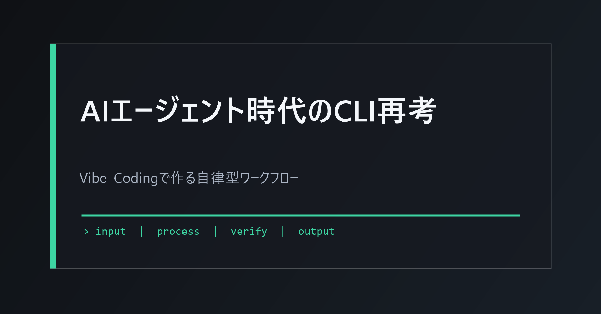
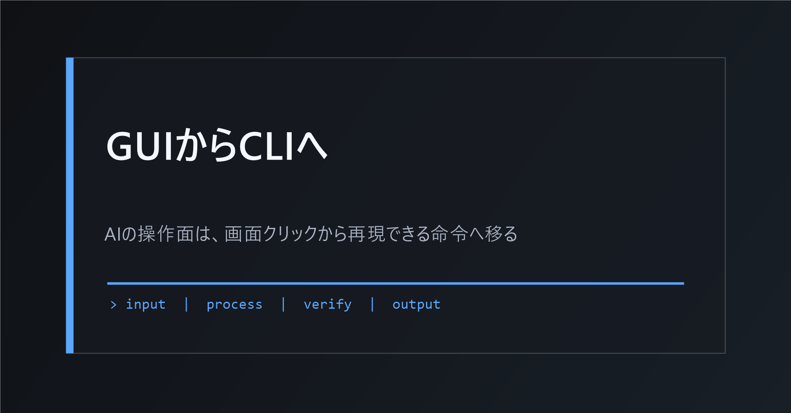
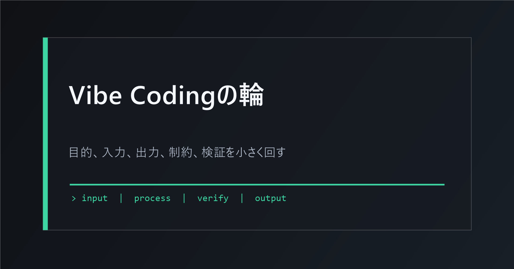
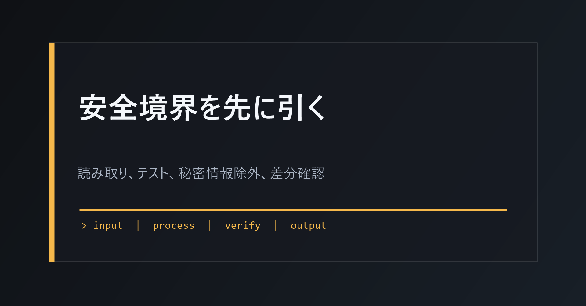
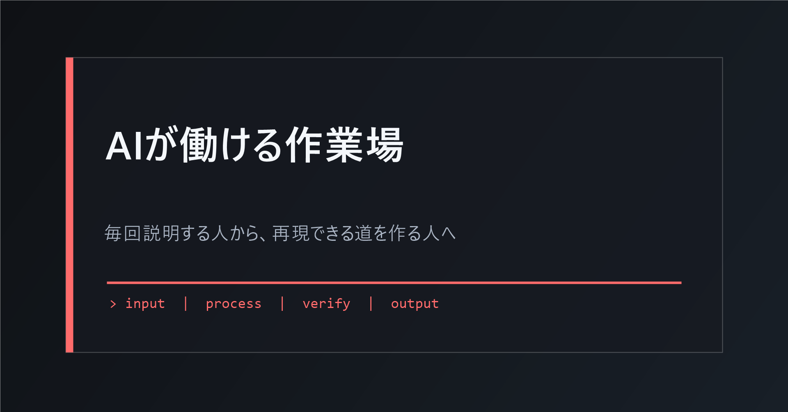

# AIエージェント時代の最適解：CLI再考とVibe Codingによる自律型ワークフロー構築

「AIを使っているのに、なぜ毎回同じ説明をしているのだろう」

チャットAIを日常的に使う人ほど、この違和感にぶつかる。調査してほしい資料を渡す。出力形式を指定する。前回と同じトーンで書いてほしいと説明する。ところが、少し条件が抜けると、結果がぶれる。もう一度直す。さらに別のファイルへ貼り直す。

AIは賢くなった。それでも、人間が毎回作業台を組み立てているなら、仕事はあまり速くならない。必要なのは、AIに頼む文章をうまくすることだけではない。AIが迷わず動ける作業環境を作ることだ。

そこで再評価されているのがCLI、つまりCommand Line Interfaceだ。黒い画面にコマンドを打つ古い道具に見える。しかしAIエージェントの視点では、CLIはとても扱いやすい。命令がテキストで残る。入力と出力が決まっている。失敗したときのエラーも読める。同じ作業を何度でも再実行できる。

## なぜ今、CLIなのか

GUIは人間にやさしい。ボタン、メニュー、ドラッグ操作は直感的だ。けれどAIにとっては、画面上のボタンを見つけ、クリック位置を推測し、状態変化を読み取る必要がある。これは意外に不安定だ。

CLIは逆だ。人間には少し硬いが、AIには読みやすい。たとえば、あるフォルダ内のMarkdownを要約して一つのファイルにまとめたいとする。GUIならフォルダを開き、ファイルを選び、コピーし、貼り付け、保存する。CLIなら「このフォルダを読み、要約をsummary.mdへ書く」という手順をスクリプト化できる。

たとえ話をするなら、GUIはレストランで店員に口頭注文する状態。CLIは注文票だ。品名、数量、受け取り場所が文字で残る。AIは注文票のほうが読みやすく、間違いが起きたときもどこで間違ったかを追いやすい。

## AIエージェントはチャットから実行者へ移っている

2025年から2026年にかけて、AIの使い方は「相談」から「実行」へ移っている。Claude Code、Codex、GitHub Copilot CLIのような環境は、自然言語の指示を受け取り、ファイルを読み、コードを書き、テストを走らせる。OpenClawのようなローカル実行型エージェントも、AIが日常のソフトウェアやサービスへ接続して動く未来をわかりやすく示した。

ここで重要なのは、AIが魔法のように何でもできるという話ではない。むしろ逆だ。AIが確実に働くには、明確な入力、明確な出力、明確な制約が必要になる。その形式としてCLIが強い。

料理人のたとえで考える。チャットだけのAIは、腕のいい料理人に電話で相談している状態に近い。CLIを持ったAIは、厨房に立っている料理人だ。包丁、鍋、計量器、食材棚が決まった場所にある。作業ログも残る。前回のレシピを再現できる。

## Vibe Codingは非エンジニアの入口になる

Vibe Codingという言葉は、AIにコードを書かせながら、作りたい雰囲気や目的を自然言語で伝えて進める開発スタイルとして広がった。誤解されやすいが、これは「雑に頼めばAIが全部作る」という意味ではない。

本質は、小さく作り、すぐ動かし、結果を見て直すことだ。

非エンジニアにとって大事なのは、PythonやBashを完璧に覚えることではない。自分の仕事を、AIが扱える形に分解することだ。たとえば次のように言える。

- 入力は、今週の議事録Markdown全部。
- 出力は、決定事項、未決事項、次アクションを分けたsummary.md。
- 禁止は、元ファイルを変更しないこと。
- 検証は、出力に空欄がないこと。

この程度まで言語化できれば、AIは小さなCLIツールを作れる。最初から立派なアプリを作る必要はない。むしろ、毎日使う小さな不便を一つ選ぶほうが成功しやすい。

## CLIはAIの共通言語になる

CLIには、標準入力、標準出力、標準エラーという考え方がある。専門用語に見えるが、意味は単純だ。

標準入力は、AIに渡す材料。標準出力は、AIが使える結果。標準エラーは、失敗した理由。これらが分かれているから、AIは次の行動を決めやすい。

人間の作業では、失敗理由が画面のどこかに赤字で出るだけでも理解できる。AIの場合、その赤字を正確に読める保証はない。CLIならエラーが文字として残る。AIはその文字を読み、修正案を出し、もう一度試せる。

この再現性が、AIエージェント時代の生産性を支える。毎回ゼロから頼むのではなく、手順をツール化し、ログを残し、改善していく。仕事は単発の依頼から、育てるワークフローへ変わる。

## 実践：自分専用CLIをAIに作らせる

最初の一歩は、業務の中から「毎回似たことをしている作業」を一つ選ぶことだ。候補は、議事録整理、CSVの集計、画像ファイル名の整理、記事下書きの構成チェック、メール文面の定型化などでよい。

次に、作業を四つに分ける。

入力は何か。出力は何か。やってはいけないことは何か。成功条件は何か。

この四つをAIに渡し、「この作業をローカルで実行できるCLIツールにして」と頼む。生成されたコードをいきなり大事なフォルダで動かさない。テスト用フォルダを作り、コピーしたサンプルで動かす。出力を見て、期待と違えばエラーログや出力例をAIに返す。

この輪がVibe Codingの実務版だ。雰囲気で終わらせず、実行結果で会話する。

## リスクは小さな枠で管理する

AIにCLIを使わせると便利だが、危険もある。ファイルを上書きする。秘密情報を外部へ送る。意図しないフォルダまで処理する。だから最初の設計が重要になる。

最低限、次の境界線を置く。

- 最初は読み取り中心にする。
- テスト用フォルダだけで動かす。
- `.env` や認証ファイルを読ませない。
- 削除処理を入れない。
- 実行前に対象パスを表示させる。
- Git差分や出力ファイル一覧を確認する。

AIに自由を与えるほど、人間は境界線を明確にする必要がある。これはAIを疑う態度ではない。仕事を再現可能にするための設計だ。

## これからの「使いこなし」は、作業路を作る力

AI時代のスキルは、プロンプトの飾り方では終わらない。重要なのは、自分の仕事をAIが実行できる道に変換する力だ。

CLIはその道になる。Vibe Codingは、その道をAIと一緒に作る方法になる。

黒い画面を覚える必要はない。最初に覚えるべきなのは、仕事を入力、出力、制約、検証に分けること。そしてAIに小さなツールを作らせ、実行し、結果で直すこと。

AIを相手に毎回説明する人から、AIが迷わず動ける作業場を持つ人へ。この差が、これからの個人と組織の生産性を分ける。

## 参考ファイル

- 03_detailed_agenda.md
- 04_blog_post.md
- 05_thumbnail_prompts.md
- 06_section_prompts.md
- ./thumbnail.png
- ./img1.png から ./img4.png
