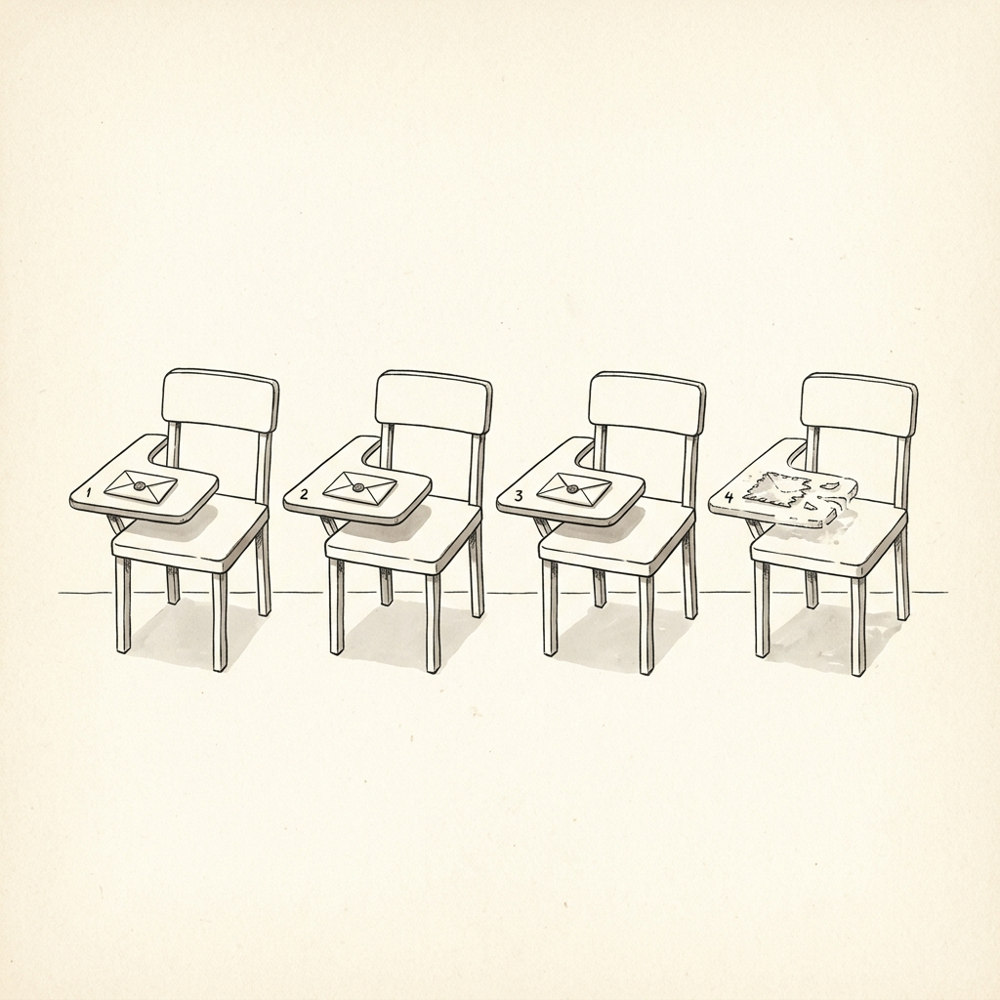

AIを「増やす」前に、読んでほしい話があります。

---

月曜の朝、X（旧Twitter）のタイムラインをスクロールしていると、こんな投稿が流れてきます。

「AIエージェント40体を並列で動かしたら、売上が3倍になった」

「役割を分担させるだけで、月200時間が浮いた」

その投稿を見て、自分もやってみようと思った。そういう人は、少なくないはずです。私もそう感じた一人でした。

でも、その話の「続き」を知っていますか。

先日、Claude Codeを使ってAIエージェントを40体構築し、1ヶ月後にすべてを廃棄したという記録が公開されました。著者は現在、Claude Code × n8nコミュニティを運営し、118名以上を伴走しているこはく氏（@Kohaku_NFT）です。

この記事は、その失敗の記録を丁寧に読み解きながら、「なぜ壊れたのか」「どうすれば壊れないのか」を、製造業出身の合理主義者として解説するものです。

数字とロジックで語ります。精神論は出てきません。

---

## 40体のAI社員が、1ヶ月で全滅するまで

丸2日かけて設計した。そう記録されています。

リーダー、ライター、リサーチャー、コーダー、レビュアー——役割を分けて、ルールを書いて、階層を作り、性格設定まで作り込んだ。Claude CodeのMaxプラン、月$200の環境での実験です。

最初の3日間は動きました。指示を出せばちゃんと返ってくる。ルールを守っている。「これはいける」という確信があった、とこはく氏は書いています。SNSでスクショをあげそうになった、とも。

1週間後、何かがずれ始めます。

同じ指示を出しても、前と違う結果が返ってくる。役割を逸脱するエージェントが現れる。これを「同じ入力に対して、出力の一貫性が保てなくなった状態」と表現しています。製造業でいえば、工程の再現性が失われた状態です。品質管理の観点からすると、これは出荷できないレベルの問題です。

2週間後、原因の特定ができなくなります。

40体のうち、どのエージェントが崩れているのか追えない。ログを追いかける時間が、1日あたり2〜3時間になった。自分で作業するより、確認作業の方が長くなっていた。

1ヶ月後、運用保守のコストが実利を完全に上回りました。

作業時間を減らすために作ったのに、ログ確認だけで週10時間以上が溶けていた。結論、使わなくなった。残ったのは、40体分のguidelinesファイルだけです。合計で数万トークン分のルール。誰も触らない残骸でした。

ここで必ず出てくる問いがあります。

「設計が甘かったのでは？」

違います、とこはく氏は言います。甘い設計が壊れたのではなく、人数を増やすほど壊れやすくなる構造がある。では、その構造とは何か。

---

## なぜAI組織は壊れるのか——3つの構造的理由

### 理由1：記憶の腐敗（Context Rot）

職人が作業机の上に書類を積み上げていくと、どうなるか。最初は整理されていても、書類が増えるにつれて古いものが下に埋もれ、最終的には床に落ちて見失ってしまう。

AIの記憶の仕組みは、これとまったく同じ構造です。

AIが一度に参照できる情報量には上限があります。これを「コンテキストウィンドウ」と呼びます。作業机の広さに相当するものです。Anthropicの公式ドキュメントには、こう明記されています——「トークン数が増えるほど、精度と想起（思い出す力）が劣化する」。

つまり、機能として存在することと、安定して使えることは、別物です。

こはく氏の実測では、ルール・コード・会話履歴が積み上がるにつれて、10万トークンを超えたあたりから劣化が明確に始まりました。これは公式の一般原則と一致します。

最近の評価研究でも、同じ傾向が確認されています。AgentDietという手法では、エージェントの過去の履歴から不要・冗長な情報を自動的に削ぎ落とすことで、パフォーマンスの低下を1〜2%以内に抑えながら、入力トークンを40〜60%削減できることが実証されています。裏を返せば、何もしなければその分だけ性能は落ちていく。

逆説があります。「よく使い込むほど育つ」とSNSでよく見かけます。でも、使い込むということはguidelinesファイルが増えるということです。ファイルが増えるということはコンテキストが重くなるということです。それはつまり、Context Rotが加速するということです。壊れやすい仕組みの上に知識を積んでも、崩れやすくなるだけです。育てる前に土台が必要です。

### 理由2：圧縮崩壊（Compaction）

長時間AIを動かしていると、前半の文脈が自動で圧縮されます。これを「compaction（コンパクション）」と呼びます。

伝言ゲームに例えると、分かりやすいです。詳しく伝えようとすれば情報過多で混乱し、短く要約しすぎれば「このお客さんを怒らせてはいけない」という重要な注意点が抜け落ちてトラブルになる。マルチエージェントが長時間稼働するとき、これが起きます。

Claude Codeの公式リリースノートにも記載がありました。「圧縮後に一部のエージェントが消えたり、重複して生成される不具合がある」と。

こはく氏の実測では、40体体制で3時間動かせばほぼ確実に圧縮が走る。そのたびに「今、誰が消えた？」を人間が確認するハメになる。

会社組織に例えるとこうです。過去の議事録を読まずに中途配属され、すでに同じ業務をしている人がいることも知らずに仕事を始める。「3人が消えて、2人が重複して、残りの35人はそれに気づかない」という事態が、AI組織内で起きます。

さらに深刻なバグも報告されています。最新のメッセージに「thinking blocks（思考ブロック）」が含まれている場合、それを圧縮しようとするとAPIから400エラーが返され、セッション全体が回復不可能な状態に陥り、すべてのコンテキストが失われます。引き継ぎ書類そのものが燃えてしまうようなものです。

### 理由3：指示は絶対命令ではない

「自分で作業するな。指示だけ出せ」

そう書いても、AIが毎回きれいに従うとは限りません。就業規則より顧客の言葉を優先してしまうアルバイトスタッフを想像してください。「割引は不可」と定められているのに、お客さんに強く押されると負けてしまう。LLMのルール処理も、構造的にはこれに近いです。

LLMにとってルール文は、絶対命令というより文脈の一部として処理されます。履歴、途中のやりとり、直前の出力に引っ張られて、解釈がずれる。

IHEval（Instruction Hierarchy Evaluation）という研究では、LLMが「どの指示を優先するか」の判断や、長い文脈での安定した指示追従に弱さがあることが報告されています。特定のモデルの問題ではなく、現時点のLLM全般の特性です。

厳密に書けば書くほど、今度はルールが長くなってContext Rotが進みます。精密なルールが、逆にシステムを脆くする。この構造そのものが、人数を増やしたときの壁になります。

---

## エージェントには視野がない——これが本当の核心

エージェントはAのタスクを動かせます。Bのタスクも動かせます。ただ、AがBに影響して、BがCを壊して、CがDに連鎖する——この全体像を把握できる存在が、40体の中に一人もいません。

全員が自分のコンテキストの範囲だけで動いています。隣のエージェントが何をやっているか知らない。

マルチエージェントの通信チャネルは、エージェント数とともに爆発的に増えます。2体なら1経路、4体なら6経路、10体なら45経路です。調整コストも指数関数的に上がる。単一AIなら$0.10で処理できるタスクが、マルチエージェントでは調整のオーバーヘッドによって$1.50に跳ね上がることがあります（LangChain調査より）。

「じゃあチーフエージェントを置けばいいのでは？」

チーフにも、まったく同じ問題があります。チーフもコンテキストの範囲でしか判断できない。部長も課長も自分の部署しか見ていない状態で、全体を俯瞰して意思決定する人がいない会社です。

ここが、AI時代に経営者が担うべき役割の核心です。

LangChainの2025年調査（1,340名対象）によると、すでに57.3%の組織が本番環境でAIエージェントを稼働させています。KlarnaのAIアシスタントは導入後1ヶ月でサポートチャットの3分の2（230万件）を処理し、平均解決時間を11分から2分未満へ短縮しました。実行力は、もうあります。

一方でGartnerは、2027年末までにエージェントAIプロジェクトの40%以上がキャンセルされると予測しています。コストの高騰、ビジネス価値の不明確さ、リスク管理の不足が理由です。

何をやるべきか、何をやめるべきかの判断。優先順位をつけてリソースを配分する意思決定。AとBの矛盾に気づき、Cの出力がDを壊すことを予測する。これが、現時点では人間の仕事です。プレイヤーから監督者へ。この転換が、AI時代の分かれ目になります。

---

## 「壊れない設計」の4原則——1体から始める具体的な手順

では、どうすればいいのか。4つのステップに整理します。

**ステップ1：成果（Outcome）から逆算して設計する**

「エージェントを何体置くか」から考えない。「このシステムが動くことで、何がどう変わるか」というビジネス成果から設計を始めます。プロセスや役割数から入ると、手段が目的化します。製造業でもよくある話です。「この設備を導入したい」が先行して、実際に解決したい問題が後回しになる。

**ステップ2：まず1体のエージェントで解決できないか試す**

LangChainの調査では、実際のケースの80%は、適切に設計された単一エージェントのほうがマルチエージェントシステムより優れたパフォーマンスを発揮するとされています。

精度を上げるルールは2つだけ、とこはく氏は書いています。「待て」——一発で完成させようとしない。1回目の出力は下書きです。「検証しろ」——作ったものと別のものにチェックさせる。この2つを徹底してから、やり直し率が体感で7割減ったと。

単一エージェントでどうしても不安定になる局面が出てきたとき、初めてオーケストレーターを追加します。

**ステップ3：壊れても回復できる構造にする**

エラーは起きる前提で設計します。

家庭の配電盤（ブレーカー）を思い出してください。1つの家電がショートしても、ブレーカーが落ちることで家全体を守ります。AIシステムでいうサーキットブレーカーは、これと同じ役割です。連続的なエラーを検知して、システム全体への波及を遮断します。

「高級レストランが満席なら、ファミレスへ。それも閉まっていたら、コンビニで弁当を買う」——こうしたフォールバックチェーン（代替手段の連鎖）を事前に設計しておくことで、1つの手段が失敗してもシステムが止まらなくなります。

状態の管理も重要です。LangGraphのようなフレームワークを使えば、各処理の節目でその時点の状態をデータベースに保存できます。クラッシュが起きても、ゲームのセーブポイントから再開するように、最後に成功した地点から再開できます。

外部メモリへの永続化も有効です。重要なタスク結果や状態を、AIのコンテキスト内だけに保持せず、外部ファイルやデータベースに書き込む設計にします。セッション開始時や圧縮後にそこを読み直すことで、Context Rotやcompactionを実質的に無害化できます。

**ステップ4：「完全に独立したタスク」だけをマルチエージェントにする**

マルチエージェントが本番環境で機能するための条件は、厳密です。

Anthropicが実際に運用している気候変動影響分析システムには、3つの条件があります。各エージェントのタスクが完全に独立していること。作業の90%がデータの読み取りと分析であること（書き込みが少ないほど調整コストが激減します）。そして、決定論的なオーケストレーション——エージェント同士の自律的な対話に任せるのではなく、明確な状態遷移の設計図でハンドオフを定義すること。

スープの仕込みで塩と砂糖を間違え、次の料理人にそのまま渡してしまう連鎖崩壊は、書き込みが少なく、完全に独立したタスク設計によって防げます。

この3条件を満たさない場合は、単一エージェントの徹底的な最適化を先行させてください。

---

## AI導入は、自社の組織設計の診断でもある

AIエージェントが崩壊するポイントは、既存の組織設計の弱点と、驚くほど重なります。

エスカレーションルールがない。トラブル時の判断基準がない。報告の形もない。そんな会社に人を増やすほど、混乱は大きくなります。AI組織もまったく同じ構造です。

AIを40体導入しようとして失敗した、という話は、実は「その組織設計がAIの前に崩れる構造だった」という診断でもあります。逆に言えば、1体のエージェントをしっかり使いこなせる組織は、設計が整っている組織です。

Deloitteの2025年調査では、エージェントシステムを導入した組織はターゲットプロセスで15〜30%のコスト削減を達成し、投資回収期間は6〜18ヶ月だとされています。これは、適切に設計されたシステムの話です。

ここで問いかけたいのは、こういうことです。

あなたの組織に40人の新入社員を採用したとして、引き継ぎ資料も、エスカレーションルールも、報告フォームも整備しないまま働かせたら何が起きますか。AIに同じことをしていないでしょうか。

---

## まとめ：40体より、1体の設計

- 40体は構造的に壊れやすい——Context Rot、compaction、指示の限界という3つの理由がある
- 育てる前に壊れない土台が先決
- 「動く」と「使える」は別物
- 全体を見る仕事は、現時点では人間が担う
- 「待て」と「検証しろ」だけで精度は大きく上がる
- AI導入は自社の組織設計の診断でもある

AI社員を40人雇うのは、1人を使いこなしたあとでいい。

まず1体から設計し、動かし、安定させる。そこから積み上げる順番が、結果として最短ルートです。

製造業で25年間、生産管理に関わってきた私が一番強調したいのは、ここです。「まず動くか確認する」ではなく、「安定して再現できるか確認する」。品質の基準を先に設ける。それがなければ、規模を広げるほど問題が拡大するだけです。

スマート工場でも、IoTセンサーを100台導入する前に、まず1台で何が測れるかを徹底的に検証します。AIも同じです。

---

*参考：こはく氏（@Kohaku_NFT）の実験記録 / Anthropic公式ドキュメント / IHEval研究論文 / LangChain State of AI Agents 2025（1,340名対象） / Gartner AI Agent予測2025 / Deloitte AI ROI調査2025 / AgentDiet研究*

<!-- 参照ファイル一覧
- 03_detailed_agenda.md
- 04_blog_post.md
- 05_thumbnail_prompts.md
- 06_section_prompts.md
- ./thumbnail.png
- ./img1.png
- ./img2.png
- ./img3.png
- ./img4.png
- ./img5.png
-->
