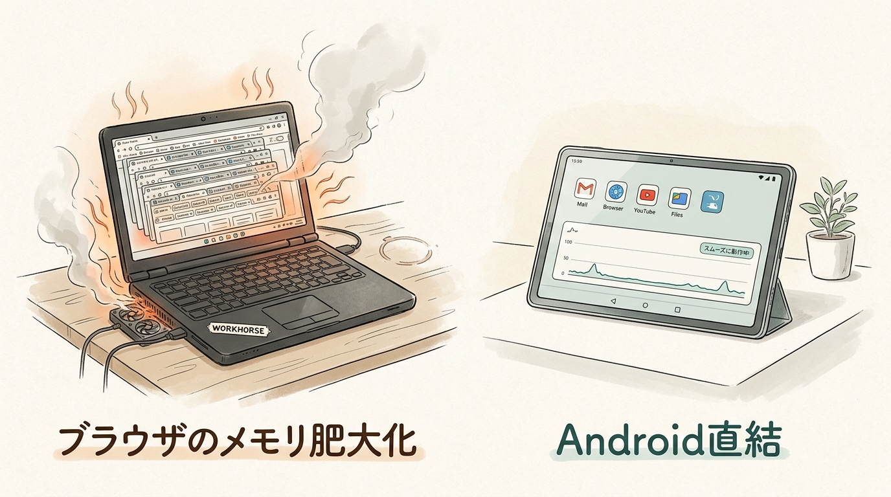
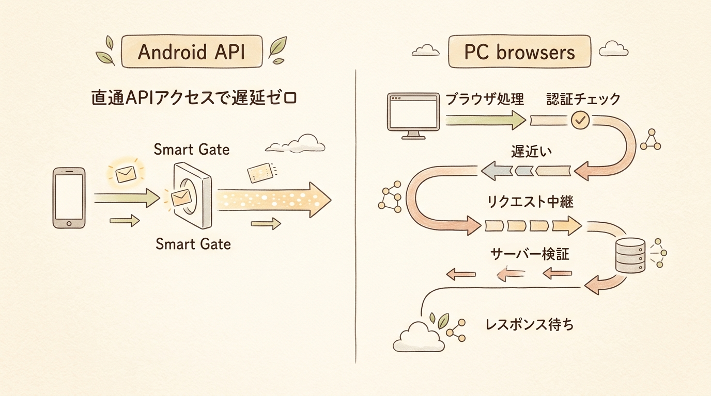
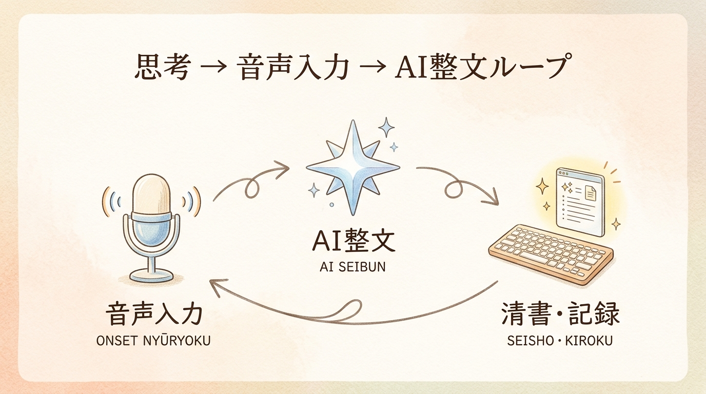

月曜の朝、PCを開いた瞬間、ファンがウーンと爆音を立てて回り出す。

画面上のブラウザには20個以上のタブが並び、ChatGPTやGeminiの対話画面、文字起こしアプリ、ドキュメント作成ツールが複雑に絡み合っている。文章を打ち込もうとしても、数秒の遅延が挟まり、思考のテンポがブツリと途切れてしまう。

30万円、40万円も出した最高峰のノートPCを使っているのに、なぜこんなに重くてストレスが溜まるんだろう？

もしあなたが日常的にAIや文字入力を使って仕事や執筆を行い、そんな違和感を抱いたことがあるなら、かつての私とまったく同じ罠にはまっています。

自由と爆速の生産性は、根性ではなく設計で手に入ります。

私は25年間、地方の製造業で生産管理と効率化を追求してきました。その経験から言えるのは、PCブラウザで重いAIツールを動かし続けるのは、巨大デパートの全館暖房を点けてメモを1枚書くような致命的なリソース構造の歪みがあるということです。

この歪みを正し、作業環境をPCブラウザからAndroidネイティブアプリ＋音声AIへと全面的に組み替えた結果、私の執筆スピードは体感で3倍になり、ストレスは限りなくゼロになりました。

なぜ高級PCが安価なモバイル端末に負けてしまうのか、その科学的理由と、今日から試せる爆速執筆システムの全貌をお話しします。

---

## 1. 導入と問題提起 — 「40万円のPC」が「6万円のタブレット」に負ける怪

### なぜあなたの高級PCはAIを使うとファンが猛烈に回りだすのか？

あなたが持っている最新のCore i9やM3プロセッサを積んだ40万円のPC。その潜在能力は極めて高いはずです。しかし、ブラウザを開いてAI対話を始めると、とたんに動作が重くなり、バッテリーが猛烈な勢いで減っていきます。

この原因は、Web Bloat（ウェブの肥大化）とブラウザのメモリ爆食い構造にあります。

Web Bloatについて最新の研究データを紹介しましょう。Danluu氏による分析によると、現代の一般的なWebページの読み込みデータ量は13MBから21MBに達しています。これは、人気3DゲームのPUBGを40fpsで動かすよりも重い描画・処理負荷がブラウザにかかっていることを意味します。

さらに、Google Chromeなどのモダンブラウザは、安全性のためにタブごとに独立した処理エンジンを起動します。結果として、放置している数個のタブだけで数GBから10GB以上のメモリをあっという間に食い尽くしてしまうのです。

巨大デパートに例えてみましょう。ブラウザは単なるノートではなく、中に何十店舗も入った巨大デパートです。あなたが今日買いたい1枚のメモ用紙を書くためだけに、デパート全体の照明と暖房を点け、全店員をフル稼働させている状態なのです。

あるいは高級大型トラックです。30トンの積載量がある大型トラックで、近所のスーパーへ豆腐を1パック買いに行くようなものです。小回りが利かず、ガソリンを無駄遣いして当然です。

### 「指は思考の4倍遅い」という執筆の物理的限界

問題はハードウェアだけではありません。私たちが日々行っている手タイピングという入力方式そのものにも、致命的なボトルネックが存在します。

人間の平均的なキーボード入力速度は、1分間に約60文字から80文字程度です。一方で、私たちが頭の中で思考する速度、あるいは口から発話する速度は、1分間に約300文字から400文字に達します。

つまり、指は思考の約4倍から5倍も遅いのです。

頭の中のアイデアは新幹線のように時速300kmで疾走しているのに、あなたの指はママチャリのペダルを必死に漕いでそれを追いかけている状態です。途中でアレ、何を書こうとしていたんだっけ？とアイデアが消えてしまうのは、あなたの集中力不足ではなく、入力インターフェースの物理的限界が原因です。

---

## 2. 謎解きとしての専門解説 — なぜ「AI × Android」ネイティブ環境は爆速なのか？

### ブラウザの重厚なレガシー vs Androidネイティブアプリの軽量化構造

では、なぜAndroid端末を使うと、そのストレスが瞬時に吹き飛ぶのでしょうか。

最大の理由は、ブラウザを挟まず、OS直結のネイティブアプリで動かすという構造の違いにあります。

WindowsやmacOSは、約30年間のレガシー（過去の互換性維持のための古い仕組み）を引きずっています。ブラウザ経由でWeb版のAIサービスを利用する場合、データはOS、ブラウザ、JavaScriptエンジン、ネットワーク、AIサーバーという重厚な階層を経由して往復します。

一方、Androidでは、ネイティブアプリや軽量なAPIを直接叩きます。

PCブラウザは、英語しか話せない相手と3人の通訳を介して会話するようなものです。対してAndroidネイティブアプリは相手への直通ダイヤル。応答速度が圧倒的に速いのは当然です。

### OS比較の真実 — 「Windows < iOS < Android」速度のピラミッド

作業環境の応答・処理速度の序列を客観的に比較すると、以下のようになります。

最遅のWindowsは、30年のレガシーと重厚な背景プロセスを抱えています。中間のiOSは高速ですが、Apple独自の厳格なセキュリティ機構が通信やアプリ間連携の間に挟まります。最速のAndroidは余計な割り込み機構が最も少なく、バックグラウンドでの軽量処理やダイレクトなAPI呼び出しにおいて最もオーバーヘッドが小さいのです。

iOSは通過するたびに何重もの手荷物検査を受ける厳格な空港です。対してAndroidは、事前認証済みのIDカードでスイスイ通過できる専用スマートゲート。データの往復において最もロスの少ないOSなのです。

### 最新研究が証明するオンデバイスAI・NPUの衝撃（Prefill速度1,000 tokens/sec超）

スマホやタブレットのAIなんて、クラウドの巨大サーバーに頼っているだけじゃないのかと思われるかもしれません。しかし、先端の技術研究（ASPLOS 25にて発表されたllm.npuシステム等）は、すでにモバイルNPUの驚異的な性能を実証しています。

Qualcomm Hexagon等の最新NPUを活用したオンデバイスAI推論技術では、Prefill速度（AIがプロンプトを理解する速度）において1Bから3B規模の軽量モデルで世界で初めて1秒あたり1,000トークン以上の超高速処理を達成しています。従来のCPU処理に比べ、速度は最大41倍に加速し、エネルギー消費量は最大59倍も削減されます。

料理を注文するたびに離れた中央工場からデリバリーしてもらうのがクラウドAI。目の前の卓上調理器で一瞬で加熱して食べるのがNPUです。外部ネットワークの遅延ゼロで、手元でAIが駆動する時代がすでに始まっています。

---

## 3. 教訓の抽象化と普遍的なテーマへの昇華 — 爆速執筆環境を支える3つの三種の神器

私が実践し、メルマガ1,000文字を3分で書き上げる爆速執筆システムは、以下の3つの要素で構成されています。

### ① 思考を止めない「音声入力 × Groq (Whisper) × Dictate Keyboard」

第一の神器は、手タイピングの限界を破る音声入力システムです。

使用するキーボードアプリはDictate Keyboard。マイクに向かって話した音声データをリアルタイムで直接ドキュメントの入力欄へ流し込む専用アプリです。

バックエンドの音声認識エンジンには、推論専用チップLPUを展開するGroqのAPIを連携させます。

このシステムの凄さは、クリップボードを一切汚さない点にあります。従来の文字起こしアプリのように文字起こし結果をコピーしてドキュメントに貼り付けるというステップが不要で、話した言葉がリアルタイムでそのまま画面上にテキストとして流れていきます。

喋った瞬間に、インクが自動で浮き出てノートに文字を書き込んでいく魔法のペンを手に入れた状態です。コピー＆ペーストの作業で思考が途切れることがなくなります。

### ② 暴走を許さない「整形係としてのGemini Gem」

音声入力の弱点は、話し言葉特有の無駄な言い回しや、文法的なねじれが生じることです。

ここで登場するのがGeminiです。ただし、一般的なプロンプトで「この記事を直して」と頼むと、AIは勝手に新しい段落を創作したり、余計な自論を付け加えたりしてしまいます。

そこで、指示プロンプトを厳格に固定した専用のGemを作成します。

あなたは優秀な校正係です。入力された文章の意図・主張・事実関係を1文字も勝手に改変したり追加したりしてはいけません。誤字脱字、てにをはの修正、話し言葉の整文のみを行い、整えた文章だけを出力してください、という指示を固定します。

自分のアイデアを勝手に上書きして小説を書き始める自己主張の激しい作家ではなく、提出した下書きのてにをはを黙って完璧に整えてくれる静かな専属校正者としてGeminiを従わせるのです。

### ③ 物理的フリクションをゼロにする「エレコム SLINT × 親指シフト」

最後のピースが、入力の物理的インターフェースです。

長年、私がAndroid端末への全面移行を躊躇していた理由は、快適な日本語入力ができる軽量キーボードが存在しなかったからです。

しかし、エレコムの薄型BluetoothキーボードSLINT（TK-TM10BPBK）と、Android用のIMEであるOyaMozcを組み合わせたことで、この問題は完全に解決しました。Bluetoothの通信遅延とキータッチの相性が絶妙で、親指シフトのミスタッチがほぼゼロになったのです。

一歩踏み出すたびに靴擦れしていた重いブーツから、自分の足型にピッタリ馴染んだ超軽量ランニングシューズに履き替えた状態です。入力に対する物理的な引っ掛かりが完全に消え去りました。

---

## 4. 解決策・具体的なアクションプラン — 今日から始める「AI×Android」サブ機運用

ここまで読まれて、なるほど、理屈は分かった。でもいきなりメインのPCを捨てるのは怖いと思われるかもしれません。当然です。

ですから、まずはAI・執筆専用のサブ機として運用を始めることをお勧めします。

### ステップ1: 手持ちのAndroid端末または6万円台タブレットを準備する

わざわざ30万円の機材を買う必要はありません。6万円前後で購入できるXiaomi Padや、使わなくなったAndroidスマートフォンで十分です。

重量級の画像編集やプログラミング、複雑なVBA作成などは書斎のPCで行い、文章の執筆やアイデア出しはカフェでスケッチブック（Androidタブレット）を開く。この役割分担から始めましょう。

### ステップ2: 音声入力アプリとGeminiネイティブアプリの初期設定

Android端末にGeminiネイティブアプリをインストールし、音声入力用キーボードアプリDictate Keyboardを導入します。日本語配列キーボードを使用する場合はOyaMozc等の最適なIMEを設定します。

### ステップ3: 「思考 → 音声発話 → Gemini推敲」の爆速執筆ループを回す

実際の執筆手順は至ってシンプルです。

Google ドキュメント等のエディタを開き、頭の中にあるアイデアや主張をDictate Keyboardを使ってマイクに向かって一気に喋ります（5分間で約1,000〜1,500文字）。

吐き出した文章をコピーし、専用のGemini Gemに貼り付けて整文を実行します。応答時間はわずか3秒。

整形された文章をドキュメントに戻し、人間らしい熱量や細かな表現を手直しして完成です。

このループを1回回すだけで、従来手タイピングで1時間かかっていた原稿が、わずか10分足らずで完成します。

---

## 5. 結論 — 自由は「根性」ではなく「設計」で手に入る

あなたが毎日使っているその40万円のPCは、本当にあなたの思考のスピードを加速させていますか？それとも、重いブラウザのファン音とともに、あなたの貴重な時間と集中力を静かに削り取っていませんか？

ここで一つ、異分野の比喩をお届けします。

F1カーと電動キックボードの比喩です。

サーキット場であれば、圧倒的な馬力を誇るF1カーが勝利します。しかし、混雑した街中の小道において、F1カーは小回りが利かず、宝の持ち腐れになります。

街中を最速で駆け抜け、目的地へストレスなく到着できるのは、サッと乗って自由に移動できる軽量な電動キックボードです。

ツールに振り回されるのは、もうやめましょう。
根性でタイピング速度を上げようとするのも、やめましょう。

システムと構造を少し設計し直すだけで、あなたの目の前には、思考のスピードで文章が紡がれていく圧倒的な自由が広がっています。

まずは手元のスマートフォンから、その小さな一歩を試してみてください。

<!-- 参照ファイル一覧
- 03_detailed_agenda.md
- 04_blog_post.md
- 05_thumbnail_prompts.md
- 06_section_prompts.md
- ./thumbnail.png
- ./img1.png
- ./img2.png
- ./img3.png
-->
