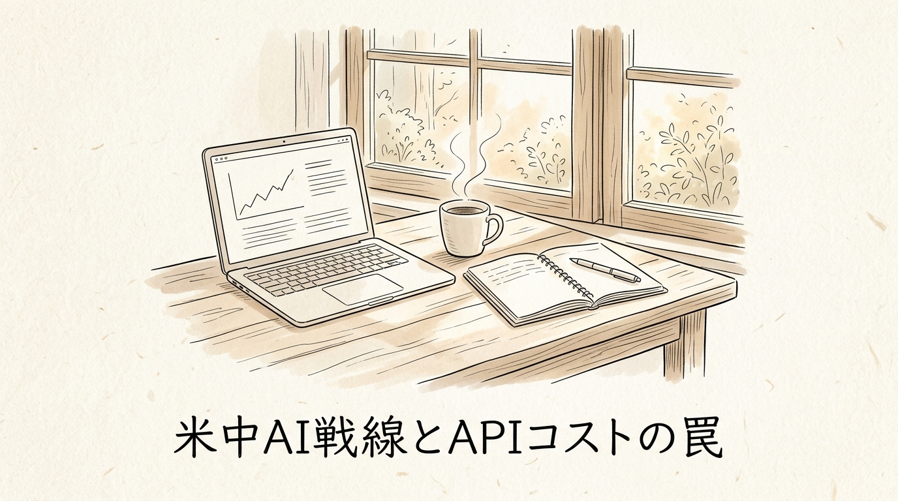
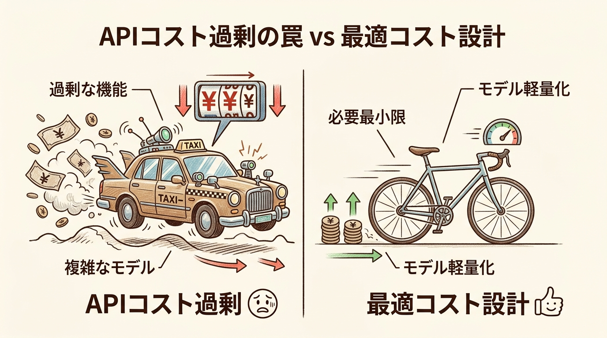
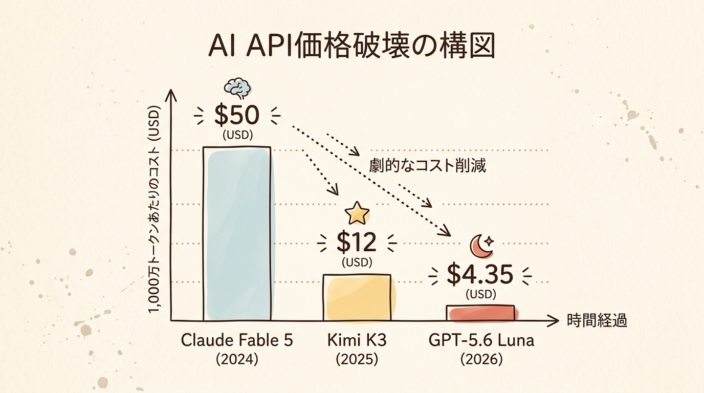
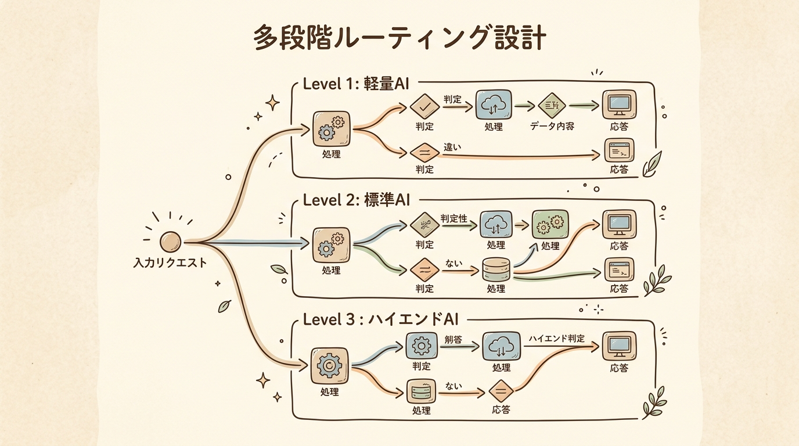

月曜の朝8時。コーヒーを淹れてデスクに向かい、ダッシュボードを開いた瞬間に手が止まる。
売上やユーザー数は確かに伸びている。なのに、画面の隅で不気味に数字を更新し続ける「API利用料」のメーターが、胃をキュッと締め付ける。

「ユーザーが増えれば増えるほど、利益がインフラコストに消えていく」
かつて地方の製造現場で25年、泥臭くコスト構造と戦ってきた人間として、この光景には既視感しかありません。工場の一部に過剰なオーバースペック設備を入れたせいで、作れば作るほど赤字が膨らんでいく、あの苦い感覚です。

今、AIをプロダクトや業務に組み込んだ現場のあちこちで、全く同じ悲鳴が響いています。
「業務は劇的に速くなった。でも毎月のAPI請求額を見るのが怖い」
「このペースで利用が増えたら、事業として成り立たなくなる」

今回は、米中AI覇権争いの背景で急速に進む「AIの劇的な低コスト化」の実態を数値で解き明かします。そして、単一の最高峰AIにすべてを頼る危うさを捨て、自社の利益を静かに守る「多段階ルーティング設計」という現実的な解法を共有します。

冷めないうちにコーヒーを飲みながら、自社の設計図を見直すきっかけにしてください。

---

## 1. 導入と問題提起 — API請求書に潜む「過剰スペックの罠」

### ユーザー増加の歓喜と、裏で跳ね上がるコストの現実

新しいAI機能をリリースし、ユーザーから喜びの声が届く。開発者としてこれ以上の瞬間はありません。しかし、その裏で単位計算の設計を誤ると、ビジネスは一瞬で歪みます。

わかりやすく言えば、「近所のコンビニへ牛乳を買いに行くだけなのに、毎回高級ハイヤーを呼んでメーターを回し続けている状態」です。

1回の移動（APIリクエスト）は数十円かもしれません。ですが、それが毎日数万回、数十万回と積み重なれば、タクシー会社からの請求書は恐ろしい額になります。牛乳の価値よりもハイヤー代の方が遥かに高い。これが、多くの開発現場が知らず知らずにハマっている構造のバグです。

### 米国スタートアップすら悲鳴を上げる「月100万ドルの壁」

これは決して、スキルの浅い個人開発者だけのミスではありません。シリコンバレーの最前線を走る企業でも起きています。

米国で一気に拡散したサービス「Polsia」の創業者、Ben Cera氏の事例は極めて象徴的です。
彼らは当初、Anthropic社の最上位モデルを使ってサービスを構築しました。スタート直後のAPI代は月1万〜2万ドル（約150万〜300万円）。成長痛として許容できる範囲でした。

しかし、バイラルヒットによってユーザーが急増した途端、API請求額は**月100万〜150万ドル（約1億5,000万〜2億2,500万円）**へと激変したのです。
「このままでは、売上が伸びる前に会社が倒産する」
危機感を抱いた彼は、すぐに最上位モデルの単独運用を破棄。中国系の軽量オープンモデルへとシステムを切り替えました。結果、月間のAPIコストを**約10万ドル（約10分の1）**へ抑え込み、倒産を回避したのです。

なぜ、これほどのコスト削減が可能だったのか。その理由は、AI開発の主戦場そのものがガラリと変わったからです。

---

## 2. 謎解きとしての専門解説 — 米中AI戦線がもたらした「価格破壊」の真相

### 知能競争から「普及と低コスト化」への地殻変動

これまでAIのニュースと言えば、「どちらがより賢いか」「どちらがテストで満点を取ったか」という、フロンティアモデル（AIの最先端・最高峰知能モデル）の知能比べばかりでした。

ですが、2025年から2026年にかけて主戦場は完全にシフトしました。
今の戦いは「最高峰の知能」ではなく、**「実務現場での圧倒的な低コスト化」と「オープンウェイト（モデルの設計図や重みデータを公開し自由にカスタマイズできる仕組み）」による普及率競争**です。

これは、かつての携帯電話が高級品からAndroid OSの登場によって一気に世界中へ普及した歴史と全く同じです。
「AIを制した者が勝者となる」という米トランプ大統領の言葉通り、国レベルの争いは続いています。しかし現場の勝敗を決めるのは、論文の美しさではなく「1トークンあたりの単価」なのです。

### Claude Fable 5（$50）vs Kimi K3（$12）vs GPT-5.6 Luna（$4.35）の激突

この価格破壊を、実際のデータで見てみましょう。
同じWebサイト構築テストを実行した際にかかったAPIコストの比較です。

- **Anthropic「Claude Fable 5」**: 約49〜50ドル
- **Moonshot AI「Kimi K3」**: 約12ドル（コストを4分の1に削減）
- **OpenAI「GPT-5.6 Luna」**: 約4.35ドル（中国勢に対抗し80%値下げ）

三ツ星シェフのフルコース（$50）と同じ味の料理を、自動化調理マシン（LunaやKimi）が$4台で出し始めたようなインパクトです。

クラウド仲介サービス「OpenRouter」のデータでは、2025年初頭には米国製モデルが利用量の80%を占めていました。しかし2026年6月、歴史上初めて中国製モデルの利用量が米国製を追い抜きました。
米国内の利用量を見ても、中国系モデルが53%と過半数を占めています。現場のエンジニアたちは、ブランドよりも圧倒的なコストパフォーマンスを選び始めています。

---

## 3. 教訓の抽象化と普遍的なテーマへの昇華 — 「神の知能」は日常業務に必要なのか

### 「メール作成に神の力は必要ない」という現実的合理性

米Bloombergの記事にあった、忘れられない一節があります。
**「You do not need God to write your emails.（メール作成に神の力は必要ない）」**

私たちは無意識に「一番高いAIを使えば安心だ」と思い込みがちです。ですが、自社のタスクを冷徹に見つめ直してみてください。

- 定型の問い合わせ回答
- 社内連絡の文章調整
- ログデータの抽出や整理

こうした作業に、ノーベル賞級の知能は本当に要るでしょうか。
「電卓で済む計算のために、巨大なスーパーコンピューターの電源を入れて電気代を払う必要はない」のです。

### 自由は根性ではなく「設計」で手に入れる

製造業の現場で学んだ鉄則があります。
「最高の部品だけを集めた製品は、高すぎて誰も買えない。優れた製品とは、適正な部品を組み合わせ、全体の設計で品質とコストを両立させたものだ」

AI運用も全く同じです。
単一の「神モデル」に依存する運用は、値上げや障害、コスト爆発に対して脆すぎます。
本当の安定や利益は、根性で削るのではなく、**「複数のモデルを組み合わせ、状況に応じて自動で切り替えるしなやかな設計」**によってのみ手に入ります。

---

## 4. 解決策・具体的なアクションプラン — コスト爆発を防ぐ「多段階ルーティング設計」

では、具体的にどうシステムを組み替えるべきか。明日から試せる2ステップです。

### ステップ1: 業務タスクの「知能レベル選別」

自社のAI処理を、以下の3階層に切り分けます。

1. **Level 1（定型処理・データ抽出）**: ログ解析、フォーマット変換、定型文生成
   - **採用モデル**: 軽量オープンモデルや GPT-5.6 Luna
   - **イメージ**: 「郵便物の自動仕分け」
2. **Level 2（中級推論・文章要約）**: 記事要約、一般的な問い合わせ対応
   - **採用モデル**: 中位モデル（Kimi K3 や Claude Haikuクラス）
   - **イメージ**: 「一般スタッフによる作成・確認」
3. **Level 3（高度思考・重要判定）**: 複雑なシステム設計、契約書監査
   - **採用モデル**: 最上位フロンティアモデル（Claude Fable / GPT最上位）
   - **イメージ**: 「専門家・弁護士による最終チェック」

すべてのリクエストをLevel 3へ流すのをやめ、8割を占めるLevel 1・2を低コストモデルへ逃がすだけで、API費用は即座に半減〜8割減になります。

### ステップ2: 抽象化レイヤーを挟んだ「マルチモデル運用」

プロバイダーのSDKを直接コードに書き込むのではなく、OpenRouterや自前のプロキシといった抽象化レイヤーを1枚挟みます。

これにより、新しい安価なモデルが出た際もコードをいじらず設定変更だけで即座に乗り換えが可能になり、プロバイダーの障害や規制リスクからも自由に身を守ることができます。

---

## 5. 専門用語マッピング

本記事で触れた主要な用語の整理です。

- **フロンティアモデル**
  - **一言解説**: AI開発企業が誇る最先端・最高峰の知能モデル。
  - **たとえ話**: 「F1レースで走る最高速の専用マシン」。
- **オープンウェイト**
  - **一言解説**: モデルの設計図やパラメータが公開され、自前で自由に改変・運用できる仕組み。
  - **たとえ話**: 「秘伝のレシピが公開され、自宅で自由にアレンジして作れる料理」。
- **API（Application Programming Interface）**
  - **一言解説**: システム同士がデータをやり取りするための共通窓口。
  - **たとえ話**: 「レストランの注文口（客と厨房をつなぐ窓口）」。
- **多段階ルーティング**
  - **一言解説**: タスクの難易度に応じて、自動で最適なAIモデルへ振り分ける仕組み。
  - **たとえ話**: 「コールセンターの自動音声案内」。
- **コンテキスト長**
  - **一言解説**: AIが一度に読み込んで理解できる情報量。
  - **たとえ話**: 「作業デスクの上に一度に広げられる資料の広さ」。

---

## 6. 結論部のフック設計

最後に、一つだけ問いを置かせてください。

「今月払うAIのAPI費用。その8割は『必要な知能』への投資ですか？ それとも『設計の未熟さ』への勉強代ですか？」

巨大な家を建てる時、すべてをダイヤモンドで造る人はいません。土台には石を使い、柱には木を配し、窓にはガラスをはめる。素材の特性を知り、適切に配置することこそが「設計」です。

テクノロジーに振り回される側から、テクノロジーを静かに使いこなす側へ。
ダッシュボードを眺めるあなたの目が、不安から「静かな確信」へ変わることを願っています。

<!-- 参照ファイル一覧
- 03_detailed_agenda.md
- 04_blog_post.md
- 05_thumbnail_prompts.md
- 06_section_prompts.md
- ./thumbnail.png
- ./img1.png
- ./img2.png
- ./img3.png
- ./img4.png
-->
