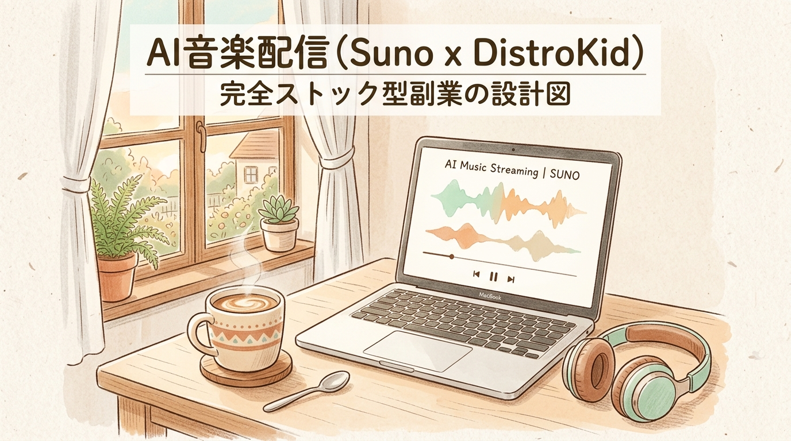
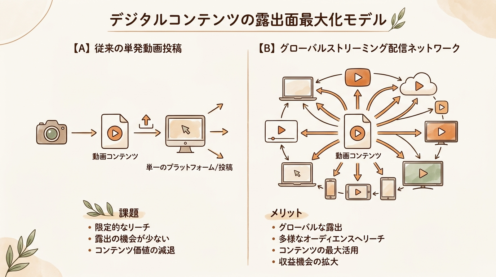
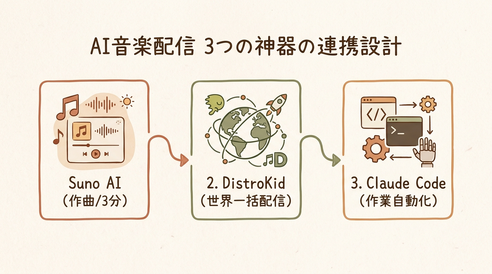
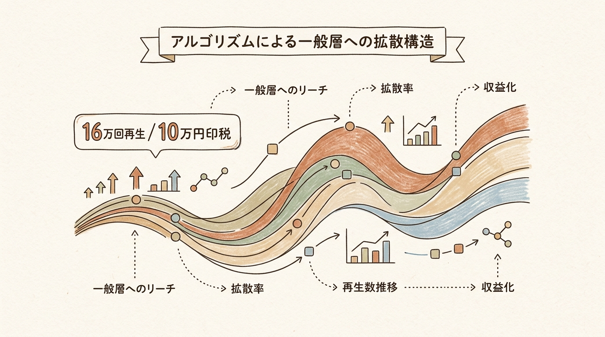
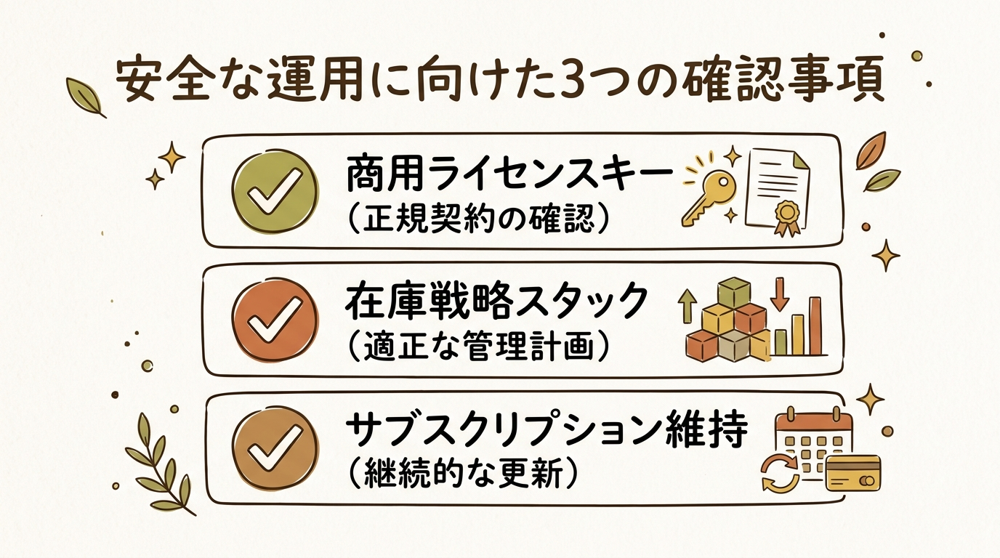

## 導入：日曜の夜、満員電車を想像してため息をついているあなたへ

日曜日の夕方、薄暗くなる部屋でふと「明日からまた、あの満員電車と終わらないデスクワークか……」と、胸の奥がぎゅっと重くなる感覚を覚えたことはありませんか？

毎月決まった日に振り込まれる給料。真面目に働いているけれど、税金や物価の上昇で実質的な手取りは増えない。かといって、副業を始めようとYouTubeの動画編集やブログ執筆に挑戦しても、1本の動画や記事を作るのに10時間も20時間もかかり、本業の合間に続ける体力が持たずに挫折してしまう。かつての私も、地方の製造業で25年間、毎日数字と格闘しながら同じような閉塞感を抱えていました。

労働時間と収入が1対1で直結する働き方から脱出し、自分が寝ている間も価値を生み出し続ける仕組み（ストック）を作りたい。

もしあなたがそう願っているなら、今、静かに起きている「AI音楽配信」という新しい選択肢に目を向けてみてください。

「音楽？ 楽器も弾けないし、楽譜も読めないのに無理だ」と思われたかもしれません。しかし、結論から申し上げます。

現在の生成AI（Suno）と世界配信インフラ（DistroKid）、そして作業を自動化するAI秘書（Claude Code）を組み合わせることで、音楽の専門知識ゼロの個人が、わずか数分で曲を作り、世界中の音楽プラットフォームに楽曲を並べてストリーミング収益を得る時代が到来しています。

実際に、ある検証事例では、AIで制作したたった1曲の楽曲（『夏風ペダル』）を世界配信したところ、公開から約2ヶ月で10万円を超える印税収入（再生数約16万回）が発生しました。しかも、その収益の大部分は、知人や既存のファンではなく、SpotifyやApple Musicのアルゴリズム（自動推薦機能）を通じて楽曲を気に入った「世界中の一般リスナー」から生み出されたのです。

なぜ、そんなことが可能なのか？ どうすれば知識ゼロの個人がその再現性ある仕組みを構築できるのか？

今回は、元・製造業の生産管理として業務の標準化と自動化を追求してきた私ケンジが、感情論抜きで、数字とロジック、そして具体的な設計図とともにその全貌を解き明かします。

---

## 1. 音楽未経験でも世界デビュー!? AI音楽配信が拓く「ストック型副業」の新常識

### 1-1. なぜ今「AI音楽配信」なのか？ YouTube投稿との決定的な違い

副業でAIを活用しようとするとき、多くの人が真っ先に思い浮かべるのが「YouTubeにAIが作ったBGM動画を投稿する」という方法です。しかし、実はこのやり方には構造的な弱点があります。YouTubeの動画投稿は、サムネイルの作成、動画のレンダリング、チャンネル登録者の獲得など、配信に至るまでの工程が非常に多く、プラットフォームの広告収益化条件（チャンネル登録者1,000人・再生時間4,000時間）をクリアするまでに途方むない時間がかかります。

一方、今回ご紹介する「音楽配信プラットフォームへの一括配信」は、アプローチが根本から異なります。

作成した楽曲を、直接 Spotify、Apple Music、YouTube Music、TikTok、Amazon Music、Instagram といった全世界の主要ストリーミングサービスへ直接「商品」として納品するのです。

ここで、ひとつの日常のたとえを想像してみてください。

・たとえ話（デジタル流通の構造）
自作の商品を売るとき、地元の小さな路面店（自分の未認知チャンネル）にポツンと置いて客が来るのを待つのか。それとも、世界中にある何千台、何万台もの「全自動自販機」（SpotifyやApple Musicの配信棚）に、一瞬で自分の商品を並べるのか。

デジタルコンテンツには物理的な在庫が存在しません。1曲作るコストも、10のプラットフォームに置くコストも、データとしては同じです。それならば、最初から世界中の人が日常的に音楽を聴いている巨大なインフラに露出面を最大化して並べる方が、論理的に考えて買われる（再生される）確率は飛躍的に高まります。

### 1-2. 再生されるたびに収益が発生する「ストリーミング印税」の仕組み

ストリーミング配信の魅力は、一度配信棚にセットしてしまえば、あなたが本業で仕事をしている間も、夜ぐっすり眠っている間も、誰かが通勤電車やカフェでその曲を再生するたびに「ストリーミング印税（再生報酬）」が発生し続ける点にあります。

・専門用語の補足
ストリーミング印税（再生報酬）：ユーザーが楽曲を再生した回数や時間に応じて、配信プラットフォームから権利者（あなた）へ支払われる継続的な収益。カラオケで自分の曲が歌われるたびに著作権料が入る仕組みと同じです。

物理的なCDを売る時代は「1枚売れたら〇〇円」という単発の売上でした。しかし、ストリーミング時代は「聴かれ続ける限り、半永久的にチャリンと収益を生み出す資産」になります。これが、労働を切り売りする副業と、仕組みを積み上げるストック型副業の根本的な違いです。

---

## 2. 作曲は3分・配信は丸投げ！収益化を支える「3つの神器」

では、具体的にどのようにして音楽未経験者が楽曲を作り、世界へ配信し、その面倒な手続きをこなすのでしょうか？ その裏側には、役割が明確に分かれた「3つのAI・デジタルツール」の連携が存在します。

・たとえ話（3つの神器のチーム構成）
① Suno AI：あなたの頭の中にあるイメージを即座に形にする「超優秀なゴースト作曲家」
② DistroKid：世界中の音楽ショップへ商品を一括で納入してくれる「大手音楽卸問屋」
③ Claude Code：面倒な書類記入やデータ移行を文句一つ言わずに代行する「手が早い優秀な作業秘書」

この3つのツールが連携することで、個人の作業負荷は驚くほど小さくなります。それぞれの役割を詳しく分解してみましょう。

---

### 2-1. 【神器1】Suno AI（自動作曲AI＝プロの音楽家）

まず、楽曲の制作を担うのが生成AIツール「Suno（スノ）」です。

・専門用語の補足
プロンプト（AI指示文）：AIに対して「どんな楽曲を作ってほしいか」を伝えるテキストの注文票。レストランで「夏らしくて爽やかなポップス、テンポは早めで」とシェフに頼むメニュー指示のようなものです。

Sunoの使い方は驚くほどシンプルです。スマートフォンやPCからサービスを開き、テキストボックスに「明るい夏のポップス」「哀愁を帯びたLo-Fi HipHop」「作業に集中できるカフェ風インスト」といったプロンプトを入力し、作成ボタンを押すだけです。

わずか約3分で、イントロからAメロ、サビ、アウトロまで完成された、ボーカル付き（またはインスト）の楽曲が2パターン生成されます。音質もプロのCDクオリティと遜色ありません。あなたが楽譜を読んだり、楽器を練習したりする必要は一切ないのです。

---

### 2-2. 【神器2】DistroKid（一括配信アグリゲーター＝世界の音楽問屋）

「良い曲ができた。でも、SpotifyやApple Music、TikTokなど20〜30もある配信サイトに、ひとつひとつ英語でアカウントを作って楽曲を登録するなんて、想像しただけで気が遠くなる……」

そう感じるのは当然です。ここで登場するのが、音楽配信一括代行サービス（アグリゲーター）の「DistroKid（ディストロキッド）」です。

・専門用語の補足
アグリゲーター（音楽配信一括代行業者）：個人のアーティストと世界中の音楽配信プラットフォームの間に立ち、楽曲データやジャケット画像、メタデータを一括で仲介・配信してくれる大型問屋。

DistroKidを利用すると、一度データをアップロードするだけで、世界中のほぼ全ての主要配信サービスへ一括で楽曲が送信されます。申請から早いサービスでは2〜3日、遅いところでも2週間程度で、あなたの楽曲がSpotifyやApple Musicの検索結果に登場します。

気になる費用面ですが、DistroKidの基本プラン（Musicianプラン）は年額24.99ドル（月額に換算するとわずか約2.08ドル＝約300円程度）です。曲数の制限なく、何曲でも配信し放題という破格のコストパフォーマンスを誇ります。

---

### 2-3. 【神器3】Claude Code（AIエージェント＝超優秀な作業秘書）

DistroKidを使えば一括配信ができるとはいえ、英語のフォーム画面に曲名を打ち込んだり、ジャケット画像を選択したり、利用規約をチェックしたりする作業自体が「面倒くさい」と感じる方も多いでしょう。

そこで、生産管理の視点から最強の自動化ハックとなるのが、AIエージェントツール「Claude Code（クロード・コード）」の活用です。

・専門用語の補足
AIエージェント（自律型AI指示ツール）：ユーザーの曖昧な指示を解釈し、パソコン画面の解析、ブラウザの操作、ファイルのダウンロードや配置などを自律的に代行してくれる次世代のAIアシスタント。

実際の検証事例では、ユーザーは作業の大半を自分で行っていません。DistroKidのURLをClaude Codeに渡し、「DistroKidでこの楽曲とジャケット画像を配信設定して」と指示を出すだけで、AIエージェントが画面を解析し、Sunoからの楽曲ファイルの取得から必要項目の入力までを自動で処理しました。

人間が行ったのは、本人の認証が必要な「アカウント作成」「クレジットカード決済」「最後の確認ボタンのクリック」というわずか数分の操作だけです。

・たとえ話（AI秘書の存在意義）
海外の複雑な役所手続きをするとき、自分で辞書を片手に書類と格闘するのではなく、英語が得意で仕事が爆速な秘書に「これやっといて」と書類を渡し、自分は最後に確認のハンコを押すだけの状態をつくる。

この「制作」「配信」「自動化」の3層構造を整えることで、仕事で疲れて帰ってきた夜でも、ストレスなく継続できる仕組みが完成します。

---

## 3. 【実証データ】1曲で10万円の収益発生！なぜファン以外にも爆発的に聴かれたのか？

「仕組みはわかったけれど、本当に素人が作ったAIの曲が聴かれて、稼げるのか？」

数字とロジックを重視する方なら、当然そう疑問に思うでしょう。ここで、実際の検証データを元に、収益化の再現性を客観的に分析してみましょう。

### 3-1. 16万回再生・1曲で約10万円の印税が発生した裏側

検証として制作・配信された楽曲『夏風ペダル』（Sunoで生成された爽やかなJ-POP調の楽曲）の実績データは以下の通りです。

・配信楽曲：『夏風ペダル』
・配信先：DistroKid経由でSpotify, Apple Music, YouTube Music等へ一括配信
・再生回数：YouTube Music等で約16万回再生を記録
・収益結果：配信開始から約2ヶ月で、1曲単体で約10万円の印税収益を達成

たった1曲をSunoで生成し、DistroKidで配信しただけで、10万円というまとまった収益が発生したのです。年額約25ドルのDistroKid利用料を差し引いても、圧倒的な利益率であることがお分かりいただけるでしょう。

### 3-2. 勝因は「ファン向け」ではなく「一般層へのアルゴリズム波及」

この検証事例で最も注目すべきポイントは、「収益の大部分が、既存のファンや知人ではなく、まったく面識のない一般リスナーの再生によってもたらされた」という事実です。

検証では、ファン向けに制作された「お金の勉強ソング」という楽曲も同時に配信されましたが、こちらの再生回数は約2.2万回にとどまりました。一方で、一般的なJ-POPとして汎用性の高い『夏風ペダル』は16万回再生と、実に7倍以上のパフォーマンス差がついたのです。

・たとえ話（アルゴリズム波及の例え）
知人だけに手作りのパンを配る（ファン向けコンテンツ）のではなく、スーパーの惣菜コーナーに「誰もが日常的に食べたくなる美味しい食パン」（汎用性の高い楽曲）を並べたことで、通りすがりの買い出し客が次々とカートに入れていった状態。

・専門用語の補足
アルゴリズム（自動推薦機能）：プラットフォーム側が、ユーザーの再生履歴や好みを分析し、「この曲が好きなら、これも好きでは？」と自動でプレイリストやおすすめに差し込むAI機能。

SpotifyやApple Musicのアルゴリズムは、楽曲のジャンルやメロディの完成度、リスナーのスキップ率などを分析し、条件を満たした楽曲を自動的に「ドライブ用プレイリスト」「作業用BGM」などの公式・ユーザープレイリストへピックアップします。

つまり、あなたにSNSのフォロワーが一人もいなくても、楽曲自体のクオリティがアルゴリズムに評価されれば、プラットフォームが勝手に世界中のリスナーへ曲を届けてくれるのです。

---

## 4. 始める前に知っておくべき「3つの注意点とリスク」

ここまでメリットと可能性をお伝えしてきましたが、私は静かな確信とともに、リスクや注意点も包み隠さずお伝えするのが誠実な立場だと考えています。

楽して一攫千金が狙えるような甘い話ではありません。失敗しないために、以下の3つのルールを必ず頭に叩き込んでおいてください。

---

### 注意点①：Sunoの有料プラン加入（商用利用権の確保）が絶対条件

Suno AIは無料プランでも楽曲を作成できますが、無料プランで生成した楽曲の著作権はSuno側に帰属し、商用利用（ストリーミング配信による収益化）は規約上固く禁じられています。

配信を行って収益を得るためには、必ず「Pro Plan」または「Premier Plan」といった有料プランに加入した状態で楽曲を生成する必要があります。有料プラン期間中に作成した楽曲は、解約後も永続的にあなたに商用利用権が残ります。ルールを無視して無料プランの楽曲を配信すると、アカウント停止や収益没収のリスクがありますので、ここはケチらずに必ず有料プランで実行してください。

### 注意点②：「1曲で確実」ではなく「数を出してヒットの母数を増やす」ストックアプローチ

『夏風ペダル』が1曲で10万円を稼いだのは素晴らしい事例ですが、「自分が作った最初の1曲が必ず10万円になる」と誤解してはいけません。

音楽のヒットには、どうしても季節性、トレンド、アルゴリズムの気まぐれといった確率要素が絡みます。重要なのは、1曲の成否に一喜一憂することではなく、Sunoを使えば3分で高品質な楽曲ができるという生産性の高さを活かして、20曲、50曲、100曲と配信数を重ねていくことです。

100曲配信すれば、そのうち5曲がアルゴリズムに乗って大きく稼ぎ、残りの95曲も毎月数十円〜数百円の小さな印税を生み出し続ける。この「ヒットの母数を増やし、面で稼ぐ」考え方こそが、製造業の生産管理にも通じるストックビジネスの本質です。

### 注意点③：DistroKidの契約維持と「Legacyオプション」の理解

DistroKidは年額サブスクリプション制のサービスです。万が一、年額更新をストップして解約した場合、配信されていた楽曲は各プラットフォームから取り下げられてしまいます。

もし「将来的にサブスクを解約しても、永続的に楽曲を配信棚に残し、収益を受け取り続けたい」と考える場合は、DistroKidが提供している「Leave a Legacy（遺産として残す）」といった配信維持オプション（1曲あたり単発の追加支払い）を付与しておくと安心です。自身の出口戦略に合わせてオプションを使い分けましょう。

---

## 5. まとめ：今日から始めるAI音楽プロデューサーへの第一歩

最後に、今回のポイントを整理しておきましょう。

・AI音楽副業 成功設計図
・制作の自動化：生成AI「Suno」の有料プランを活用し、専門知識ゼロ・たった3分で商用利用可能な高品質楽曲を制作する。
・流通の最大化：一括配信アグリゲーター「DistroKid」（年額約25ドル）を使い、SpotifyやApple Musicなど世界20〜30以上の配信サイトへ同時に露出させる。
・作業の極小化：AIエージェント「Claude Code」に配信手続きやデータ移行を代行させ、自分の作業時間を数分の決済・確認操作のみに削減する。
・収益のロジック：SNSのフォロワー数ではなく、配信プラットフォームの「アルゴリズム（自動推薦）」に乗せることで、一般リスナーからの継続的なストリーミング印税を狙う。
・継続の構え：1曲の成否に囚われず、AIの生産性を活かして楽曲のストック数を増やし、面で収益の柱を構築する。

---

### 自由は、根性ではなく「設計」で手に入れる

かつての私もそうでしたが、真面目で真剣に生きている人ほど「もっと努力しなければ」「自分が時間を削って頑張らなければ」と自分自身を追い込んでしまいがちです。

しかし、冷静に計算してみてください。あなたの1日は24時間しかありません。本業で疲弊した体と頭を振り絞って労働時間を増やすやり方には、必ず限界が来ます。

本当に必要なのは、根性で乗り切ることではなく、「自分が動かなくても価値を生み出し続ける仕組みを、最新のツールを使って設計すること」です。

難解な楽譜を覚える必要も、高価な楽器を買う必要もありません。
今夜、PCを開いてSunoで最初のプロンプトを打ち込んでみる。その一歩を踏み出すかどうかが、1年後のあなたの生活の「選択肢の数」を大きく変えることになります。

静かな確信を持って、あなたも今日から「AI音楽プロデューサー」としての第一歩を踏み出してみませんか？

<!-- 参照ファイル一覧
- 03_detailed_agenda.md
- 04_blog_post.md
- 05_thumbnail_prompts.md
- 06_section_prompts.md
- ./thumbnail.png
- ./img1.png
- ./img2.png
- ./img3.png
- ./img4.png
-->
