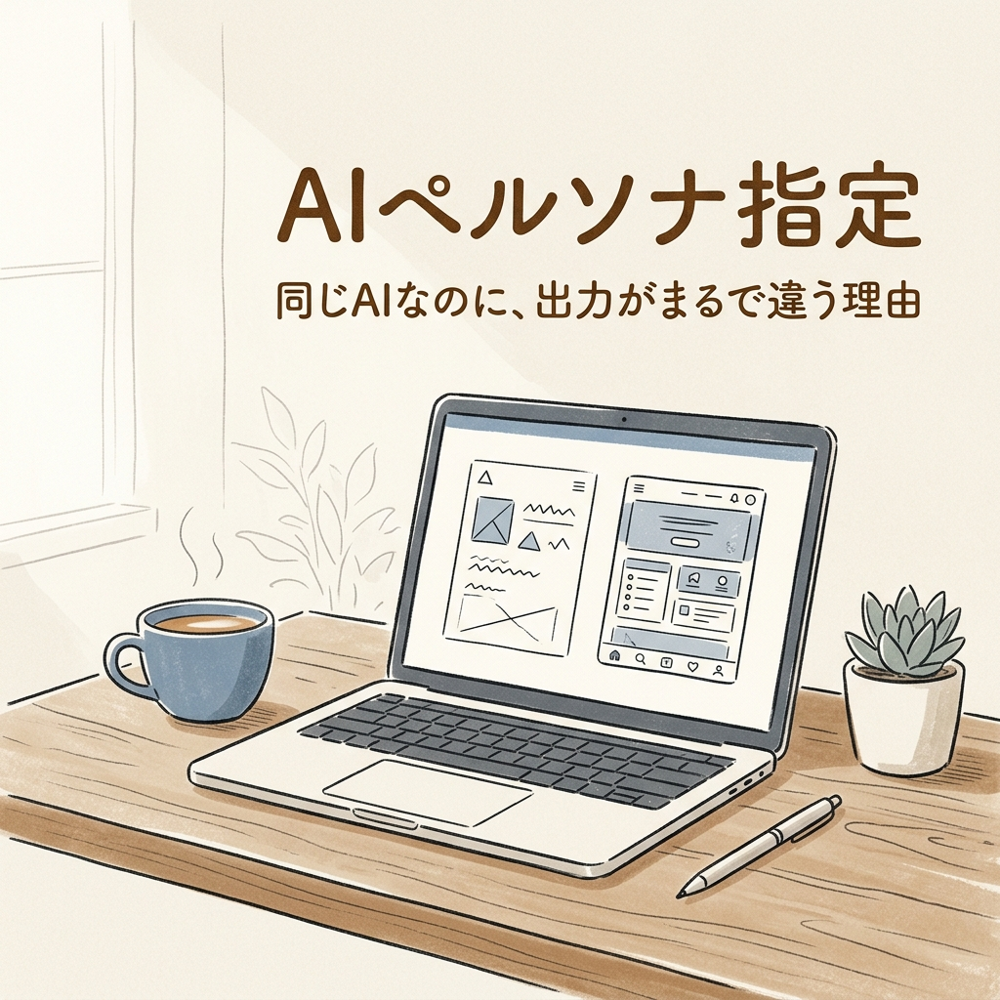
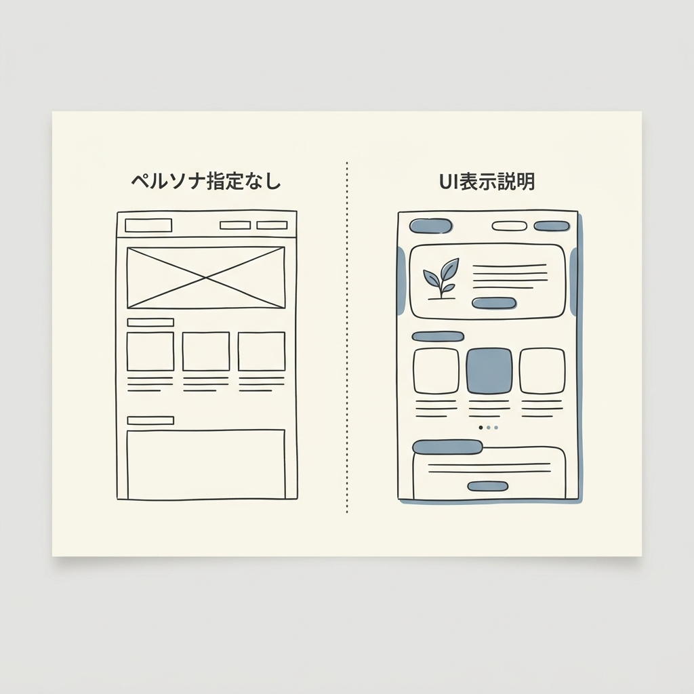
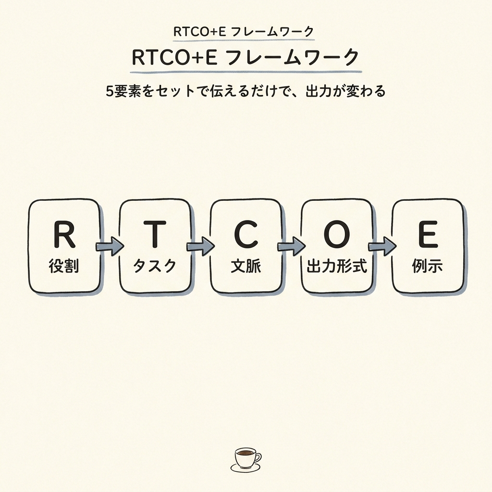
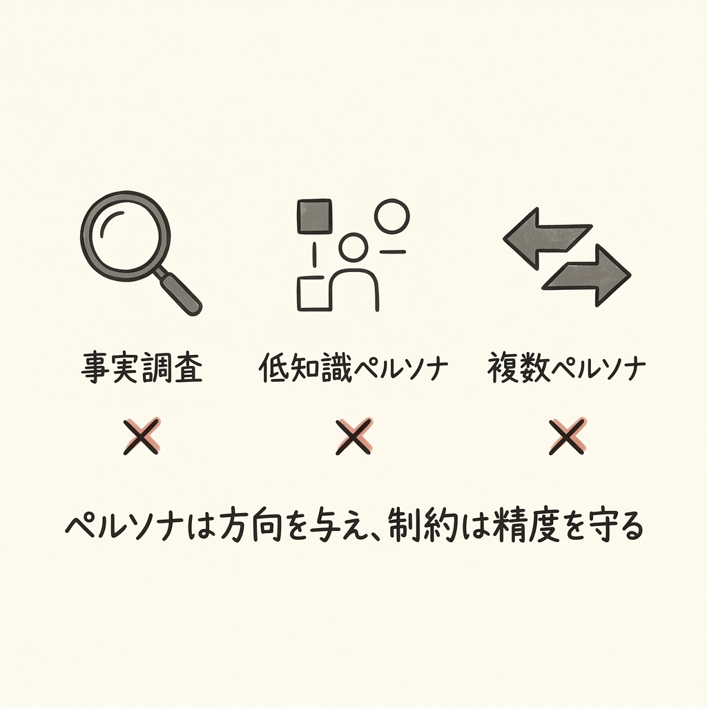

夕方6時、オフィスの自席。

チームリーダーから「新サービスのランディングページの叩き台、AIで作ってきてくれ」と言われた。
ChatGPTに打ち込んだ。「LPのUIデザイン案を作ってください」

数秒後に戻ってきた答えは——ヘッダー、キャッチコピー、CTAボタン、フッター。
正確だ。間違ってはいない。

でも、「料理を頼んだのに食材リストと調理法の説明書が来た」感じ、とでも言えばいいか。

翌朝、隣の席のデザイナー経験者の後輩が作ったモックアップを見て静止した。
色彩の統一感、文章のトーン、ターゲットへの刺さり方——どこもかしこも、昨日の自分の出力とは「別の星の産物」だった。

「同じAI、同じような質問……なぜ？」

この問いの答えが、**ペルソナ指定**という概念の入口だ。

---

## 同じAIに頼んだのに、なぜ「あの人の出力」だけが別格なのか

新人に仕事を頼むとき、「会議室を使えるようにしておいて」と言うのと、「明日の午後2時に30代の経営者2名が来るから、PDF資料を人数分印刷して、プロジェクターをつないで、飲み物はあたたかいものを用意してほしい」と伝えるのでは、準備の質が別物になる。

AIへの指示も、まったく同じ構造だ。

「UIデザイン案を作って」という依頼と、「10年以上の経験を持つシニアUXデザイナーとして、認知負荷の最小化にこだわりを持ち、BtoBのSaaSツールを専門にしてきたあなたが——」という依頼では、AIが参照する「正解の候補群」そのものが変わる。

これが、出力に雲泥の差が生まれる理由だ。

### ペルソナ指定とは「AIへの役割名刺」である

AIにとってのペルソナ指定とは、「あなたは誰として、この問いに答えるのか」を事前に伝える行為だ。

医者への問診票に近い。「症状は何ですか」だけでなく、「年齢・職業・生活習慣・既往歴」まで伝えると、医者の診断の精度が別次元になる。

ペルソナがない状態のAIは、「スーパーシェフに何を作るか伝えずに厨房に立たせる」ようなものだ。素材はある、技術もある。でも、何を目指せばいいか分からなければ、結果は「誰にでも食べられる無難な定食」に落ち着く。

### Before/After——タスク管理アプリで見る3つの世界

同じ「タスク管理アプリのUIデザイン案を考えてください」という一文でも、ペルソナ設定の違いで出力はこう変わる。

**ペルソナなし（Before）**

タスク名入力欄・チェックボックス・期限設定・優先度ボタン。一言で表せば「教科書の挿絵」。正確だが、誰に刺さるかが見えない。

**ペルソナあり / カフェ店員・アオイ（24歳）**

ペルソナ: 「細かい設定を見るとやる気が失せる。自己肯定感を高めたい」

- アプリ内の「タスク」という言葉を廃止。「今のキブン」と表記。
- パステルカラーと曲線を基調とした柔らかいUI。
- タスクをこなすと「画面内の植物が育つ」ゲーミフィケーション要素を追加。
- 完了時に小さなアニメーションで「よくやった」を演出。

アオイさんの「やる気が続かない」という痛点に直接応えるデザインになった。

**ペルソナあり / ITプロマネ・田村（36歳）**

ペルソナ: 「1秒の無駄も許さない。感情的な演出はノイズ」

- ダークモードを基調とした高密度の「コックピット型インターフェース」。
- クリティカルパス（作業全体の中で最も時間のかかるルート）の自動可視化。
- コマンド検索でキーボードだけで全操作が完結。
- 色彩は情報の優先度を示すためだけに使用。装飾はゼロ。

同じプロンプト、同じAI。でも「誰のための設計か」を定義した瞬間、出力の世界観が根本から変わった。

---

## 「ペルソナ指定の魔法」はなぜ効くのか——AIの思考を設計する仕組み

電子レンジの「あたため」と「解凍」の切り替えを思い浮かべてほしい。

同じ機械、同じ電力。でも、モードを変えるだけで動作は根本から変わる。ペルソナ指定は、AIに対して「どのモードで動くか」を設定する行為だ。

### AIの「探索範囲」を狭める仕組み

AIが回答を生成するとき、それは「膨大な正解候補が並んだ棚」から最適なものを選ぶプロセスに近い。

ペルソナを与えると、その棚の広さ——探索空間（AIが正解を選ぶときの候補の広がりのこと）——が一気に絞り込まれる。

コンビニで「なんか飲み物くれ」と言った店員は困惑する。飲料コーナーに100本以上の選択肢があるから。でも「寒い夜に体を温めるもの、甘すぎないやつ」と言えば、候補は自然とホットコーナーの10本程度に絞られる。

ペルソナ指定とは、AIに「どの棚を見るか」を最初に教える行為だ。

### 数字で見るペルソナ指定の効果

感覚論で語るのは、この記事の流儀ではない。

構造化されたペルソナプロンプトを使った推論タスクの実験では、精度が **53.5% から 63.8%** まで向上したことが報告されている（AQuA数学推論データセットを用いた研究より）。

AI活用に関する職場調査では、専門職の **86%** が「AIは時間削減に役立つ」と回答している。ただし、満足度はまだ中程度に留まっており、その差を生んでいる要因が「指示の質」だとされている。

ペルソナなしのAIは「才能はあるが誰にも方向を示されていない新人」、ペルソナありのAIは「その分野の10年選手をその場に召喚した状態」——同じ道具でも、使い方の設計が変われば、パフォーマンスは別物になる。

---

## 実践編——明日からできる「ペルソナ設計書」の作り方

舞台監督が俳優に演技指導するとき、「悲しい顔をして」とは言わない。「8年付き合った人に別れを切り出された、でも内心ほっとしている人の表情」と伝える。

AIへのペルソナ指定も同じだ。「誰として・どんな価値観で・どんな文脈で」まで掘り下げると、出力が変わる。

### RTCO+Eフレームワーク

「役割・タスク・文脈・出力形式・例示」の5要素をセットで指示する方法だ。演劇に例えて整理するとわかりやすい。

- **R（Role / 役割）**: 演劇でいう「役柄」。AIが誰として答えるかを定義する。
- **T（Task / タスク）**: 脚本の「シーン」。何を作るかを指示する。
- **C（Context / 文脈）**: 舞台の「設定」。背景・制約・目標を伝える。
- **O（Output / 出力形式）**: 演じ方の「指示」。どんな形式で返すかを指定する。
- **E（Examples / 例示）**: 「このシーンを見本にして」という参考資料。

これを一本のプロンプトにまとめると、こうなる。

**実践テンプレート（そのままコピーして使える）:**

> あなたはBtoB SaaSツールの設計に10年以上携わってきたシニアUXデザイナーです。認知負荷の最小化と情報の優先順位の明確化にこだわりを持ちます。
> 10〜50人規模のチームが使うプロジェクト管理ツールのダッシュボードホーム画面のUI案を提案してください。
> ミニマルで清潔感のあるスタイルを基本とし、主要な情報（タスク一覧・進捗・通知）を一画面で把握できる構成にしてください。
> レイアウトの説明とコンテンツの優先順位を、箇条書き形式で返してください。
> Stripeのデザインスタイルを参考にしてください。

R・T・C・O・Eの5要素が全部入っている。これだけで、出力は「教科書的な一般論」から「特定の文脈に最適化されたプロの提案」へと変わる。

### ペルソナ設計のチェックリスト

プロンプトを書く前に、この4つを決める習慣をつけると出力が安定する。

- 誰として答えさせるか（職種・専門分野・経験年数）
- 何を作るか（具体的な成果物）
- 誰のために・どんな制約の中で（文脈・制約・目標）
- どう返すか（フォーマット・長さ・詳しさの度合い）

料理人に依頼するとき、「お客様は誰ですか」という質問から始まるのと同じだ。これを先に決めてから包丁を握る。それだけで、厨房で起きることが変わる。

---

## 「ペルソナの罠」——これだけは知っておいてほしい限界と注意点

強力な調味料も、使いすぎると料理の素材の味が消える。

ペルソナ指定は強力なツールだが、万能ではない。使い方を間違えると、逆効果になることが研究で確認されている。

### ペルソナが逆効果になる3つのケース

**1. 「正確な数値・統計を調べたい」とき**

「あなたは統計の専門家です」という役割を与えると、AIは役割に「忠実」であろうとして、自信満々に答えを作る。ここに落とし穴がある——正確な事実確認が必要な場面では、役割より「思考プロセスの制約」を付与する方が安全だ。

推奨: 「あなたは論理的な分析官です。推測せず、データに基づいて答えてください」

**2. 「幼稚な視点を演じさせる」とき**

「小学生の視点で」「子供のように」という指定は、研究で回答精度を下げることが実証されている。知識量が少ないペルソナをAIに演じさせると、AIも能力を「引き下げて」しまう。

**3. 「複数の矛盾するペルソナを重ねる」とき**

「ミニマリストのデザイナーであり、かつポップで派手なスタイルが得意な——」という指定は文脈が崩壊する。ペルソナは一本筋の通ったものにする。

### ハルシネーションとの向き合い方

「ハルシネーション」——これはAIが「事実ではない情報を、自信満々に生成してしまう現象」だ。

たとえ話で言えば、役になりきった俳優が脚本にないセリフを「それっぽく」アドリブで言う状態に近い。特にペルソナ指定で「専門家として答えよ」と役割を与えると、AIは役割に「ふさわしい答え」を作ろうとして、根拠のない情報を補完する傾向がある。

対策はシンプルだ。ペルソナ設定に、必ずこの一文をセットにする:

> 「事実として確認できないことは推測せず、その旨を明示してください」

ペルソナは方向を与え、制約は精度を守る——この両輪で、AIは初めて使いやすい道具になる。

---

## 設計の質が、道具の性能を決める

同じカメラを持って同じ場所に立っても、シャッターを押す人によって写真は全く別物になる。光の読み方、焦点の意図、構図の設計——これらを先に決めた人の写真は、「記録」でなく「作品」になる。

AIへのペルソナ指定は、「どんな写真を撮りたいか」を最初に決める行為だ。

AIは、あなたの指示の設計レベルと同じものを返してくる、精巧な鏡だ。

タスク管理アプリのアオイさんのデザインを思い出してほしい。「タスク」を「キブン」に変え、植物を育てるという概念を加えたのは、ペルソナの設計から生まれた発想だ。同じ道具を持っていても、設計書を読んだ人と読んでいない人は、1年後に全く別の場所に立っている。

今日の昼休み、試してみるだけでいい。ここまで読んでくれたなら、もうスタートラインに立っている。

---

## まとめ——ペルソナ指定で変わる5つのこと

- AIへの「役割名刺」を先に決めると、出力の解像度が変わる
- 「探索空間を絞る」ことで、AIは汎用回答からプロの提案へとシフトする
- RTCO+Eの5要素（役割・タスク・文脈・出力・例示）をセットにすると再現性が上がる
- 論理タスクではペルソナより「思考制約」が有効な場面がある
- ハルシネーション対策として「推測しない」制約を必ずセットにする

---

<!-- 参照ファイル一覧
- 03_detailed_agenda.md
- 04_blog_post.md
- 05_thumbnail_prompts.md
- 06_section_prompts.md
- ./thumbnail.png
- ./img1.png
- ./img2.png
- ./img3.png
-->
