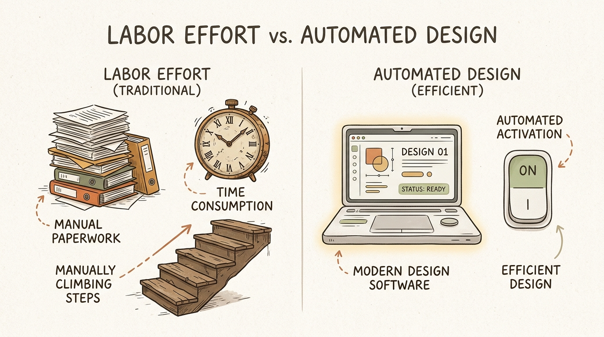
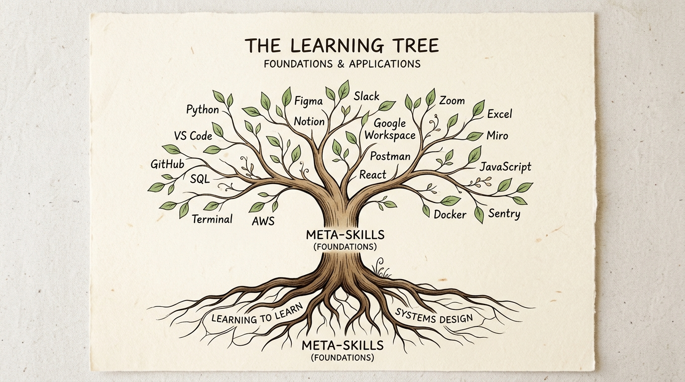
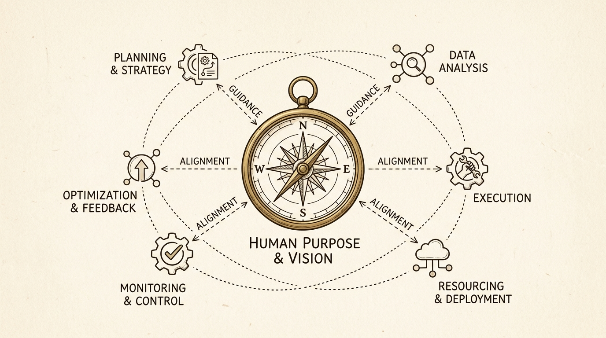

月曜日の朝。満員電車に揺られながらスマホを開くと、画面には「生成AIがホワイトカラーの業務を8割代替する」「プログラミングも事務作業もAIが即座にこなす」というニュースが踊っている。

オフィスに到着してパソコンを開き、いつものようにメールを返し、Excelの集計データを加工し、提出用の資料を整える。真面目に、泥臭く、時間をかけてこなしてきた日々の仕事。

でも、ふと手が止まる瞬間はないだろうか。

「今日、自分が2時間かけて作ったこのデータ集計、AIなら数秒で終わるんじゃないか？」
「寝ずに努力して身につけてきたスキル、来年はどうなっているんだろう？」

かつて私は、地方の製造業で25年間、生産管理や事務効率化の現場にいた。夜遅くまで残業し、関数やVBAを駆使して現場の仕組みを整えていた時期がある。真面目に働いている人ほど、「自分が積み上げた作業努力の量」に誇りを持ち、それを武器にして生きようとする。

だが、時代は決定的に変わった。

結論から言おう。これからの時代、ガムシャラに時間を投じる「作業努力」の経済的価値は、実質ゼロに向かっていく。

今回は、Google DeepMind CEOのデミス・ハサビス氏や生成AI界の第一人者である深津貴之氏の知見を紐解きながら、AI時代に淘汰される人と、静かに自由を勝ち取る人の違いを構造として解説する。根性論や精神論は一切使わない。すべては「設計」と「ポジショニング」の話だ。

---

## 1. 努力の価値が暴落する時代——なぜ「真面目な人」ほど追いつめられるのか？

### 1.1 ボタン1つで消える「20年の熟練」

かつて、技能の獲得には膨大な「時間」と「反復訓練」が必要だった。

プログラミング言語を習得し、エラーを出さずにコードを書くには数年の現場経験が必要だった。経理の複雑な仕訳や税務処理をこなすには、資格取得と泥臭い下積みが不可欠だった。

だが今、何が起きているか。

これまで20年かけて磨かれてきた作業スキルが、SaaSのボタン1つ、あるいは月額数千円のAI課金によって、一瞬で「誰でもボタン1つで実行できるコマンド」に化けている。

ここで計算してみてほしい。人間が1時間かけて行うデータ整理の時給対価が2,000円だとする。一方、クラウド上で動作するAIが同じ処理を行う場合の電気代・計算コストは、わずか0.01円以下だ。

生産性の勝負において、人間が「時間と作業量」でAIに勝つことは物理的にあり得ない。手書きの美しい筆記体で手紙を書く技術が、印刷機の登場で「趣味」になったのと同じ現象が、すべてのホワイトカラー業務で起きている。

### 1.2 AIと「作業量」で戦ってはいけない

多くの真面目なビジネスパーソンがハマる罠がある。

「AIに奪われないために、もっと勉強して作業スピードを上げよう」「人一倍働いて成果を出そう」と、従来の延長線上で努力の量を増やそうとすることだ。

これは、時速300kmで走る新幹線に対して、裸足で全力疾走して勝負を挑むようなものだ。

AIは24時間365日、疲れることも愚痴を言うこともなく、一定の品質でアウトプットを出し続ける。AIと「量」や「速度」で正面衝突する戦略をとる限り、待っているのは疲弊と敗北だけだ。

まずは「努力のベクトル（方向性）」を根本から設計し直さなければならない。

---

## 2. 生存の鍵「メタスキル」とは？——個別スキルの賞味期限を突破する

### 2.1 個別スキル（火の魔法）とメタスキル（パッシブ能力）

では、どんな能力を鍛えればいいのか。

Google DeepMindのCEO、デミス・ハサビス氏は、AI時代において最も重要な能力として「学び方を学ぶ (Learning how to learn)」、つまり『メタスキル』の獲得を挙げている。

メタスキルとは一言で言えば、「特定のスキルを獲得・制御するための、上位の思考OS」のことだ。

ゲームに例えると分かりやすい。

- 個別スキル: 「火の玉の魔法」や「特定の剣技」。Pythonのライブラリの書き方や特定のツール操作など。
- メタスキル: 「経験値獲得量1.5倍」や「移動速度20%アップ」「新しい魔法を瞬時に解読する知性」。課題の構造化能力、プロンプト設計、学習プロセスの最適化など。

個別スキル（火の魔法）は、ゲームのアプデ（ルールの更新）で一瞬にして無効化される。AI時代においては、個別スキルの賞味期限が数年単位から数ヶ月単位へと縮んでいる。

だが、パッシブ能力であるメタスキルさえ持っていれば、どんなにツールや環境が変わろうと、新しいスキルを瞬時に吸収して使いこなすことができる。

### 2.2 ルールが変わっても生き残る人の共通点

生成AIの第一人者である深津貴之氏のキャリアに、象徴的な事例がある。

深津氏はかつて、Adobe Flashを用いたWeb表現のトップクリエイターだった。だが、iPhoneの登場でFlash非対応が決まり、Web表現のルールは一夜にしてガラガラと音を立てて変わった。

もし深津氏が「Flashの操作手順」という個別スキルだけに執着していたら、キャリアは途絶えていただろう。だが、彼の本質的な強みはツールそのものではなく、その根底にあった「ユーザー意識の誘導設計」や「情報の構造化能力」というメタスキルだった。

だからこそ、プラットフォームがスマホアプリになり、生成AIになっても、常にトップランナーであり続けられる。

道具（ツール）に固執せず、道具を動かす設計思想（メタスキル）を身につけること。これが変化の激しい時代における唯一の安全網だ。

---

## 3. 「AIの上司」になるポジショニング——人間にしか出せない「非合理なノイズ」

### 3.1 合理的なAI（部下）と、非合理な人間（上司）

AI時代のポジション取りで非常に明快なフレームワークがある。「AI＝超優秀な部下」「人間＝目的を与える上司」という関係性だ。

最新のAIエージェントは、データ分析もリサーチも数分で完了させる。合理性、正確性、処理速度において、AIは究極の部下だ。

しかし、どれほど優秀なAIにも決定的な欠点がある。「自発的な欲望や目的を持たない」ことだ。

AIは「何を調べるべきか」「なぜそれをやるのか」という初期条件（スタート地点）を与えられない限り、自分からは動かない。

上司と部下の関係を思い出してほしい。オフィスで優秀な秘書に「何か美味しいもの買ってきて」と頼むと、秘書は高評価の店を合理的に探してくれる。だが、「そもそも今日、中華を食べたいのか和食を食べたいのか」という非合理な欲求（初期条件）を決めるのは上司だ。

合理的な計算はAI（部下）に任せ、人間は「非合理な欲望・問い・初期条件」を与える。この立ち位置を取ることこそが、「AIの上司」になるということだ。

### 3.2 「初期条件」と「意思」を与える仕事

AI時代に人間が価値を発揮するポイントは3つに絞られる。

1. 独自の問い（問いを立てる力）: 現場の違和感やノイズから問いを拾い上げること。
2. 初期条件の設定（プロンプトと文脈の設計）: 誰向けにどんな課題を解決させるかの前提条件を精緻に組み立てること。
3. 最終判断と責任の受容（意思決定）: AIが出した選択肢から「今回はこれでいく」と腹をくくって決定すること。

AIに作業を丸投げして答えを求める人は、AIの「部下」になる。
AIにコンテキストを与え、意思決定の材料を作らせる人が、AIの「上司」になる。

---

## 4. 今日から始める「AI時代の上位互換キャリア」3ステップ

明日から私たちが取れる再現性のある3ステップを整理した。

### Step 1: 自分の業務を「上司目線」で解剖する

まず、あなたが日頃行っている業務を書き出してみてほしい。

メール返信、データ集計、資料の下書き作成、問い合わせ対応。

そして「これはAI部下に指示書（マニュアル）を出して頼めるか？」と自問する。指示書さえあればAIでできる作業なら、今日から自分で手を動かすのをやめる。指示書を作成し、AIに初稿を作らせ、自分はチェックと修正に回る。手作業時間を減らし、「指示書の精度を上げる時間」にシフトすることが第一歩だ。

### Step 2: 「学び方を学ぶ」メタ学習の習慣化

新しいAIツールの操作方法を丸暗記しようとしてはならない。意識すべきは「構造のパターン」を理解することだ。

「このツールはどんな初期条件を受け取って、どう出力を変換しているのか？」という入力と出力の構造に着目する。操作マニュアルを読むのではなく、仕組みのロジックを抽象化して理解する。このメタ学習を一度身につければ、未知のツールが登場しても数分で本質を見抜けるようになる。

### Step 3: 自分だけの「非合理なこだわり」を言語化する

AIのアウトプットは放っておくと「平均的で無難な70点」になる。そこに100点、120点の価値をもたらすのが、あなた自身の「非合理なこだわり（美意識・体験・痛みの記憶）」だ。

教科書やWebデータには載っていない、泥臭い現実の中であなたが感じてきた違和感やこだわりを、AIのアウトプットに追加する。効率化された土台の上に人間の生々しいノイズ（意志）を乗せること。これこそが、他者には決して真似できない強固な差別化になる。

---

## 5. 専門用語の初心者向け整理

本記事で登場した概念を日常の例えでまとめた。

- メタスキル
  - 一言解説: スキルを獲得・制御するための「学び方を学ぶ力（思考のOS）」。
  - 日常の例え: ゲームで個別の攻撃技を覚えるのではなく、「レベルが上がりやすくなるパッシブ能力」や「基礎体力を底上げする体質」を鍛えるようなもの。
- AIエージェント
  - 一言解説: 指示を受けて、自律的に調べ物やタスクを実行するAIプログラム。
  - 日常の例え: 「〇〇について調べておいて」と頼むと、自分でネット検索や整理をして報告してくれる優秀な専属秘書。
- 初期条件（プロンプト・コンテキスト）
  - 一言解説: AIに成果物を作らせるためのスタート地点や前提条件の設定。
  - 日常の例え: 建築家が大工さんに手渡す「どんな暮らしを実現したいか」という設計コンセプトと土地の条件。
- 作業のボタン化（AI代替）
  - 一言解説: 長年の経験が必要だった作業が、SaaSやAIのボタン1つで完了する現象。
  - 日常の例え: 手でゴシゴシ洗っていた洗濯が、全自動洗濯機のボタン1つに置き換わった変化。

---

## 結論：自由は根性ではなく「設計」で手に入れる

かつての私は、「もっと人一倍働かなければ」「もっとスキルを増やさなければ」と、終わりのない労働の輪の中で焦り続けていた。真面目な人ほど自分を追い詰め、体をすり減らして成果を出そうとする。

だが、静かに観察してほしい。

時代のルールは変わった。時間を投じる根性論の価値は終わり、仕組みと構造を理解した人間が、軽やかに自由を手にする時代だ。

朝8時。コーヒーを淹れてデスクに向かう。今日の予定は、AI部下に手渡す指示書のチェックと、これからの方向性を決める思考の時間だけ。

あなたが今日行ったその作業。
もし「ボタン1つ」で終わるとしたら——明日のあなたの価値は、どこにあるだろうか？

恐れる必要はない。今日から作業者をやめ、AIの指示役（上司）としての第一歩を踏み出そう。

自由は、根性ではなく「設計」で手に入れるものなのだから。

<!-- 参照ファイル一覧
- 03_detailed_agenda.md
- 04_blog_post.md
- 05_thumbnail_prompts.md
- 06_section_prompts.md
- ./thumbnail.png
- ./img1.png
- ./img2.png
- ./img3.png
-->
