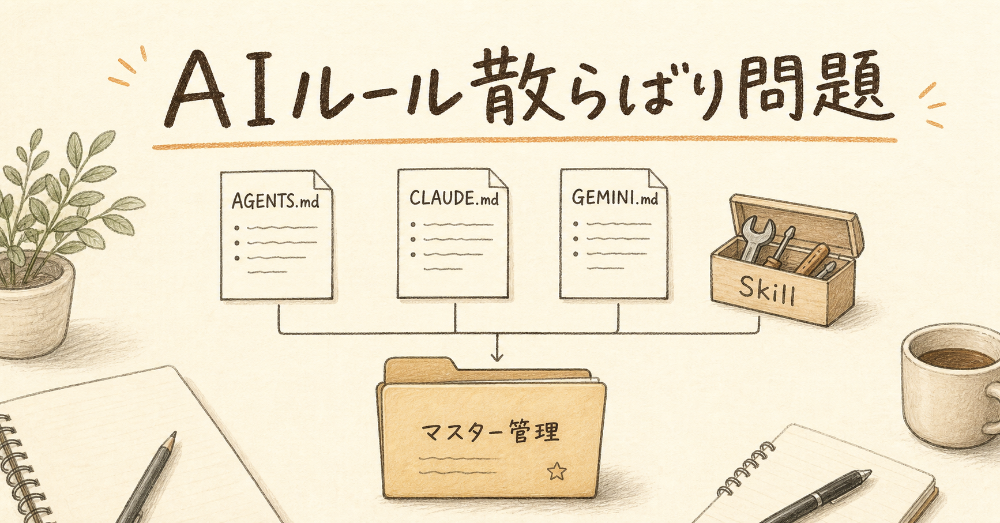
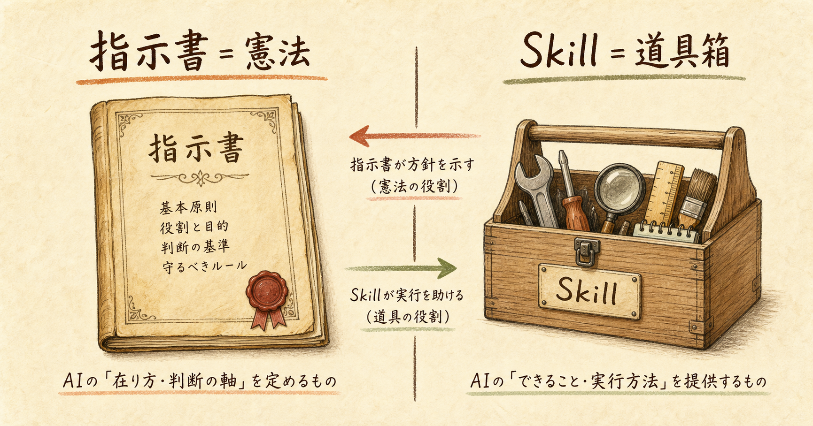
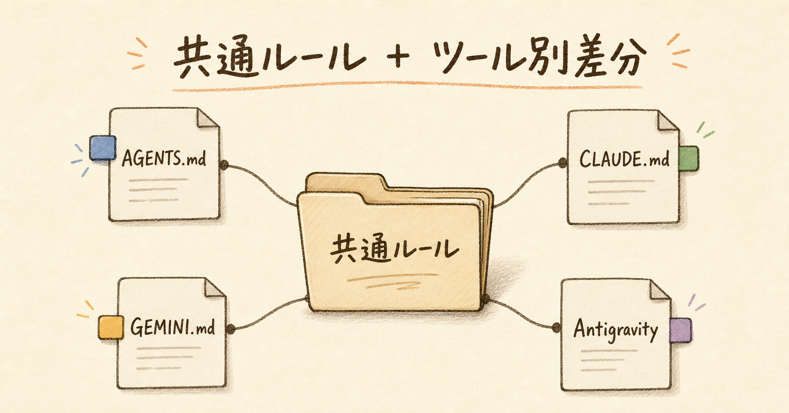
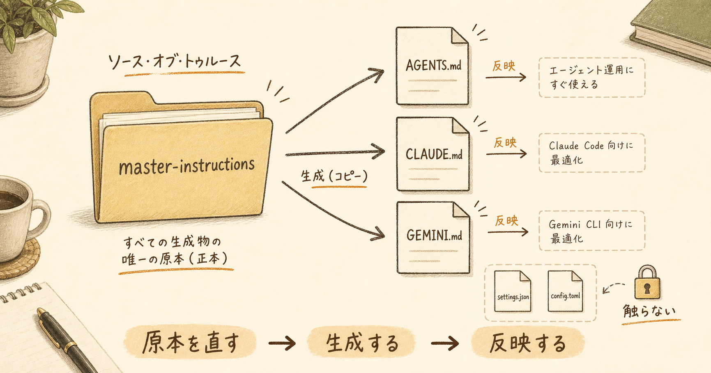
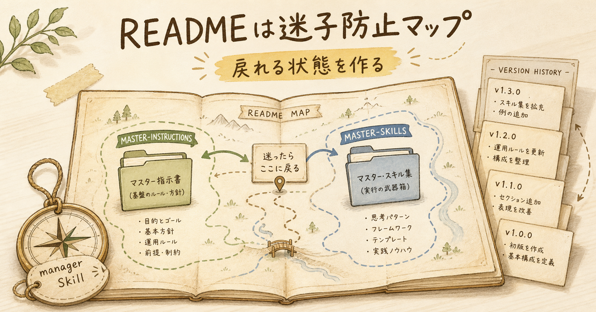

---
title: "AIツール併用で起きるルール散らばり問題の整理術"
description: "Codex、Claude Code、Geminiを併用すると指示書やSkillが散らばりがちです。AGENTS.md、CLAUDE.md、GEMINI.md、settings系をどう分け、原本管理するかを整理します。"
pubDate: "2026-05-04"
tags: ["AIツール", "AGENTS.md", "Skill管理", "Codex", "Claude Code"]
heroImage: "./thumbnail.png"
slug: "ai-tool-rule-management"
draft: false
---

# AIツールを複数使う人ほど、実は「ルールの散らばり」で困る

朝、作業を始める前にCodexを開く。

昨日はClaude Codeで整理した。別件ではGeminiにも聞いた。Google Antigravityのワークスペースもある。どれも便利です。便利なのに、ある瞬間から別の疲れが出てきます。

「このルール、どこに書いたっけ」

これです。

AIツールの使い方そのものではありません。プロンプトの書き方でもありません。もちろん、それも大事です。でも複数のAIツールを日常的に使い始めると、もっと地味な問題が出てきます。

ルールが散らばる。

AGENTS.md、CLAUDE.md、GEMINI.md。さらにSkill。さらにsettings.jsonやconfig.toml。最初は全部「AIに関係するもの」として見えてしまう。でも実際には、役割が違います。

ここを混ぜると、かなり早い段階で運用が重くなります。

昨日直したはずのルールが、別のAIには反映されていない。コピー先だけ直して、原本が古いまま残る。逆に、指示書と同じ感覚でsettings系まで統一しようとして、壊してはいけない配線に手を伸ばしそうになる。

かつての私も、ここで一度つまずきました。

AI活用が進むほど、必要になるのは「もっと強いプロンプト」だけではありません。AIが迷わない環境です。人間側が、どのルールをどこに置き、どこを直せば反映され、どこは触らないのかを決めておく必要があります。

## AIツールを増やすほど、問題は使い方ではなく置き場所になる

Codex、Claude Code、Gemini、Antigravity。

それぞれ得意なことがあります。コード変更が得意なもの、長い文脈整理が得意なもの、Google Drive側の流れに乗せやすいもの。使い分け自体は自然です。

問題は、使い分けが増えた瞬間に、ルールも増えることです。

最初はAGENTS.mdだけでよかった。次にCLAUDE.mdが出てくる。Gemini用にGEMINI.mdも必要になる。作業手順をSkillにしたくなる。さらにアプリ側のsettings.jsonやconfig.tomlも目に入る。

すると頭の中で、こうなります。

「全部、同じ内容にしておけばいいのでは」

気持ちは分かります。私も最初はそう考えました。

でも実際には、同じにしてよいものと、同じにしてはいけないものがあります。

指示書は、AIへの基本姿勢や安全ルールを書く場所です。たとえば「ユーザーの変更を勝手に戻さない」「作業前に差分を見る」「保存先を守る」といった、AI全体の振る舞いに関わるものですね。

Skillは違います。特定作業をうまくやるための手順書です。画像生成、動画生成、リサーチ、資料化、コードレビュー。作業ごとの型を置く場所です。

settings.jsonやconfig.tomlはさらに違います。これはAIへのお願いではなく、アプリ本体の配線です。認証、権限、プラグイン、自動処理、連携先。ここを指示書と同じノリで統一しようとすると、壊れる可能性があります。

家の中で考えると分かりやすいです。

家族のルールを書いた紙。工具箱の使い方。ブレーカーやガス栓の設定。

この3つを「家に関係するものだから」と同じファイルにまとめる人はあまりいません。AI環境でも同じです。

## まず分けるべきは「指示書」と「Skill」

今回の整理で、一番効いたのはここでした。

指示書とSkillを分ける。

指示書は、AI全体の基本姿勢、安全ルール、作業方針を書く場所です。言い換えると、憲法に近い。どんな作業でも守るべき前提です。

Skillは、特定作業を上手にやるための手順書です。こちらは道具箱です。動画を作るときの手順、画像を生成するときの注意、リサーチするときの進め方。必要なときに取り出して使うものです。

つまり、こう分けます。

master-instructions は憲法。

master-skills は道具箱。

この分け方だけで、かなり頭が軽くなりました。

なぜなら、何かを追加するときに判断できるからです。

「これはAIの基本姿勢か」

そうならmaster-instructions側です。

「これは特定作業の手順か」

そうならmaster-skills側です。

この判断軸がないと、何でもAGENTS.mdに入れたくなります。逆に、Skillの中に安全ルールまで書きたくなります。結果として、どのAIがどのルールを読むのか分からなくなる。

会社で言えば、就業規則と経理ソフトの操作マニュアルを同じ冊子にするようなものです。読めなくはない。でも、更新する人も読む人も迷います。

AIにとっても同じです。

AIは賢いですが、ファイルの役割まで勝手に整理してくれるわけではありません。人間側が置き場所を決めておかないと、毎回の指示が長くなります。

## AGENTS.md、CLAUDE.md、GEMINI.mdは完全同一にしない

次に大事なのが、完全同一にしないことです。

最初は、全部同じにしたくなります。

CodexはAGENTS.md。

Claude CodeはCLAUDE.md。

GeminiはGEMINI.md。

読むファイルが違うなら、全部同じ内容にしておけば安心に見えます。

でも、実際にはそれぞれのツールで得意な動きも、前提にしている環境も違います。Codex Desktopで使うルール、Claude Codeで使うルール、Geminiで使うルール。共通化できる部分は多いですが、完全に同じにはしないほうが自然です。

ここで必要なのは、完全統一ではありません。

統一管理です。

共通ルールを持つ。

その上で、ツール別差分を持つ。

これが現実的です。

たとえば「ユーザー変更を勝手に戻さない」「保存先を守る」「機密情報を外に出さない」は共通ルールです。どのAIにも守らせる。

一方で、CodexならAGENTS.mdの読み方、Claude CodeならCLAUDE.mdやSkill配置、GeminiならGEMINI.md側の前提があります。ここは差分として残す。

家族の防災ルールに近いです。

避難する、火元を見る、連絡する。これは共通です。でも父は車、母は自転車、子どもは通学路。動き方の細部は違います。全部を同じにすると、かえって現実に合わなくなる。

AIツールも同じです。

共通ルールとツール別差分。

この二段構えにすると、統一感を保ちながら壊れにくくなります。

## 一番育っているものを土台にする

こういう整理を始めると、ついゼロから作りたくなります。

新しいフォルダを作る。新しいルール体系を作る。きれいな名前をつける。

でも、実務ではゼロから作るより、すでに育っているものを土台にしたほうが強いです。

今回は、既存のAGENTS.mdとCLAUDE.md系が一番充実していました。実際の運用の中で、失敗や修正が積み重なっていたからです。

そこに、Gemini独自のルール、Google Drive側の保存場所ルール、settings系を触らない方針を合流する。

このほうが、現場に合います。

運用は発明より整理です。

発明は気持ちがいい。新しい概念を作ると、前に進んだ感じがします。でも日々の作業を軽くするのは、たいてい発明ではなく整理です。

何が原本か。

何がコピーか。

何は統一して、何は統一しないのか。

この線引きがあるだけで、次の作業の迷いが減ります。

## settings.jsonやconfig.tomlは統一しない

ここは、かなり重要です。

AGENTS.md、CLAUDE.md、GEMINI.mdはAIへの指示書です。

でも、settings.jsonやconfig.tomlは違います。アプリ本体の設定です。

認証、権限、自動処理、プラグイン、連携先。こういう配線が入っています。

つまり、触るリスクが違います。

指示書は、文章として直せます。もちろん誤った指示を書けば事故は起きますが、基本的には「AIにどう動いてほしいか」の話です。

settings系は、アプリの動きそのものを変えます。認証情報に近いもの、権限に関係するもの、連携先に関係するものが入ることもあります。

これを「全部のAIツールで統一しよう」とすると、危ない。

料理で言えば、献立メモとガス栓を同じ感覚で触るようなものです。献立は直せばいい。でもガス栓は、意味が分からないまま触る場所ではありません。

だから、settings系は統一しない。

管理するのは、場所と役割です。

どこにあるか。

何の設定か。

触ると何が変わるか。

バックアップや復旧はどうするか。

この程度に留める。指示書と同じノリで中身を揃えない。

ここを切り分けるだけで、安心感がかなり変わります。

## 原本とコピーを分ける

今回、一番すっきりしたのは原本とコピーを分けたことです。

原本は、Gドライブ側のmaster-instructionsに置く。

コピーは、それぞれのツールが読む場所に置く。

たとえば、CodexならAGENTS.md。Claude CodeならCLAUDE.md。GeminiならGEMINI.md。

コピーを直接いじり続けると、必ずズレます。

最初は小さな修正です。「ここだけ直しておこう」。その場では問題ありません。でも数週間後、どれが最新か分からなくなる。

原本を直す。

生成する。

反映する。

この流れにするだけで、迷子になりにくくなります。

町内会の掲示板を想像すると分かりやすいです。掲示板に貼ってある紙を、その場で赤ペン修正し続けると、どれが正式版か分かりません。事務所に原稿があり、そこを直して印刷し直す。これなら戻れます。

AIの指示書も同じです。

AGENTS.mdを直接直すことが悪いわけではありません。緊急対応では必要なこともあります。ただし、その修正を原本へ戻さないと、後で必ずズレます。

だから、原本管理にする。

この考え方はSkillにもそのまま使えます。

master-skillsに原本を置く。Codex、Claude Code、Google Antigravityなどに反映する。ツールごとに必要な差分は残す。

AIツールが増えるほど、個別最適ではなく原本管理が効いてきます。

## READMEとmanager Skillは、未来の自分への地図になる

今回、master-instructionsにもREADMEを作りました。

READMEというと、他人向けの説明書に見えます。でも実際には、数週間後の自分への案内板です。

何を管理する場所か。

どこが原本か。

どこへ反映するか。

settings系はなぜ統一しないか。

master-skillsとはどういう関係か。

これが書いてあるだけで、未来の自分が助かります。

人間は忘れます。特に、AI環境の整理はその場では分かった気になります。でも二週間後に別の作業で戻ってくると、意外と忘れている。

「なぜこのフォルダを作ったんだっけ」

「このファイルは原本だったか、コピーだったか」

「settingsは触っていいんだっけ」

そのたびに考え直すのは無駄です。

READMEは、その判断を減らすための地図です。

そして、manager Skillは、その地図を使って実際に作業するための手順書です。

master-instructions-managerを作れば、AGENTS.md、CLAUDE.md、GEMINI.mdの原本管理、生成、反映、GitHub保存、復旧を次回も同じ品質で再現できます。

一度きりの整理で終わらせない。

これが大事です。

## GitHub管理で「戻れる状態」を作る

Google Driveに原本を置くだけでも、かなり良くなります。

でもGitHubに保存すると、さらに安心できます。

いつ何を変えたか分かる。

壊れても戻せる。

別PCでも再現できる。

変更の履歴が残る。

運用は、戻れる状態を作って初めて強くなります。

ただし、ここでも注意があります。

GitHubに何でも入れればいいわけではありません。settings系や認証情報、秘密情報は混ぜない。保存するのは、原本として管理すべき指示書やSkillです。

戻れる状態を作ることと、危ないものを公開することは別です。

この線引きも、READMEに書いておくといいです。

## AIを使う前に、AIが迷わない環境を作る

AI活用が進むほど、最後に効いてくるのは運用です。

もちろん、良いプロンプトを書く力は大事です。モデルごとの癖を知ることも大事です。新しいツールを試すことも大事です。

でも、それ以前に、AIが読むべきルールの住所が決まっているか。

ここが決まっていないと、毎回の作業で迷います。

人間も迷うし、AIも迷う。

逆に、置き場所が決まっていると、指示は短くなります。

「この作業はAGENTS.mdに従って」

「この作業はvideo Skillを使って」

「settings系は触らない」

それだけで済む場面が増えます。

AIを使う前に、AIが迷わない環境を作る。

今回の学びは、ここでした。

プロンプトを磨く前に、ルールの住所を決める。

Skillを増やす前に、指示書とSkillを分ける。

コピーを直す前に、原本を直す。

settingsを統一する前に、それが本当に統一してよいものか確認する。

派手な話ではありません。

でも、こういう地味な整理が、毎日の作業時間を少しずつ削ってくれます。数週間後の自分が、迷わず再開できるようになります。

AIを使いこなすというのは、AIに強い命令を出すことだけではない。

AIが迷わない環境を、人間側が設計することでもあります。

<!-- 参照ファイル一覧
- 03_detailed_agenda.md
- 04_blog_post.md
- 05_thumbnail_prompts.md
- 06_section_prompts.md
- ./thumbnail.png
- ./img1.png 〜 ./img4.png
-->
