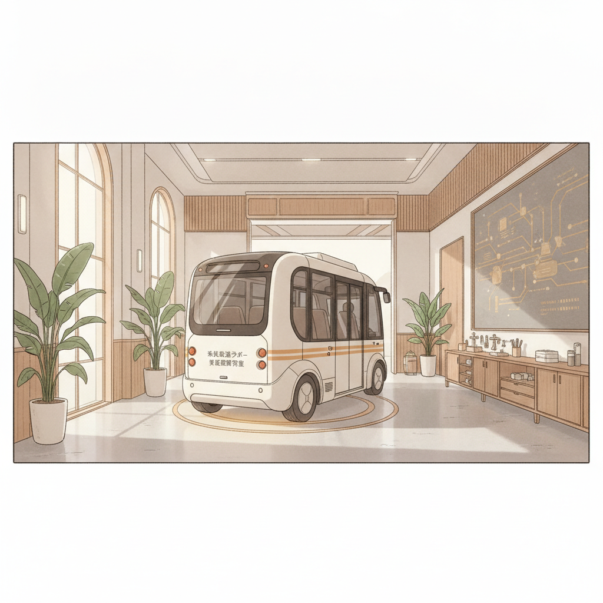
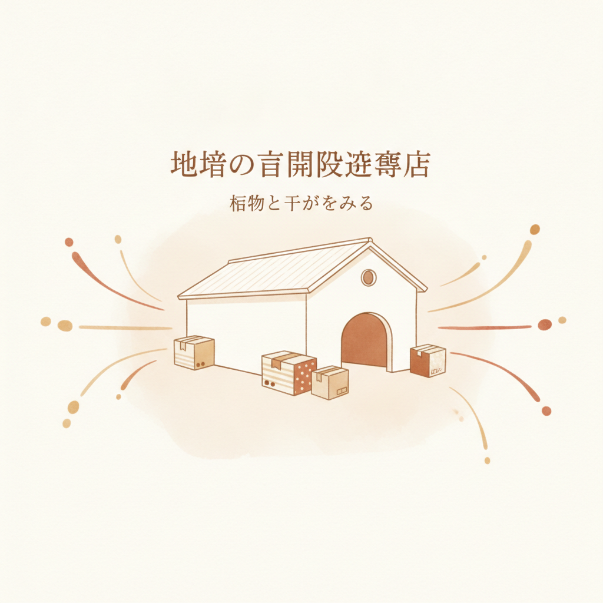

地方都市の駅前や郊外の団地を歩いていると、運行本数が極端に減ったバス停の時刻表に目が止まります。1日にわずか3本。ドライバー不足と採算悪化により、路線の廃止を告げる貼り紙が無造作に残されている光景も珍しくありません。

そんな折、ニュースでは「過疎地を救う自動運転バスの実証実験」が華々しく報じられます。セレモニーでテープカットが行われ、丸みを帯びた最新鋭の電気バスが、お年寄りや子どもたちを乗せてゆっくりと走り出す映像を見かけたことがあるかもしれません。

「これで移動の足が確保される」
「人手不足の時代にふさわしい解決策だ」

誰もがそう期待します。けれど、数か月後にその地域を再訪してみると、あの先進的なバスはどこにも走っていません。時刻表は以前のまま、あるいはさらに便数が削られていることすらあります。

なぜ、何十回、何百回と繰り返される実証実験は、地域の日常に定着しないのでしょうか。

私は地方の製造業で25年間、生産管理や業務改善の現場に身を置いてきました。設備の自動化や省人化プロジェクトを数多く担当してきた経験から見ると、この問題の根底にあるのは技術の未熟さではありません。「費用の構造」と「投資回収の設計」に、最初から決定的なズレがあるからです。

感情論や技術への期待をいったん脇に置き、数字と仕組みの視点から、この壁の正体を静かに分解してみましょう。

---

## 補助金という名の延命措置。実証実験が「実験」で終わる理由

日本各地で毎年のように行われている自動運転の実証実験（PoC：Proof of Concept）。その多くは、国土交通省や経済産業省などの手厚い補助金によって賄われています。

1回あたりの実験予算は、数千万円から、規模によっては数億円に上ることもあります。自治体にとっても、運行事業者にとっても、自己負担を最小限に抑えながら「先進的な取り組みをしている」という実績を作ることができる。この構造そのものが、最初の落とし穴です。

補助金が出ている間は、どれだけ収益がマイナスであっても問題になりません。運行に必要な人件費も、車両のリース代も、外部コンサルタントへの委託費も、すべて国や県の予算枠から支払われるからです。

しかし、実験期間が終了した瞬間に、厳しい現実が突きつけられます。

- 車両1台の調達・維持費（高精度LiDARや各種センサーの保守を含む）
- 走行ルートを centimeter 単位で把握するための高精度3Dマップの定期更新費
- 通信インフラやクラウドサーバーの常時利用料
- 万が一の事故に備える特殊な損害保険料

これらはすべて、固定費として重くのしかかります。小型の自動運転バスであっても、システム維持やセンサー類の定期校正を含めれば、年間で数百万円から1,000万円単位の維持管理コストが継続して発生します。

一方で、利用する住民から得られる運賃収入はどうでしょうか。過疎地域のコミュニティバスの運賃は、片道100円から200円程度が相場です。1便あたりの乗客が平均3人だとすれば、1回の運行で得られる売上は300円から600円。1日に10往復したところで、日商はわずか数千円です。

どれだけ住民に喜ばれようと、毎月数十万円から百万円規模の赤字を垂れ流し続けるシステムを、財政の逼迫した自治体が自腹で維持できるはずがありません。補助金という人工呼吸器が外された瞬間、プロジェクトが停止するのは、冷徹な算術の結果にすぎないのです。

---

## 「無人」の看板と、遠隔監視室の静かな人件費

自動運転に対して多くの人が抱く最大の誤解は、「運転手が不要になれば、人件費がゼロになって大幅にコストが下がる」という期待です。

現在、日本国内で実用化が進められている「レベル4（特定条件下における完全自動運転）」の運用実態を見ると、現場の景色は想像と大きく異なります。

車内に運転手はいません。けれど、その代わりに何が存在しているかといえば、「遠隔監視員」です。

現行の安全基準や法令では、車両が予期せぬ障害物や天候悪化に直面した際、遠隔地から即座に状況を把握し、必要に応じて停止や誘導の指示を出す監視体制が求められます。つまり、運転席から人が消えただけで、オフィスのモニター前には資格を持った人間が常時張り付いているのです。

ここで、製造業のライン設計と同じように、稼働率と人件費の割り戻しを計算してみます。

遠隔監視員1人が、安全を確保しながら同時に監視できる車両は何台でしょうか。理論上は「1人で数台」と言われますが、安全マージンを最優先する現在の運用基準では、1台に対して1人、あるいは2台に対して1人が限界です。

監視員を8時間交代のシフトで常駐させ、バックアップ要員も含めれば、車両1台を朝から夕方まで走らせるために、実質2名から3名分の人件費（人件費単価、法定福利費、シフト管理コスト）が発生します。

さらに、乗降時の車いす介助や、急な体調不良への対応を考慮し、車内に「保安要員」や「アテンダント」を同乗させているケースも少なくありません。

運転手を1人減らすために、システム導入費を数千万円投じ、遠隔監視員と保安要員を配置する。これでは、従来のように地元のシルバー人材やタクシー会社に運行を委託していた頃よりも、総人件費が跳ね上がってしまいます。

技術の進化によって1人が10台を同時監視できるようになれば潮目は変わりますが、路面の段差、豪雪、豪雨、路上駐車といった日本の地方特有の環境要因（運行設計領域：ODDの壁）をクリアするには、まだ相当な設計の積み上げが必要です。

---

## 移動を単体で黒字化しようとする過ち。製造業に学ぶ「全体最適」

では、地方の自動運転は永久に実現しない絵空事なのでしょうか。決してそうではありません。問題は技術にあるのではなく、「移動単体で採算を取ろうとしている」というビジネスモデルの前提にあります。

工場で生産設備を自動化するとき、私たちは「その機械単体でいくら儲かるか」とは考えません。前後の工程を含めた工場全体の仕掛品がどれだけ減り、納期遅延ペナルティがいくら浮き、トータルの原価がどう下がったかで投資対効果（ROI）を判定します。

地域の交通もまったく同じです。「100円の運賃を集めて黒字にする」という発想を捨てない限り、過疎地の交通は絶対に成立しません。

解決の鍵は、固定費を別の価値で相殺する「複合型の設計」にあります。

- 貨客混載の徹底：朝夕は住民を運び、日中の閑散時間帯は農産物や宅配便、処方薬を配送して物流事業者から安定した運託費を得る。
- 自治体の別予算との統合：高齢者が外出しやすくなることで抑制される「介護予防費」や「医療費」、スクールバス運行費を交通予算と合算して捉える。
- 移動販売・移動診療とのセット運用：単なる移動手段ではなく、巡回型の行政窓口や売店としての機能を車両に持たせ、テナント料や委託料を回収する。

運賃箱にお金を落としてもらうのではなく、その車両が走ることで地域全体の別のコストが年間どれだけ削減されたか。そこから浮いた原価を、運行維持費に再配分する。

このように「地域全体のキャッシュフロー」を一つの大きなサプライチェーンとして捉え直す設計ができて初めて、自動運転は補助金なしで自律稼働できるシステムになります。

最新のセンサーを積んだバスを走らせること自体は、手段にすぎません。肝心なのは、誰がどのコストを肩代わりし、誰がその余白を享受するのかという、お金と役割の配管図をあらかじめ引いておくことなのです。

---

## あなたの日常にも潜む「終わらないPoC」の罠

ここまで読んできて、どこか既視感を覚えた方もいるのではないでしょうか。

「先進的なツールを導入したものの、現場の手間が増えて誰も使わなくなったDX」
「予算消化のために立ち上げられ、成果が出ないままフェードアウトした新規事業」
「毎月サブスクリプション代を払い続けているのに、使いこなせていない高機能な業務ソフト」

形は違えど、私たちが働く現場でも、まったく同じ「終わらない実証実験」が繰り返されています。

目的は業務を楽にすること、あるいは成果を出すことだったはずなのに、いつの間にか「新しい技術を試すこと」「上司や世間にアピールすること」自体が目的化してしまう。その結果、維持費という名の見えない固定費だけが毎月静かに削り取られていく。

かつての私も、工場の現場で何度もこの罠にはまりました。立派な自動化構想をぶち上げては、メンテナンスの手間と想定外のエラー処理に追われ、かえって残業を増やすという苦い失敗を重ねてきました。

そこから抜け出すために身につけたのは、ごくシンプルな習慣です。

新しい仕組みを取り入れるときは、華やかなカタログスペックを見る前に、まず「維持にかかる毎日の固定費（時間、お金、集中力）」を計算すること。そして、「その仕組みが止まったとき、誰がどのようにリカバーするのか」という泥臭い運用フローを、紙と鉛筆で書き出してみることです。

自由な時間や持続可能な仕組みは、革新的な道具そのものが連れてきてくれるわけではありません。道具を支える土台の数字を、どれだけ冷徹に見積もれるか。その設計の精度によって決まります。

---

地方の駅前で消えていくバスの話は、決して遠い世界の出来事ではありません。

耳触りの良い言葉や、先端技術という名の熱狂に流されず、その裏側にある構造とコストを静かに見つめること。

明日の朝、手元の業務を見渡すとき、その視点があるだけで、選ぶべき選択肢の輪郭は少しずつ、けれど確実に変わっていくはずです。