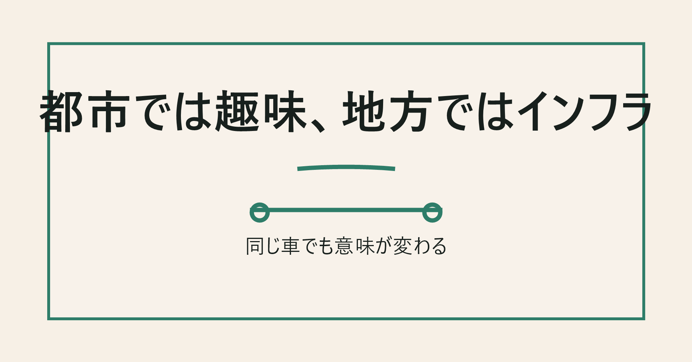
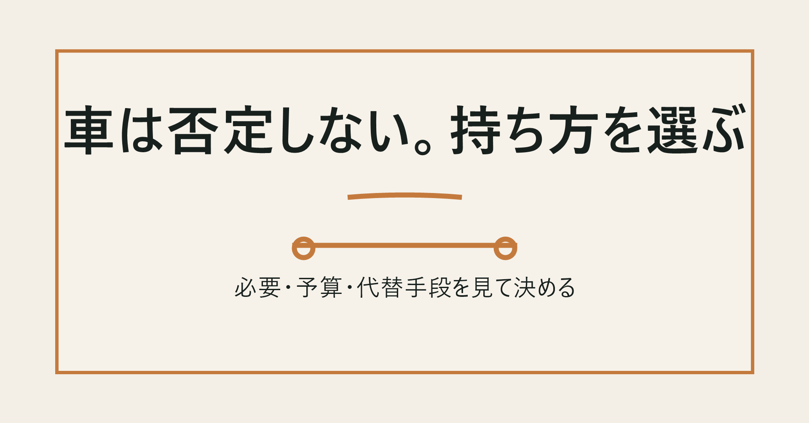

# 車は嗜好品。それでも所有していい条件

給料日から数日。口座の数字が静かに減る。

家賃。通信費。保険。そこまではまだわかる。問題は車。

駐車場代が落ちる。ガソリンを入れる。保険料を払う。税金の通知が来る。車検の見積もりを見て、少し黙る。ローンがあれば毎月の返済も乗る。

しかも、そんなに乗っていない。

平日は駅まで歩く。買い物はネットスーパー。遠出は月に一回あるかないか。それでも車は、家の前や駐車場で静かにお金を食べている。

ここで反論はある。

「地方では車がないと生活できない」

「子どもがいたら無理」

「親の通院はどうするんだ」

その通り。そこを無視して「車は全部ムダ」と言うなら、ただの都会目線だ。

でも、それでも思う。

車は、多くの人にとって嗜好品だ。

必需品の顔をして家計に居座っている、かなり高額な嗜好品。ここを認めないと、家計改善は浅いところで止まる。

## 車は便利。でも便利と必需品は違う

車は便利だ。

雨の日に濡れない。重い荷物を運べる。子どもを乗せられる。夜でも移動できる。自分のタイミングで出発できる。

ただ、便利なものが全部必需品になるわけではない。

食洗機も便利。乾燥機も便利。デリバリーも便利。高性能なスマホも、広い家も、いい椅子も便利。けれど、それらを全部「必要」と呼び始めたら、家計はすぐ苦しくなる。

固定費とは、使わなくても毎月発生する支出のことだ。

車はこの固定費のかたまり。乗らない日も駐車場代はかかる。保険も続く。税金も来る。車検も避けられない。

使っていないジム会費なら月数千円で済む。車は桁が違う。財布に小さな穴が空いているようなものだ。毎日は少しずつでも、十年、二十年で見るとかなり大きな差になる。

## 生涯4,000万円級の支出を、なんとなく許していないか

ユーザー指定の参考要点では、車にかかる生涯費用は約4,000万円にも上る。

NotebookLM調査でも、普通車を長期で乗り継ぐ前提では、購入代金と維持費を合わせて約4,000万円規模になる試算が確認できた。もちろん前提で変わる。軽自動車中心なら下がるし、地方で駐車場代が安い人もいる。

それでも、4,000万円という数字には意味がある。

車は買った時の価格だけで終わらないからだ。

車両代。ガソリン代。任意保険。自動車税。重量税。車検。点検。タイヤ。オイル。駐車場。洗車。故障。買い替え。高速代。

一つひとつは説明できる支出。でも全部足すと重い。

NotebookLM調査では、ソニー損保の2025年全国カーライフ実態調査由来の要点として、毎月の維持費平均は1万4,100円。日本自動車工業会の2025年度乗用車市場動向調査由来の要点では、新車の平均購入価格は331万円、平均保有期間は7.2年と整理されていた。

ここで見るべきなのは、車は「たまに大きく払うもの」ではなく、「常に少しずつ未来のお金を削るもの」だという点。

機会費用とは、そのお金を別のことに使えた可能性のこと。

車に毎年50万円使うなら、その50万円は投資にも、旅行にも、教育費にも、住宅ローンの繰上返済にも、労働時間を減らす原資にも使えない。

車は移動手段である前に、未来の選択肢を食べる支出でもある。

## 地方、子育て、介護では車はインフラになる

一度、車不要論に反論する。

地方では車がないと生活が成り立たない地域がある。これは本当だ。

買い物。病院。子どもの送迎。駅やバス停までの距離。雪。雨。高齢の親の通院。仕事。

こういう生活で「車は嗜好品です」とだけ言われたら、腹が立つのは当然だ。

NotebookLM調査では、地方の車依存率は買い物90%、通院88%、子どもの送迎70%という調査紹介があった。高松市の調査紹介では、車が使えなくなると全体で約73%、子育て世帯では80%以上が外出活動に支障を来すという整理もあった。

この場合、車はインフラだ。

インフラとは、生活を成立させる基盤のこと。水道や冷蔵庫やスマホに近い。都市部の週末用マイカーと、地方の生活用マイカーを同じ言葉で切るのは雑すぎる。

だから、この記事の主張は「全員、車を捨てろ」ではない。

生活を成立させるために必要なのか。

不便を減らすために持っているのか。

好きだから持っているのか。

見栄や習慣で持っているのか。

この四つは同じではない。

## それでも、都市部のマイカーはかなり嗜好品に近い

都市部では話が変わる。

電車がある。バスがある。タクシーがある。カーシェアがある。レンタカーがある。ネットスーパーがある。自転車も選べる。

駅近に住んでいて、週末しか車に乗らない人なら、車はかなり嗜好品に近い。

NotebookLM調査では、東京23区の駐車場代中央値が月3万5千円規模となり、年間所有コストが70万から90万円台へ膨らむケースがあると整理されていた。一方、東京で車を持たず、公共交通、タクシー、カーシェアを併用すると、年間移動コストは約13万から26万円、平均約18万円という試算もあった。

前提次第ではある。毎週遠出する人、仕事で使う人、家族構成によっては違う。

ただ、数字を見ると、なんとなく持っている車には強い疑いをかけた方がいい。

所有と利用を分ける。

車そのものが欲しいのか。移動したいだけなのか。

もし目的が「たまに移動すること」なら、所有しなくてもいい。カーシェア、レンタカー、タクシーを組み合わせれば足りるかもしれない。

ドリルを買いたいのではなく、壁に穴を開けたいだけ、という話に近い。

## 持つなら、好きだから持つと認めた方がいい

車が好きなこと自体は悪くない。

運転が楽しい。好きな車に乗ると気分が上がる。家族で遠出する時間が好き。自分の空間として落ち着く。

そういう感情は、数字だけでは切れない。

問題は、趣味を必需品のふりで家計に入れることだ。

車が好きなら、好きでいい。嗜好品として持てばいい。コーヒー豆にこだわる人もいる。カメラにお金をかける人もいる。旅行に使う人もいる。車もその一つだ。

ただし、趣味なら予算が要る。

生活防衛資金を削ってまで買うのか。投資を止めてまで乗るのか。教育費を圧迫してまで維持するのか。老後資金を遅らせてまで新車に乗り換えるのか。

ここに答えられないなら、嗜好品としての車に家計が負けている。

浪費は悪ではない。浪費は人生を豊かにする。でも順番がある。

貯める。増やす。使う。

この順番を逆にすると、ずっと苦しい。

## どうしても必要なら、車の持ち方を変える

車が必要な人は、持ち方を変えればいい。

まず、新車ローンを当たり前にしない。

新車は買った瞬間から価値が落ちやすい。もちろん車種による。人気車や希少車は強い。ただ、多くの車は時間と走行距離で価値が下がる。

そこで見るべきなのがリセールバリューだ。

リセールバリューとは、売る時に戻る価値のこと。買値だけでなく、手放す時の金額まで含めて実質コストを見る。

300万円で買って3年後に100万円で売れる車と、300万円で買って3年後に250万円で売れる車では、同じ300万円の買い物ではない。前者の実質コストは200万円。後者は50万円だ。

NotebookLM調査では、ランドクルーザー、アルファード、ジムニーなどがリセールバリューの強い例として挙がっていた。海外需要、モデルチェンジ周期、唯一性が価値を支える要因になる。

次に、生活防衛資金を削らない。

原則は一括で買える範囲に抑えるのが堅い。金利は確実なコストだからだ。ただし、一括で買った結果、手元資金が空になるなら危ない。

病気。失業。家の修繕。親の介護。

人生は急にお金を要求してくる。

だから実務的には、こう考える。

- 生活防衛資金を残す。
- 車は総額ではなく年間コストで見る。
- リセールが残る車を選ぶ。
- 高金利ローンは避ける。
- 見栄のオプションを削る。
- 軽自動車や中古車も正面から検討する。
- 使う頻度が低いならカーシェア、レンタカー、タクシーを試算する。

「車が必要」と「新車で好きなグレードをローンで買う」は別の話だ。

必要なのは移動かもしれない。欲しいのは気分かもしれない。その差額が嗜好品の値段だ。

## 結論。車はやっぱり嗜好品。でも、所有していい条件はある

結論は変わらない。

車は、やっぱり嗜好品だ。

少なくとも、都市部で代替手段があり、週末しか乗らず、なくても生活が成立する人にとっては、かなり高額な嗜好品だ。

でも、車の所有がありな場合もある。

地方で公共交通が弱い。子どもの送迎がある。介護や通院がある。仕事で使う。身体事情がある。代替手段を試算しても所有の方が安い。車が本当に好きで、趣味費として予算内に収まっている。

こういう場合は、持っていい。

ただし、持ち方は選ぶ。

新車ローンを当然にしない。リセールを見る。中古も見る。軽も見る。生活防衛資金を守る。年間コストで判断する。配当や副収入の範囲で趣味として楽しむ。

車を否定する必要はない。

でも、車に人生の選択肢を削らせる必要もない。

あなたの車は、生活の道具か。それとも、高額な趣味か。

どちらでもいい。ただ、答えを知った上で持つべきだ。

<!-- 参照ファイル一覧
- 03_detailed_agenda.md
- 04_blog_post.md
- 05_thumbnail_prompts.md
- 06_section_prompts.md
- ./thumbnail.png
- ./img1.png
- ./img2.png
- ./img3.png
- ./img4.png
-->
