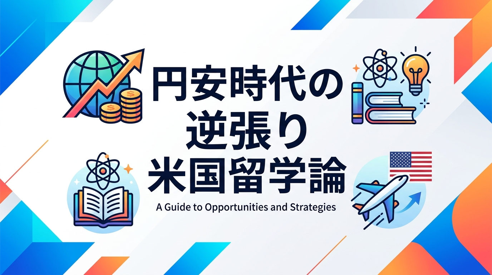
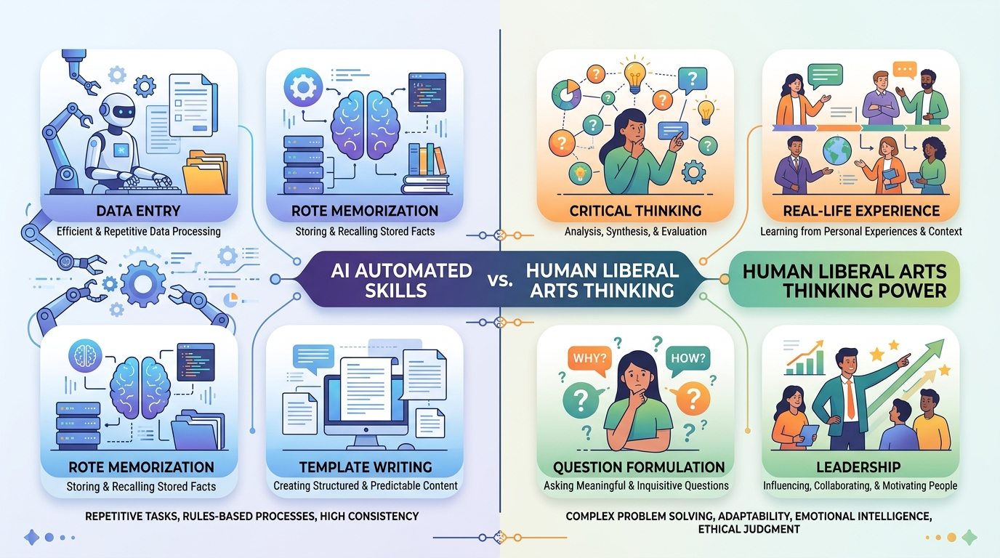
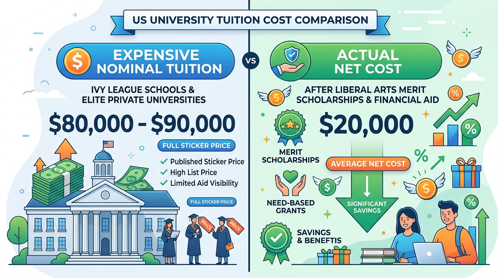
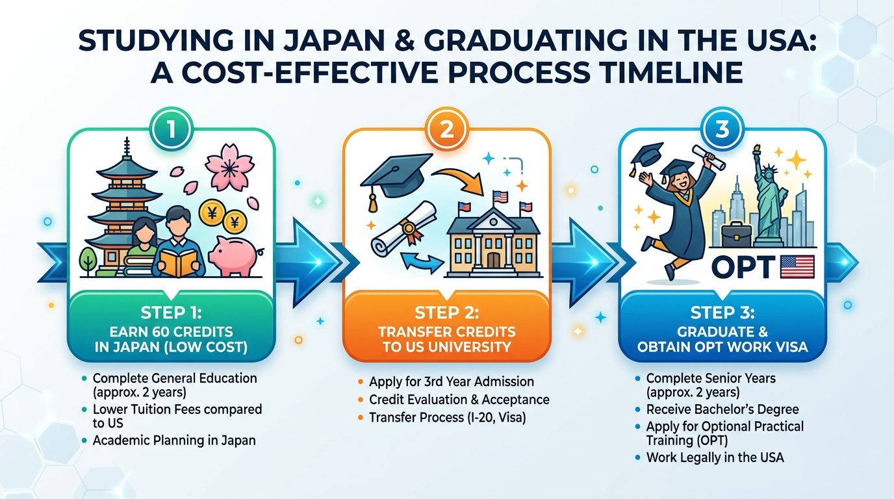

---

## 導入：講義室の静寂と、忍び寄る「無力感」

大学2年生の秋、冷え込み始めた講義室の最前列で、僕はノートパソコンの画面をぼんやりと見つめていた。

スクリーン上で明滅するカーソルの先では、生成AIがものの数秒で完璧な法学的考察とデータ分析のレポートを書き上げていく。教授が教壇で熱弁を振るう「専門用語の定義」も「過去の判例の暗記」も、この小さな画面の中のアルゴリズムがあっけなく処理してしまう。

「僕たちが今、毎日必死に覚えているこの知識って、社会に出る頃には一体何の価値が残っているんだろう？」

喉の奥がキュッと絞られるような、生々しい焦りと恐怖が全身を駆け巡った。周囲を見渡せば、隣の席の友人は退屈そうにスマホをスクロールしている。画面に映し出されているのは、「1ドル＝156円突破」「歴史的円安で若者の海外留学断念が相次ぐ」というニュースの見出しだった。

「英語を話せるようになりたい」「広い世界に出て、誰も思いつかないような挑戦をしてみたい」——かつて胸の奥に秘めていたささやかな夢。しかし、現実の数字が冷酷に立ちはだかる。ネットで検索すれば、「米国の大学留学は年間1,000万円超え」「富裕層にしか許されない贅沢」という言葉が溢れていた。

「円安だし、うちの家庭じゃ絶対無理だな。おとなしく日本の大学に出て、大企業の歯車として生きるのが唯一の正解なんだ」

そう自分に言い聞かせ、諦めるための理由を探していた。だが、その時の僕はまだ知らなかったのだ。「円安だから留学は無理」という言葉が、実態を何一つ調べていない単なる「思い込み（固定観念）」に過ぎなかったことを。そして、AIが急速に人間の仕事を侵食するこの激動の時代において、まさにそのアメリカの「リベラルアーツ（教養教育）」こそが、僕たちの人生を守る最強の武器になるという事実を。

---

## 第1章：AI時代の落とし穴——なぜ今「日本の有名大学」を出るだけでは危険なのか？

### 1.1 専門知識はAIに代替される：AIが絶対に奪えない「2つの価値」

「AI時代に、日本で有名大学の法学部を出たからってどうするの？」

50年以上にわたり日本の米国留学を牽引してきた栄陽子氏（栄陽子留学研究所）は、そう鋭く問いかける。

長年、日本の教育システムは「あらかじめ用意された正解をいかに正確に、大量に暗記し、ペーパーテストで吐き出すか」という一律の偏差値教育に依存してきた。しかし、この「正解の暗記と分析」こそ、生成AIが最も得意とする領域である。

電卓が普及した時代にそろばんの段位を競い合うのが滑稽であるのと同様に、AIが瞬時に答えを導き出す時代に、知識の暗記量だけで勝負しようとする教育は極めて危険だ。では、AIがどれほど進化しても絶対に奪えない価値とは一体何だろうか？

それは、以下の2つに集約される。

- **1. 実体験と失敗のデータベース**: 身をもって傷つき、汗をかき、現場で体感した生の体験。
- **2. 自分で問いを立てる思考力（リベラルアーツ）**: 複雑な事象から本質を見抜き、独自の価値観で意思決定を下す「判断力と決断力」。

リベラルアーツ（教養教育）とは、単なる「雑学」のことではない。特定の専門分野に閉じこもるのではなく、文系・理系の枠を超えて人間・社会・自然の仕組みを横断的に学び、自らの頭で考え抜く基礎体力を養う教育である。特定の料理だけを作る専門学校ではなく、どんな食材でも美味しい料理を創り出せる「基礎調理の万能レッスン」のようなものだ。

AIがどれほど賢くなろうとも、現場でトラブルに直面した時の生々しい感情や、多様な価値観を持つ人々と膝を突き合わせて議論した「体験」を代替することはできない。

### 1.2 「東京でしか生きられない能力」という最大のリスク

日本の暮らしは快適だ。街は安全で、24時間営業のコンビニがあり、ワンコインで安くて美味しいご飯が食べられる。

しかし、栄氏はその「居心地の良さ」こそが罠であると警鐘を鳴らす。日本全体の購買力が下がり、少子高齢化が進む中で、「日本国内（東京）でしか生きられない能力しか持っていないこと」は、今後100年生きる若者にとって最大のリスクとなり得るからだ。

アメリカの大学教育が学生に徹底的に叩き込むのは、親元を離れた寮生活と激しいディスカッションを通じた「分析力・判断力・決断力」である。そして、全留学生が「必ず自分の人生のリーダーになること」を期待される。

「これからは2拠点以上で生活できるタフさを持っていなければ生き残れない」——世界のどこへ放り出されても自分の足で立ち、生きていけるサバイバル能力こそ、今まさに私たちが身につけるべき真の学力なのだ。

---

## 第2章：「円安で留学費用1,000万円」のウソ——学費を劇的に下げる2つの「裏ワザ」

### 2.1 知られざる「リベラルアーツ・カレッジ」の給付型奨学金制度

「アメリカの大学留学は、年間7.8万ドル（UCLA）や9万ドル（ハーバード大学：約1,300万円超）かかるから、円安の今は絶対に通えない」

テレビやネットのニュースで報道されるこうした数字を見て、諦めてしまう人が大半だ。しかし、これは「定価表示の高級料亭」だけを見て、業界の仕組みを知らずに逃げ出しているようなものである。実は裏側で、誰でも使える「特大の返済不要クーポン」が配られているとしたらどうだろうか？

アメリカには約600校の「リベラルアーツ・カレッジ（少人数制の教養大学）」が存在する。これらの大学の最大の特徴は、外国人留学生に対しても非常に寛容であり、**「給付型奨学金（返済不要の奨学金）」**を極めて手厚く支給してくれる点にある。

多くのリベラルアーツ校では、年間3万ドル〜4万ドル規模の奨学金が日常的に支給される。その結果、学費・寮費・食費をすべて含めた実質的な自己負担額は、**「年間約2万ドル（約300万円）」**まで抑えられるケースが多発している。

年間300万円という金額は、日本の私立大学に自宅外（地方）から通わせ、家賃や生活費を仕送りする総額と大差がない。つまり、「富裕層しか行けない」というのは完全なデマであり、適切な大学選びさえ行えば、一般的な家庭でも十分に手が届く選択肢なのだ。

### 2.2 放送大学×単位移行：総額コストを半減させる「3年次編入」ルート

さらに費用を劇的に削減する、知る人ぞ知る最強の裏ワザが存在する。それが、**「国内での単位取得×米国大学への3年次編入ルート」**だ。

アメリカの大学は完全な「単位制」を採用している。卒業に必要な約120単位のうち、前半の教養課程（約60単位）は、必ずしもアメリカの現地大学で取得する必要はない。

例えば、日本の「放送大学」や地元の国公立大学で、1年半ほどかけて60単位（受講料わずか約40万円）を取得する。そして、その単位をそのままアメリカの大学へ移行（Credit Transfer）し、**3年次から編入（Transfer Admission）**するのだ。

これは例えるなら、**「新幹線の乗車チケットを、前半区間だけ各駅停車（放送大学）で安く移動し、後半のクライマックス（3・4年目）だけ本場アメリカの特急列車に乗り換える」**ようなショートカット戦略である。

このルートを使えば、以下のような圧倒的なメリットが生まれる。

- **米国滞在期間を「2年間」に圧縮**: 4年分の学費と滞在費（寮費・食費）をまるまる半額に削減できる。
- **OPT（現地就労許可）の権利を獲得**: 卒業後、文系なら1年間、理系（STEM分野）なら最大3年間の現地企業インターンシップ（OPT）で働く権利が得られ、ドル建てで高収入を得ながら現地キャリアを築ける。

---

## 第3章：ペーパーテスト一発勝負は不要！日本人留学生が今「売り手市場」である理由

### 3.1 アメリカ入試の本質は「自分という商品の売り込み」

「でも、自分はTOEFLの点数も低いし、ペーパーテストが苦手だから受かるはずがない」

そう思って二の足を踏む必要も一切ない。日本の大学入試が「ペーパーテストの点数による一発切り捨て」であるのに対し、アメリカの大学入試は**「自分という人間の多様性（ダイバーシティ）を売り込むプレゼンテーション」**だからだ。

アメリカの大学は、似たような成績・背景の学生ばかりが集まることを極めて嫌う。教室のディスカッションを活性化させるため、多様なバックグラウンドを持つ「変わったやつ（個性的な学生）」を喉から手が出るほど欲しがっている。

シェフが料理にアクセントを加える「激レアな限定スパイス」を求めるように、現在、日本人留学生の数が減少しているアメリカの大学において、日本人はそれだけで強烈な「希少価値」を持っているのだ。

英語が多少拙くても、「日本の伝統文化（日本舞踊など）ができる」「地域活動でこんな挑戦をした」といった自分の強みを堂々と自己アピール（売り込み）すれば、それだけで合格や奨学金オファーをもぎ取ることができる。

### 3.2 「出張入試（1on1面接）」で1週間で合格と奨学金を勝ち取る方法

栄陽子留学研究所などが実施している「出張入試」制度では、アメリカの大学の審査官10校ほどが直接日本へ来日し、1対1の面接を行う。

形式ばったお堅い面接ではなく、温かい雰囲気の中で対話が行われ、早ければわずか1週間ほどで合格内定と給付型奨学金の金額が提示される。

最初からニューヨークやロサンゼルスのような大都市のマンモス校を目指す必要はない。周囲が親切で、学生一人ひとりをファミリーとして温かく面倒を見てくれる「地方の田舎のリベラルアーツ・カレッジ」で基礎体力をつけることこそが、日本人の確実な成功ルートなのだ。

実際、バラク・オバマ元大統領も、最初はカリフォルニアの田舎にある小規模な「オクシデンタル・カレッジ（学生数約2,000人）」に入学してじっくり実力を蓄え、その後ニューヨークのコロンビア大学へ編入するというステップを踏んでいる。

---

## 第4章：英語も人生も「体」で覚える——今日から始めるサバイバル・アクションプラン

### 4.1 偏差値の罠から抜け出し、高い志（心意気）を持つ

「語学ができるようになってから留学する」と考えている人は、一生留学できない。

語学の本質は、机に向かって英単語帳を暗記することではない。現地で学生たちがダイエットのために食事を抜いている生の姿を見て、「I'm on a diet」というフレーズを身体感覚とセットで覚えるような体験こそが本物だ。

語学はスポーツと同じである。教科書でプールでの泳ぎ方を100時間読んでも泳げるようにはならない。水の中に飛び込んで、手を動かし、息を継ぎながら「体で習得するもの」なのだ。

「どこの大学に入るか」「どの会社に就職するか」という小さな偏差値の目的で生きていたら、AI時代に人生は立ち行かなくなる。地球や国家をどう支えるか、自分はどんな価値を世界に提供できるかという「高い志（心意気）」を持って、広い世界へ踏み出してほしい。

### 4.2 明日からできる「3つの逆張りアクション」

円安やAIの波に怯える側から、それらを波乗りするように活用する側へ回るために、今日からできる具体的なToDoリストは以下の3つだ。

- **1. 放送大学のシラバスをチェックする**: 
  国内で安価に取得できる教養単位（最大60単位）のシミュレーションを行い、3年次編入ルートの計画を立てる。
- **2. 全米の「リベラルアーツ・カレッジ」を3校調べてみる**: 
  知名度だけに惑わされず、外国人留学生への給付型奨学金が充実している地方の小規模大学（例: オクシデンタル・カレッジなど）の実態を調べる。
- **3. 「出張入試（面接イベント）」の情報を調べる**: 
  ペーパーテストの点数ではなく、一芸や自己アピールで合否が決まる米国独自の面接ルートのスケジュールを確認する。

---

## 結論：嵐の日に、逆方向の船へ乗り込め

かつて講義室の最前列で「自分には無理だ」と諦めかけていたあの日の自分に、今なら胸を張って言える。

「円安だから無理」という世間の常識は、仕組みを知らない人たちが作った幻想に過ぎない。多くの人が「嵐の日は家の中でじっと耐えるべきだ」と固まっている時こそ、真のチャレンジャーは風向きを計算し、誰も乗っていない逆方向の船（逆張り留学）に格安で乗り込むのだ。

AIがすべてを効率化する時代だからこそ、人間らしい愚直な「経験・体験」と「自ら問いを立てる思考力」が、あなたの人生を誰も真似できない唯一無二の物語にしてくれる。

さあ、小さなスマホの画面を閉じて、まだ見ぬ広い世界へと一歩を踏み出そう。

<!-- 参照ファイル一覧
- 03_detailed_agenda.md
- 04_blog_post.md
- 05_thumbnail_prompts.md
- 06_section_prompts.md
- ./thumbnail.png
- ./img1.png
- ./img2.png
- ./img3.png
-->
