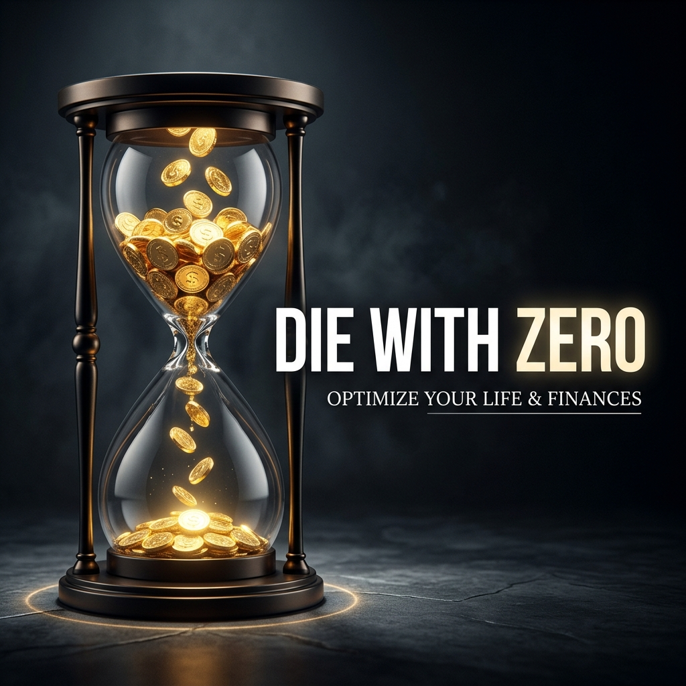
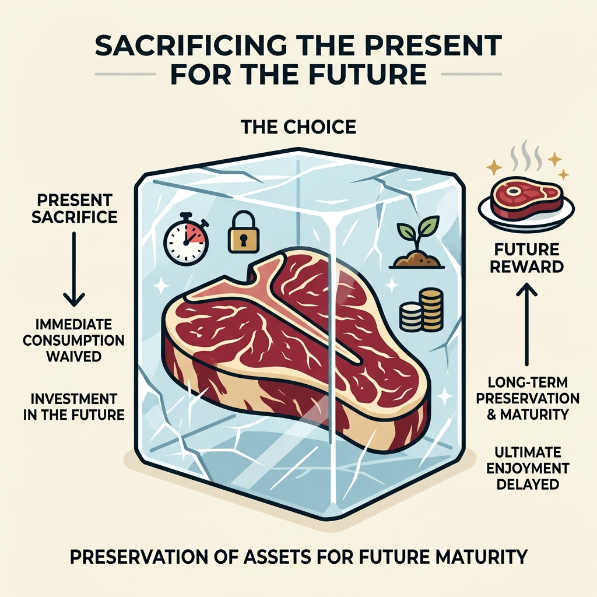
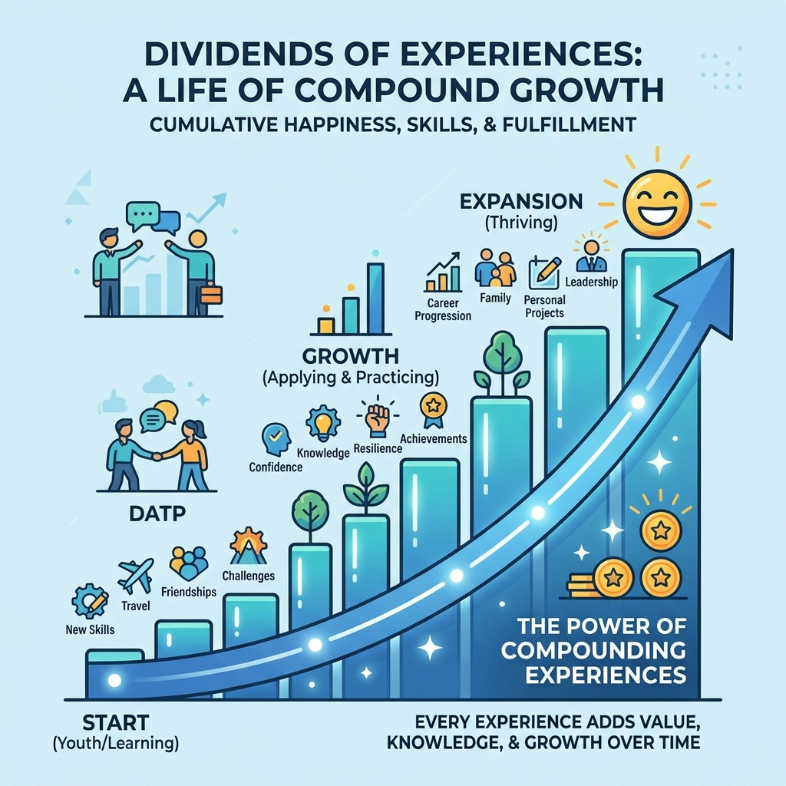
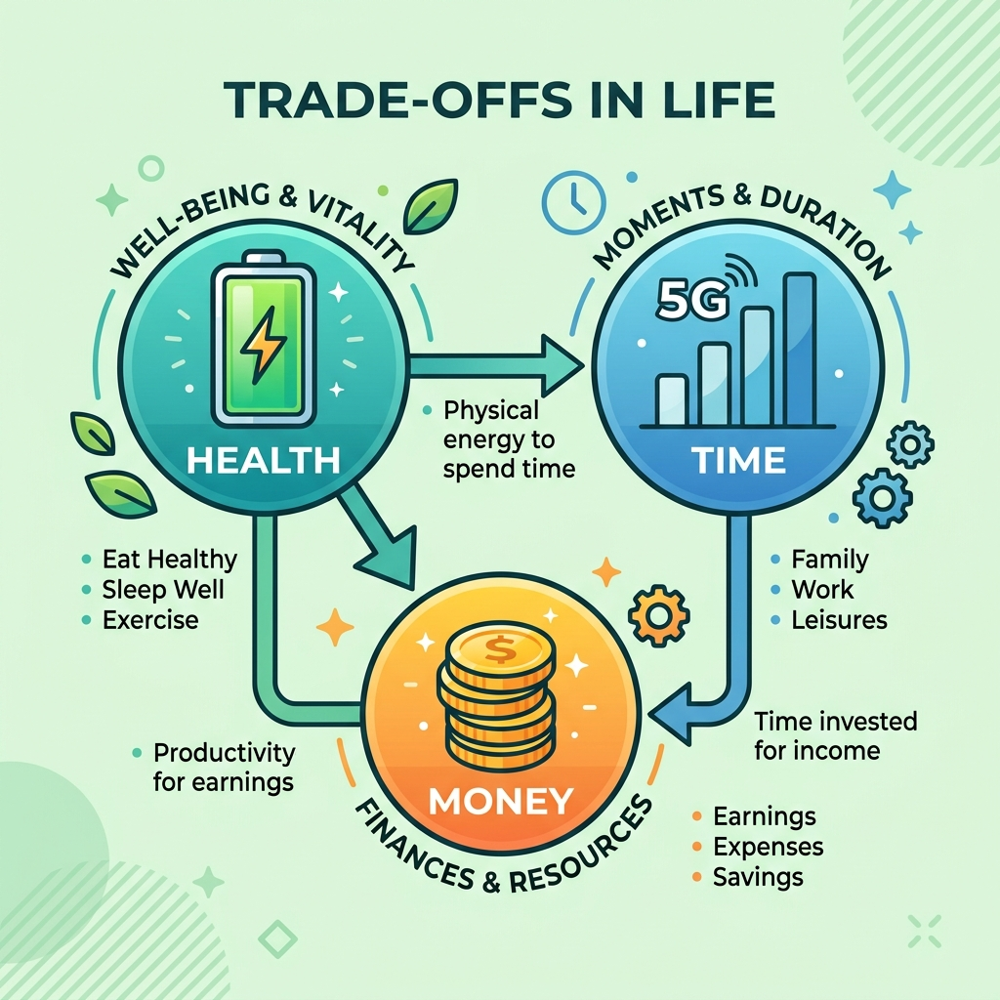
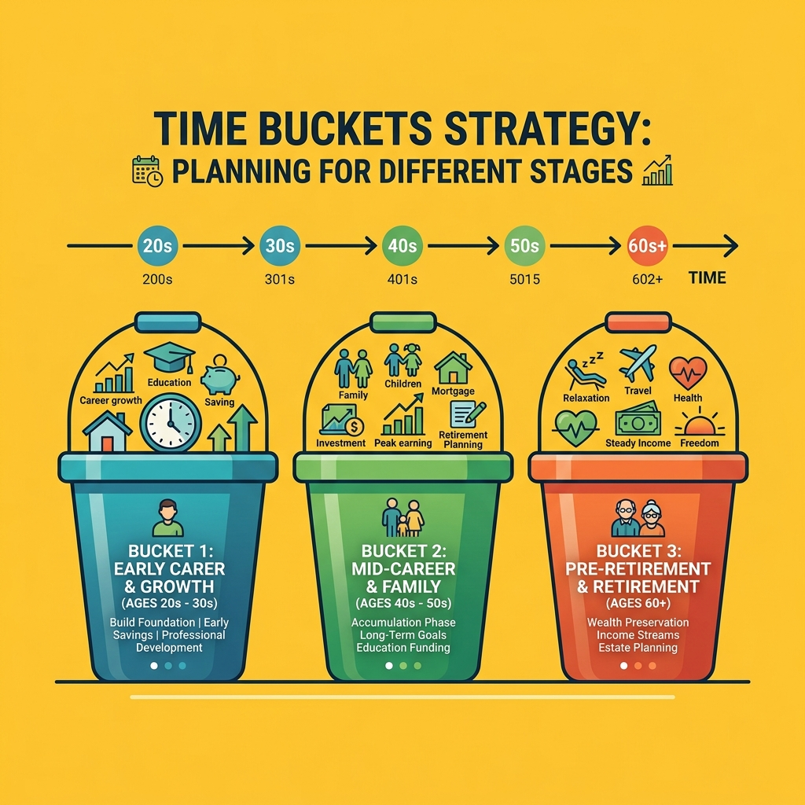

毎月25日、給料が振り込まれると、私は決まってスマホを開く。証券会社のアプリにログインして、インデックスファンドへの自動積み立てがちゃんと実行されたか確認する。数字が少し増えているのを見て、胸の奥で小さくホッとする。よし、これで老後の備えはまた一歩前進した。

その日の夕食はスーパーの特売カップラーメン。本当は今度の連休に思い切って海外旅行に行こうと、パンフレットも集めていたのだ。でも、「いや、旅行なんて老後にゆっくり行けばいいじゃん。今はこのお金を投資に回して複利で増やそう」と自分を言い聞かせて、計画を白紙に戻した。

## 老後のために「今」を犠牲にする私たち

いつか食べるために、最高級のステーキをずっと冷凍庫にしまい込んでいる。そんなふうに感じたことはないだろうか。いざ老後になって解凍したときには、すっかり霜焼けで味が落ちているかもしれない。ひょっとすると胃腸が弱って、脂っこい肉なんてとても食べられなくなっている可能性だってある。

高校時代の同窓会での出来事が、私のこの「冷凍保存の人生」を根底から揺さぶった。久しぶりに会った友人が、ここ数年で世界一周旅行をした話、現地でのとんでもないハプニング、そこから得た価値観の変化を熱を込めて語っていたのだ。彼の目はキラキラと輝き、周りの友人たちもその話に完全に引き込まれていた。

ふと自分を振り返る。私の口座には、もしかすると彼より多くの「お金」があるかもしれない。でも、私には彼のように「語れる経験」が何一つなかった。増えていく数字の代わりに、私は何を失ってきたのか。

自分は何のために働いて、何のために生きているんだ？ 老後にお金があっても、もう海外旅行に行く足腰が立たないかもしれないじゃないか！

この衝撃的な気づきこそが、ビル・パーキンスの著書『DIE WITH ZERO（ゼロで死ぬ）』が突きつける厳しい現実だ。

## 人生の真の資産は「経験の配当」である

なぜ、私たちはこれほどまでにお金を貯めることに執着してしまうのか。それは「お金そのものが価値だ」と思い込んでいるからだ。でも、真実は違う。お金は単なる引換券だ。価値に変換して初めて意味を持つ。そして人生で最も価値のある資産とは、銀行残高なんかではなく「経験の配当」なのだ。

経験の配当とは、思い出が後から生み出す幸福感のことだ。たとえば20代で友人たちと無茶な貧乏旅行をしたとする。その時の楽しさはもちろんだけど、30代、40代になっても集まるたびに「あの時は酷かったな」と笑い合える。辛い仕事の合間に、ふとその時の景色を思い出して心が救われることもある。

若い頃の旅行の思い出は、まさに一生利息を払い続ける「高利回り債券」のようなものだ。早く経験すればするほど、その後の人生で配当を受け取る期間が長くなる。逆に、70代で同じ旅行をしたとしても、配当を受け取れる期間は残りわずかしかない。

著者のパーキンスはヘッジファンドのマネージャーだ。数字と投資のプロフェッショナルから見れば、「今しかできない経験」に投資せず、ただ銀行に現金を寝かせておくことは、人生という投資ゲームにおける致命的な機会損失に他ならない。お金を貯めることが絶対の善だという思い込みを捨てて、一刻も早くお金を「経験」という配当を生む資産に変換しなければならない。

## 「金・時間・健康」の残酷なトレードオフ

ここで、私たちは一つの残酷な真実に直面する。人生の満足度を上げるためには「金」「時間」「健康」の3つが必要だが、これらは人生のステージによって非情なトレードオフの関係にあるということだ。

スマホゲームに例えてみよう。健康が「バッテリー残量」、時間が「プレイ可能な通信量」、金が「課金アイテム」だ。
20代の若者は、バッテリーは100%、通信量も無制限だけど、課金アイテムを持っていない。
40代の働き盛りは、バッテリーもまだ70%あり、課金アイテムも増えてきたが、仕事に追われて通信量が全くない。
そして70代の老後は、通信量は無制限に戻り、課金アイテムも大量に持っている。しかし、肝心のバッテリーが10%しか残っていない。

どんなに大量の課金アイテムを持っていても、バッテリーが切れてしまえばゲームを楽しむことはできないのだ。

この事実を無視して、私たちは死ぬ直前までお金を増やし続けようとする。パーキンスはこれに対し、ネットワース・ピーク（資産の頂点）を意識せよと警告する。これ以上資産を増やしても、それを使う健康と時間が減っていくため、人生全体の価値が目減りし始めるタイミングのことだ。スマホゲームで言えば、これ以上課金してもアイテムを使い切れない「カンスト」の状態である。

多くの人は、このピークを45歳〜60歳の間に迎える。このピークを過ぎたら、私たちは意識的にお金を「減らす」フェーズに入らなければならないのだ。

## 「ゼロで死ぬ」ためのタイムバケット戦略

では、具体的にどう行動を変えればいいのか。「ゼロで死ぬ」とは、極端な浪費を勧めているわけではない。人生の資源を完全に使い切り、最も豊かな状態を目指すという徹底的な最適化戦略なのだ。

そのための最強のツールがタイムバケットである。タイムバケットとは、年齢ごとにできることを分類するバケツのことだ。

作り方は簡単。自分の人生を5年または10年区切りの「バケツ」に分ける。そして、「死ぬまでにやりたいことリスト」を、それぞれのバケツに放り込んでいく。

これはまさに、人生の夏休みの宿題を、体力のある7月、少し疲れてきた8月前半、もう体力がない8月後半で振り分ける作業に等しい。

たとえば、「バックパックひとつで世界を回る」「激しいスポーツに挑戦する」という項目は、70代のバケツに入れても実行不可能だ。これらは体力がある「7月（30代・40代）」に割り振らなければならない。逆に、「庭いじりを楽しむ」「読書に没頭する」という項目は、「8月後半（60代・70代）」のバケツでも十分に楽しめる。

タイムバケットを作ることで、「これは今しかできない」「これは後でもできる」という明確な境界線が見えてくる。今しかできないことには、惜しみなくお金と時間を投入する。それが、後悔のない人生をデザインするということだ。

また、これは自分のためだけではない。子どもや大切な人への「贈与」も同じだ。自分が死んで80代になったときにお金を遺すよりも、子どもが結婚や起業で最もお金を必要とする「30代」のタイミングで生前贈与する方が、お金の価値は何倍にも跳ね上がる。

## あなたの命の時間は、何に変換されているか？

最後に、あなたの心に一つの問いを投げかけたい。

あなたの銀行口座に眠っているそのお金は、一体「何時間のあなたの命」と引き換えに得たものですか？

時給換算で数千時間、数万時間というあなたの「命の時間」が、ただのデジタルデータとして口座に幽閉されている。その時間を解放し、素晴らしい経験や愛する人への貢献という「生きた証」に変換しないのであれば、あなたはその分だけ早く人生を終えたのと同じではないだろうか。

お金は、人生という車を走らせるための燃料でしかない。タンクを満タンにしたまま車庫で錆びつく車になるか。それとも、燃料を完全に使い切って素晴らしい景色をすべて見尽くし、清々しくエンストするか。

ゼロで死ぬという究極のゴールに向かって、あなたは明日、どんな経験にお金を使うだろうか。

<!-- 参照ファイル一覧
- 03_detailed_agenda.md
- 04_blog_post.md
- 05_thumbnail_prompts.md
- 06_section_prompts.md
- ./thumbnail.png
- ./img1.png 〜 ./img4.png
-->
