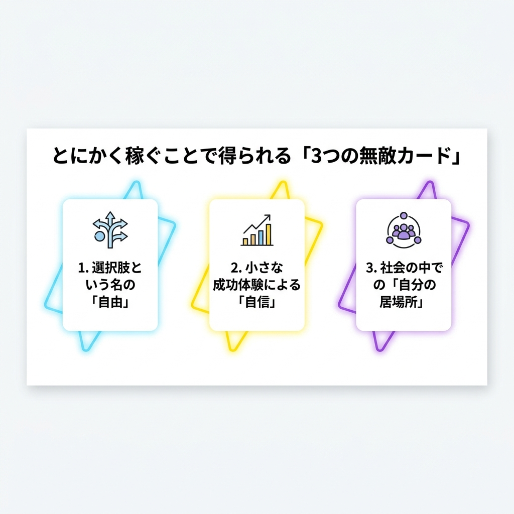
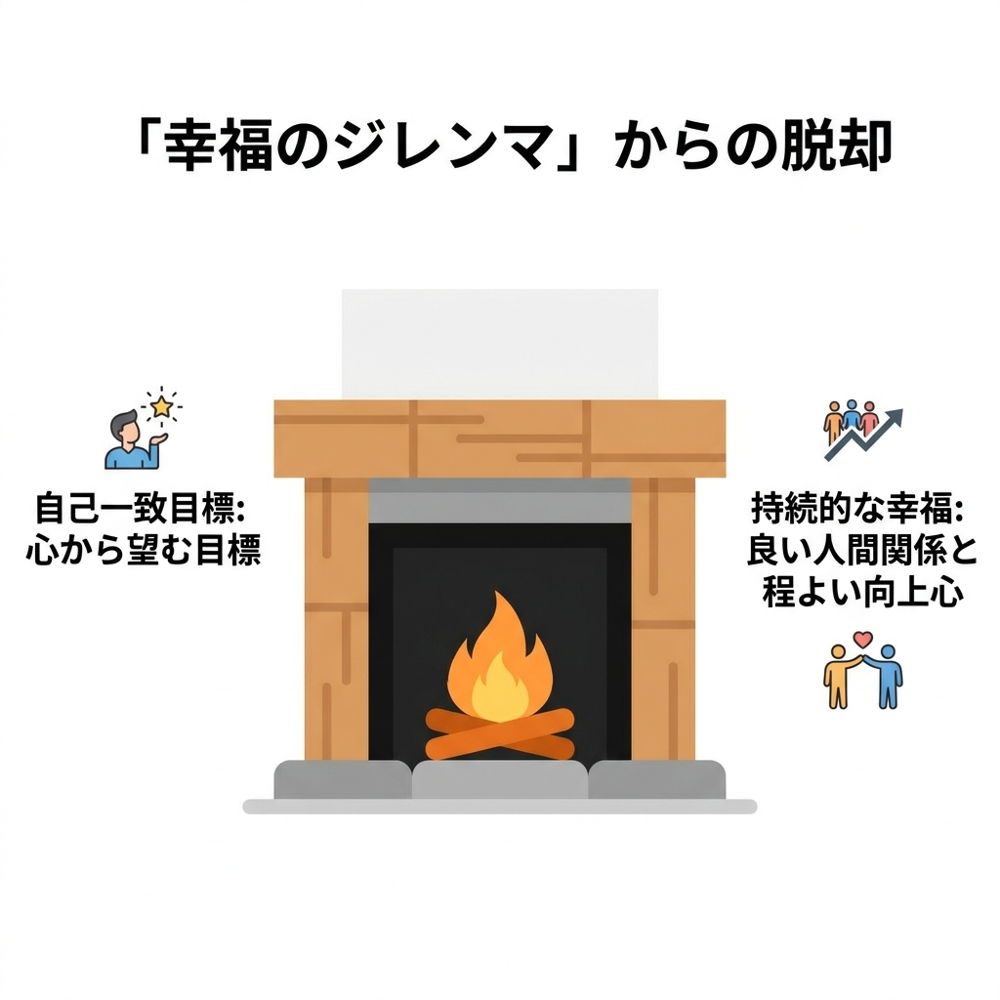

## 「やりたいこと探し」の罠と、残酷な真実

休日の午後、ぼんやりとスマホをスクロールしてため息をつく。
Instagramを開けば、趣味のキャンプで最高に楽しそうにしている友人の写真。YouTubeのおすすめには、「好きなことで生きていく」と熱弁する同年代の起業家。
みんなどこかキラキラしていて、熱中できる何かを持っているように見える。

ひるがえって自分はどうか。
熱中できる趣味もない。どうしてもやりたい仕事もない。
毎月の給料は生活費とちょっとした交際費で消えていき、貯金残高を見ても将来の安心感なんて到底得られない。今の仕事に殺意を抱くほどの不満があるわけじゃないけど、このまま単調な日々を定年まで繰り返すのかと思うと、胸の奥がざわざわする。
「やりたいことを見つけなきゃ」と焦って、本屋で自己啓発本を何冊も買ってはみたものの、結局何も変わらない。

そんなあなたに、残酷な真実を言おう。

### なぜ自己啓発本を読んでも「やりたいこと」は見つからないのか？

「やりたいこと」は、ある日突然空から降ってくる宝の地図なんかじゃない。
それは、あちこち歩き回って、泥だらけになって見つける「道端の面白い石」みたいなものだ。

自己啓発本は口を揃えて「内なる情熱に従え」と説くけれど、そもそも最初から強烈な情熱を持っている人間なんて、ほんの一握りの異常者だけだ。
普通の人は、とりあえず何かを始めてみて、小さな成功体験を積み重ねるうちに「あ、これ好きかも」と気づく。
「やりたいこと」がないのは、あなたの人間性が薄っぺらいからじゃない。単に、選択肢を広げるための「行動」と「武器」が足りていないだけだ。

### 「お金を稼ぐ」という、最も確実な土台作り

だから、一見冷たく聞こえるかもしれないけれど、最も合理的で実践的なアドバイスを送る。

**「やりたいことがないなら、とりあえずカネを稼げ」**

この言葉に反発を覚える人もいるだろう。
「お金が目的になるなんて虚しい」とか「稼ぐ意味が見出せない」とか。
でも、それは冒険に出る前に、まずは村で「装備」と「食料」を買うのと同じことだ。手ぶらで魔王に挑むバカはいない。

目標設定ではよく**SMARTの法則**（具体的で達成可能な目標設定の型。例えば「痩せる」じゃなく「1ヶ月で1kg痩せるために毎日15分歩く」と決めるようなもの）が有効だと言われる。
「いつかやりたいことを見つける」なんていうフワッとした目標より、「半年後に副業で月5万円稼ぐ」という生々しく測定可能な目標のほうが、はるかに人間を行動に駆り立てる。

## とにかく稼ぐことで得られる「3つの無敵カード」

「とりあえず稼ぐ」という行動は、単に銀行残高の数字を増やすだけじゃない。人生のブレイクスルーに必要な「3つの無敵カード」を強制的に手に入れることでもある。

### 1. 選択肢という名の「自由」

お金は「人生のバイキング」で好きな料理を取るためのチケットだ。

資金さえあれば、いざ「留学したい」「起業したい」「転職のために半年間学校に通いたい」と本気で思った時に、明日にでも行動に移せる。
逆に資金がなければ、どれほど魅力的な「やりたいこと」が見つかっても、歯を食いしばって諦めるしかない。

ここで重要なのが**キャリアアンカー**（仕事で絶対に譲れない自分だけの軸。船が流されないように下ろす錨のようなもの）だ。
「経済的な安定」や「自律・独立」といったキャリアアンカーを満たすためには、どうきれいごとを並べても、最低限の経済的基盤が絶対に必要だ。

### 2. 小さな成功体験による「自信」の構築

自転車の補助輪が外れたときのような、あの「自分でも進める！」という実感。

「会社から与えられた仕事」をこなして貰う給料とは違い、「自らの力で生み出した価値」に直接お金が払われる経験は、強烈な自信になる。
クラウドソーシングで初めて自分の書いた記事が採用されて、500円の報酬を得たときの喜び。あの500円は、会社の給料の500円とは重みがまったく違う。
「自分でも稼げるんだ」という事実が、すり減った自己効力感を飛躍的に高めてくれる。

### 3. 社会の中での「自分の居場所」の発見

パズルのピースが「カチッ」とはまる、あの感覚。

お金を稼ぐということは、誰かに価値を提供し、感謝されたという動かぬ証拠だ。
本業であれ副業であれ、誰かの役に立っているという実感が、この残酷な社会における「自分の居場所」を作ってくれる。

## お金は手段。では「本当のゴール」とは何か？

ここまで「カネを稼げ」と煽ってきたけれど、別に「金の亡者になれ」と言っているわけじゃない。

### お金そのものを目的にすると陥る「幸福のジレンマ」

ガソリンを入れること自体が目的のドライブなんて、狂っている。

お金はあくまでガソリンであり、目的地じゃない。
年収や貯金額だけをひたすら追い求めると、どこまでいっても心が満たされない「幸福のジレンマ」に陥る。

ここで目指すべきは**自己一致目標**（他人の借り物じゃない、心から自分が望む目標。親に無理やり行かされる塾じゃなく、自分が好きで通うサッカー教室のようなもの）だ。
稼ぐという泥臭いプロセスの中で、自分が何に喜びを感じ、何に苦痛を感じるのかを冷静に観察する。そうやって、真の目標を掘り当てていくのだ。

### 良い人間関係と「程よい向上心」がもたらす持続的な幸福

暖炉の火を絶やさないための、適度な薪くべ。

ハーバード大学が75年もかけて調べた結果、人間の持続的な幸福の基盤は結局「良い人間関係」にあることがわかっている。
お金を稼ぐ過程で出会った仲間や、価値観を共有できる人々とのつながりが、人生を豊かにする。
現状に満足しすぎず、かといって過労死するほど無理もしない「程よい向上心」が、心を健やかに保つ唯一の秘訣だ。

## 明日から始める「実践的な人生戦略」

じゃあ、具体的に明日から何をすればいいのか。

### ノースキルからでも始められる「稼ぐ練習」

筋トレを始めるとき、いきなり100kgのバーベルを上げるバカはいない。最初は軽いダンベルからだ。

特別なスキルがなくても、不用品の売却、ポイ活、単発のアルバイト、クラウドソーシングでの簡単なデータ入力など、「自力で1円を稼ぐ」経験は今日からでもできる。
あるいは今の仕事に対して、「どうすればもっと価値を出して昇給につなげられるか」を真剣に考えるのも、立派な第一歩だ。

### 10年後の自分から逆算する「小さな一歩」

山頂からルートを見下ろし、最初の足場を決める。

10年後の自分を想像して、「経済的に自立していたい」「どこでも働けるスキルを持っていたい」という状態目標から逆算してみる。
そして、「そのために今週は何をするか」という超具体的な行動に落とし込むのだ。

あなたは「やりたいこと」という綺麗な幻を言い訳にして、今すぐできる「稼ぐこと」から逃げていないだろうか？

「やりたいこと」が見つかってから動き出すんじゃない。
とりあえず動き出して、ガムシャラに稼いでいるうちに、いつの間にか「やりたいこと」のほうからあなたを見つけてくれる。
それが、この人生というゲームの本当のルールだ。

<!-- 参照ファイル一覧
- 03_detailed_agenda.md
- 04_blog_post.md
- 05_thumbnail_prompts.md
- 06_section_prompts.md
- ./thumbnail.png
- ./img1.png
- ./img2.png
-->
