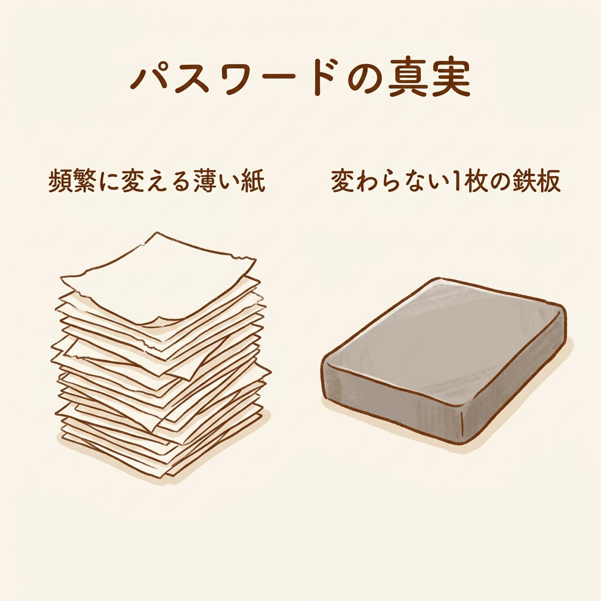
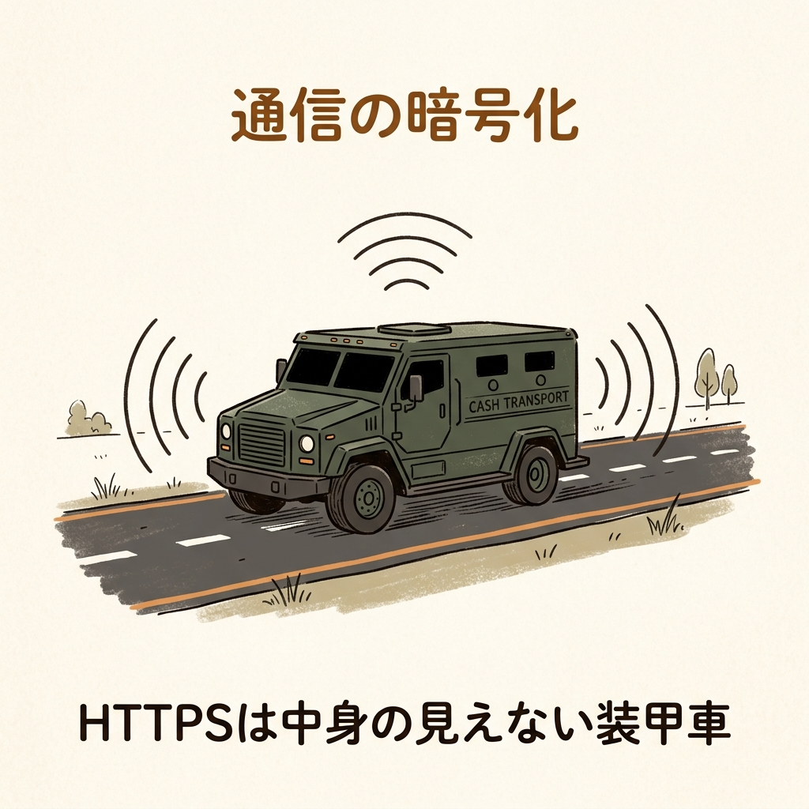
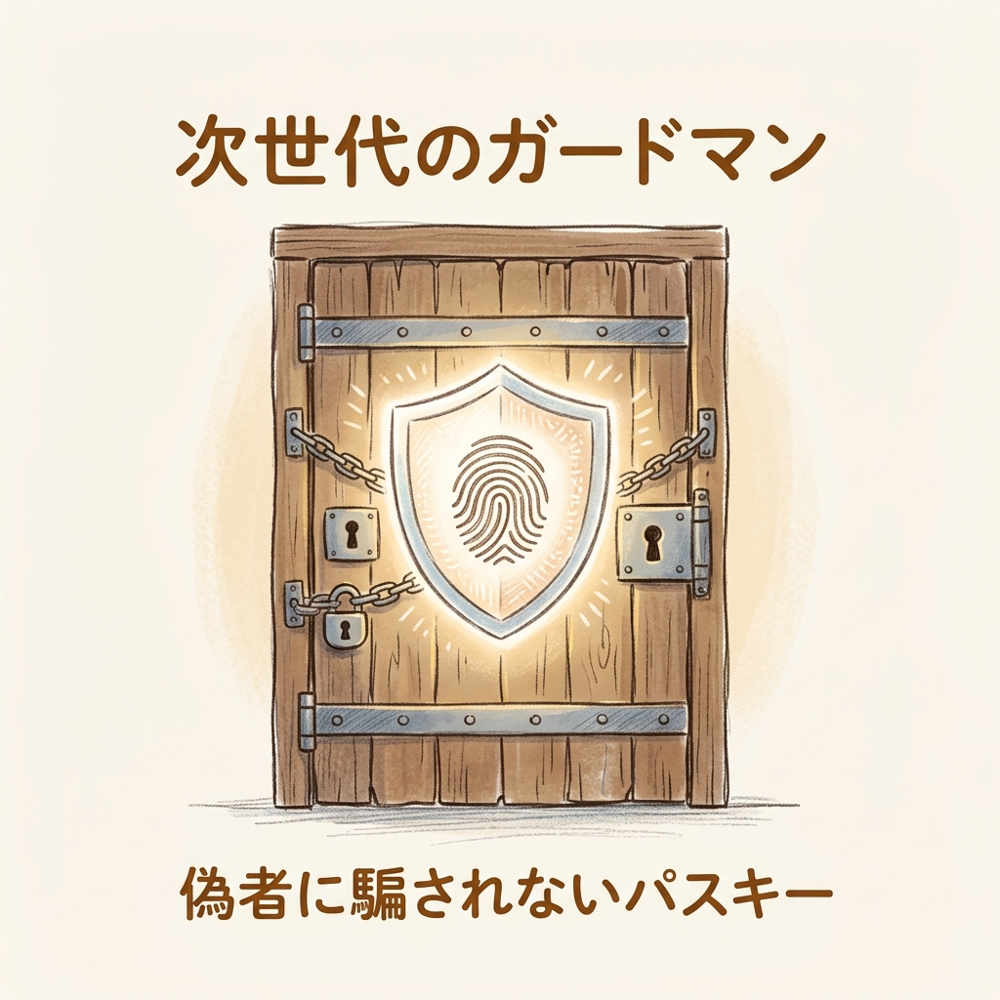

## 終わらない「パスワード変更」の呪い

月曜の朝。出社してPCを開き、さあ仕事を始めようとした瞬間に画面に表示されるポップアップ。

「パスワードの有効期限が切れます。変更してください」

またか、と小さくため息をつきますよね。前回のパスワードの末尾にある1を2に変えてエンターを押す。あるいは、忘れそうだからと付箋に新しいパスワードを書き込み、モニターの隅に貼り付ける。会社のルールをきっちり守ったはずなのに、なんだかとても脆いことをしているような虚しさに襲われます。

こんな儀式に、一体何の意味があるんでしょうか。セキュリティ対策って、私たちの仕事を邪魔するために存在しているんでしょうか。真面目な働き手ほど、この終わらない徒労感、いわゆる「セキュリティ疲労」を抱えています。

実のところ、この「鍵穴の形を少し変えるだけの儀式」、現代では意味がないどころか、逆効果であることが証明されているんです。

情報セキュリティの世界には「ハックロア（Hacklore）」という言葉があります。ハッキング（Hacking）と民間伝承（Folklore）を組み合わせた造語で、根拠が不十分、あるいは時代遅れになった安全神話のこと。言うなれば現代の雨乞いの儀式ですね。昔は意味があると思われていたけれど、今はただ体力を消耗するだけになっています。

## なぜ「あの常識」は時代遅れになったのか

世界のセキュリティのルールブックを作る機関、米国国立標準技術研究所（NIST）は、すでに数年前のガイドライン改訂で「定期的なパスワード変更の強制」を非推奨としています。

なぜでしょうか。理由は人間の心理にあります。頻繁な変更を強いられると、記憶の負担を減らすために「Password123」を「Password124」にするなど、予測可能なパターンに陥りやすくなります。ダイヤル式南京錠を0000から9999まで全部試す泥棒（総当たり攻撃）にとって、こんな推測しやすいパスワードは格好の的です。

これは1枚の鉄板と、10枚の薄い紙の違いに似ています。頻繁に変える薄い紙のような弱いパスワードを10個用意するより、一度決めたら変えない強固な1枚の鉄板の方が、はるかに破られにくい。漏洩が疑われる場合を除き、パスワードは変更しないのが今のグローバルスタンダードです。

また、「公衆Wi-Fiは絶対悪」というのも、一昔前の常識です。

現在、企業のウェブサイトやアプリの圧倒的多数は「HTTPS」という暗号化された通信路を使っています。これは例えるなら、外から中身が見えない装甲車での現金輸送です。たとえ同じカフェのWi-Fiネットワークに悪意のある人間が潜んでいても、その中身を解読することは極めて困難です。

もちろん、偽装アクセスポイントという間違った道に誘導されるリスクには依然として注意が必要ですが、「公衆Wi-Fiだから」という理由だけで一律に避けて業務を滞らせるのは、いささか過剰反応と言えます。

## セキュリティ疲労が招く「内側からの崩壊」

ルールの肥大化は、真面目な働き手から防衛の体力を確実に奪います。

意味のない90日ごとの定期変更ルール、複雑すぎる記号混じりの生成要件、過剰なネットワーク制限。これらハックロアに基づく対策は、私たちに「どうせ何をやっても意味がない」「ルールが多すぎて守りきれない」という徒労感とサボタージュを生み出します。

オオカミ少年の警報と同じで、どうせ無意味だと感じると、本当に危険な時にも誰もルールを守らなくなる。ユーザーがサボタージュを始めた時、組織の防御壁は外からではなく、内側から崩壊していくんです。

完璧を目指すのではなく、選択と集中をすることが重要です。攻撃を受けてもすぐに回復できる「しなやかな強さ」を持つためには、無数のバリケードを張り巡らせるより、強固な一つの金庫にリソースを集中させるべきです。

## 明日から捨てるルール、始めるルール

私たちが今すぐシフトすべき、真のセキュリティ対策は以下の点に集約されます。

一つ目は、複雑さより長さを重視すること。パスフレーズの威力です。
意味のない記号の羅列よりも、自分だけが知っている長い呪文（パスフレーズ）の方が、システムによる総当たり攻撃に対しては圧倒的に強いのです。たとえば「Watashi-wa-Maiasa-Kohi-wo-Nomu」のような、自分にとって意味のある長い文章ですね。複雑な記号を覚えるより簡単で、かつ強固です。これをパスワードマネージャーに記憶させ、マスターパスワード1つだけを覚えればいい環境を作ります。

二つ目は、必須の「2つ目の鍵」である多要素認証（MFA）と、パスキーへの移行です。
パスワードが万が一漏洩しても、手元のスマートフォンへのSMS認証などがあれば不正アクセスはほぼ防げます。銀行のキャッシュカードと暗証番号の組み合わせと同じです。

しかし、最近ではその2つ目の鍵すらも、巧妙な偽サイトで中継して突破したり、承認通知を大量に送りつけて誤って承認させたりする手口が増えています。

そこで最終的な解決策となるのが「パスキー（Passkey）」などの次世代認証です。これは顔パス（生体認証）とシステム間の暗号照合を組み合わせた仕組みで、人間が偽サイトに騙されようとしても、システム同士が「これは本物ではない」と弾いてくれる、絶対に偽者に騙されない最強のガードマンです。

あなたが今必死に守っているそのセキュリティルールは、本当にシステムを守るためのものでしょうか？ それとも、ルールを作った人の安心感を守るためのものでしょうか？

真のセキュリティとは、ガチガチに縛って身動きを取れなくすることではありません。自由に動ける余白を残したまま、急所だけを確実に守る設計のことです。

月曜の朝、不要なパスワード変更のポップアップに時間を奪われない働き方は、設計さえ変えれば、すぐにでも始められます。

<!-- 参照ファイル一覧
- 03_detailed_agenda.md
- 04_blog_post.md
- 05_thumbnail_prompts.md
- 06_section_prompts.md
- ./thumbnail.png
- ./img1.png
- ./img2.png
- ./img3.png
-->
