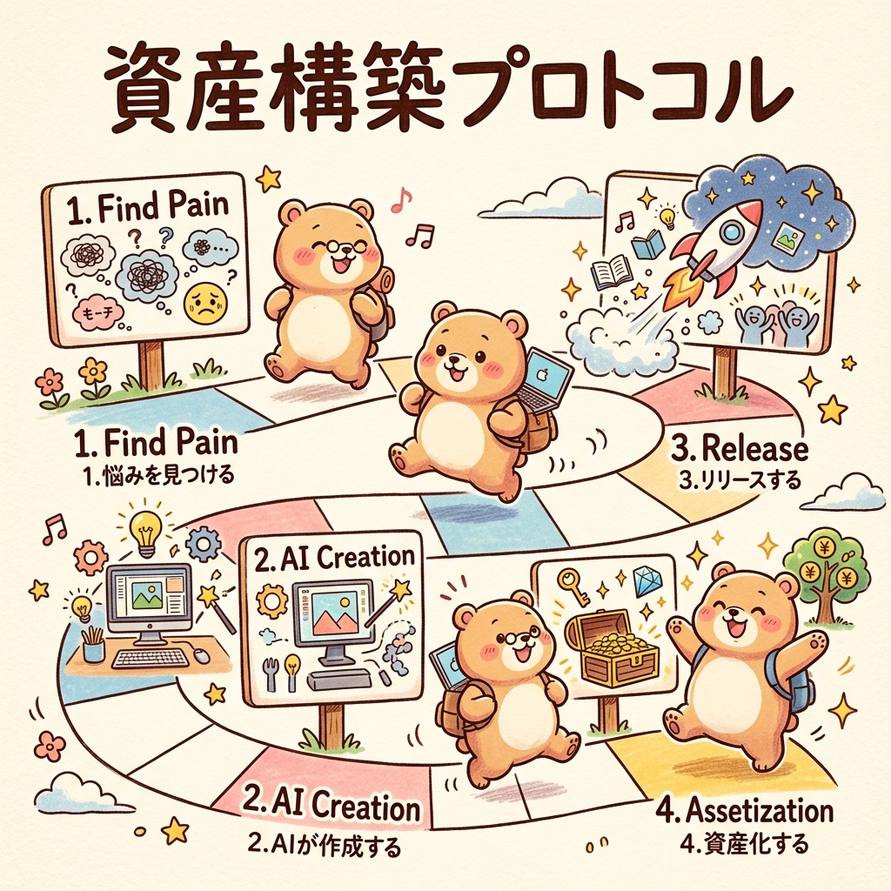
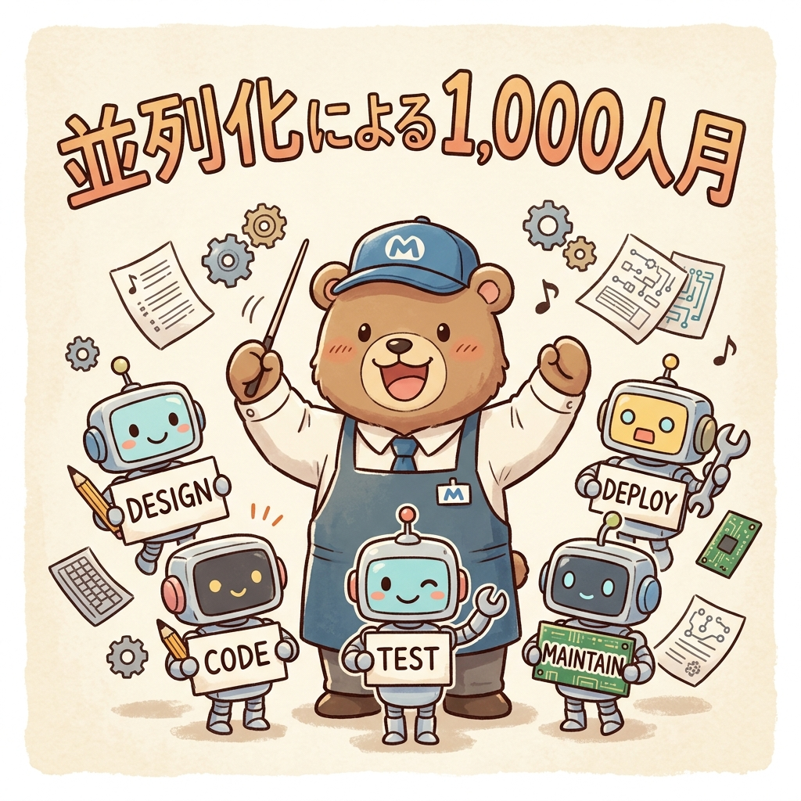

「ケンジさん、最新のAIについて毎日3時間は勉強していますし、SNSでも発信を続けています。でも、一向に収益に繋がる気配がありません。私の努力が足りないのでしょうか……？」

クアラルンプールの湿り気を帯びた夜風を感じながら、ホテルのラウンジでこうした相談を受けることがあります。かつての私も、地方の製造業で深夜までエクセルを叩き、マニュアルを作り、自分なりに「意識を高く」持って働いていました。でも、いくら知識を詰め込んでも、自分の人生が豊かになっていく実感は得られませんでした。

少し厳しい言い方かもしれませんが、はっきり言ってしまうと、自由は根性で手に入れるものではありません。「設計」で手に入れるものです。

あなたが今感じている「報われない努力」の正体は、能力不足ではありません。努力を「投資」ではなく「消費」として扱ってしまっている、その構造的な欠陥にあります。

今日は、製造業の生産管理（SCM）という冷徹なロジックと、Google Antigravityという最新のAIを使い、あなたの努力を「黄金の資産」へと転換させる具体的な道筋をお話しします。

## 第1章：承認欲求のサンクコスト（埋没費用）―「意識高い系」の行動力学

まず、認めなければならない不都合な真実があります。2026年現在、情報の価値は暴落しました。シリコンバレーの最新トレンドも、高度なエンジニアリングの知識も、今やスマホ一つで安価に入手できます。

この環境下で、「勉強すること」や「情報収集すること」自体の価値は、かつてのそれとは比較にならないほど低くなっています。それにもかかわらず、多くの人がビジネス書を読み、高額なセミナーに参加し、SNSで「学び」をアウトプットすることに没頭しています。

これ、実は心理学で言う「能動的先延ばし（Active Procrastination）」という罠なんです。

本来取り組むべき、リスクを伴う本質的な課題――例えば製品のリリースや、見知らぬ顧客への営業電話、バグだらけのコードと向き合うこと。こうした「痛み」から逃れるために、一見有益に見える「周辺的な活動」に没頭し、自分を正当化してしまう。

SNSでの「いいね」やセミナーでの高揚感は、脳内の報酬系を巧みにハックします。まだ1円の利益も生んでいない段階で、脳に「目標を達成した」という偽りの達成感を与えてしまうのです。

その結果、本来「資産」を構築するために向けられるべき有限のリソースが、自己満足という短期的な快楽のために消費されていく。これが「意識高い系」が陥る、サンクコスト（埋没費用）の泥沼です。

実業家として歩み出すなら、まず「今の努力の9割は、自己満足のための消費である」と冷徹に認識することから始めなければなりません。

## 第2章：実業家の「逆算型」生産管理システム

では、実力を持つ実業家はどう動いているのか。彼らの思考は、生産管理における「プル型（受注生産）」システムに基づいています。

意識高い系の行動は、典型的な「プッシュ型（見込み生産）」です。需要が確定していないのに、「いつか役立つはずだ」と知識という在庫を大量に積み上げる。これは経営的に見れば、倉庫を圧迫し続ける「不良在庫」を抱えているのと同じです。

対して実業家は、まず「市場の出口（キャッシュフロー）」を特定し、そこから逆算して必要なリソースのみをジャスト・イン・タイムで調達します。

彼らが最適化するのは、自分の知識量ではなく「スループット（収益の発生速度）」です。制約理論（TOC）に基づき、ビジネスの流れを停滞させているボトルネックだけを集中的に解決します。

ここで重要になるのが、リードタイム（LT）の圧縮です。意識高い系が完璧な学習によってLTを無限に引き延ばしている間に、実業家は60点の不完全なプロダクトを即座にリリースし、市場の反応という現実のデータを得ることでLTを最小化します。

かつての私も、完璧なエクセルシートを作ることに固執していましたが、本当に価値があったのは、そのシートが現場の「痛み」を一つでも解決した瞬間だけでした。

## 第3章：事例研究：#100日チャレンジと「市場のフィードバック・ループ」

最近話題の「#100日チャレンジ」。100日間連続でアプリをリリースしたり、コンテンツを投稿したりするこの手法は、単なる根性論ではありません。統計学における「大数の法則」をビジネスに適用した、極めて合理的な戦術です。

新規ビジネスが当たる確率が1%だとしても、1回だけの挑戦で当てるのは至難の業です。しかし、100回試行すれば、少なくとも1つ以上が成功する確率は統計的に63%を超えます。

100日チャレンジの本質は、自分の才能を信じるのではなく、試行回数による「確率の強制執行」を行うことにあります。

そして、このプロセスで最も価値があるのは、成功したプロダクトそのものではありません。100回という高速なフィードバック・ループを通じて、自分の頭の中の「妄想」が市場の「真実」によって削ぎ落とされ、最適化されていく自分自身のワークフローこそが、最大の無形資産となります。

## 第4章：AIエージェント時代の資産構築―Antigravityによる自動化の極致

2026年、実業家が持つべき最強の武器は、Google AntigravityのようなAIエージェントです。

かつては、コードを書く「労働者」が必要でした。しかし今は、開発者が一行もコードを書かずに、要件定義からデプロイまでを完結させる「エージェント・マネージャー（工場長）」へと進化すべき時です。

Antigravityを活用すれば、複数のエージェントを並列稼働させ、デザイン、バックエンド、セキュリティ、テストを一気に処理できます。これにより、個人の生産性は組織並みの「1,000人月相当」へと指数関数的に向上します。

ここで私が特に重視している機能が「Agent Skills」です。一度得た知見やワークフローをAIにスキルとして登録しておくことで、あなたの努力が単発の作業で終わらず、AIの知能向上という永続的な資産へと変換されます。

自由を手に入れるための鍵は、AIという「自律型生産設備」をいかに設計し、運用するかにある。これは、工場で機械の配置（レイアウト）を考えるのと全く同じ論理です。

## 第5章：結論：今日から始める「消費から資産へ」の転換プロトコル

最後に、あなたが今日から実業家として歩み出すための、具体的なプロトコルを提示します。

まず、努力の「棚卸し」をしてください。

- **整理**: 「将来役に立つかも」というだけの学習を、勇気を持って捨てる。
- **整頓**: 自分の活動を「消費」と「資産」に明確に分け、8割を資産へ配分する。

そして、以下の4ステップを実行してください。

1. **ターゲット・ペイン（痛み）の特定**: 自分がやりたいことではなく、誰かがお金を払ってでも解決したい「小さな不満」を見つける。
2. **AIエージェントへの権限委譲**: Antigravityを使い、60点のプロトタイプを数分で生成させる。
3. **市場への強制暴露**: 即座にリリースし、市場からの「冷たい真実」をフィードバックとして受け取る。
4. **収益の自動化とスケーリング**: 最初の収益が発生したら、そのプロセスをAIに学習させ、仕組み化する。

あなたが今日行った作業の中に、「明日、あなたが何もしなくても価値を生み出し続けているもの」はありますか？

もし一つも思い当たらないのであれば、その日の努力は単なる消費です。

世界は、自分を認めてもらうための舞台ではありません。課題と解決策をマッチングさせ、そこから資産を抽出するための実験場です。

今日、この瞬間から。自分のプライドという幻想を捨て、市場という現実の海へ、あなたのプロダクトを漕ぎ出してください。

自由は、待つものではなく、自ら設計して手に入れるものです。

---

<!-- 画像リネームマッピング (GAS/手動作業用)
Phase2生成ファイル → GASアップロード用ファイル名

Image/thumbnail/thumbnail_01.png → thumbnail.png
Image/sections/section_01.png → img1.png
Image/sections/section_02.png → img2.png
Image/sections/section_03.png → img3.png
Image/sections/section_04.png → img4.png
Image/sections/section_05.png → img5.png

アップロード先: GitHub src/content/blog/escaping-ishiki-takai-trap/ (コロケーション配置)
Astro参照パス: ./thumbnail.png, ./img1.png, ./img2.png, ./img3.png, ./img4.png, ./img5.png
-->

<!-- 参照ファイル一覧
- 03_detailed_agenda.md
- 04_blog_post.md
- 05_thumbnail_prompts.md
- 06_section_prompts.md
- Image/thumbnail/thumbnail_01.png
- Image/sections/section_01.png
- Image/sections/section_02.png
- Image/sections/section_03.png
- Image/sections/section_04.png
- Image/sections/section_05.png
-->

> **著者：ケンジ**
> マイクロ法人代表。マレーシア・クアラルンプール在住。
> 製造業での生産管理25年の経験を活かし、AIワークフローによる「自由の設計」を提唱。
