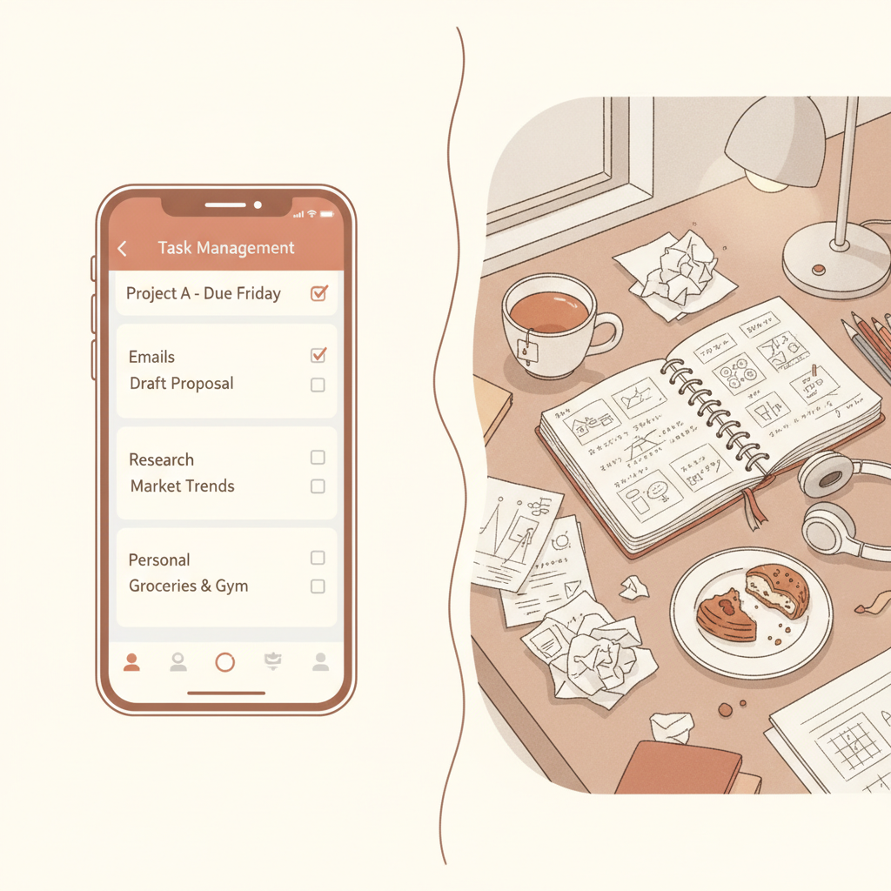
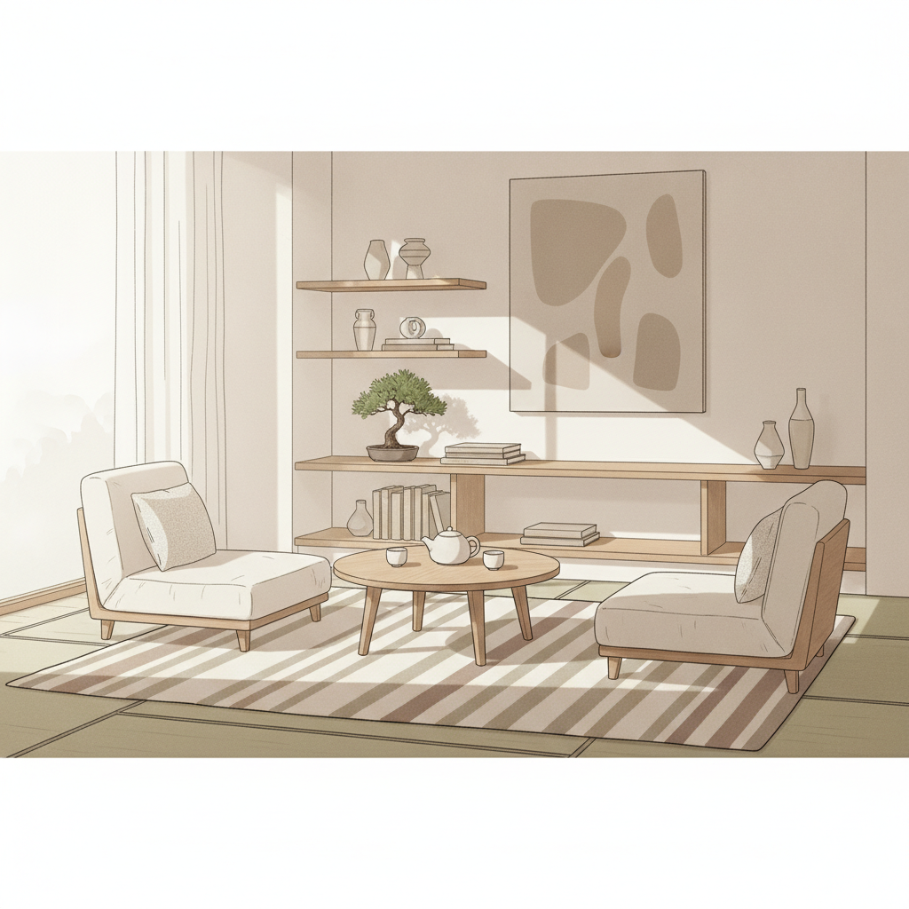
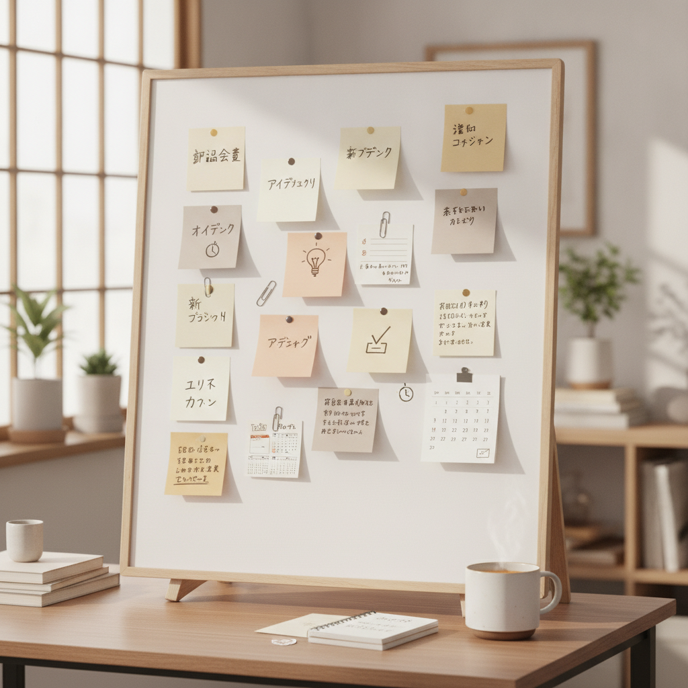
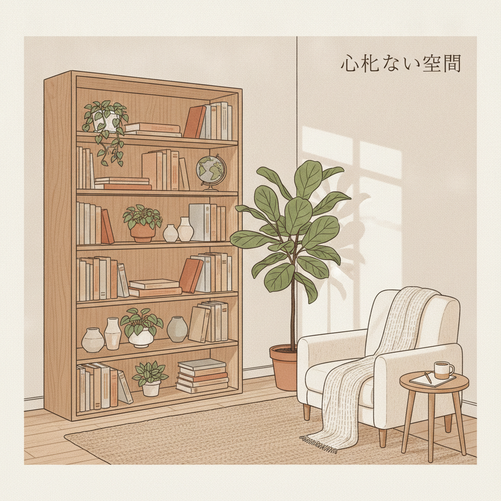

月曜日の夜、疲れ切って帰宅した玄関で脱ぎ捨てられた靴下を目にしたとき。あるいは、休日の朝に「今日、子どもの予防接種って言ったよね？」「え、聞いてないよ」という押し問答から始まる重苦しい沈黙。

真面目に働いて、家族のために一生懸命生きている人ほど、こうした家庭内の小さな摩擦に深く消耗してしまいます。

職場でなら、複数の関係者を巻き込みながらスケジュールを引き、トラブルが起きても「仕組みのどこに課題があったか」を冷静に切り分けられるはずです。それなのに、なぜか最愛のパートナーを前にすると、感情をコントロールできなくなったり、「どうして言わなくても分かってくれないのか」と相手を責めてしまったりする。

かつての私も、まったく同じ罠にはまっていました。

地方の製造業で25年間、生産管理や業務改善の現場にいた私は、工場ラインのボトルネックには誰よりも早く気づけたのに、自分の家庭という最小の現場では、善意と感情論ばかりを押し通そうとしていたのです。

家庭を維持するために必要なのは、もっと強い忍耐力でも、相手を変えようとする説得でもありません。必要なのは、最初から摩擦が起きないように組まれた**「運用の設計」**です。

---

## 感情がすれ違う本当の原因：見えない「認知負担」の偏り

夫婦の間で起こる喧嘩の原因を尋ねると、多くの人が「家事の分担」を挙げます。しかし、本当の痛点は「どちらがゴミを捨てたか」「どちらが皿を洗ったか」という物理的な作業そのものではありません。

クイーンズランド大学が2026年に発表した研究によると、家事・育児労働には「身体的負担」「認知負担」「感情的負担」の3層が存在します。そして、ジェンダー平等が進んだとされる現代の家庭でも、計画の立案やスケジュール調整といった**「認知負担（Mental Load）」**は、女性側に約25%偏っていることが明らかになっています。

これは、レストランに例えると分かりやすいかもしれません。

10分間皿を洗うのは「作業」です。一方で、今週の食材の在庫を確認し、献立を考え、子どものアレルギーや予防接種の期限を逆算して買い出しの段取りを組むのは「料理長（シェフ）の頭脳労働」です。

「何か手伝うことある？」という悪気のない一言が相手を苛立たせるのは、指示を出すこと自体が最も脳のメモリを消費する作業だからです。画面上では何もしていないように見えても、裏で50個のアプリがバックグラウンド起動したままバッテリーを熱暴走させているスマートフォンのような状態です。

さらに、会話による記憶の保持率は、直後で約50%、1ヶ月後には約21%まで自然減衰します（忘却曲線）。つまり「言った・言わない」の衝突は、愛情の欠如ではなく、単なる「人間の脳の仕様」によるバグにすぎません。

ラーメン屋が暗記だけで10人分の注文を受けないように、家庭内のタスクや予定も、個人の記憶や善意に依存してはいけないのです。

---

## 科学が証明する「会話の3分間」と永久的課題の扱い方

ワシントン大学のジョン・ゴットマン博士らは、40年以上にわたり3,000組以上の夫婦を追跡調査し、極めて明快なデータを導き出しました。

夫婦が15分間の議論を行う様子を観察するだけで、将来の離婚を94%の精度で予測できるといいます。さらに驚くべきは、**「会話の最初の3分間」が厳しい立ち上がり（批判や皮肉）かどうかを見るだけで、その会話の結末を96%の確率で予測できる**という事実です。

仕事の打ち合わせで、開口一番に「なんでこの資料できてないの？」と人格攻撃から入る人はいません。それなのに家庭では、ドアを開けた瞬間に急上昇のアクセルを踏み、衝突事故を起こしてしまう。飛行機が滑走路をゆっくり滑走するように、「ちょっと相談があるんだけど」と穏やかに切り出す（柔らかい立ち上がり）だけで、多くの破綻は防げます。

また、ゴットマン博士の研究では、夫婦間の葛藤の**69%は性格や価値観の違いに根ざす「永久的課題」**であり、そもそも根本解決できないものであることも示されています。

天気が雨だからといって、空に向かって怒鳴る人はいません。雨は止まないのだから、折りたたみ傘を用意する。パートナーの性質もそれと同じです。「相手を変える」という不可能な目的にエネルギーを注ぐのをやめ、違ったままでも破綻しないルールを作ることに注力するべきです。

もし感情が高ぶり、心拍数が100を超えて思考がシャットアウト（いわゆる壁作り状態）になったら、どんな議論も成立しません。その状態に陥ったときは、意図的に最低20分間の冷却時間を取る。これも感情論ではなく、生理学的な仕様に基づいた運用設計です。

---

## プロジェクトマネジメントを家庭に持ち込む「3つの実装ステップ」

では、具体的に家庭をどのように「プロジェクト」として運用すればいいのでしょうか。大掛かりなシステムや専門用語を導入する必要はありません。やるべきことは、次の3つの手順に集約されます。

### 1. タスクの「外出し」と可視化
頭の中にあるToDoや「名もなき家事」をすべて外に出します。TrelloやBacklogのようなツールを使ってもいいですし、冷蔵庫の横に貼ったシンプルな付箋でも構いません。

重要なのは、「誰が悪いか（人）」ではなく「何が残っているか（課題）」に視点を移すことです。作業のステータスが誰の目にも見えていれば、「気づいたほうがやる」という曖昧なルールによる不公平感は消えます。

### 2. 1回15分の「週次定例」をスケジュール天引きする
日々の生活の中で突発的に重い話を切り出すのをやめ、あらかじめ決めた日時に短い定例ミーティングを設けます。

* 今週うまくいったこと（Keep）
* 引っかかっていること（Problem）
* 来週試してみたい改善（Try）

この3点だけを淡々と確認します。感情的な不満をぶつけ合う場ではなく、工場のライン見直しのように「仕組みの調整」を行う時間です。日常の業務連絡をこの場に集約することで、平日の夜に事務的なやり取りが減り、心に余裕が生まれます。

### 3. 「肯定と否定の比率」を5対1以上に保つ
ゴットマンの研究では、安定した夫婦関係を維持するためには、1つの否定的なやり取りに対して**最低5つ以上の肯定的なやり取り（感謝、共感、笑顔）**が必要であることが分かっています。

批判を1回口にするなら、その前に5回、小さな感謝を言葉にしておく。感情の口座を赤字にしないための、極めて合理的な数値基準です。

---

## 効率化の罠：パートナーを「改善対象」にしてはならない

ここで、絶対に避けるべき重大な注意点があります。それは、**家庭を「会社」そのものにしてしまわないこと**です。

精神科医のグラント・H・ブレナー博士が警鐘を鳴らすように、パートナーを「自分の改善プロジェクト」として扱い始めると、関係性は急速に崩壊します。どちらか一方が上司やカウンセラー気取りになり、「あなたのために教えてあげている」という態度を取った瞬間、対等な親密さは失われ、冷え切った評価関係へと変質してしまいます。

また、生活のあらゆる瞬間に「効率」や「費用対効果」を求めるのも危険です。

子どもの予測不能な行動や、休日に何もしないで過ごす無駄な時間。それらは切り捨てるべきノイズではなく、人生の豊かさそのものです。

ハルメクが2025年に行った調査では、仲の良い熟年夫婦であっても、平日に一緒に過ごす時間が**「3時間」を超えると長すぎると感じる**傾向が示されています。

仲が良いからといって、24時間密着してすべてを最適化する必要はありません。樹木が健全に育つためには、お互いの枝がぶつからない適度な間隔が必要なように、夫婦の間にも「干渉しない余白」が不可欠です。

仕組みを作るのは、家庭を無機質な工場にするためではありません。無駄な事務連絡や「言った・言わない」の低次元な摩擦をゼロにして、**本当に大切な「意味のない雑談」や「穏やかな沈黙」を楽しむ余白を取り戻すため**です。

---

## 自由は、根性ではなく「設計」で手に入れる

今の生活の慌ただしさ、パートナーとのすれ違いを、「自分の我慢が足りないからだ」「もっと努力しなければ」と抱え込む必要はありません。

真面目に生きている人ほど、仕組みの不備を自分の精神力で埋めようとして擦り切れてしまいます。

朝、お気に入りの豆を挽いてコーヒーを淹れる時間。
夕方、何の用件もないのに交わす他愛のない一言。

そうした穏やかな日常は、根性で耐え忍んだ先にあるのではなく、無駄な摩擦を論理的に削ぎ落とした「設計」の先に静かに立ち現れます。

まずは今夜、パートナーに「ちょっと仕組みを試してみない？」と、柔らかく声をかけてみることから始めてみてください。あなたの家庭という大切な現場は、設計ひとつで、もっと息のしやすい場所に変えられるはずです。