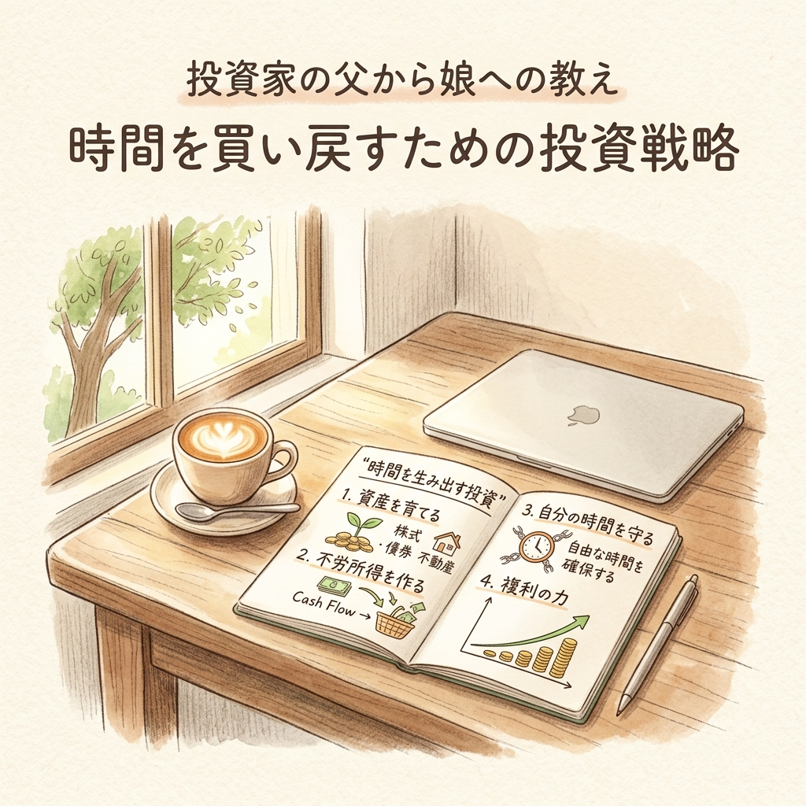
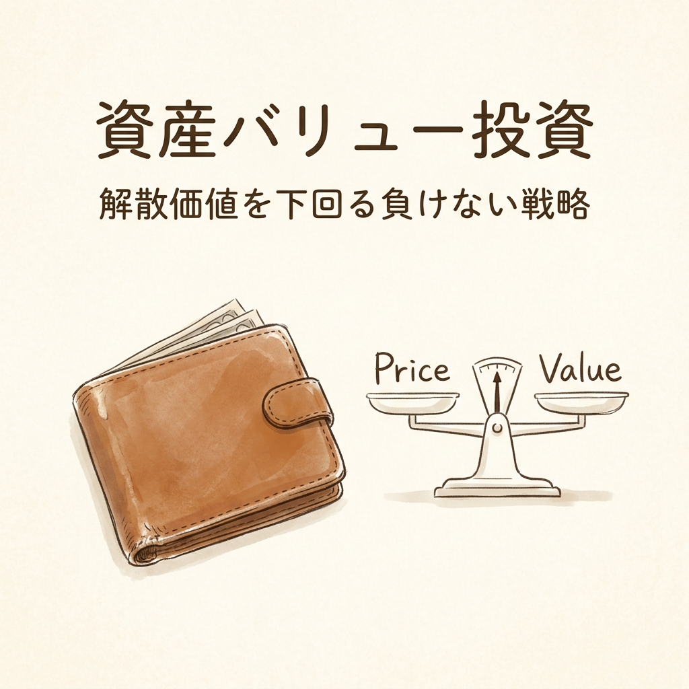
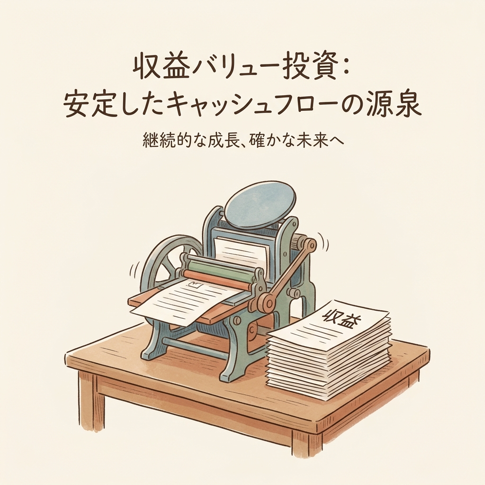

月曜日の朝8時、満員電車。
スマートフォンの画面に並ぶ赤い数字が緑に変わって、いくらかの運用益が出ているのを眺める。
でも、その数字が増えたからといって、この息の詰まる通勤や上がらない給与という現実は、1ミリも変わってくれない。

毎月数万円を思考停止で積み立ててはいるものの、このまま60歳まで働き続ける未来が、全く見えない。
まるで、自動で動くエスカレーターに乗っているのに、行き先がどこか誰も教えてくれないような感覚。
かつての自分もそうだったからよくわかる。真面目に汗水流して働いている人ほど、この「見えない未来」の罠に落ちやすいんだよね。

そんな時、ある一冊の本に出会った。
『５０万円を５０億円に増やした投資家の父から娘への教え』。
著者のたーちゃん氏は、現役の麻酔科医。人の命を預かる壮絶な現場にいながら、なぜ50億円もの資産を築けたのか。
そして彼は、余命宣告を受け、最愛の娘たちにこの「知恵」を遺すことを決めた。
彼が遺したロジックを知れば、私たちもこの終わりのないラットレースから降りる方法が見つかるかもしれない。

## 50万円を50億円に変えた「3つの防具と武器」の正体

多くの人は、投資を「いくら儲かるか」というギャンブルだと思い込んでいる。
でも彼のやり方は全く逆で、「これ以上は絶対に損をしない」という防御から入る。
これがバリュー投資のキモ。ざっくり言えば、「1万円札が5000円で売られているのを探す」ゲームだ。

彼の投資法には、明確な3つのステップがある。

第一の防具が「資産バリュー投資」。
企業の現金や不動産といった解散価値（最悪会社を畳んでも株主に残る資産）に注目し、その価値より安い株価で買う。
PBR（株価純資産倍率）なんて小難しい言葉があるけど、要は「会社の全財産を切り売りしたらいくらになるか」の目安。
これって、「中身に1万円入っているとわかっている財布を、8000円で買う」のと同じこと。買えば、最悪でも2000円の得が確定する。

第二の武器が「収益バリュー投資」。

資産だけじゃなく、企業が安定して利益を出し続けているかを見る。
これは「自動で毎日お札を刷り続けてくれる丈夫なプリンター」を買うようなものだ。
資産（財布の中身）がたっぷりで、しかもキャッシュフロー（プリンターの印刷能力）がある企業。ここで初めて、私たちは「負けない」から「増やす」段階へ進むことができる。

## 常識の裏を突く「シクリカル」という逆張り戦略

そして第三の武器が、10倍株を生み出す「シクリカル株（景気敏感株）」への投資。

鉄鋼とか海運みたいに、景気で利益が激変する企業がある。
不況で赤字を出して、世間が「あの業界はもう終わりだ」と見放した時、株価は底なしに落ちていく。
でも、著者はまさにこの「死の谷」を狙う。
誰も見向きもしない真冬のサーフボードを、底値で買うようなものだ。
全員が捨てた箱の中にだけ、当たりくじが入っている。これが逆張り戦略の凄み。

もちろん、これはただの博打じゃない。徹底的な歴史的サイクル分析の裏付けがあって初めて成立するロジックなんだ。

## なぜ「自分の言葉でレポートを書く」必要があるのか

こうした投資をやる上で、著者が何より強調しているのが「分析レポートを書くこと」。

個人投資家がよく陥るのが、「なんとなく上がりそうだから」という感情に任せた投資。
著者は、投資理由や目標株価の根拠、リスクシナリオ、撤退条件を文章にすることを義務付けている。
地図を持たずに見知らぬ森に入れば、迷うのは当たり前。
レポートを書くことで、自分の頭の中にあるバイアスを消し去り、論理的な判断だけを残すことができる。

ここで大事なのは、自分で書くということ。
情報を集めるのはAIに任せればいい。でも、最後の「なぜ買うのか」という論理構成だけは、自分の言葉で紡がなきゃダメだ。

## お金は目的ではない。「時間」を買い戻すための最終アクション

著者は50億円という莫大な資産を手にしてからも、麻酔科医の激務を続けた。
なぜなら、彼にとって投資は「お金を増やすこと」自体が目的じゃなかったから。

彼が娘たちに遺したかったもの。それは「お金」ではなく、「お金を増やす知恵」であり、その先にある「残酷なまでの自由」だ。
嫌な仕事に縛られない自由。愛する人と過ごす自由。そして、自分の足で歩く自由。
50億円は、娘たちが人生という大空へ飛び立つための、ただの「滑走路」に過ぎない。

もし明日、あなたに50億円が手に入ったとしたら。
それでも、今の満員電車に揺られて、同じ仕事を続けたいと思えるだろうか。

投資とは、自分の「時間」と「人生の選択肢」を買い戻すための盾なんだ。
今日、PBRが1倍を割っている企業のリストを眺めてみること。それが、終わらないラットレースから抜け出すための、最初の小さな一歩になるはずだ。

<!-- 参照ファイル一覧
- 03_detailed_agenda.md
- 04_blog_post.md
- 05_thumbnail_prompts.md
- 06_section_prompts.md
- ./thumbnail.png
- ./img1.png
- ./img2.png
- ./img3.png
-->
