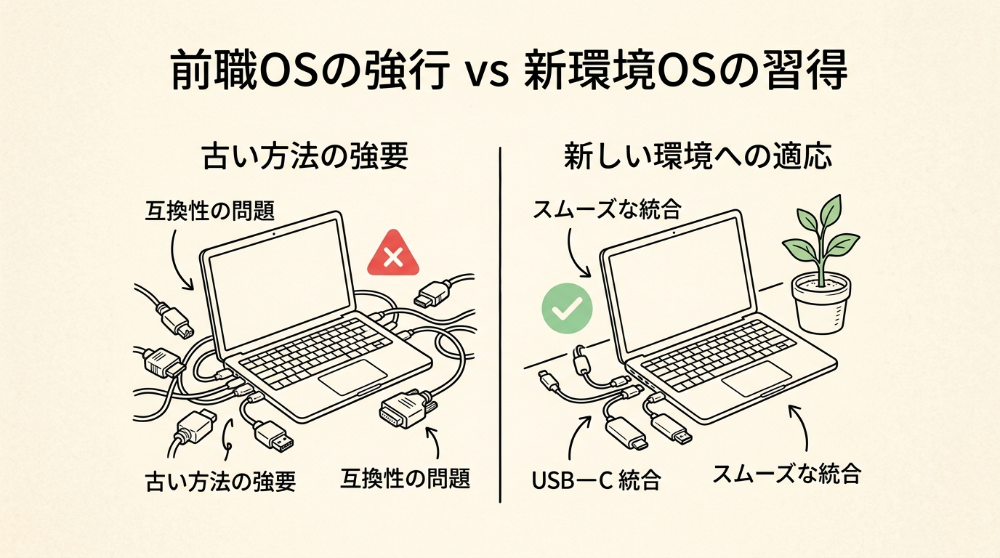
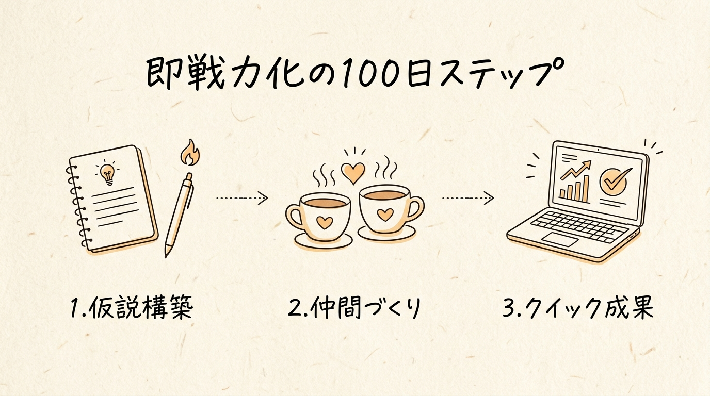

## 1. 【導入】なぜ、優秀な人ほど「転職・異動の100日」でつまずくのか？

月曜の朝9時。新しいオフィスのデスク。
真新しいノートPCを開き、一口のコーヒーを含んだ瞬間の、あの独特な空気感を覚えているでしょうか。

周囲の社員たちが聞いたこともない社内用語や略語をハイスピードで飛び交わせ、チャットツールの通知が絶え間なく鳴り響く。前職では頼れるエースや成果を出し続けるプログラマーとして一目置かれていたあなたが、ここでは実績ゼロのただの中途入社組として静かに扱われる——。そんな微かな居心地の悪さと、胸の奥を締め付けるような焦り。

一刻も早く結果を出さなければ。
自分のスキルと経験が本物であることを証明しなければ。

そう意気込む真面目な人ほど、実はある大きな罠に足をとられます。

転職や部署異動という新天地に移った直後、多くのビジネスパーソンが真っ先にハマる罠。それは、信頼貯金がゼロの状態で、前職の成功体験を大々的に振りかざしてしまうことです。

ここで、一つ極めてシビアな現実データをお見せします。
中途採用や新しい環境に移ったビジネスパーソンのうち、実に30%以上が2年以内に離職しています（徳谷智史氏 / ダイヤモンド・オンライン調査）。さらに驚くべきことに、企業側が早期離職と認識する入社9.5ヶ月以内の離職率は40.8%（エン・ジャパン 2025年実態調査、291社対象）に達しており、直近3年間で半年以内の早期離職を経験した企業は57%にものぼります。

離職が最も集中するのは、入社・着任から半年〜1年の間。
職場の歓迎ムード（ハネムーン期）が終わり、現実の摩擦と人間関係の溝が浮き彫りになるタイミングです。

なぜ、前職で輝かしい実績を残してきた優秀な人材が、新天地では早期離職の死の山を越えられずに挫折してしまうのでしょうか。

理由は極めてシンプルです。
能力が低いからでも、努力が足りないからでもありません。単に新環境のOS（文化と用語）に書き換える作業（アンラーニング）を怠り、信頼貯金がないまま正論の斧を振り回して、組織の防衛反応（変化アレルギー）に激突してしまったからです。

たとえば、Windowsで動作するように最適化された最新のソフトウェアを、Macのパソコンに事前設定なしで無理やりインストールしようとしたらどうなるでしょうか。当然、システムエラーを起こしてクラッシュします。
あるいは、アウェイのサッカー場に乗り込み、一人だけ野球のルールを持ち込んで「ホームランを狙う」と言っているようなものです。どれだけ素晴らしい打撃フォームを持っていても、その場ではイエローカードを出されて退場させられます。

自由で選択肢のある働き方や、新環境での輝かしい実績。それらは根性や気合いで力押しして手に入れるものではありません。最初の100日（First 90 Days）に、どのような手順で信頼貯金を積み上げ、摩擦を起こさずに自分の強みを発揮するかという「設計」によってのみ手に入るのです。

本稿では、8社を渡り歩いて成果を出し続けてきたトップマーケター・足立光氏の知見や、組織論の最新データをもとに、転職・異動直後の100日間で摩擦ゼロで即戦力化する再現可能なロードマップを全公開します。

---

## 2. 【解明】成果を焦る人がハマる「2つの致命的な落とし穴」

新天地に移ったばかりの人間が、よかれと思ってやってしまう行動が、実は組織からの信頼を音を立てて崩壊させています。まずは、私たちが無意識に陥りがちな2つの致命的な落とし穴を論理的に解剖しておきましょう。

### 落とし穴1——「前の職場では〜」というマウンティングの毒性

入社3週間目の企画会議。
既存の運用フローの非効率さに気づいたあなたは、親切心からこう発言してしまいます。
「前の職場では、この工程をすべて自動化ツールで処理していました。うちのやり方は古すぎるので、前職と同じ運用フローに切り替えるべきです」

この一言を発した瞬間、会議室の空気は凍りつきます。
あなたにとっては効率化のための純粋なアドバイスのつもりでも、長年そのやり方で泥臭く業務を回してきた現場の社員たちには、次のように聞こえています。
「あなたたちが今までやってきたやり方はレベルが低い。前職の優秀な私たちが教えてあげる」

これが、いわゆる前職マウンティングの毒性です。
ここで必要なキーコンセプトがアンラーニングです。

- アンラーニング（Unlearning）
  - 一言解説: 過去の成功体験や前職の知識・やり方を一度横に置き、新しい環境の文化や用語を素直に学び直すこと。
  - 日常のアナロジー（たとえ話）: スマートフォンの古いキャッシュデータを削除して、新しいバージョンのアプリをスムーズに動かせるようにする作業。

他人の家にお邪魔した瞬間に「うちの部屋の配置の方がオシャレだから今すぐ模様替えしよう」と土足で上がり込む人を、誰が歓迎するでしょうか。どれだけ前職のやり方が合理的であっても、その土地の「文脈（なぜ今のやり方になっているのかの歴史的経緯）」を尊重しない提案は、現場からの強烈なアレルギー反応と拒絶を引き起こします。

### 落とし穴2——正論と「役職（ポジションロジック）」で人を動かそうとすること

2つ目の落とし穴は、正しい論理や、上司・役職としての権限（ポジション）で相手を力任せに押さえ込もうとすることです。

- ポジションロジック（Position Logic）
  - 一言解説: 役職や権限、正論の力だけで相手を論破し、指示に従わせようとするマネジメント手法。
  - 日常のアナロジー（たとえ話）: 警察官が街頭で大声で注意したとき、通行人が自分の行いを反省するのではなく、単に怒られないようにその場から隠れるようになる現象。

マネジメント層やプロジェクトリーダーとして着任した人が部下を詰めることで動かそうとすると、部下やチームメンバーは正しい成果を出すことではなく「上司から怒られないように言い訳を作ること」を最優先にするようになります。
結果として組織から思考力が奪われ、提案や報連相が途絶え、最終的にチーム全体が崩壊します。

人は正論では動きません。「この人は自分の苦労を理解してくれている」「この人は味方だ」という感情的な安心感と信頼があって初めて、ロジックを受け入れる余地が生まれるのです。

---

## 3. 【設計図】摩擦ゼロで即戦力化する「100日ロードマップ」の3ステップ

では、新天地に着任した人間は、最初の100日間をどのようなステップで過ごすべきなのでしょうか。グローバル標準のチェンジマネジメント手法「First 90 Days」と足立光氏の実践論をベースにした、3段階の具体的な設計図を示します。

### ステップ1——【事前〜30日】着任前の「外からの仮説メモ」と現場観察

新天地での勝負は、着任初日の前から始まっています。
多くの人は入社してから何をすべきか教えてもらう勉強期間を決め込もうとしますが、プロフェッショナルは着任前に自力で一次情報を集め、仮説を構築しておきます。

- クイック仮説
  - 一言解説: 完璧な内部データがなくても、一顧客や外部の目線から「この組織の強み・弱み・解決すべき課題」のあたりをつける仮の筋書き。
  - 日常のアナロジー（たとえ話）: 初めて行く旅先の名物店に入る前に、外から行列の様子や看板を観察し、「この店の名物は訪れる人の多さで、接客に課題がありそうだ」と予習しておく観光客の視点。

たとえば足立光氏は、ファミリーマートのCMO（最高マーケティング責任者）に着任する直前、自ら店舗を6日間連続で視察し、「行く理由がない店になっている」「競合の後追いで企画が不十分」という明確な仮説メモを作成してから初日を迎えました。

着任後の最初の30日間（Day 1〜30）でやるべきことは以下の3点に集約されます。

- 100日ロードマップ：第1フェーズの行動設計
  - 観察と記録の留保: 現場のやり方に違和感があっても、その場では批判せずノートに記録するにとどめる。
  - 自己開示シートの配布: 自分の経歴、得意分野、弱み、支援してほしい内容をA4一枚にまとめ、チームに共有して安心感を与える。
  - 用語と文脈の完全インプット: 会社固有の略語や過去の失敗歴史を、辞書を引くように愚直に学習する。

### ステップ2——【30日〜60日】味方を増やす「泥臭い社内政治」と信頼貯金

30日を過ぎたら、本格的にチームメンバーやキーパーソンとの人間関係を構築します。
「社内政治」というと、派閥争いや立ち回りといったネガティブなイメージを持つ人が多いかもしれません。しかし、本質的な社内政治とは「自分の正しい提案を通すために、あらかじめ味方と信頼の基盤を作っておく誠実なコミュニケーション」のことです。

- 信頼貯金
  - 一言解説: 相手の話を聴き、成果や感謝を周囲に分配することで蓄積される人間関係の信用資産。
  - 日常のアナロジー（たとえ話）: 銀行口座に預金がまったくないのに「ローンを組ませてくれ」と頼んでも審査に落ちるように、まず相手に言葉とリスペクトの預金を増やすこと。

このフェーズでは、キーパーソンとの1on1を重ね、「何か困っていることはありませんか？」「私が前職で培ったスキルで、あなたの業務を少し手伝わせてくだい」と、相手へのギブ（貢献）から始めます。自分が成果を出す前に、周囲の成果を助ける。この積み重ねが、次のステップで爆発的な推進力を生み出します。

### ステップ3——【60日〜100日】自分の権限内で行う「小さなクイックウィン」

60日を過ぎ、周囲との信頼関係と組織の文脈が頭に入ったら、いよいよ最初の成果を創出します。
ここで絶対にやってはならないのが、会社全体を揺るがすような大改革をいきなりブチ上げることです。

目指すべきは、Quick Win（クイックウィン）の創出です。

- Quick Win（クイックウィン）
  - 一言解説: 短期間（数週間〜1ヶ月）・低予算・自分の権限内で確実に達成できる、小さく目に見える成功体験。
  - 日常のアナロジー（たとえ話）: 家全体の大掃除をするのではなく、まず誰もが気になっていた「デスクの引き出し1つ」だけを完璧に整理整頓して見せること。

たとえば、「部署内の煩雑なデータ集計作業をVBAやAIツールで自動化し、チーム全体の作業時間を週5時間削減する」「散らかったマニュアルを整理して検索しやすくする」といった、誰も反対できない小さな成果です。
「この人は口だけではなく、本当に現場を助けて成果を出してくれる」という実績が1つでも生まれると、周囲の視線は警戒から期待へと一変します。

---

## 4. 【実践ハック】企画を100%通す「前と同じです」話法とステルス実験

信頼貯金をつくり、クイックウィンを出したとしても、次に新しい大きな企画を通そうとするときには、必ず組織の変化アレルギーが立ちはだかります。
人間の脳は本能的に「未知のもの」「新しい変化」を危険とみなし、抵抗するようにできているからです。

ここで、足立光氏が実践する究極の社内政治ハックを紹介します。
それが、「前と同じです（実は2割新しい）」話法です。

会議でプレゼンをする際、絶対に言ってはならない言葉があります。
それは、「これ、まったく新しい画期的な提案なんです！」と自慢気にアピールすることです。こう宣言した瞬間、承認権限を持つ上層部や他部署の脳内には、失敗したときのリスクや過去のやり方の否定に対する警戒アラートが鳴り響きます。

正解のトークスクリプトは、真逆です。

「今回の企画ですが、基本的には『従来の運用フローとまったく同じ枠組み』です。過去の成功パターンのマイナーチェンジ版として構成しています。ただし、1点だけ、私の承認権限内でテストとして『2割だけ新しい要素（自動化ステップ）』を組み込んで試してみたいと考えています」

このように説明すると、聞き手は「なんだ、いつもと同じか」と安心し、防衛ラインを下げます。

- 社内政治ハックのアナロジー（たとえ話）
  - ステルス戦闘機のアナロジー: 相手の防衛レーダーに捕捉されない低い高度（自分の決定権限内）で飛行し、密かにテスト実験を行い、成果の数値が出てから着陸報告をする手法。
  - 隠し味のスパイスのアナロジー: カレーのレシピを全部変えて「新メニュー」として出すのではなく、いつものカレーに隠し味のスパイスを1滴だけ入れて「いつものカレーですよ」と食べてもらうアプローチ。

自分の裁量権限（予算〇万円以内、チーム内でのテスト運用など）の範囲でこっそり実行し、数値成果が出た後に「実はテストしたら結果がこう出ました」と報告する。これが、摩擦をゼロにし、着実に関与範囲を広げていく本物のプロフェッショナルの立ち回りです。

---

## 5. 【結び】自由と成果は、根性ではなく「設計」で手に入れる

かつての私も、同じように悩んでいた一人でした。
25年間、地方の製造業で生産管理や泥臭い事務効率化に従事し、現場の理不尽や頑なな組織文化と戦い続けてきました。

若かった頃の私は、「正しいことを言えば人は動く」と信じ込み、正論の刃で周囲と衝突しては傷ついていました。しかし、独立してマイクロ法人を経営し、マレーシアをはじめとする海外と日本を行き来するようになって気づいたのです。

自由な時間、選択肢のある暮らし、そして新しい環境で信頼される実績。
それらは決して「根性」や「我慢」、あるいは「激しい衝突」の先にあるのではありません。
人間の感情と組織のメカニズムを深く理解し、冷静に構築された「100日の設計図」の先にあるのです。

あなたが明日、新しいオフィスやプロジェクトチームの扉を開けるとき。
前職の肩書きやプライドという重い鎧を静かに脱ぎ捨ててみてください。

そして、相手の言葉に耳を傾け、小さく自己開示をし、「前と同じです」と静かに微笑みながら、自分の手元で小さなテストを始めてみてください。

その静かな設計の積み重ねが、気づいたときには誰にも真似できない強固な信頼となり、あなたに真の自由と素晴らしい実績をもたらしてくれるはずです。

---

### 【まとめ】明日から始める「初動100日」のアクションリスト

- 1. 着任前に「外部視点」の仮説メモを3つ作成する
  - 一顧客・外部の目線から、組織の課題と仮の解決策を予習しておく。
- 2. A4・1枚の「自己開示シート」を作成して共有する
  - 経歴、強み、弱み、手伝ってほしいことを開示して相手の防衛線を解く。
- 3. 「前の職場では〜」を意識的に封印し、組織の用語を丸暗記する
  - アンラーニングを徹底し、新環境の文化とローカルルールに敬意を示す。
- 4. 自分の権限内でできる「1ヶ月以内のQuick Win」を1つ決める
  - 誰も反対できない小さな業務改善（データ整理・マニュアル化）で信頼を可視化する。
- 5. 新しい提案は「前と同じです」というフレームでプレゼンする
  - 8割の安心感と2割の新規テスト要素を組み合わせ、摩擦ゼロで企画を通す。

<!-- 参照ファイル一覧
- 03_detailed_agenda.md
- 04_blog_post.md
- 05_thumbnail_prompts.md
- 06_section_prompts.md
- ./thumbnail.png
- ./img1.png
- ./img2.png
-->
