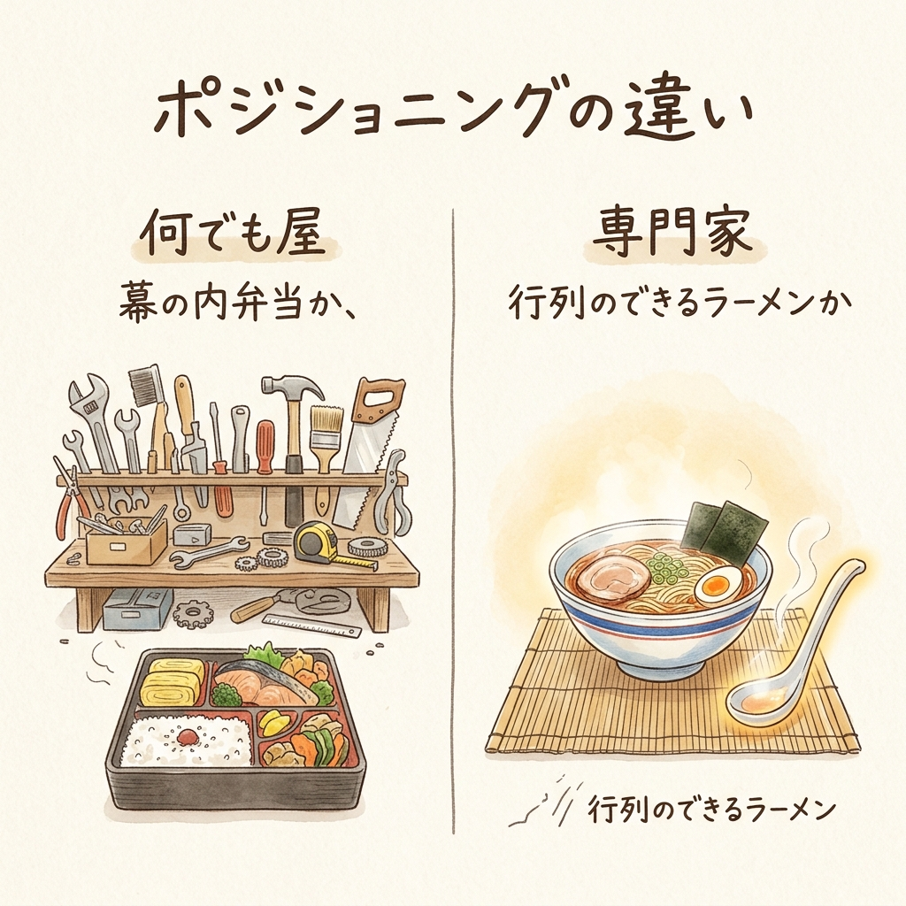
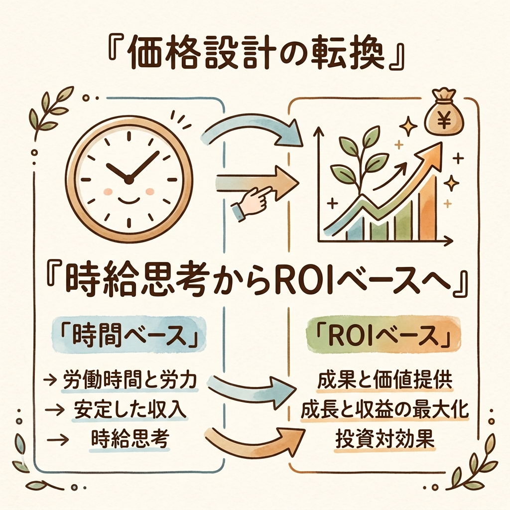
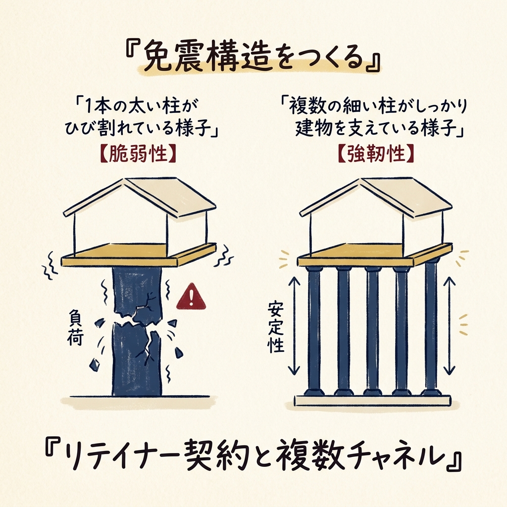

月曜の朝。満員電車の窓に映る自分の顔を見て、ふと思うことはありませんか。
「これだけいくつものプロジェクトを回して、残業もして、成果も出しているのに、なぜ来月の給料は同じなのだろうか」と。

会社という組織の中で、あなたは間違いなくエース級の働きをしているはずです。リスティング広告の運用から、LPの改善提案、時にはクライアントとの折衝まで、「マーケティングの何でも屋」として頼りにされている。
でも、その努力がダイレクトに自分の銀行口座へ反映されることはない。
だから、「独立」の二文字が頭をよぎるのは、ごく自然なことです。

ただ、ふとスマホでクラウドソーシングサイトを開いたとき、静かな絶望を感じたことはないでしょうか。
そこに並んでいるのは、「何でもやります」「SEOもSNSも広告も任せてください」とアピールする無数のフリーランスたち。そして、彼らが奪い合っているのは、驚くほど低単価な案件ばかりです。

「会社を辞めて独立しても、結局はこの安売り合戦に参加して疲弊するだけなのではないか」
その不安は、論理的に考えて正しい。

今回は、「スキルを増やせば稼げる」という幻想を捨て、労働時間と収入を切り離すための「設計図」についてお話しします。
自由は、根性ではなく「設計」で手に入れるものです。

## 「幕の内弁当」は、なぜ高いお金を払ってまで食べられないのか

会社の看板が外れた日のリアルを想像してみてください。
あなたは「広告も、SNSも、SEOもできます」と名乗る。それはまるで、コンビニの「幕の内弁当」です。
便利で、そこそこ美味しい。でも、わざわざ遠くから足を運び、1杯1,500円を払って並んでまで食べたいかと言われれば、そうではないはずです。

人は、「行列のできるこだわりのラーメン専門店」にこそ、高いお金を払います。

これこそが、「ポジショニング」の力です。
ポジショニングとは、専門用語で言えば「自分の立ち位置・得意分野を明確にすること」です。
スーパーの棚を想像してください。誰もが手にする「普通の醤油」として並べば、隣にある10円安い醤油に負けます。しかし、「刺身専用の最高級醤油」として棚に置かれれば、価格競争から抜け出すことができる。

「何でもできます」というアピールは、フリーランスの世界では「私にはこれといった強みがありません」と叫んでいるのと同じなのです。

## 時給思考から「ROI」ベースへの転換

自分のタグ（専門性）を決めたら、次に捨てるべきは「時給思考」です。

「1時間あたり5,000円で働きます」という思考は、収入の上限を「24時間」という物理的限界に縛り付けます。
ここで必要なのが、「ROI（投資対効果）」という概念への転換です。

ROIとは、「かけた費用に対してどれだけ儲かったか」を示す指標です。
たとえば、あなたが1万円の広告費を使って、クライアントに5万円の売上をもたらしたとする。プラス分は4万円です。
クライアントは、あなたが画面に向かってカタカタと作業した「時間」にお金を払うのではありません。この「4万円のプラス」を生み出してくれたという「結果（価値）」にお金を払うのです。

コンビニのアルバイトは「時間」を提供して時給をもらいます。
しかし、腕利きの外科医は「手術にかかった時間」ではなく、「命を救うという圧倒的な価値」に対して高い報酬を受け取る。
あなたが目指すべきは、間違いなく後者の設計です。

## 安定を生み出す「免震構造」をつくる

単価を上げる設計ができたら、最後は「安定の設計」です。
フリーランスの恐怖は、「来月の収入がゼロになるかもしれない」という不安にあります。

特定の1社に依存している状態は、1本の太い柱で建物を支えているようなものです。その柱が折れた瞬間、建物は崩壊する。
そうではなく、複数の細い柱で建物を支える「免震構造」をつくる必要があります。
それが、「リテイナー契約」と「複数チャネルの構築」です。

リテイナー契約とは、月額固定で継続的にサポートする顧問契約のことです。
スポーツジムの月額会費のように、「いつでも専門家に相談できる」という安心感に価値を置きます。この契約を複数社と結ぶことで、毎月の固定収入（ベースライン）が安定します。

・紹介による案件（信頼ベース）
・SNSやブログ経由の案件（権威性ベース）
・既存クライアントからの継続案件（実績ベース）

これらを組み合わせることで、初めて心と時間の「余白」が生まれます。

## 今日から始める、自分の「タグ」探し

「今の働き方、5年後も同じだとしたら——それでいいですか？」

海全体に網を投げて、すべての魚を捕ろうとするのはやめましょう。
まずは自分だけの「小さな釣り堀」を見つけ、そこで1位になること。

「BtoBのSaaS業界に特化した、コンテンツマーケティングの専門家」
「Instagramを活用した、若年層向けアパレルブランドの再生請負人」

あなたの今のスキルは、「何でもできます」ですか？
それとも、「これしかできませんが、誰にも負けません」ですか？

スキルを増やすほど市場価値が上がるという常識は、捨ててしまって構いません。
捨てる勇気を持ち、特定の領域に絞り込むこと。それこそが、単価を上げ、時間的自由を手に入れるための唯一の設計図なのです。

<!-- 参照ファイル一覧
- 03_detailed_agenda.md
- 04_blog_post.md
- 05_thumbnail_prompts.md
- 06_section_prompts.md
- ./thumbnail.png
- ./img1.png
- ./img2.png
- ./img3.png
-->
