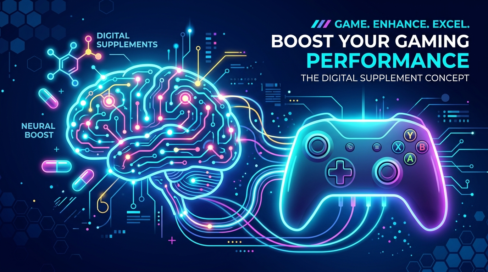
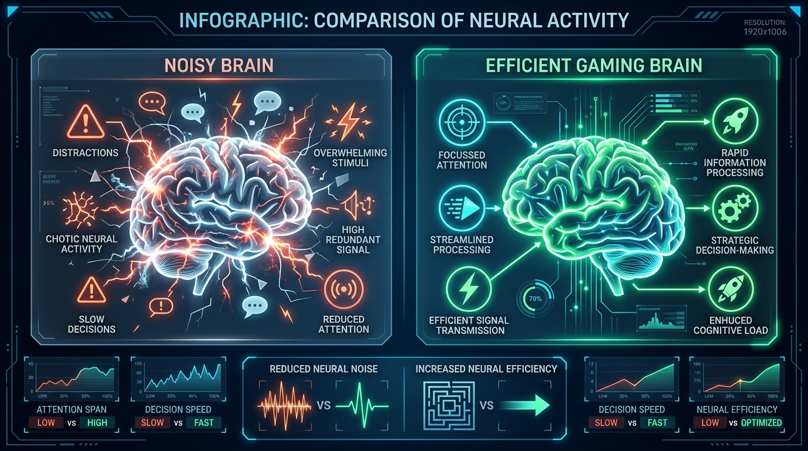
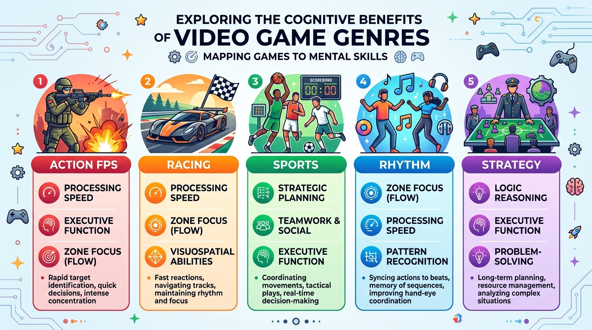
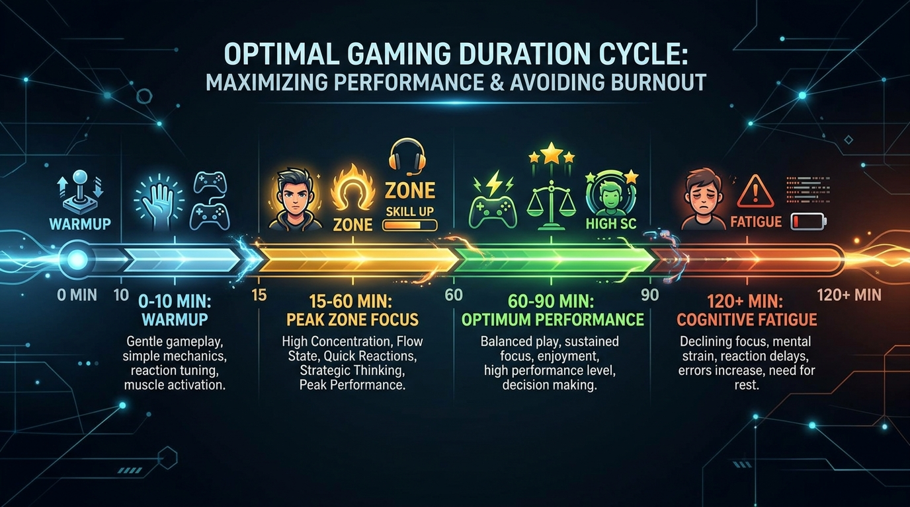

## 深夜の罪悪感に別れを告げよう

仕事が終わって疲れ果てた夜。自宅のデスクでPCやスマホを立ち上げ、コントローラーを握りしめる。
「ふう、今日もお疲れさま……」

画面の中で目まぐるしく展開する世界に没頭しながらも、ふと胸の奥がキュッと痛む瞬間がある。

「本当は資格の勉強や読書に時間を使うべきなんじゃないか？」
「明日も早いのに、また30分も時間を無駄にしてしまった……」

ゲームを終えた後に襲ってくる、あの嫌な罪悪感。時間を捨てているんじゃないかという自己嫌悪。特に30代や40代でバリバリ働く人や、子供を育てる親にとって、「ゲーム＝大人の時間泥棒」という見えないプレッシャーは想像以上に根深い。

でもちょっと待ってほしい。
もしその罪悪感こそが完全な思い込みで、**むしろゲームを生活から排除することこそが、あなたの仕事のキレや集中力を奪っていた**としたら？

スタンフォード大学オンラインハイスクールの星友啓校長や、1万4千人を超える被験者を対象にした最先端の脳科学研究（133件のメタ分析）が突きつけた事実は、僕たちの常識を根底からひっくり返すものだった。

「ゲームは気休めの娯楽じゃない。現代人の脳を整え、仕事の処理スピードを引き上げる『デジタル・サプリメント』だ」

なぜゲームをすると脳のパフォーマンスが跳ね上がるのか。その仕組みと、仕事の成果に直結するプロのゲーム活用術を本音で語っていこう。今夜から余計な罪悪感はゴミ箱に放り投げて、コントローラーを最強の生産性武器に変えてしまえばいい。

---

## 1. なぜ僕たちは「ゲーム＝罪悪感」と自分を責めてしまうのか？

### 昔ながらの「ゲーム禁止令」が残した心の傷

僕たちがゲームをするたびに感じる罪悪感の正体。それは幼い頃に叩き込まれた「ゲームばかりしていると頭が悪くなる」「ゲームは現実に立ち向かえない奴の逃げ場だ」という昔の価値観だ。

けれど、スタンフォードで教鞭を執る星友啓校長の話を聞くと、日本とアメリカではゲームに対する視線がまるで違うことに気づかされる。日本では何かと肩身の狭いゲームだが、アメリカの教育や脳科学の最前線では「人間の秘めた能力を引き出すトレーニング環境」として極めて高い評価を得ている。

人間が本来持っている内発的動機付け——つまり「誰かに命令されたわけじゃないのに、心の底からやりたくてたまらない！」という内なる情熱を育てる上で、ゲーム以上に完成されたシステムは存在しない。

内発的動機付けとは、要するに親や上司に「勉強しろ」「仕事しろ」と怒られて重い腰を上げるのではなく、大好きな漫画の最新刊を夢中でむさぼり読むようなワクワク感のことだ。

ハードな仕事を終えた後の脳は、何十キロも走り抜いた直後のエンジンのようなもの。そこに無理やり「勉強しろ」「自己啓発本を読め」と外部からのプレッシャーをかけたら、脳の回路が焼き切れてしまうのは当たり前だ。

ハードなトレーニングの後に飲むプロテインが傷ついた筋肉をリペアするように、適度なゲーム体験は疲れ切った脳に「達成感」という極上の栄養を補給してくれる。脳を回復させ、明日のモチベーションを再び燃え上がらせるための大切なピットインなのだ。

### 科学が立証した「脳のデジタル・サプリメント」という真実

1,000人以上を追跡したグローバルな研究（PLoS One掲載）でも興味深いデータが出ている。日常的な運動がメンタルの安定に効くのに対して、ゲームのプレイ時間は「短期記憶」「言語能力」「推論力」といった、まさに仕事の現場で使われる脳の処理能力にダイレクトに効いているのだ。

脳科学の言葉で言えば、ゲームは脳をサボらせるどころか、現実世界の激しい情報処理を生き抜くための「実践的な脳トレ空間」にほかならない。

ここで一番知っておいてほしいのが「神経効率（Neural efficiency）」という考え方だ。

神経効率とは、脳が無駄なエネルギーを一切使わず、省エネで素早く正確に答えを叩き出す状態のこと。スマホで裏で立ち上がりっぱなしの無駄なアプリ（頭の中の雑念やノイズ）をすっきり終了させて、メインの動作を爆速にする感覚に近い。

日常的に正しくゲームを楽しんでいる人の脳波（安静時アルファ波）を調べると、脳内の無駄な通信ノイズが綺麗にミュートされていることが分かっている。無駄な雑音が存在しないからこそ、脳は最小限のパワーで、静かに、そして圧倒的なスピードで複雑な課題を片付けられるようになるのだ。

---

## 2. 脳のパフォーマンスが跳ね上がる3つの科学的理由

### 理由①：133の研究（1.4万人）が裏付ける「記憶力・判断力」の強化

「ゲームで頭が良くなるなんて、一部のゲーム好きな学者が言ってるだけでしょ？」

そんな疑い深い人に見てほしいのが、上海師範大学の研究チームがまとめた133件・計1万4,245人を対象にした大規模なメタ分析データだ。結論から言えば、市販されている普通のビデオゲームを遊ぶだけで、人間の記憶力や注意力といった高度な認知機能に明らかなプラス効果が出ることが証明されている。

とりわけ伸び幅が大きかったのが「ワーキングメモリ（作業記憶）」だ。

ワーキングメモリとは、必要な情報を頭の中に一時的にキープしながら、同時に別の判断をこなす「脳の作業デスク」のような領域のこと。料理で言えば、手元で手際よく野菜を刻みつつ、鍋の火加減を気にし、頭の中でタイマーの残り時間を計算するような、手際のいいシェフの広いまな板だ。

この「脳のまな板」が狭いと、複数の案件が同時に舞い込んだときにすぐパニックを起こし、メールの見落としやミスを連発することになる。ゲームを遊ぶことは、この脳のまな板を物理的にぐんと広げ、ビジネスの現場でのマルチタスク処理能力を底上げしてくれるのだ。

### 理由②：ゲームのジャンルで変わる「仕事スキルの鍛え方」

ゲームなら何でもいいわけじゃない。遊ぶジャンルによって、脳のどの部分が鍛えられるかははっきり分かれている。自分が今仕事で求めているスキルに合わせて、ゲームを「選ぶ」のが賢い大人のやり方だ。

- **FPS・アクションゲーム**: 画面全体の変化を瞬時に見抜く広域な視野（分散型空間注意）と、反応スピードが劇的に向上する。突発的なトラブルや大量のデータに襲われたとき、一瞬で本質を見抜いて即決できるようになる。
- **カーレースゲーム**: 複数の課題を同時にこなすマルチタスク能力が研ぎ澄まされる。締め切り間際に複数の案件をスピード感を落とさずに処理したい人向けだ。
- **サッカー・スポーツゲーム**: 相手や味方の動きを数秒先まで読む予測力と全体俯瞰力が身につく。市場のトレンドや競合の動きを読み、チームを動かす戦略思考が養われる。
- **リズムゲーム（音ゲー）**: 集中力を持続させ、リラックスしたまま極限の集中（ZONE）に入る感覚が身につく。単調で膨大なデータ入力やチェック作業を一気に終わらせたい時に効く。
- **戦略シミュレーション・カードゲーム**: 論理的な推論力と長期的な計画性が鍛えられる。リスクを抑えながらプロジェクトの全体工程を組むビジネス現場に直結する。

実行機能（Executive Function）と呼ばれる、目標に向けて計画を立て、誘惑を退け、状況の変化に柔軟に対応する脳の司令塔機能。これはまさに、大混雑する交差点で事故を起こさないよう瞬時に交通整理を行う「ベテランの交通指導員」のような働きだ。ゲームはこの交通指導員の腕前を、楽しみながらどんどん上げてくれる。

### 理由③：コントローラーを置いた後も効果が続く「オフライン可塑性」

ゲームの効果がその場限りの気晴らしで終わらない最大の理由。それが「オフライン可塑性（Offline Plasticity）」の存在だ。

オフライン可塑性とは、ゲームのプレイを終えた後や、夜寝ている間にも脳の神経回路がじわじわと書き換わり、学習した能力が定着していく現象のこと。ジムで限界まで追い込んだ後、家でゆっくり休んでいる間に筋肉が太く強く育っていく「超回復」と全く同じ仕組みだ。

アクションゲームで求められる素早い判断や感覚のコントロールは、脳の深い部分にある「手続き記憶」にしっかりと刻まれる。実験によると、アクションゲームのプレイを完全にやめてから10週間が経過した後の追跡テストでも、向上した認知能力や脳の基礎回路の変化が維持されていた。

つまり、ゲームによって鍛え上げられた脳の処理スピードは、コントローラーを置いた後もあなたの仕事を支え続ける「一生ものの資産」になるということだ。

---

## 3. 仕事のキレを最高にする「プロのゲーム習慣ルール」

サプリメントと同じで、いくら脳に良いからといって無制限に遊べば毒になる。ゲームを最強の生産性ツールに変えるための、科学的なルールを押さえておこう。

### ルール①：1回のプレイは「60〜90分」を厳守（2時間の壁）

ゲームで脳を覚醒させる黄金時間は、1回あたり60分から90分だ。

脳がゲームを始めてから集中状態に入るまでの変化は実にわかりやすい。

- **0〜10分**: 準備運動タイム。脳が日常モードからゲームの空間認識モードへ切り替わる。
- **15分前後**: **ZONE（超集中状態）**の始まり。余計な雑念が消え、頭の回転が加速する。
- **30〜60分**: 集中力とパフォーマンスが最高潮に達する黄金ゾーン。
- **60〜90分**: 高いパフォーマンスを維持。脳の適度な運動としてベストな状態。
- **120分（2時間）オーバー**: 脳の覚醒状態が行き過ぎ、集中力が急降下。脳疲労と目の疲れが溜まり、逆効果になる。

2時間以上のダラダラプレイは、翌日の仕事に疲れを残すだけだ。「90分でアラームをセットしてサクッと遊ぶ」。これができる人が、ゲームを生産性武器に変えられる。

### ルール②：「ソロ」と「マルチ」を目的で使い分ける

誰と遊ぶかによっても、脳への効き目は変わってくる。

- **ソロプレイ（1人）**: 没頭度と集中力がグンと高まる。仕事や勉強の前に「頭のギアを集中モードに入れたい時」や、深い思考力を鍛えたい時におすすめ。
- **マルチプレイ（仲間と）**: 集中度は落ち着くが、ストレス解消や感情の発散、リフレッシュ効果が絶大。重い案件が終わった後の「脳の冷却・メンタル回復」に最適だ。

### ルール③：数ヶ月単位で細く長く続ける

京都大学などの研究でも、3Dアクションゲームの中での直感的な動きが、現実社会での複雑な思考力や持続的な注意機能と深く結びついていることが確かめられている。

脳の基礎回路を構造から書き換え、仕事に役立つ認知スキルとして完全に定着させるには、単発で終わらせず、週に数回のペースで30週間（約7ヶ月）ほど気長に継続するのがベストだ。

---

## 4. まとめ：今夜から堂々とコントローラーを握ろう

夜、ゲーム画面を前にして感じていたあの罪悪感。
もしその罪悪感でストレスを溜め込み、自分から脳のパフォーマンスを落としていたとしたら、こんなに勿体ない話はない。

スタンフォードの星校長が言うように、ゲームは現代人が失いかけている「内発的動機付け」を取り戻し、脳の処理速度を跳ね上げる最高のデジタル・サプリメントだ。

- **1日60〜90分のプレイ時間を守る**
- **鍛えたい能力に合わせてゲームを選ぶ**
- **ソロとマルチを気分や目的で使い分ける**

この3つのルールさえ守れば、ゲームはあなたの時間を奪う悪魔から、仕事の成果を何倍にも引き上げる「最強の相棒」に変わる。

今夜、コントローラーを握る時はもう自分を責める必要なんてない。
「今、自分は脳のパフォーマンスを高める極上のサプリメントを摂っているんだ」と胸を張って、最高の没頭感を味わってほしい。その楽しんだ時間が、明日のあなたの仕事に圧倒的なキレをもたらしてくれるはずだ。

<!-- 参照ファイル一覧
- 03_detailed_agenda.md
- 04_blog_post.md
- 05_thumbnail_prompts.md
- 06_section_prompts.md
- ./thumbnail.png
- ./img1.png
- ./img2.png
- ./img3.png
-->
