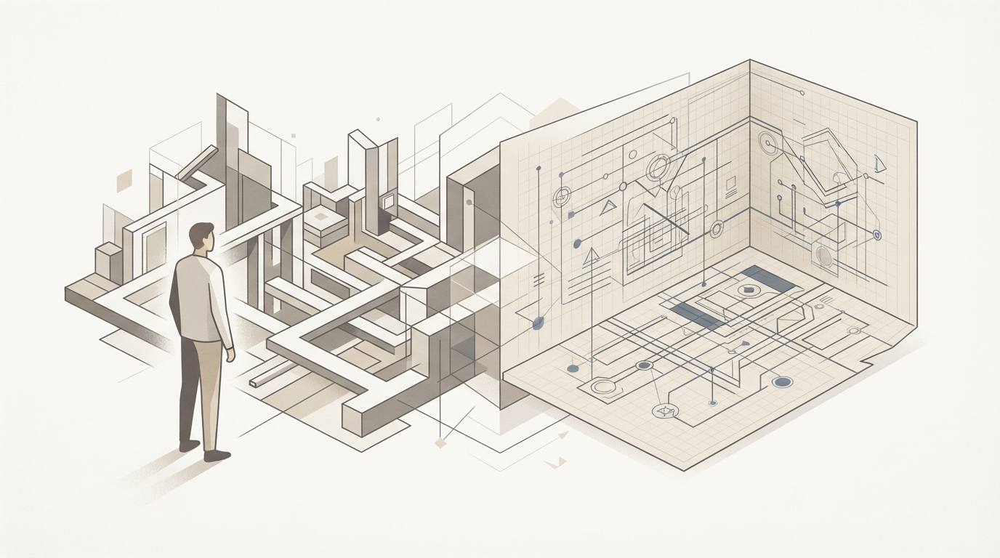
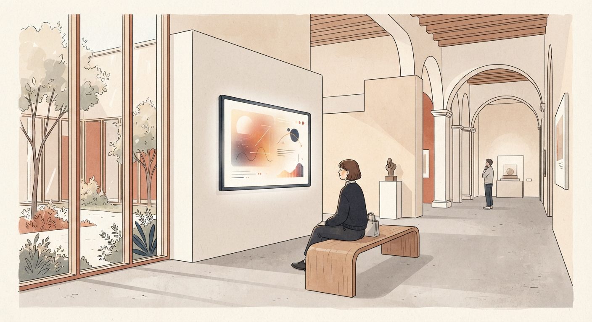
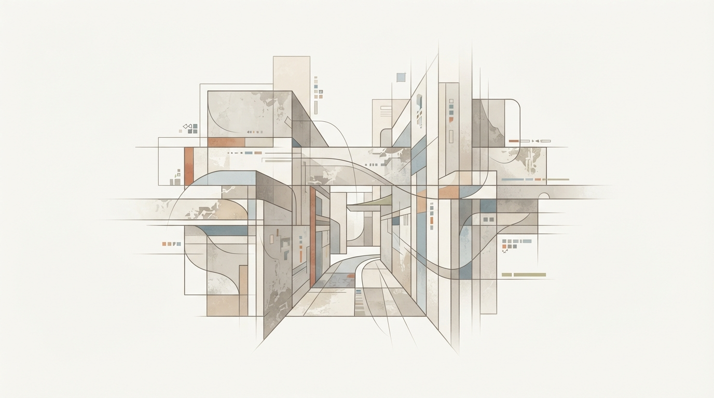
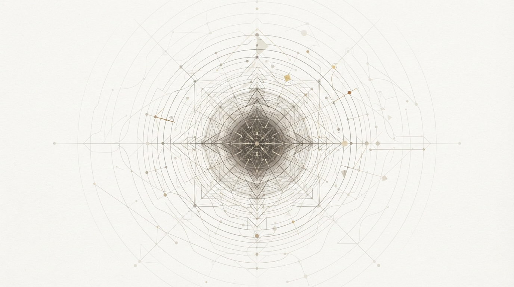
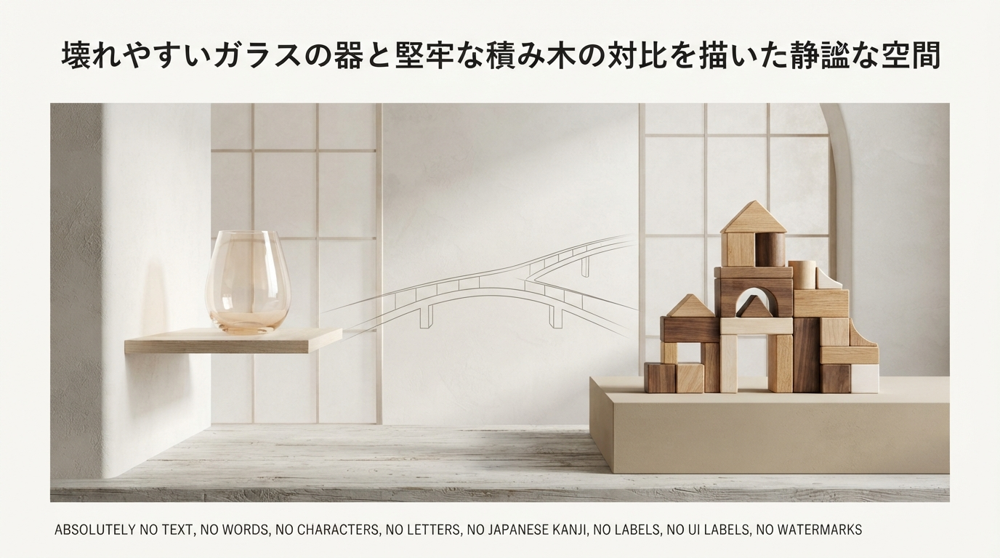
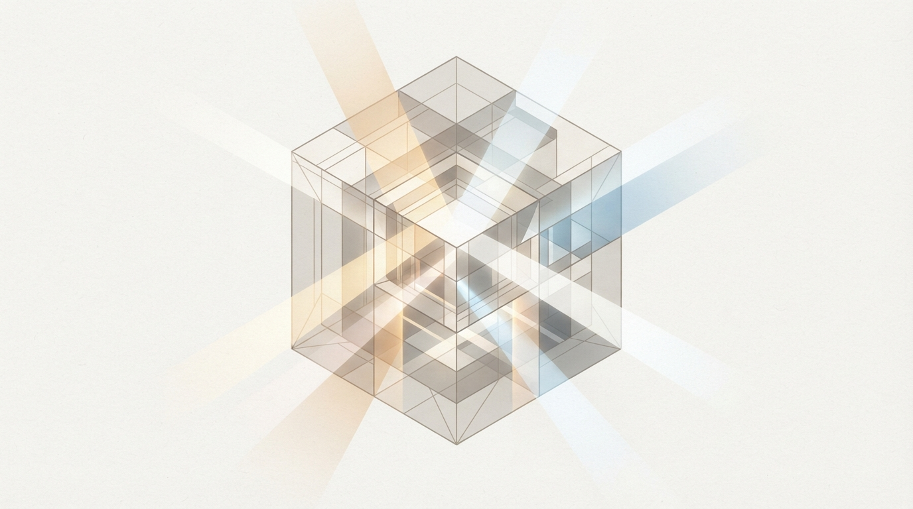

月曜日の朝、オフィスに向かう電車の中で、スマートフォンをスクロールしているとします。

タイムラインには、似たような「初心者向けまとめ」や、要約されたニュースが次から次へと流れては消えていきます。時間をかけて作られたはずのオウンドメディアの記事や、企業の公式YouTube動画が、ほとんど誰の目にも留まらずに流されていく光景は、もはや日常の一部になりました。

真面目にリサーチし、分かりやすさを追求して噛み砕いているのに、なぜか届かない。数字を追って更新頻度を上げても、残るのは制作側の消耗だけ——。

もし、あなたが情報発信やコンテンツの企画、あるいは組織のブランディングに携わっていて、そんな閉塞感を感じているとしたら、立ち止まって考えるべきポイントがあります。

私たちは、「情報を分かりやすく伝えること」ばかりに気を取られ、受け手が本当に心を動かされる「眼差しの共有」を忘れてしまっていないでしょうか。

その問いに対して、きわめて静かで、かつ鮮やかな答えを示してくれた事例があります。それが、多様な分野の専門家とともにゲームの仮想世界をただ歩く動画シリーズ、「ゲームさんぽ」です。

かつて製造現場で生産ラインの標準化や設計に25年間携わってきた私の目から見ても、この試みには、単なる「ゲーム実況の変種」では片付けられない、きわめて合理的で深い構造設計が組み込まれています。

今回は、この「ゲームさんぽ」という現象を紐解きながら、これからの時代に個人や企業が持続可能な価値を届けるための「コンテンツ設計論」について、数字とロジックを交えて考えてみたいと思います。

---

## 1. 3歳児の視線から始まった「対話型鑑賞」の移植

「ゲームさんぽ」の原点は、意外なほど素朴な日常のワンシーンにありました。

発案者であり、美術館の学芸員としても活動していた「なむ」氏が2016年に目撃したのは、当時3歳だった自身のお子さんが、戦争アクションゲーム『Call of Duty』の画面を見ていたときの様子でした。

銃撃戦が繰り広げられる激しいゲームの中で、3歳の子どもが目を奪われていたのは、銃でも敵でもなく、背景の片隅に置かれていた「小さな冷蔵庫」や公園の「滑り台」だったのです。

大人が「敵を倒してゴールへ進むゲーム」として見ている世界が、3歳児の目には「生活の道具が並ぶ不思議な街」として映っていた。

「同じ画面を見ていても、視点が違えばまったく別の世界が立ち現れる」

この気づきから、なむ氏は2017年に個人チャンネルで動画投稿を開始しました。しかし、立ち上げ当初の約2年間は、十数本の動画を投稿しても再生回数は50回程度、登録者数も数十人という、静かな船出でした。

転機が訪れたのは2019年5月です。美術科教科書の編集者だった「いいだ」氏が企画に着目し、ライブドアニュースとの協業として、気象予報士の石原良純氏を迎えた『ゼルダの伝説 ブレス オブ ザ ワイルド』の観察動画を公開しました。

ゲーム内の空を見上げ、雲の流れや天候変化の仕組みを気象学の知見から読み解くこの動画は、公開直後に3本とも100万回再生を突破し、チャンネル登録者数は一気に約5万人増加しました。その後、シリーズ累計の総再生回数は6,000万回を超え、2021年のクラウドファンディングでは1,440名の支援者から1,306万円以上の資金を集め、白夜書房から336ページに及ぶ書籍として出版されるに至ります。

なぜ、ゲームを攻略しない「ただ歩いて眺めるだけ」の動画が、これほど多くの人々を引きつけたのでしょうか。

その本質は、美術館の教育手法である「対話型鑑賞」をデジタル空間へ移植した点にあります。

対話型鑑賞とは、作品の年代や作者といった客観的な知識を一方的に教え込むのではなく、鑑賞者同士が「どこに何が見えるか」「なぜそう感じるのか」を言葉にし合い、見方を深めていく鑑賞法です。立命館大学の井上明人講師は、専門家とプレイヤーが同一画面を見つめるこの手法を「共視（きょうし）」と呼びました。

攻略という一本道の「消費」をやめ、専門家の目を借りて世界を再解釈する。この視点の転換こそが、すべての始まりでした。

---

## 2. 専門家の眼差しが掘り起こす「沈黙の環境ストーリーテリング」

優れたゲームの仮想空間には、開発陣が膨大な時間と熱量を注ぎ込んだ「無言の設計」が埋め込まれています。

ゲームデザインの学術研究において、これは「環境ストーリーテリング（Environmental Storytelling）」と呼ばれます。ゲーム研究者のマーク・ブラウンが提唱したピラミッドモデルでは、空間設計は以下の3つの階層で成り立っているとされます。

- **第1層：世界観構築（World Building）**：その世界が従う物理法則や歴史、基本的なルールの土台。住宅で言えば地盤調査や基礎工事にあたります。
- **第2層：レベルデザイン（Level Design）**：プレイヤーが実際に移動し、課題をクリアするための動線設計。間取りや廊下、階段の配置です。
- **第3層：環境ストーリーテリング（Environmental Storytelling）**：テーブルの上に置かれた飲みかけのコーヒーカップ、柱に刻まれた子どもの身長の傷、鍵のかかった引き出し。言葉による説明なしに、住人の暮らしや出来事の痕跡を伝える細部です。

多くのプレイヤーは、ゲームを急いでクリアしようとするあまり、この第3層を無意識のうちに通り過ぎてしまいます。

しかし、そこに「専門家」という特異なフィルターを通すと、見慣れた景色が一変します。

例えば、古代ギリシャ研究家の藤村シシン氏が『アサシン クリード オデッセイ』でパルテノン神殿を訪れた際、発した一言は象徴的でした。一般に有名な参道側を指して「それ裏なんだよなあ！」と指摘したのです。観光写真で広く知られている正面は、実は神殿の裏手であり、神像が安置されていた本来の表側は反対にあるという史実を、さらりと提示してみせました。

あるいは、CGクリエイターの榊原寛氏（CD PROJEKT RED）が『Cyberpunk 2077』の街を歩いた際には、信号機の柱の太さや花壇の高さが、現実の縮尺ではなく「プレイヤーの視界の広さやカメラの移動速度」というゲーム固有の法則に従って調整されている舞台裏を明かしました。

照明デザイナーの東海林弘靖氏は、『FF7リメイク』の神羅カンパニー本社を観察し、館内の照明の陰影や配置の偏りから「この企業はトップダウンで成果至上主義の体質ではないか」と推測し、ストーリーの設定と見事に一致させてみせました。

植物学者の稲垣栄洋氏は、『スーパーマリオ オデッセイ』のファンタジーな架空植物を見て、「マリオのために花が咲いているわけではない」と前置きしつつ、「もしこの植物が実在するなら、この動きにはどんな生存戦略や受粉の目的があるのか」と真摯に考察を巡らせました。

ここで起きているのは、「現実と違って間違っている」という減点方式の粗探しではありません。

「なぜ作り手はこの形を選んだのか」「この世界線ではどんな合理性があるのか」という、制作者への敬意と好奇心に満ちた受容です。専門家の確かな解像度を通じて、開発者が込めた無言の設計意図が言語化される瞬間、視聴者はまるで新しい眼鏡を手に入れたかのような知的な快感を覚えるのです。

---

## 3. 「コアからマスへ」——財務省セミナーが示した情報流通の真実

この「ゲームさんぽ」の成功構造は、Webマーケティングやコンテンツ制作における長年の「思い込み」を覆すヒントに満ちています。

令和7年度の財務省職員トップセミナーにおいて、株式会社チョコレイトの吉岡大輝氏が登壇し、「ネットっぽさの理解」というテーマで興味深い分析を提示しました。

情報発信を考える際、多くの組織や担当者は「全人類に届くように、できるだけ浅く、誰にでも分かる初心者向けの教科書を作ろう」と考えがちです。しかし吉岡氏が指摘したのは、むしろその逆の力学でした。

ネット空間において、誰もが思いつくような平均的な解説は、誰の感情も揺さぶらず、タイムラインの藻屑となって消えていきます。

逆に、本当に拡散し、結果としてマス（一般層）にまで届くのは、**「特定の分野を愛する人が見ても100点だと唸るような、マニアックで偏愛に満ちた情報」**です。

吉岡氏のセミナーでは、以下のような具体例が紹介されています。

- はんこ屋が超精密な技術で作る極小の印鑑プロセス動画が、SNSで1,200万インプレッションを記録した事例
- 据付工事会社が職人の細かい溶接技術をそのまま映した投稿が、1.3万リツイートを獲得した事例
- YouTubeから届いた「銀の盾」を、オリンパスの電子顕微鏡で素材レベルから構造分析した事例

これらに共通しているのは、「初心者に媚びていない」という点です。

プロの眼差しによる本気の観察と、作り手の熱量。その高密度のコアコンテンツに触れた熱心なファンが「これは凄い」と声を上げ、コメントやシェアを行う。その熱量がアルゴリズムを刺激し、二次拡散を通じて「普段はその分野に全く興味がなかった一般層」にまで届いていく。

「浅く広く作って全員に無視される」のではなく、「深く狭く掘り下げて熱狂を生み、結果として遠くまで届く」。

ゲームさんぽが証明したのは、まさにこの「コアからマスへ」という情報伝播の設計美でした。

---

## 4. 2023年の騒動が投げかけた「数字と信用の非対称性」

しかし、どれほど優れたコンテンツであっても、それを支えるコミュニティと組織の設計を誤れば、一瞬にして揺らぎます。

その現実を如実に示したのが、2023年2月に起きた改編騒動でした。

当時、運営元であるライブドアの親会社が変わる中で、2023年2月14日、何の前触れもなくYouTubeチャンネル名が「ゲームさんぽ／ライブドアニュース」から「ライブドアニュース」へと変更されました。そして、それまでゲームと教養の対話を楽しんでいたチャンネルに、突如として政治・時事ニュースの解説動画が投稿されたのです。

企画を担当していたディレクター陣も事前共有を受けておらず、視聴者にとっても完全に寝耳に水でした。

Twitterでは「乗っ取り」という言葉がトレンド入りし、反発の声が広がりました。その結果、42.2万人に達していたチャンネル登録者数は、わずか数日のうちに約5万人（全体の10%以上）急減するという事態に至りました。

この出来事は、企業運営におけるきわめて重要で痛烈なケーススタディを残しています。

当時のライブドア全体の売上高は約40億円規模でした。それに対し、「ゲームさんぽ」というコンテンツ単体の年間想定売上は、総再生数などから試算して約3,000万円。全体売上のわずか0.75%程度に過ぎませんでした。

経営的な数値データだけを見れば、「0.75%の事業の看板を掛け替えて、より大きなニュース媒体として活用する」という判断は、一見すると合理的な最適化に見えたのかもしれません。

しかし、そこに致命的な見落としがありました。

数字の上では0.75%であっても、そこには「この場所でしか得られない対話」を愛していた、40万人以上の濃密なファンコミュニティが存在していました。事前の説明や感謝、方針変更のプロセスを省略し、異なる文脈の情報を土足で流し込む行為は、ファンにとって「自分たちの居場所への侵襲」と映ったのです。

信用を積み上げるには年単位の設計と対話が必要ですが、それを失うのは、たった1回の不誠実なボタンの掛け違いで十分です。

その後、制作陣は独立して「株式会社よそ見」を立ち上げ、新チャンネル「ゲームさんぽ／よそ見」として再始動しました。2026年現在、同社は海外取材や独自イベントを手がけるまでに成長し、一方で元のライブドアニュース側も後任スタッフによって企画を継続しています。

この一連のプロセスが私たちに教えてくれるのは、**「効率や規模の数字だけで、ファンの熱量や関係性の設計を測ってはならない」**という重い教訓です。

---

## 5. 日常の業務に活かす「視点の設計図」

ここまで見てきた「ゲームさんぽ」の軌跡と構造は、私たち自身の仕事や発信にどう落とし込めるでしょうか。

特別なゲーム番組を作る必要はありません。大切なのは、彼らが実践していた「認識のフレームワーク」を、自分の仕事に応用することです。明日からの業務で意識できる3つのステップを整理してみます。

- **1. 「攻略」ではなく「観察」の時間を設ける**
  - 私たちは普段、業務のタスクを「いかに早く終わらせるか（攻略）」ばかりに集中しがちです。しかし、週に一度でもいいので、自分が普段使っているツール、社内の業務フロー、製品のパッケージなどを、あえて立ち止まって「観察」してみてください。なぜこのボタンはここにあるのか。なぜこの帳票はこのレイアウトなのか。作られた背景の意図に目を向けるだけで、改善のための解像度が跳ね上がります。
- **2. 異なる専門領域の「目を借りる」仕組みを作る**
  - 自社の製品やサービスを、社内の人間だけで評価していると視野が狭くなります。営業の資料をエンジニアに見てもらう、経理のフローを現場の若手に体験してもらう、あるいはまったく異なる業界の知人に触ってもらう。「これは何ですか？」という他者の素朴な問いこそが、自社の中に眠っている「言語化されていない価値（環境ストーリー）」を浮き彫りにします。
- **3. 「誰にでも受ける一般論」を捨てる**
  - レポートや提案書、ブログ記事を書くとき、「誰にでも当てはまる無難な正論」を書くのをやめてみましょう。自分が一番情熱を注いだディープな部分、現場でしか気づけない違和感、試行錯誤の末に見つけた細部の工夫を、数字とロジックを添えて誠実に書く。万人受けを狙わないその深い熱量こそが、巡り巡って、最も信頼できる読者を引き寄せる磁石になります。

---

## 自由は、根性ではなく「設計」で手に入れる

かつて工場の現場で、毎日のように資材の在庫表と格闘し、Excelのマクロを組み替えていた頃のことを思い出します。

当時の私は、「もっと頑張らなければ」「人より長く働かなければ成果は出ない」と、どこかで信じ込んでいました。

けれど、25年の歳月を経て独立し、拠点を変えながら自分の時間をコントロールできるようになった今、静かに確信していることがあります。

物事を変えるのは、個人の根性や気合ではありません。

「どこに立ち止まり、誰の目を借りて、どう世界を観察するか」という、日々の視点と仕組みの設計です。

もし今、日々の仕事や情報発信で行き詰まりを感じているなら、一度歩みを緩めて、足元を観察してみてください。

目の前にある使い古された机や、見慣れた業務の画面の中にも、まだ誰も言葉にしていない美しい設計と、新しい選択肢の種が、静かに眠っているはずです。