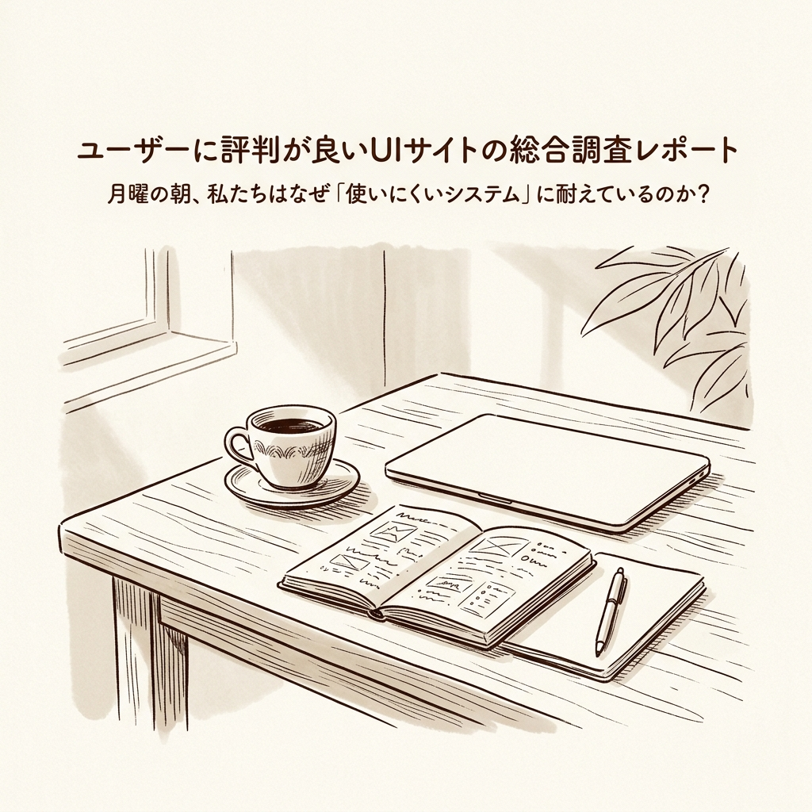
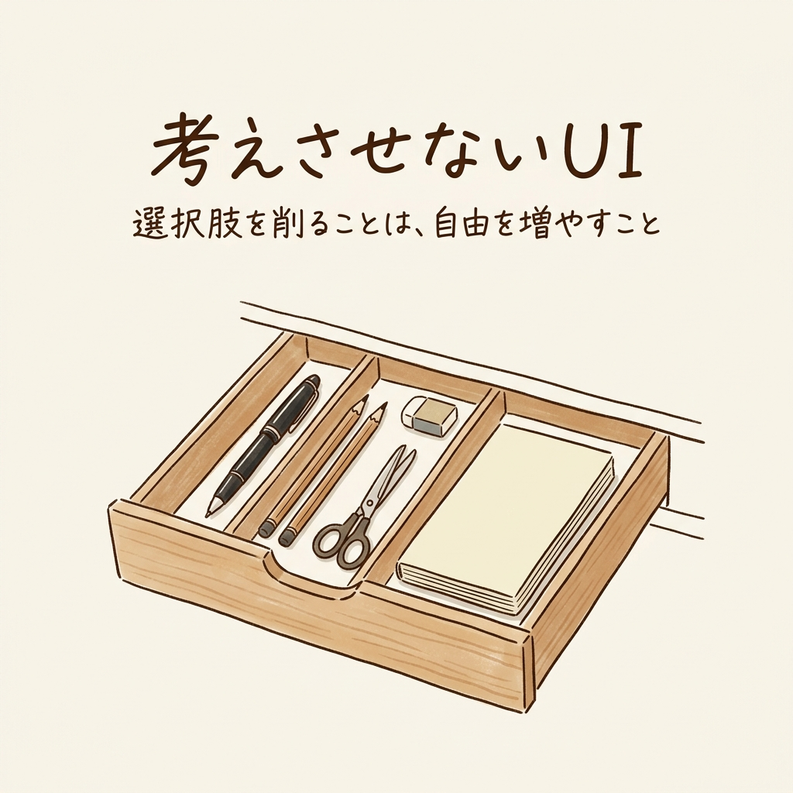

月曜日の朝8時半。コーヒーが冷めないうちにPCを立ち上げ、会社の業務システムにログインする。

どこにあるのか分からないボタンを探し、先ほど別の画面で入力したのと同じデータをもう一度手入力していく。真面目に働いている人ほど、この作業のための作業に黙々と耐えています。

かつての私もそうでした。地方の製造業で生産管理をしていた頃、1日のうちの数時間はシステムとの格闘に費やされていました。システムは仕事を手助けするためのものなのに、いつの間にか私たちがシステムのお世話をしている。そんな倒錯した日々が続いていました。

ふと私用で、ヤマト運輸のサイトを開いて荷物の再配達を依頼してみる。そこには、わずか数秒、数タップで完了する世界がありました。

この圧倒的な摩擦のなさと、自分の仕事環境の摩擦の多さのギャップ。同じデジタルシステムなのに、なぜこれほどまでに体験が違うのでしょうか。

## 会社と日常の間に広がる「使いやすさ」の巨大なギャップ

この違いは、毎日通るたびに足を取られるぬかるんだ道と、一切の抵抗なくスッと進める動く歩道くらい異なります。

私たちが日常的に触れている優れたウェブサービスは、ユーザーに考えさせないことを至上命題として設計されています。一方、多くの社内システムは機能があることを優先し、それをどう使うかはユーザーの根性と学習能力に丸投げされています。

## 評判の良いUIは、ユーザーに「何もさせていない」

ここで重要なのが、UI（ユーザーインターフェース）の設計思想です。UIとは、システムと人間の翻訳家のようなものです。外国語のメニューしか出さないレストランで、言葉が分からなくても指差しで注文できるようにする写真付きメニューですね。

ヤマト運輸やヨドバシカメラのサイトが評価されている理由は、デザインが美しいからではありません。ユーザーの「次に何をすべきか」を先回りして考え、余計な選択肢を削ぎ落としているからです。

優秀なバーテンダーは「メニューから選んでください」とは言いません。客の顔色を見て「いつものですね」とスッとグラスを差し出す。これこそが、迷わず使えるおもてなしの度合い、つまり高いユーザビリティの正体です。初めて入ったスーパーでも、なぜか迷わず牛乳売り場にたどり着けるあの感覚です。

## この「考えさせない法則」は、仕事と生活にも移植できる

実はこれ、計算すると恐ろしいことが分かります。毎日「どこをクリックするか」に10秒迷い、「同じデータを入力する」ことに1分費やしているとしたら、1年でどれだけの時間が失われているでしょうか。

選択肢を削ることは、自由な時間を増やすことです。

毎朝服を選ぶ時間をなくすため、同じ服を何着も揃えたスティーブ・ジョブズのクローゼットの話は有名ですね。これも一種の生活のUI設計です。見えない誘導路である導線設計を整えれば、遊園地で自然と人気アトラクションに向かって歩いてしまうように、無理なく目的を達成できるようになります。

論理的に整理すると、自由は根性ではなく設計で手に入れるものなのです。

## 明日から始める自分のためのUI設計

では、明日からどうすればいいのか。

最初の1歩は、日常の摩擦を1クリックに置き換えることです。キッチンの包丁やよく使う調味料を、一番取り出しやすく、一歩も動かずに手が届く場所に配置し直すのと同じです。

PCのデスクトップにある使わないアイコンを消す。よく使うフォルダはショートカットを作る。毎日開くWebページはブックマークバーの最も左に置く。

こうした小さな自分のためのUI設計が、1日の中で確実に数分の余白を生み出します。その余白が積み重なり、やがて大きな自由の選択肢となっていくのです。

あなたの目の前にあるその作業、本当にあなたが毎日、頭を使って考えるべきことですか？

新しい便利なツールや仕事術を探し回る前に、まずは今目の前にある不便なツールや無駄な選択肢を徹底的に捨てる勇気を持ってみてください。それが、自分の時間を取り戻す最短ルートです。

<!-- 参照ファイル一覧
- 03_detailed_agenda.md
- 04_blog_post.md
- 05_thumbnail_prompts.md
- 06_section_prompts.md
- ./thumbnail.png
- ./img1.png
-->
