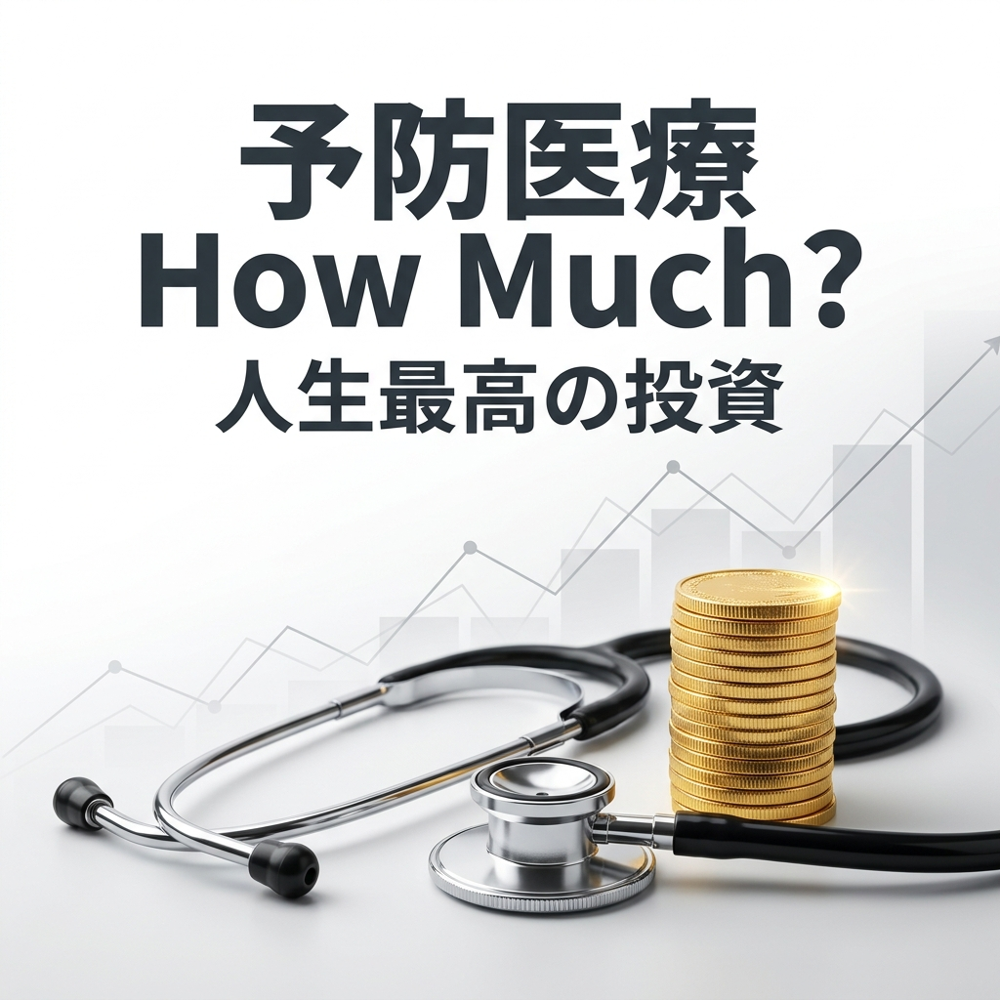
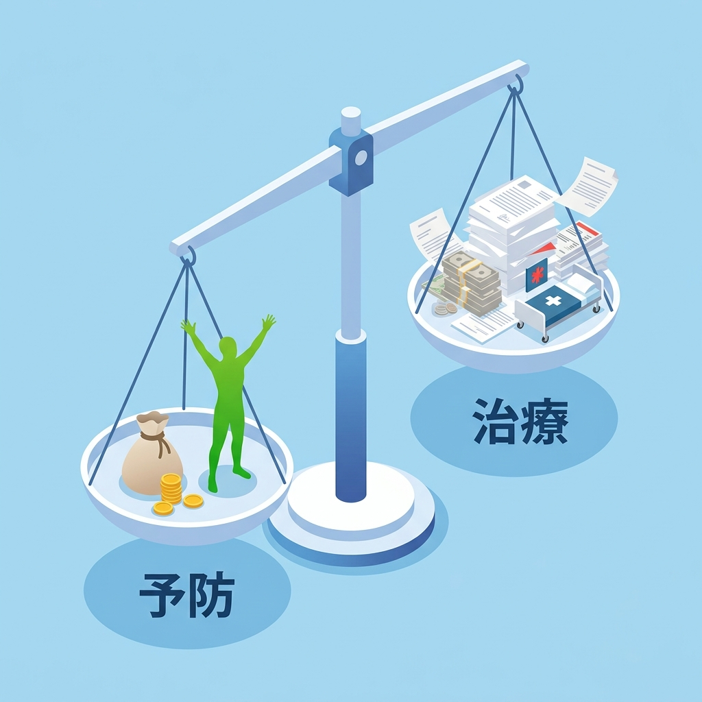

---
title: 「稼ぎ」を守る最強の資産管理術：なぜ賢い人は『予防医療』に10万円を投じるのか
description: 予防医療を「家計を圧迫するコスト」ではなく「人生最高の投資」として再定義。40代ビジネスマンが陥る「健康の非合理なギャンブル」から脱却し、自分の体という最大のキャッシュフロー・マシンのメンテナンス戦略をロジカルに解説します。
pubDate: 2026-04-28
tags: ["予防医療", "健康投資", "資産管理", "堀江貴文", "医療DX"]
heroImage: "./thumbnail.png"
slug: health-investment-roi-horie
draft: false
---

「自由は、根性ではなく『設計』で手に入れる。」

こんにちは、ケンジです。

月曜日の朝、駅のホームでこの記事を読んでいるとしたら、あなたは今、どんな気分でしょうか。
「今週も長いな……」
「昨日の休み、もっとゆっくりすればよかった」
あるいは、カバンの中にある健康診断の『C判定』の通知を、見て見ぬふりをして通勤電車に乗り込んでいるかもしれませんね。

実は、かつての私も全く同じでした。
製造業で生産管理をしていた25年間、私は仕事の効率化には病的なまでにこだわっていましたが、自分自身の「体」というマシンのメンテナンスには、驚くほど無頓着だったんです。

「検査に数万円払うくらいなら、子供の塾代に回したほうがいい」
「自覚症状がないんだから、まだ大丈夫だ」

そんな思い込みが、実は人生で最も非合理な投資判断だったことに気づいたのは、ある優秀な同期が、突然の大腸がんで職場から姿を消した時でした。
今日は、感情論や精神論ではなく、徹底的に数字とロジックで語ります。
なぜ、1回の検査に投じる10万円が、あなたの人生に数千万円の利益をもたらすのか。
予防医療を「家計を圧迫するコスト」から「利回りを最大化する投資」へと書き換える、設計図の話をしましょう。

## あなたの「稼ぎ手」は、ノーメンテナンスで動いている

生産管理の世界では、1台数億円の機械を導入したら、必ず予防保全のスケジュールを組みます。故障してから直す事後保全は、ラインが止まる損失があまりに大きすぎるからです。

でも、私たちは自分自身の体に対しては、驚くほど無頓着です。人生で最大のキャッシュフローを生み出す、たった一つのエンジンなのに。

### 中古車の車検と、あなたの体
想像してみてください。10万キロ走った中古車を、一度もオイル交換せずに、時速100キロで高速道路を走り続けさせる自分を。
いつエンジンが焼き付いてもおかしくありません。もし焼き付いてしまえば、修理代はオイル交換代の数十倍に膨らみますよね。

あなたの体も同じです。40代を過ぎ、24時間365日休みなく動き続けている臓器たちは、確実に摩耗しています。

### バックアップを取らないリスク
大切な仕事のデータが入ったPC。バックアップを取るには、数千円のクラウド費用と、同期する手間がかかります。
でもある日突然PCが壊れて、1週間仕事が止まったらどうなるでしょうか。その時の損失に比べれば、日々のバックアップ費用はコストではなく、ビジネスを継続するための必要経費のはずです。

## 経済合理性の謎解き：なぜ「10万円」が「数百万円」を守るのか

堀江貴文氏の著書『予防医療 How Much？』では、衝撃的な事実が数字で示されています。
ここでは、多くの人が「高い」と敬遠する検査のROI（投資対効果）を考えてみましょう。

### がん検診は「負債の早期完済」
例えば、大腸がん。
早期発見であれば、内視鏡手術で数日の入院、費用も数万円で済みます。何より、体への負担が少なく、すぐに元の「稼げる状態」に戻れます。

でも、もし発見が遅れてステージ3や4になればどうなるか。
手術、抗がん剤、放射線治療。費用は数百万円に膨らみ、半年以上の休職や、最悪の場合は退職を余儀なくされます。

これを金融商品で例えるなら、リボ払いの返済と同じです。
初期のわずかな手数料を惜しんで返済を先延ばしにすると、将来的に雪だるま式に膨れ上がった借金を背負わされることになる。これは運が悪いのではなく、単なるリスク管理の失敗です。

### ゲートキーパー（総合診療医）を雇うという戦略
私たちは体の不調を感じると、自分で「眼科かな」「整形外科かな」と判断して病院を回ります。
でも、これは工場の故障原因を、素人が推測してあちこちの修理屋に電話をかけるようなものです。

賢い人は、全体を俯瞰する「総合診療医」を味方につけます。
彼らは各臓器がバラバラに判断を下すのではなく、体全体のデータを見て、最適なアクションを指示してくれる、人生の経営コンサルタントのような存在です。

## 健康は、人生で最も確実な「高利回り資産」

投資の世界では、リターンが大きいものには必ず大きなリスクが伴います。
でも、予防医療という投資は、その常識を覆します。

### インデックス投資としての健康習慣
株式投資で資産を2倍にするには、市場の波に翻弄され、マイナスになるリスクも負わなければなりません。
でも、正しいメンテナンス（胃カメラ、大腸カメラ、ピロリ菌除菌など）をコツコツと積み立てる投資は、将来の損失を確実に減らすことができます。

これほど変動幅が低く、期待値が高い投資先が他にあるでしょうか。
資産形成を急ぐあまり、自分の体のメンテナンスを削って残業代を稼ぐのは、穴の開いたバケツに必死で水を汲んでいるようなものです。

## 自分という資産のポートフォリオ管理：明日から始めるステップ

では、具体的に明日から何をすべきか。
設計図を書き換えましょう。

### ウェアラブルデバイスは「24時間勤務の監査役」
Apple Watchやスマートリングを、単なる便利なガジェットだと思っていませんか。
それは、あなたの「人体工場」に設置されたリアルタイムモニターです。

心拍数の変化、睡眠の質、活動量。これらをデータとして蓄積することは、異常が起きてから止めるのではなく、振動の変化で故障を予知し、軽微な部品交換で済ませるための予知保全です。

### 自由診療を「高速道路」として利用する
「自由診療は高い」
確かに、窓口負担は増えます。でも、そこには時間と精度というリターンがあります。
数ヶ月待ちの大学病院ではなく、最新設備を備えたクリニックで、待ち時間ゼロで精密検査を受ける。
これは、渋滞の下道を避けて高速道路を利用し、最短距離でゴールにたどり着くための合理的な選択です。

## 結論：将来のあなたから、数百万円を盗んでいませんか？

もし今日、あなたの銀行口座から「10年後のあなた」が勝手に数百万円を引き出したとしたら、あなたは激怒するでしょう。
でも、今日のあなたが「忙しいから」「高いから」という理由で検査をサボることは、まさに将来のあなたから数百万円、そして数年間の自由を奪い取っているのと同じです。

健康は失ってから気づくものではありません。
それは、戦略的に守ることで利益を生み出し続けるものです。

明日、会社に行く前に、あるいは休憩時間に、近くの人間ドックや内視鏡クリニックの予約サイトを開いてみてください。
その10分間のアクションが、あなたの人生という企業の倒産リスクを劇的に下げ、豊かな配当をもたらす最初の一歩になります。

「自由は、設計で手に入れる。」

あなたの設計図に、今日から予防医療という最強の資産を組み込んでみませんか。

---

<!-- 画像リネームマッピング (GAS/手動作業用)
Phase2生成ファイル → GASアップロード用ファイル名

Image/thumbnail/thumbnail_main.png → thumbnail.png
Image/sections/section_01_economy.png → img1.png

アップロード先: GitHub src/content/blog/health-investment-roi-horie/ (コロケーション配置)
Astro参照パス: ./thumbnail.png, ./img1.png
-->

<!-- 参照ファイル一覧
- 03_detailed_agenda.md
- 04_blog_post.md
- 05_thumbnail_prompts.md
- 06_section_prompts.md
- Image/thumbnail/thumbnail_main.png
- Image/sections/section_01_economy.png
-->
