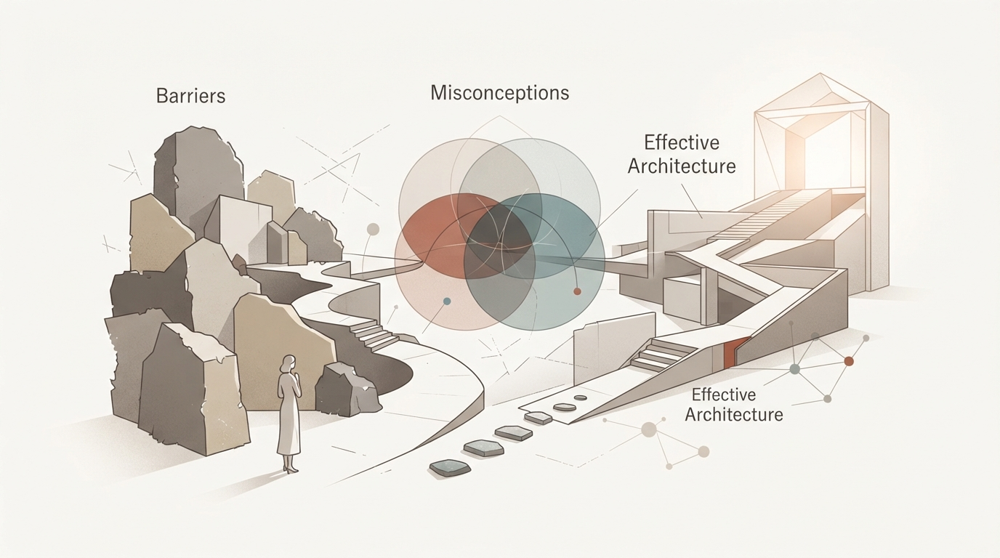

月曜日の朝、満員電車の揺れに身を任せながら、スマートフォンの単語アプリを何となく開いては数分で閉じてしまう。あるいは、本棚に並んだ分厚い文法書や、数ページだけ開かれた英語のテキストを見て、かすかな後ろめたさを覚える。

真面目に勉強しようと思い立ち、参考書を買い、最初の数日は熱心にノートをとる。けれど仕事の繁忙期がやってくると、1日途切れ、3日途切れ、気づけば元の日常に戻っている。「自分には語学の才能がないのかもしれない」「やっぱり、大人になってから新しい言語を覚えるのは無理なのだろう」と、ため息とともに諦めてしまった経験は誰にでもあるはずです。

かつて製造業の工場で生産管理の仕事をしていた頃の私も、まったく同じでした。

海外拠点との連絡やマニュアルの翻訳が必要になるたびに、机に向かって英単語を力技で暗記しようとしては挫折を繰り返していました。当時の私は、「続けられないのは自分の根性が足りないからだ」と自分を責めていたのです。

しかし、工場の製造ラインを観察していればわかることがあります。不良品が多発したり、途中で工程が止まってしまう原因の9割以上は、作業員のやる気や根性の問題ではありません。最初から「歩留まりの悪い無理なライン」を設計してしまっていることに原因があります。

語学学習もまったく同じです。大人が挫折するのは、才能がないからでも、記憶力が衰えたからでもありません。ただ単に、「続けられる仕組み」と「大人の脳に適した工程設計」を知らないまま、精神論で立ち向かってしまっているだけなのです。

今回は、20カ国語を自在に操る言語学者マシュー・ユールデン（Matthew Youlden）氏の知見と、MITやエディンバラ大学が発表した大規模な認知科学データをベースに、大人が最短距離で言語を日常に溶け込ませるための「習慣の設計図」を論理的に解き明かしていきます。

---

## 1. 「英語を何年も勉強しているのに話せない」という違和感の正体

まず、私たちが直視すべき興味深いデータがあります。

世界的な言語学習アプリDuolingoが発表した「2025年グローバル言語学習レポート」によると、世界で「最も真面目に学習時間を費やしている国」の第1位は、2年連続で日本でした。さらに、3言語以上を意欲的に学ぼうとする「多言語学習者の割合」でも、フィンランドやドイツを抑えて日本が世界トップに立っています。

この数字が示している事実は明白です。私たちは決して、語学に対して不真面目でも怠惰でもありません。世界中のどの国の人々よりも熱心に時間を投資し、真剣に言語と向き合っています。

それにもかかわらず、街中で外国人から英語で道を尋ねられた途端に固まってしまったり、ビジネスの会議で一言も発言できずに終わってしまう人が後を絶ちません。「勉強時間」と「アウトプットできる能力」の間に、これほど残酷なギャップが存在しているのはなぜでしょうか。

答えは極めてシンプルです。私たちが長年受けてきた学習モデルが、「テストで減点されないためのインプット偏重型」に固定されてしまっているからです。

言語学者スティーブン・クラッシェン（Stephen Krashen）の理論において、「モニター過剰使用者（Monitor Over-users）」と呼ばれる状態があります。頭の中に文法規則や単語の知識だけが過剰に蓄積されているため、言葉を発しようとするたびに「三単現のsは合っているか」「前置詞はinかatか」と脳内の検閲装置がフル稼働し、結果として口から言葉が一切出てこなくなってしまう現象です。

製造業の言葉で言えば、出荷前の品質検査基準があまりに厳格すぎて、完成品が1台も工場から外に出てこない状態に似ています。

どれほど精密な部品を持っていても、組み立てて動かさなければ製品としての価値は生まれません。私たちが最初に手放すべきなのは、「完璧な文法で淀みなく話さなければならない」という思い込みそのものです。

---

## 2. 言語習得を阻む3つの神話「D・I・E」とMIT 67万人データ

TEDxClaphamの講演で、20カ国語を操る言語学者マシュー・ユールデン氏は、大人が語学を始める際に自らにかけてしまう呪いを、ドイツ語の定冠詞と同じ綴りである「D・I・E」というアクロニムで表現しました。

1つ目のDは「Difficulty（難易度の誤解）」です。外国語を学ぶことは、まるでスペースシャトルを設計するロケット科学のように難解なものであり、自分のような普通の人間には到底無理だという錯覚です。

2つ目のIは「Irrelevance（無関係の誤解）」、あるいは「Inability（才能の欠如）」です。日常生活や今の仕事には直接関係がない、あるいは自分には語学のセンスがないと決めつけてしまうことです。

3つ目のEは「Expat（現地在住の誤解）」、あるいは「Endless time（果てしない時間）」です。海外に何年も住んで現地に没入しなければ話せるようにはならない、あるいは何千時間もの苦行に耐えなければならないという思い込みです。

ユールデン氏はこの3つの神話を真っ向から否定します。

特に「大人は子供に比べて言語習得能力が衰えている」という言説については、現代の認知科学によって決定的な反証が突きつけられています。

マサチューセッツ工科大学（MIT）、ハーバード大学、ボストン大学の共同研究チームが約67万人（669,498人）の英語学習者データを分析し、学術誌『Cognition』に発表した超大規模研究によると、文法規則を効率的に学習する能力（Learning Rate）のピークは、従来の通説だった「7歳前後」ではなく、「17.4歳（約17.5歳）」まで極めて高い水準で維持されることが判明しました。

大人の脳は決して錆びついているわけではありません。

むしろ大人には、子供にはない強力な武器があります。それは「メタ認知（学び方を客観的にコントロールする能力）」と「論理的推論力」です。

子供は丸暗記と直感で言葉を拾い上げますが、大人は「この文法パターンは、母国語のあの表現と同じ構造だな」「この接頭辞は否定を意味するな」と、既存の知識と照らし合わせながら最短距離で構造を理解できます。制御された環境下で論理的に学ぶのであれば、大人のほうが子供よりもはるかに学習効率が高いのです。

問題は能力の低下ではなく、大人特有の「失敗へのプライド」と「学習プロセスの設計ミス」にあります。

---

## 3. 脳科学が証明する「1日30分・週5時間の境界線」

では、大人の脳を実際に変化させ、新しい言語を定着させるためには、どれくらいの学習負荷が必要なのでしょうか。

ここで、エディンバラ大学のトーマス・バク（Thomas H. Bak）教授らが学術誌『PLOS ONE』に発表した興味深い実験データをご紹介します。研究チームは、18歳から78歳までの幅広い年齢層の被験者を集め、スコットランド・ゲール語の集中講座を「わずか1週間（合計14時間）」受講させました。

その結果、年齢に関係なくすべての受講者において、脳の注意切り替え機能（Attentional Inhibition）が有意に向上することが確認されました。言語の学習を始めた瞬間から、年齢を問わず脳の神経回路は刺激を受け、活性化し始めるのです。

しかし、この研究で真に着目すべきは、その「9ヶ月後の追跡調査」の結果です。

講座終了後、日常生活の中で「週5時間以上（1日あたり約40分）」の学習や言語接触を継続した受講者は、全員が向上した脳機能を維持していました。一方で、練習時間が「週4時間以下」に落ちてしまった受講者は、脳のパフォーマンスが学習前の状態に戻ってしまっていたのです。

サウジアラビアのタブーク大学が2026年にまとめた成人の脳神経イメージングに関するメタ分析でも、成人が集中して語学を学ぶと、大脳の左右をつなぐ白質（右弓状束など）の結合が強化されることが実証されています。ただし、学習を完全に中断してしまうと、1年ほどで元の状態へと可逆的に戻ってしまうことも報告されています。

ここから導き出される結論は、極めて実務的です。

週末に気合を入れてまとめて3時間勉強するような「バッチ処理」型の学習は、工場の稼働で言えば設備を休止させてから急激にフル稼働させるようなもので、歩留まりが悪く定着しません。

必要なのは、1日30分から40分の小さな負荷を、毎日一定のペースで流し続ける「平準化（ラインバランシング）」です。

1日30分なら、朝起きてからの10分、昼休みの10分、夜寝る前の10分というように、日常の隙間に分割して配置するだけで達成できます。何年も苦しい修行をする必要はありません。マシュー・ユールデン氏も述べている通り、1日30分の正しい習慣を1ヶ月回すだけで、日常会話の基礎を自力で処理できる地盤は確実に出来上がります。

---

## 4. 挫折をゼロにする「3つのショートカット」と「黄金の習慣設計」

1日30分の時間を確保したとして、具体的にどのようなアプローチをとれば挫折を防げるのでしょうか。マシュー・ユールデン氏が提唱する「3つのショートカット」と「3つの黄金法則」を、忙しい大人の生活に落とし込める実践システムとして再構築してみましょう。

### ショートカット1：類似性（コグネイト）の分析から入る

ゼロからすべての単語を暗記しようとするのは、もっとも非効率なやり方です。私たちが学ぼうとする言語の中には、すでに知っている言葉や構造と共通するパターンが無数に存在します。

英語を学ぶ場合でも、日本語の中にはすでに膨大なカタカナ英語が溶け込んでいます。ヨーロッパ系の言語同士であれば語彙の4割近くが共通の語源を持っていますし、文法にも「主語・動詞・目的語」の骨格があります。未知の記号として丸暗記するのではなく、「日本語のこの概念と同じだな」「この語尾変化はあの品詞だな」と、類似点を見つけ出して整理することから始めます。

### ショートカット2：最初は徹底的にシンプルに保つ

学校の授業のように、例外的な文法規則や滅多に使われない構文に最初から頭を悩ませてはいけません。

工場で新製品の立ち上げを行うとき、最初から細部の特注オプションを設計する人はいません。まずはベースとなる基本フレームだけを確実に組み立てます。日常会話で頻出する基本動詞と短い疑問文、自分の意思を伝えるための最小限の構文だけに焦点を絞り、例外は後から少しずつ肉付けしていく姿勢が大切です。

### ショートカット3：自分に関連すること（Relevance）だけに絞る

辞書を1ページ目からめくって単語を暗記する作業ほど、大人のやる気を奪うものはありません。

記憶の定着に関する認知実験が示している通り、人間は「自分自身の感情や日常の文脈と結びついた情報」しか長期記憶に移行させることができません。自分が普段の仕事で使う表現、自分の趣味について話すフレーズ、自分が日常でよく頼む料理の注文。まずは「自分の半径5メートル以内にある言葉」だけを集中的にインプットするのです。

そして、この3つのショートカットを支えるのが、マシュー氏の掲げる「3つの黄金法則」です。

- 言葉を生きる（Live the language）：勉強の時間と生活の時間を分離しない。スマートフォンの言語設定を学習対象の言語に変える、普段聴くBGMを現地のラジオやポッドキャストにするなど、生活環境そのものを少しずつ染めていく。
- 間違いを歓迎する（Make mistakes）：完璧主義を捨てる。間違えた単語や伝わらなかった発音は、欠陥ではなく「改善のための貴重なデータ（不適合品ログ）」として歓迎する。
- 楽しむ・仲間と取り組む（Make it fun）：義務感でやらない。自分の好きな海外ドラマを字幕で観たり、同じ目標を持つ仲間と小さな進捗を共有しながら進める。

---

## 5. 自由を広げるための「設計」としての言葉

朝の静かな時間帯に温かいコーヒーを淹れ、今日のタスクを3つだけ手帳に書き留める。かつて終電間際まで工場の事務棟で残業に追われ、疲弊しきっていた頃の私には想像もできなかった朝の風景です。

地方の製造業を離れ、マレーシアに拠点を移して仕事を再設計した現在、痛感していることがあります。

自由を手に入れるために必要なのは、歯を食いしばる根性でも、人並み外れた才能でもありません。自分を取り巻く環境と時間の使い方を、淡々と「再設計」することだけです。

語学もまったく同じです。

TOEICで満点を取る必要も、ネイティブスピーカーのように一切訛りのない発音を手に入れる必要もありません。大切なのは、異なる言葉を持つ相手と意思を通わせ、今まで見えなかった新しい情報にアクセスし、自分の人生における選択肢を1つ増やすことです。

ウクライナの古い諺に、次のような言葉があります。

「知っている言語が多ければ多いほど、それだけ多くの人格になれる」

新しい言語を日常に迎え入れることは、もう一つの視点を手に入れることであり、自分の世界を少しだけ広げる行為です。

高額な教材を買う必要も、明日から毎日2時間勉強すると無理な誓いを立てる必要もありません。まずは今日の帰り道、スマートフォンの言語設定を英語に変えてみる。あるいは、明日の朝の10分間だけ、好きな海外のラジオを流してみる。

そんな小さな「設計の変更」から、大人の新しい学びを始めてみませんか。