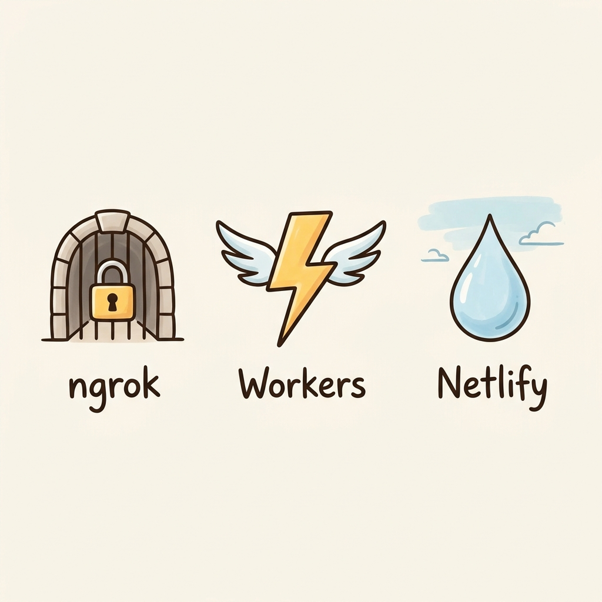
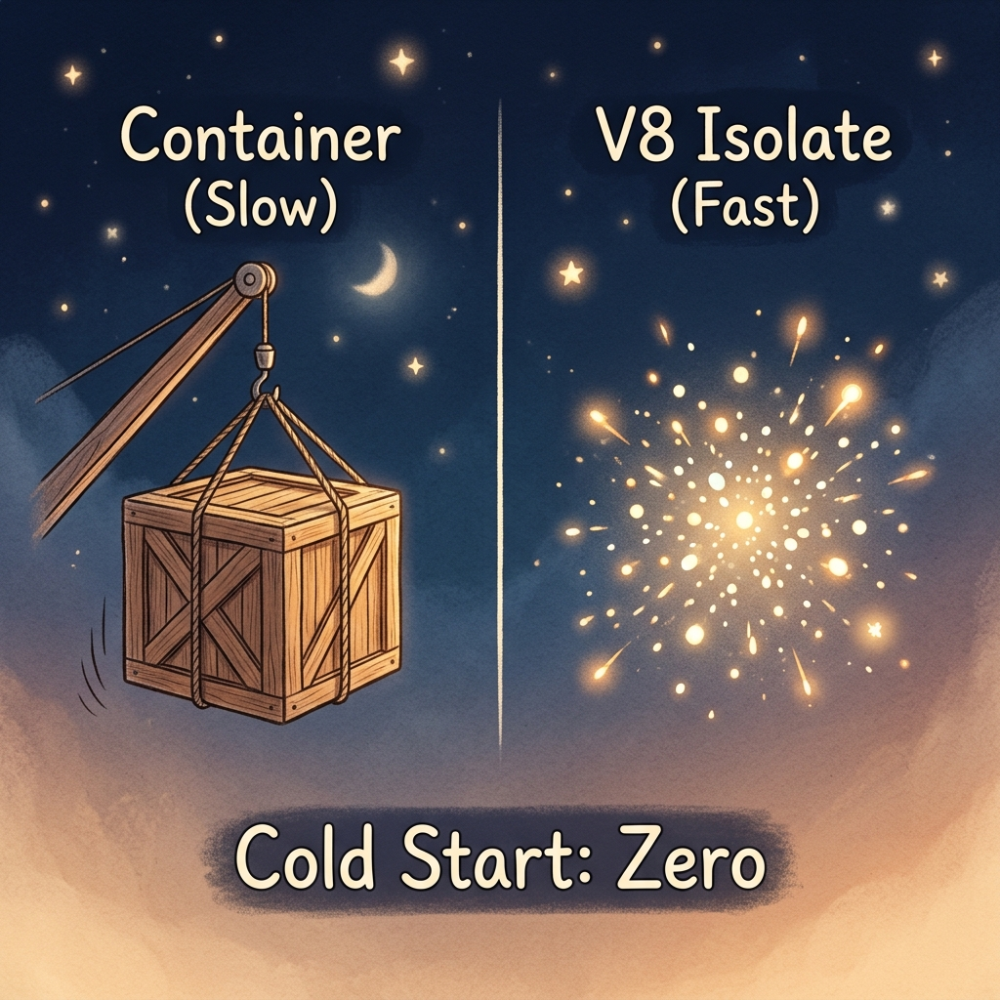
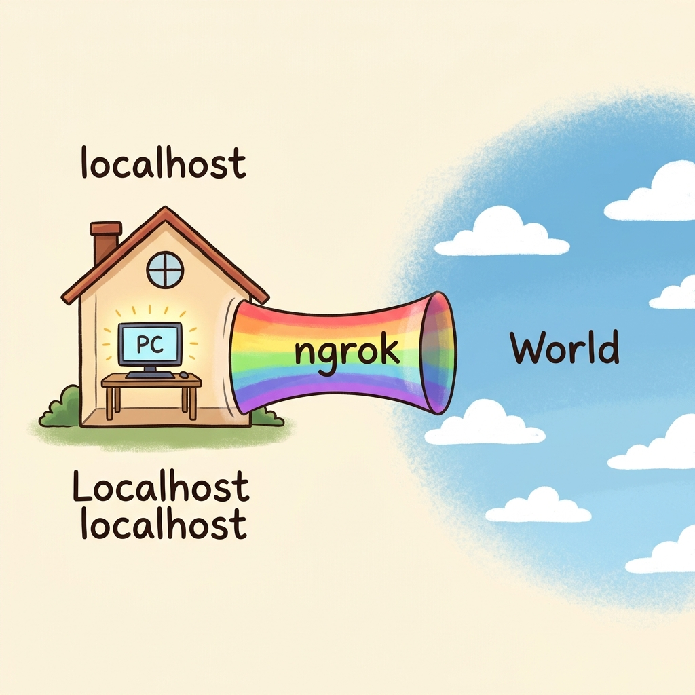

## 1. AI時代の開発を殺す「デプロイの壁」

### AIはコードを書くが、インフラは待ってくれない
CursorやClaude Codeに一言指示を投げれば、数秒後には見事なロジックが目の前に現れる。2026年、僕たちの「筆」はかつてないほど速くなった。

でも、その筆がピタッと止まる瞬間がある。書いたコードを誰かに見せようとしたり、外部のAPIと繋ごうとしたりした時だ。

ドメインを取って、SSLを設定して、サーバーを立てて、CI/CDを回す。AIが数秒で書き上げた機能を公開するのに、人間が数十分、下手をすれば数時間をインフラ作業に溶かしている。この「熱量」と「摩擦」のギャップ。これこそが、現代のクリエイティビティを窒息させている最大の犯人だと思っている。

### なぜ「localhost」の境界線がボトルネックになるのか
localhostはエンジニアにとって最も安全な聖域だ。でも、同時に最も閉ざされた場所でもある。

例えばStripeの決済連携やLINE Botを開発している時を想像してほしい。これらは外部からの「Webhook」が届いて初めて動く。でも、あなたのPCはNATやファイアウォールの奥深くに隠れていて、外の世界からは見えない。

この「境界線」を越えるためにルーターのポートを開けたり、固定IPを確保したりするのは、正直言って「本質的」な仕事じゃない。このわずらわしさが試行錯誤の回数を減らし、プロトタイプの鮮度を奪っていく。

## 2. 境界線を消し去る3つのテクノロジー

この壁をぶち壊して、自分の思考をダイレクトにインターネットへ接続するための「武器」を紹介しよう。

### ngrok：localhostを「世界の入り口」に変える
ngrokは、自分のPCと世界との間に、即座に「魔法のトンネル」を通してくれる。

仕組みは至ってシンプル。ngrokを起動すると、あなたのPCから外の世界へ向けてトンネルを伸ばし、ngrokのサーバーでリクエストを待ち受けてくれる。外部からの通信はこのトンネルを通って、あなたのPCに届く。

これがなぜ凄いのか。コマンド一行でHTTPS対応のURLが手に入るからだ。AIがコードを書き換えたその瞬間に、外部からのWebhookを受け取って動作を確認できる。この「数ミリ秒」のフィードバックループの短縮が、開発の質を決定的に変える。

### Cloudflare Workers：起動待ちゼロの「空気のようなサーバー」
プロトタイプを超えて、本格的な運用を考えるならCloudflare Workersの出番だ。

これまでのサーバーレス技術（AWS Lambdaなど）には「コールドスタート」という弱点があった。リクエストが来てから環境を立ち上げるため、どうしても数秒の待ちが発生する。でも、WorkersはV8 Isolateという軽量な仕組みを使っている。

OSを起動しないから、起動時間は5ms以下。文字通り、瞬きする間もなく動き出す。さらに世界300拠点以上のエッジで動くから、ユーザーが地球のどこにいても超高速で反応する。もはやサーバーは「場所」ではなく、ネットワークに溶け込んだ「空気」に近い存在になった。

### Netlify Drop：思考をそのままインターネットへ放り込む
「コードを書くことすら、今は手間だ。このHTMLを今すぐ誰かに見せたい」
そんな時はNetlify Dropだ。

フォルダをブラウザにポイッと放り込む。それだけで、世界中からアクセスできるURLが発行される。アトミック・デプロイという技術が裏で動いていて、常に最新の状態を一斉に反映してくれるから、ファイルが壊れる心配もない。

CI/CDの設定すら「ノイズ」と感じるほどのスピード感。Netlify Dropは、思考を物質化するための最短距離だ。

## 3. 教訓：インフラを「空気」にすれば、創造性は加速する

### 「構築」から「編む」時代へ
これらのツールが教えてくれるのは、エンジニアの仕事は「インフラを構築すること」ではなく、既存の知性を「編み合わせること」にシフトしたということだ。

インフラはもう、家を建てるような大ごとじゃない。ウェブという海に、プラグを差し込むだけの行為だ。この「空気化」によって、失敗のコストはほぼゼロになった。10個のアイデアを10個とも即座に公開して、一番反応が良かったものをWorkersでスケールさせればいい。

### 信頼とスピードをどうバランスさせるか
もちろん、速さにはリスクも伴う。ngrokでうっかりローカルの機密データを晒したり、WorkersのCPU制限に引っかかったり。

プロは、ただ速いから使うんじゃない。それぞれの「限界」を知った上で、今の自分に最適な武器を選ぶ。初期はngrokで泥臭くデバッグし、安定したらWorkers AIでエッジ推論を回す。この使い分けのセンスこそが、2026年のエンジニアに求められる新機軸のスキルになる。

## 4. 解決策：明日から「最速」をデフォルトにするために

迷った時は、この3つの問いを自分に投げてほしい。

1. **「その処理、サーバーまで行く必要ある？」**
   - Noなら**Cloudflare Workers**でエッジ処理。コストも遅延も削れる。
2. **「その公開、数時間だけでいい？」**
   - Yesなら**ngrok**。インフラを汚す必要はない。
3. **「計算、サーバー側でやる？」**
   - Noなら**Netlify Drop**。一番安くて、一番速い。

## 結論：ウェブという海にプラグを差し込め

「もし、あなたの思考が10秒後に世界中に公開されるとしたら、今の開発スタイルはどう変わりますか？」

インフラはもう、僕たちの前に立ちはだかる壁じゃない。目の前には無限の地平が広がっている。

僕たちは今、ウェブという巨大な知性の海に、自分のアイデアをプラグインする権利を手に入れた。さあ、localhostの殻を破って、あなたの思考を世界へ接続しよう。スピードこそが、最高の正義なのだから。

<!-- 画像リネームマッピング (GAS/手動作業用)
Phase2生成ファイル → GASアップロード用ファイル名

Image/thumbnail/thumbnail.png → thumbnail.png
Image/sections/section_01_ngrok_tunnel.png → img1.png
Image/sections/section_02_workers_isolate.png → img2.png
Image/sections/section_03_selection_matrix.png → img3.png

アップロード先: GitHub src/content/blog/instant-deployment-paradigm-2026/ (コロケーション配置)
Astro参照パス: ./thumbnail.png, ./img1.png, ./img2.png, ./img3.png
-->

<!-- 参照ファイル一覧
- 03_detailed_agenda.md
- 04_blog_post.md
- 05_thumbnail_prompts.md
- 06_section_prompts.md
- Image/thumbnail/thumbnail.png
- Image/sections/section_01_ngrok_tunnel.png
- Image/sections/section_02_workers_isolate.png
- Image/sections/section_03_selection_matrix.png
-->
