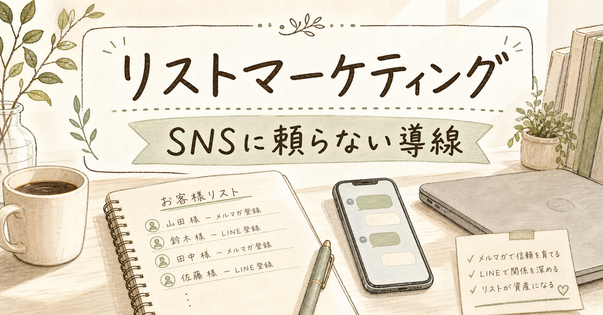
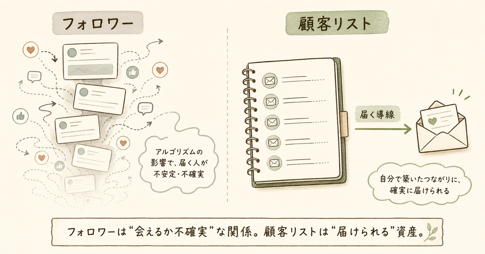
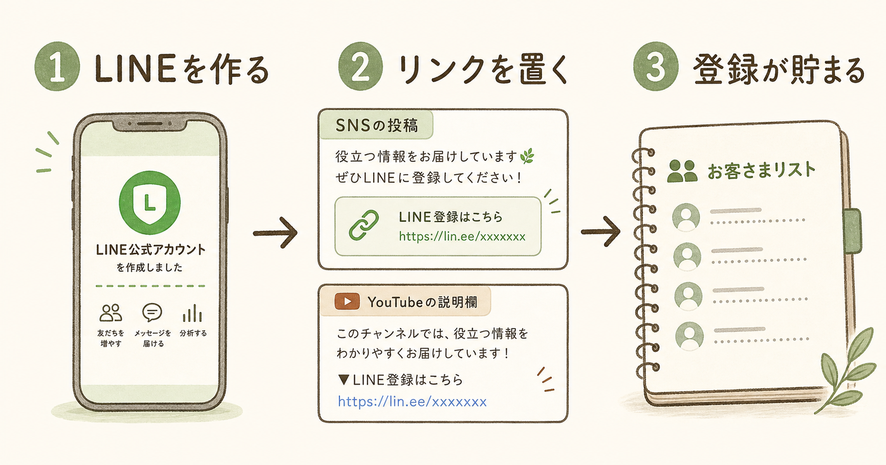
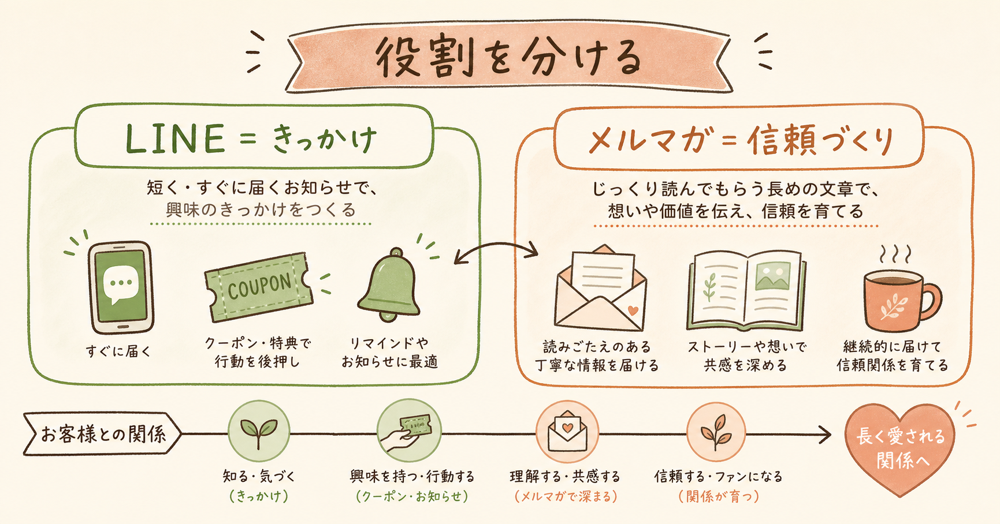
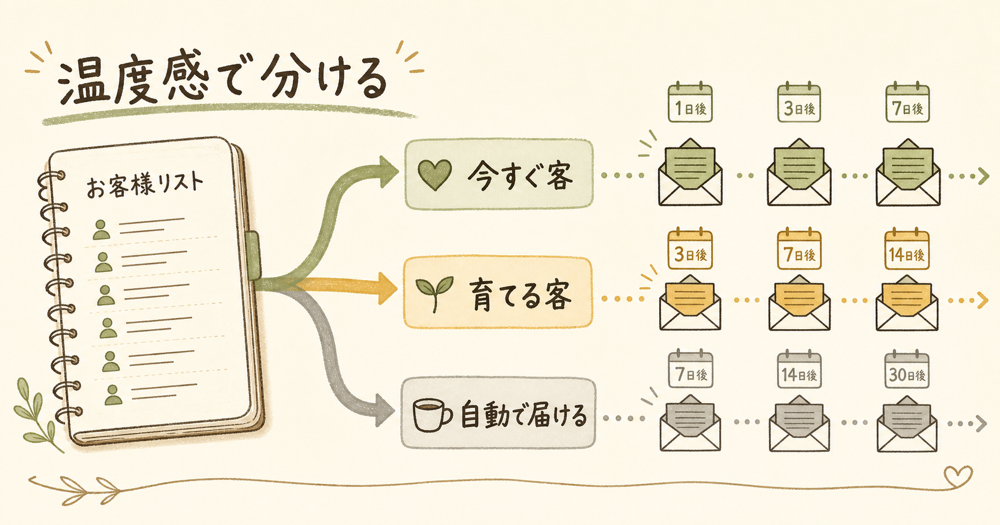

# リストマーケティング戦略：SNSに頼らず、届く導線を作る

月曜の夜。店を閉めたあと、スマホで今日の投稿を見る。

昨日は少し伸びた。保存もついた。コメントもあった。けれど、予約は増えていない。問い合わせも来ていない。フォロワーはいる。見られている感じもある。でも、売上予定表は静かなまま。

この違和感、かなり大事です。

多くの人はここで、もっと投稿しよう、ショート動画をやろう、インスタもTikTokも頑張ろう、と考えます。悪くありません。ただ、順番を間違えると疲れます。かなり疲れます。

先に作るべきなのは、投稿数ではありません。

自分から相手に届けられる導線です。

つまり、リスト。顧客リストです。LINE公式アカウントでもいい。メルマガでもいい。最初から立派な仕組みでなくて構いません。まず、相手が「また案内を受け取ってもいい」と言ってくれる場所を作ることです。

## SNSの反応が売上に変わらない理由

SNSのフォロワーは、つながりに見えます。

でも、こちらが届けたいタイミングで必ず届くわけではありません。

アルゴリズムがあります。投稿の表示順や露出量をSNS側が決める仕組みです。商店街でいえば、どの店を入口近くに置くかを管理会社が決めているようなもの。

あなたが「今日は大事な告知をしたい」と思っても、SNS側がどれくらい見せるかは、あなたが決められません。フォロワーが1万人いても全員には届かない。逆に、たまたま伸びる日もある。

SNS投稿は、通りすがりの人に看板を見せている状態に近いです。看板を見た人が多くても、その人の住所を知らなければ、次にこちらから声をかけられません。

SNSをやめろ、という話ではありません。入口として使えばいい。ただ、入口の先に自分の顧客台帳がないと、毎回ゼロから呼び込みをすることになります。

## リストマーケティングとは、顧客台帳を持つこと

リストマーケティングとは、連絡先を持ち、必要なタイミングで直接届ける販売設計です。

考え方は古いです。江戸時代の商人が大福帳を大事にしていた、という話があります。誰が何を買ったか。いつ来たか。どんな好みか。そういう記録があるから、次の声かけができます。

病院のカルテにも似ています。前回の症状、薬、反応を覚えているから、次の診察が自然になる。

LINEに登録してくれた人。メルマガを読んでくれている人。無料PDFを受け取った人。セミナーに申し込んだ人。資料請求した人。これはただの数字ではありません。「また連絡していい」と許可をくれた人たちです。

ここがSNSフォロワーと違います。

SNSフォロワーは、プラットフォーム上のつながり。顧客リストは、自分の事業側に残るつながりです。

## 最初の一手はLINE公式アカウントでいい

リストマーケティングは何から始めればいいのか。

答えは地味です。LINE公式アカウントを作ってください。

そして、SNSのプロフィール、YouTubeの概要欄、ブログの末尾、名刺、店頭POP、レシート、予約完了メールに「LINEの方も登録お願いします」と置く。最初はこれだけでいいです。

大きな設計図を作ろうとすると止まります。登録特典をどうするか。配信頻度をどうするか。ステップ配信をどうするか。考えるほど、最初の入口ができません。

まず呼び鈴をつけることです。

キッチンカーでも居酒屋でも、美容室でも整体院でも、LINE友だち登録を促している店があります。あれは単なるクーポン配布ではありません。次回、雨の日、空席が出た日、新メニューが出た日、こちらから案内できる導線を作っています。

NotebookLM調査では、LINE公式アカウントの開封率は平均60%以上、場合によっては80%超と整理されています。即時性のある案内には、やはりLINEが強い。

ただし、LINEにも弱点があります。簡単にブロックされます。配信通数によって費用が増えます。だから、LINEは入口と短い行動喚起に向いています。

## LINEとメルマガは競合ではなく役割分担

LINEとメルマガは、どちらが上という話ではありません。

LINEは玄関チャイムです。短く、早く、気づいてもらいやすい。今日の空席、限定クーポン、セミナー締切、予約リマインド。こういう案内に向いています。

メルマガは手紙です。少し長く、背景まで伝えられます。商品の開発ストーリー、導入事例、考え方、失敗談、比較検討の材料。相手の理解を深めるにはメールが向いています。

NotebookLM調査では、メールマーケティングの平均ROIは1ドル投資あたり36ドルと整理されています。メールは古い、と言われます。でも、消えていません。むしろ、ビジネスや購買検討ではまだ強い。

メルマガスタンドを使うと、ここから一段深くできます。たとえばMyASPのようなツールです。使いやすいかと聞かれると、人を選びます。高機能ですが、最初は操作に戸惑うはずです。

でも、高機能な理由があります。

登録フォームを作る。登録者を分ける。ステップメールを送る。クリックした人だけ別の配信へ移す。商品購入者を別リストにする。こういう細かな仕分けができます。

## 一斉配信から、温度感で分ける配信へ

リストマーケティングで失敗しやすいのは、全員に同じ内容を送り続けることです。

登録したばかりの人。すでに買った人。何度もリンクをクリックしている人。まだ一度も反応していない人。この人たちに同じメールを送ると、どこかでズレます。

必要なのはセグメント配信です。読者を条件で分けて内容を変えることです。小学生と大学生に同じ授業をしない。相手の理解度や関心度で、使う言葉と順番を変えます。

今すぐハンバーガーを食べたい人に、「ハンバーガーとは何か」を長々説明したら怒られます。欲しい人には早く届ける。まだお腹が空いていない人には、まず気づいてもらう。

マーケティングも同じです。

今すぐ客には申込みページや相談導線を見せる。まだ迷っている人には事例や比較材料を渡す。まだ必要性に気づいていない人には、問題提起から始める。

NotebookLM調査では、展示会名刺リストから反応者だけに営業フォローして商談化率2倍、週1メルマガで再注文率15%アップ、セグメント配信でクリック率10〜20%という事例が整理されていました。

魔法の文章ではありません。仕分けです。

## 今日やることは3つだけ

大きな仕組みは後でいいです。

今日やることは3つです。

1つ目。LINE公式アカウントを作る。

2つ目。登録リンクを、いま持っている接点に置く。SNSプロフィール、YouTube概要欄、ブログ、名刺、店頭POP、予約完了メール。新しい媒体を増やす前に、既存の接点に置いてください。

3つ目。最初の配信を決める。毎日でなくていいです。週1回でも、月2回でもいい。大切なのは、登録してくれた人を放置しないことです。

配信内容は売り込みだけにしない。店舗なら、今週の空き状況、よくある質問、季節の注意点、限定案内。講師やコンサルなら、読者がつまずきやすいポイント、事例、無料相談の案内。

LINEはブロックされやすい。メルマガは迷惑メール判定のリスクがある。個人情報やプライバシーへの配慮も必要です。リストは資産ですが、相手から預かっているものでもあります。

雑に扱わない。過剰に送らない。登録した理由と関係ない話ばかりしない。解除しやすくする。

これだけで、長く使える導線になります。

## まとめ：明日SNSが届かなくなっても、連絡できますか

SNSは便利です。入口としては強い。発見される場としても使えます。

でも、SNSだけに頼ると、届くかどうかを自分で決められません。

リストマーケティングの本質は、相手を囲い込むことではありません。必要なタイミングで、必要な人へ、直接届けられる状態を作ることです。

LINE公式アカウントを作る。登録リンクを置く。登録してくれた人に、約束した内容を届ける。

最初はそれだけでいいです。

TikTokもインスタも、ショート動画も、やらなくても事業はできます。でも、リストなしで事業を続けるのは、顧客台帳を持たずに商売するようなものです。

明日、SNSの投稿が誰にも届かなくなったとして、あなたはお客さんに連絡できますか。

できないなら、今日やることは決まっています。LINE公式アカウントを作って、登録導線を置くことです。

<!-- 参照ファイル一覧
- 03_detailed_agenda.md
- 04_blog_post.md
- 05_thumbnail_prompts.md
- 06_section_prompts.md
- ./thumbnail.png
- ./img1.png
- ./img2.png
- ./img3.png
- ./img4.png
-->

