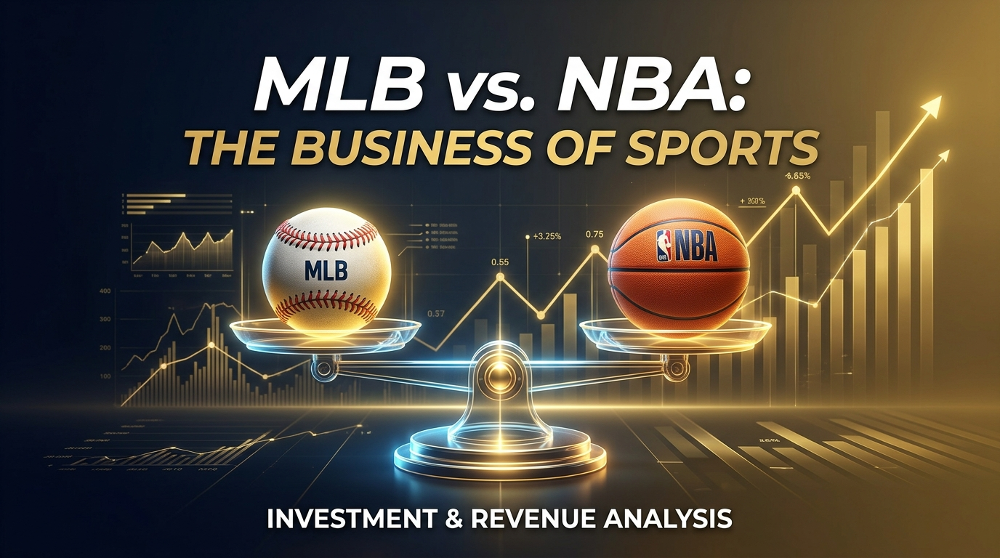
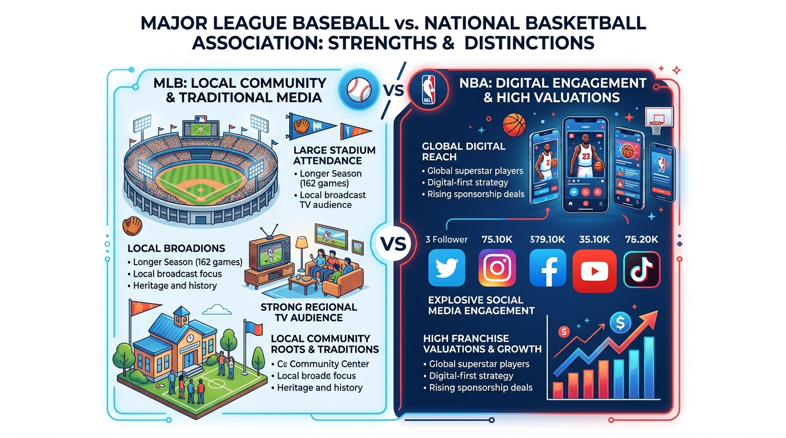
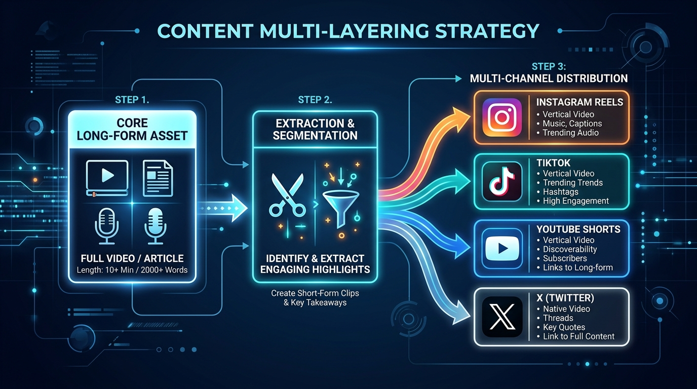

週末の夕方、リビングのテレビやスポーツバーの大型モニターでメジャーリーグ（MLB）のワールドシリーズを観戦している光景を思い浮かべてほしい。日本の宝である大谷翔平選手が打席に立ち、超満員のスタジアムが揺れる。テレビの地上波視聴率も過去最高を記録し、日本中、そして全米のローカル都市が熱狂の渦に包まれる。誰が見ても、「いまアメリカで、そして世界で圧倒的に愛され、観られているのは野球だ」と納得するはずだ。

しかし、海外の最新経済ニュースやフォーブスの「世界スポーツチーム資産価値ランキング」を開いたビジネスパーソンは、言葉を失うような衝撃的な事実に直面する。

チームの平均資産価値はNBAが55.1億ドル（約8,265億円）に対して、MLBは31.7億ドル（約4,755億円）。NBAのほうが7割以上も資産価値が高いのだ。さらに、2024年にNBAが締結した新しい放映権契約は、11年間で総額760億ドル（年間約1兆350億円）という空前のスケールに達している。

観客動員数や日常の地上波テレビ視聴者数で圧倒的に勝っているのはMLBなのに、なぜ投資家や市場から下される企業価値の評価ではNBAが異次元の圧勝を収めているのか。

ここには、単なるスポーツの人気の違いを超えた、リアルな現場の熱狂と消費（実体経済）と、SNS上の拡散力と将来価値の評価（デジタル・金融アセット経済）の決定的なねじれ構造が存在している。

MLBとNBAの最新データを紐解きながら、このねじれのカラクリを解明したい。そして、自社の製品やサービスがどちらの経済圏で戦っているのかを見極め、これからの時代を勝ち抜くためのコンテンツ戦略をお届けする。

---

## 観客数と地上波視聴率ではMLBが圧勝！しかし企業価値はNBAが7割高い謎

まずは、客観的なデータから実体経済のリアルな熱量を見ていこう。

近年「野球離れ」が囁かれていたMLBだが、足元の実体経済においては凄まじい復活と圧倒的な強さを見せつけている。

### ワールドシリーズ vs NBAファイナルの生中継視聴者数格差
全米の注目が最高潮に達するチャンピオンシップシリーズにおいて、実際にテレビ画面の前でフルゲームを観ている視聴者の数はMLBがNBAを圧倒している。

2024年から2025年のワールドシリーズは、1試合平均で1,510万人から1,550万人という驚異的な視聴者数を記録した。一方、同期間のNBAファイナルは1試合平均1,000万人から1,100万人程度にとどまっている。特に決着がつく第7戦の直接比較では、2025年のNBA第7戦が過去最低レベルの1,640万人だったのに対し、MLBのワールドシリーズ第7戦は2,590万人を記録し、1,000万人以上の差をつけて圧勝した。

### 地域に根付くローカルマーケットでの日常的な支配力
MLBの最大の強みは、年間162試合という途方ない試合数と、各都市のローカルコミュニティに深く根付いた日常の消費行動にある。同じ都市に野球チームとバスケチームの両方が存在する市場でのローカルテレビ視聴率を直接比較すると、その差は明白だ。

アトランタ市場では、MLBブレイブスの視聴率3.62に対し、NBAホークスは0.59と約6倍の差。ボストン市場ではレッドソックス（5.25）がセルティクス（2.67）を2倍以上引き離し、シカゴ市場でもカブス（4.11）がブルズ（1.36）を3倍上回る。

地元の住民が毎日テレビをつけ、球場に足を運び、ビールやグッズを買い、地域密着で熱狂している現場の実体経済においては、MLBが今なお圧倒的な王座に君臨しているのだ。

### この構造をビジネスに例えるなら
この関係性は、身近な店舗ビジネスの例えで考えると分かりやすい。

MLBモデルは、いわば「地元で毎日超満員の老舗ラーメン店」だ。毎日地域住民が押し寄せ、行列が絶えず、実店舗の売上と常連客の熱狂度は地域一番。堅実で強固な実質売上を構築している。

一方のNBAモデルは、「インスタで世界中にバズるスタイリッシュな限定スイーツブランド」と言える。実店舗の席数や毎日の来店人数そのものは老舗ラーメン店より少なくても、InstagramやTikTokで世界中の若者に写真が拡散され、ブランドライセンス費用や世界中からのフランチャイズ買収オファーによって時価総額評価が暴騰している状態だ。

実店舗の売上で勝つ老舗ラーメン店（MLB）と、世界的なブランド評価で圧勝するスイーツブランド（NBA）。この二者のズレこそが、現代ビジネスの第一の謎と言える。

---

## デジタル空間の7倍格差——Z世代を熱狂させるNBAのカラクリ

現場の視聴率でMLBが勝っているにもかかわらず、なぜNBAの企業価値がこれほど跳ね上がるのか。その最大の理由は、デジタル空間における支配力の次元が違うからだ。

### SNSフォロワー数に見る桁違いのグローバルリーチ
主要なSNSプラットフォームにおける公式アカウントのフォロワー数を比較すると、驚くべき格差が存在する。

Instagramでは、NBAの9,000万人に対しMLBは1,300万人と約7倍。Twitter (X)でもNBAの4,600万人に対してMLBは1,300万人と3.5倍以上。TikTok、YouTube、Redditでも同様にNBAが数倍の規模で圧倒している。

Z世代やアルファ世代といったデジタルネイティブ層にとって、スポーツ情報の受容スタイルは「テレビの前に3時間座ってフルゲームを観る」ことから、「スマホでSNSを開き、ハイライトの短尺動画を秒単位で連打消費する」スタイルへと完全に移行した。

### なぜバスケットボールはSNSと相性が良いのか？
競技の特性そのものが、デジタル時代のタイパ（タイムパフォーマンス）とクリップ消費に完璧に適合している。

ひとつは「顔が見える」個人のキャラクター性だ。野球はヘルメットや帽子、キャッチャーマスクで選手の顔が隠れがちだが、バスケットボールはユニフォーム一枚で顔が露出しており、表情やファッションがダイレクトに伝わる。仮面をかぶったヒーローよりも、素顔でスクリーンの中心に立つ映画スターのほうが、Instagramのストーリーズで個人のファンにつきやすい。

もうひとつは、ダンクやブロックに見るサビだけの15秒動画だ。音楽で言えば、長尺のアルバムを聴くのではなく、TikTokでサビの15秒だけを聴く文化と同じである。バスケットボールのダンクシュートは1秒見ただけで凄さが伝わる最強のショート動画コンテンツになる。対して野球は、配球の妙や駆け引きといった文脈が多く、15秒の短尺切り抜きでは魅力を伝えきりにくい側面がある。

このZ世代への爆発的リーチとグローバルな拡散力が、将来の顧客基盤としての評価を決定づけているのだ。

---

## テレビ視聴率が落ちても放映権が11年760億ドルに跳ね上がる金融バブルの真実

「でも、SNSのフォロワーが多くても、実際のテレビ視聴率が低ければ、メディア企業から入るお金は減るのではないか？」
そう疑問に思うかもしれない。しかし、現実の金融経済はまったく逆の動きを見せている。

スター選手が過密日程による怪我を防ぐために試合を休むロードマネジメント（調整休養）が問題となり、実際のフルゲームのテレビ視聴者数が低迷しているにもかかわらず、2024年にNBAが新たに結んだ放映権契約は11年総額760億ドル（年間約1兆350億円）という空前の巨額契約となった。

なぜ、実際の視聴者数が減っているのに放映権料が爆騰するのか。

その背景には、メディア業界における切実な地殻変動がある。

従来のアメリカの家庭では、月額100ドル以上を支払ってケーブルテレビを契約するのが普通だった。しかし、NetflixやAmazon Prime、YouTubeなどのネット配信が台頭したことで、有線放送を解約するコードカッティングが加速した。

ドラマや映画は、いつ見てもいいオンデマンドコンテンツになり、配信サービスで代用できる。しかし、生中継のライブスポーツだけは、リアルタイムで見なければ意味がない唯一無二のキラーコンテンツとして残ったのだ。

Amazon Prime Video、Apple TV、Netflix、そして従来のNBCやDisneyなどのメディア巨頭たちは、「スポーツの生中継放映権を失えば、有料会員が全員解約して競合へ逃げてしまう」という恐怖に直面している。

言ってみれば、ストリーミング巨頭たちが、顧客を引き留めるための唯一の「絶対に価値が落ちないダイヤモンド」を競売会場で血眼になって競り合っている状態なのだ。

このメディア企業の生存競争によって引き起こされたバブルにより、NBAの実体経済の低迷は、金融経済の力によって強烈に補填され、チームの資産価値（55.1億ドル）が押し上げられている。

---

## ピッチクロック導入と大谷翔平——MLBが仕掛けた実体経済の逆襲

もちろん、MLBも手をこまねいて黙っていたわけではない。実体経済の王者であるMLBは、時代への適合のために歴史的な改革を断行した。

2023年、MLBは投手がボールを受け取ってから投球するまでの時間制限を設けるピッチクロックを導入した。これにより、平均3時間10分以上かかっていた冗長な試合時間が、平均2時間36分へと一気に約30分短縮された。

試合のテンポが劇的に良くなり、走塁やダイナミックな守備アクションが大幅に増加した。

数百ページある重厚な長編専門書を、現代人のタイムパフォーマンスに合わせてスッキリ読める文庫化・要約版として劇的にリニューアルしたような戦略的アップデートだ。この結果、スタジアムの動員数とローカル視聴率は一気にV字回復を果たした。

さらに、ロサンゼルス・ドジャースの大谷翔平選手という規格外の存在が、MLBの弱点であったグローバルなデジタルリーチを単身で牽引している。

大谷選手の一挙手一投足は、日本・アメリカ・台湾・韓国を越えて世界中でニュースになり、グッズ売上や放映権、スポンサーシップ収入を爆発させた。大谷選手自身がひとつの国際的メディアエコシステムとして機能し、MLBという伝統的な実体経済ビジネスに現代的なアセット価値を注入し続けている。

---

## 明日から使えるビジネス処方箋：自社コンテンツの「切り抜きマルチレイヤー化」

ここまでMLBとNBAの対立構造とねじれを見てきた。では、この分析から私たち一般のビジネスパーソンやマーケター、経営者は何を学ぶべきだろうか。

現代のビジネス空間は、まさにMLBのような実体経済（目の前の顧客との堅実な取引やリピート）と、NBAのようなデジタル・金融経済（SNSでのリーチやブランド評価・時価総額）の二重構造になっている。

自社の製品やサービスを守り、成長させるための2つの処方箋を提示したい。

### 処方箋1: 自社のプロダクトがどちらの経済圏にいるかを特定する
まず、自社のビジネスがどちらに強みを持っているかを冷静に見極め、正しい指標（KPI）を設定してほしい。

店舗型ビジネス、地域密着型サービス、B2Bの受託開発・専門コンサルティングなどの「実体経済型ビジネス」では、リピート率、LTV（顧客生涯価値）、ローカルでの顧客満足度を見るべきだ。現場でどんなに愛されていても、デジタルでの見せ方を作っておかなければ、Z世代や新規の求職者から古臭いと判断されるリスクがある。

一方、SaaS、D2Cブランド、SNSインフルエンサービジネスなどの「デジタル・アセット型ビジネス」では、SNSフォロワー増減率、エンゲージメント率、UGC（ユーザー生成コンテンツ）の数を見る。ただし、SNSでいくらバズってブランド評価が高くても、実際のプロダクト体験や現場のサポートが伴っていなければ、バブルはいずれ弾ける。

### 処方箋2: コンテンツの切り抜きマルチレイヤー化を実行する
最も理想的な勝利の方程式は、MLBの強い実体（現場の深い価値）を持ちながら、NBAのようなデジタルでの短尺拡散力を仕組みとして組み込むことだ。

これをコンテンツのマルチレイヤー化（多層化）と呼ぶ。

従来の失敗パターンは、長文のブログ記事や1時間のセミナー動画を作ってそのまま放置することだ。現代人は忙しいため、よほどのファンでなければ誰も見ない。

マルチレイヤー化の成功パターンはこうだ。

まず、専門性の高い長文記事や1時間の対談動画（コア資産）を1本しっかり作る。そこから最もインパクトのある数値、驚きの事実、名言を抽出する。そして、15秒の縦型動画、1枚のインフォグラフィック画像、Xの連投スレッドテキストに分解して再加工する。

SNSを通じてグローバルに短尺動画や画像を自動散布し、興味を持った人だけを本編へ誘導する仕組みを作るのだ。

1頭の高級マグロを仕入れたら、店舗での高級大トロ寿司として提供するだけでなく、カマ焼き、ネギトロ缶詰、さらには解体ショーの15秒動画としてSNSで世界に発信し、余すところなく価値を最大化するような仕掛けである。

---

## おわりに：あなたのビジネスは、老舗ラーメン店ですか？ それともデジタルスイーツですか？

地上波の視聴者数や現場の動員数で勝るMLBと、デジタル空間の支配力と企業価値評価で勝るNBA。

このスポーツ界で起きている巨大な二極化とねじれ現象は、そのまま私たちが直面している現代ビジネスの鏡だ。

最後に、あなた自身に問いかけてみてほしい。

「あなたのビジネスは、目の前のお客様に愛される確かな老舗ラーメン店ですか？ それとも、世界中のSNSで資産価値が高まるデジタルブランドですか？」

どちらか一方だけに偏る必要はない。

現場の泥臭い実体を大切に磨き上げながら、それを時代に合った短尺切り抜きやデジタルな発信で世界へ解き放つ。

このハイブリッドな二刀流こそが、これからの激動の時代に揺るぎない価値を築き上げる道なのだ。

<!-- 参照ファイル一覧
- 03_detailed_agenda.md
- 04_blog_post.md
- 05_thumbnail_prompts.md
- 06_section_prompts.md
- ./thumbnail.png
- ./img1.png
- ./img2.png
-->
