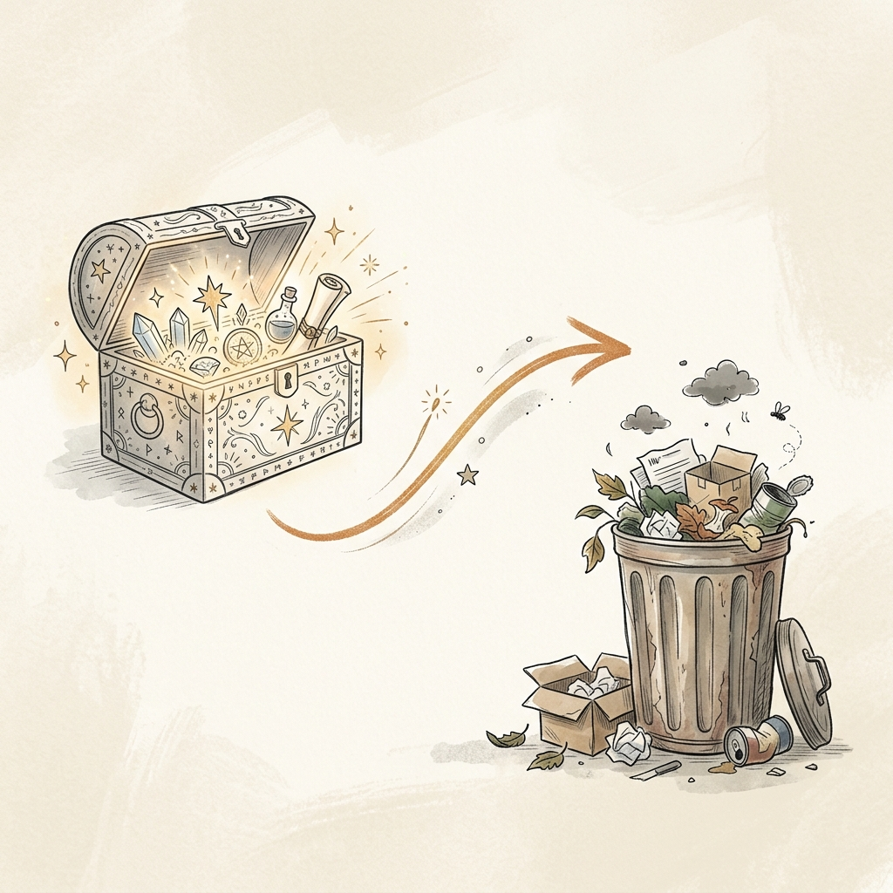
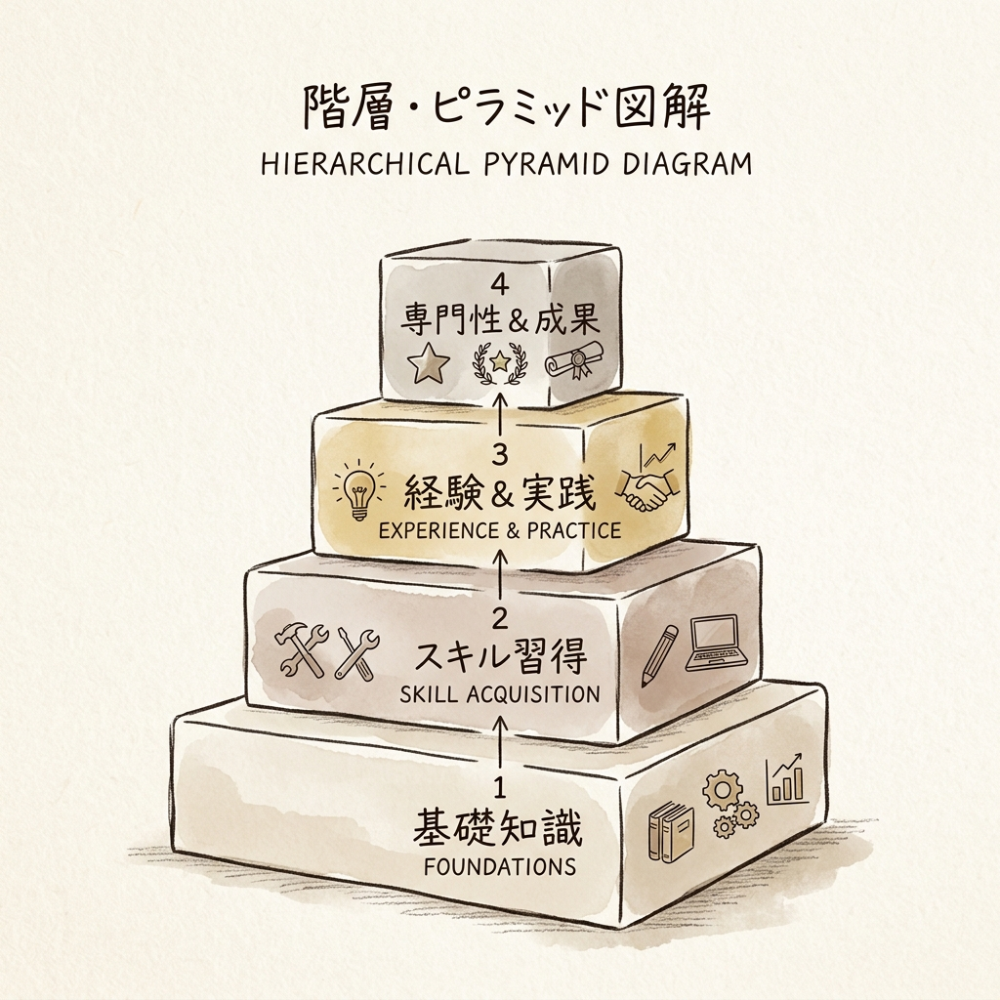

週末の午後、カフェでノートPCを開く。新しいAIツール——例えば、Claude CodeとObsidianの連携——を導入し、話題の「第2の脳」を作ってみた。
設定を終えて数回コマンドを叩くと、サクサクとメモが分類され、記事の下書きが自動生成されていく。
「お、これはすごい。ついに私の仕事も自動化されるのか」
コーヒーを飲みながら、未来を手に入れたような万能感に浸る。

しかし、1ヶ月後。
保存したはずのアイデアがどこにあるか分からない。
AIに記事を頼むと、前回直したはずの「無機質なトーン」に逆戻りしている。
「あの設定、どこに書いたっけ？」
「なぜ毎回同じ指示をしなければならないのか？」
システムが賢くなるどころか、自分の頭の中と同じように散らかっていく現実に気づく。
せっかく高いお金（サブスク代）と時間をかけたのに、結局自分の手を動かした方が早いじゃないか。
「AIが勝手に全部やってくれる」という期待は見事に裏切られ、システムを放置しそうになる。

この記事は、そんな風に「第2の脳」を持て余しているあなたに向けたものです。
魔法の箱への期待を捨て、「自分専用のシステム」をどのように育てていくのか。
その設計思想についてお話しします。

## 「第2の脳」が1ヶ月で使い物にならなくなる理由

### 魔法の箱への期待と裏切り
AIツールを入れた直後は、誰もが魔法を手に入れたように感じます。
しかし、それは「最初だけ部屋をピカピカにしてくれるが、掃除のルールを教えないとゴミをベッドの下に隠し始める最新型のお掃除ロボット」のようなもの。
時間が経つにつれて、機能不全が目立つようになります。
具体的には、入力された情報（コンテキスト）が長くなるにつれて、AIの出力品質が持続的に低下する現象（コンテキスト・ロット）や、誤った解釈が蓄積していく現象（エピステミック・ドリフト）が発生します。

### なぜAIは「忘れん坊」になるのか？
AIには、一度に覚えておける情報の量（作業机の広さ）である「コンテキストウィンドウ（Context Window）」に限界があります。
書類を広げる作業デスクを想像してみてください。広すぎてもどこに何があるか分からなくなりますよね。
情報が増えすぎるとAIの注意力が散漫になる仕組みです。
また、コンテキストが長くなると、最初と最後には注意を向けるのに、中盤にある重要な情報を見落としやすくなる「真ん中の喪失効果（Lost-in-the-Middle Effect）」という現象も起きます。
デスクの上に書類（メモや指示）を積み上げすぎると、一番下にある重要な契約書（初期のルール）が見つけられなくなる状態です。
さらに、AIエージェントの成功率は、作業時間が約35分を超えると急激に低下することが分かっています。エラーが起きると修復のためにさらにファイルを読み込み、それがさらなるノイズを生むという悪循環に陥るのです。

## 崩壊を防ぐ「4つのレイヤー」設計

この崩壊を防ぐためには、AIを単なるツールではなく「システム」として設計する必要があります。
そこで有効なのが、以下の4つのレイヤーでシステムを構築する設計思想です。

1.  **コンテキスト層（Layer 1）**: `CLAUDE.md`などを「司令塔」とし、状況別のルールを分離する。
2.  **自動化層（Layer 2）**: `Hooks（フック機能）`を用いて、「忘れる」「サボる」を物理的にブロックする。
3.  **機能層（Layer 3）**: 再利用可能な業務単位をコマンドやスキルとして切り出す。
4.  **協調層（Layer 4）**: 文脈を分離し、設計者と実装者を分ける（サブエージェントの活用）。

### 汎用テンプレの限界
誰にでも合うテンプレートは、結局誰にもフィットしません。
初期のうちは便利でも、自分のリズムに合わないことに気づくはずです。
「自分のルール」を教え込む必要があります。
たとえば、AIへの指示（インストラクション）が400行を超えると、遵守率が71%に低下するというデータがあります。
長く書けば書くほど、AIは指示を忘れやすくなるのです。

### 「確率的」なお願いから「決定論的」なルールへ
AIに対して「こういう風に書いてね」と指示を出す（確率的レイヤー）だけでは不十分です。
AIは文脈を理解して動こうとしますが、それはあくまで「お願い」であり、確実ではありません。
絶対に守るべきルールは、操作の前後で自動的に動くプログラム（決定論的レイヤー）で物理的にブロックする仕組み（Hooksなど）が必要です。
「廊下を走らないでね」と口で注意する（確率的）のではなく、廊下に「スピードバンプ（段差）」を設置して物理的に走れなくする（決定論的）ようなものです。

## 小さく始めて複利で育てる

### 「全部入り」の罠
最初から完璧なシステム（大量のプラグインや複雑な設定）を作ろうとすることは危険です。
AIの提案に直感的に従ってシステム構築を進めると、プロジェクトが拡大するにつれて致命的な失敗を招きます（Vibe Codingのカオス化）。
複数のAIスキルが干渉し合ったり、AIがバグのあるコードに合わせて「必ずパスする無意味なテスト」を生成するループに陥ったりする事例も報告されています。

### 最小限のルールと「余白」の確保
まずは「絶対に忘れてはいけないルール（Hook）」を3つだけ設定しましょう。
*   ファイル編集直後に読み込み（Read）を強制する
*   危険なコマンドをブロックする
*   セッション終了時にミスを振り返る

これだけです。
あとは運用しながら、本当に必要なスキルを月に1〜2個ずつ追加していく。
最初から豪華な庭園を造るのではなく、まずは雑草が生えないようにブロック（Hook）を置き、自分の好きな花（専用Skill）を一つずつ植えていくイメージです。

## あなた専用の「思考パートナー」を手に入れるために

### ツールの奴隷にならないための第一歩
今日からできる具体的なアクションプランを提案します。
まずは、現在の設定ファイル（CLAUDE.mdなど）の断捨離から始めましょう。
目標は200行以下です。
「自分の役割」「環境」「状況別の目次」だけを残し、細かいルールは別のファイルに切り出してください。
これだけで、AIの動作は劇的に改善されるはずです。

### 「仕組み」がもたらす本当の自由
「第2の脳」は、ただの便利なツールでも魔法の箱でもありません。
それは、AIが裏でこっそり整理し続けてくれる、自分専用の図書館（LLM Wiki）であり、あなたと一緒に成長する「思考パートナー」です。
システムが整うことで得られるのは、単なる時間の節約ではありません。
無駄なやり取りや手戻りから解放されることでもたらされる、思考の「余白」です。

あなたが作ろうとしているのは、何でも放り込める巨大なゴミ箱ですか？
それとも、あなたと共に思考を深め、成長していくパートナーですか？
「第2の脳」は買うものではなく、育てるものです。
まずは小さなルールを一つ設けるところから、設計を始めてみませんか。

<!-- 参照ファイル一覧
- 03_detailed_agenda.md
- 04_blog_post.md
- 05_thumbnail_prompts.md
- 06_section_prompts.md
- ./thumbnail.png
- ./img1.png
- ./img2.png
- ./img3.png
-->
