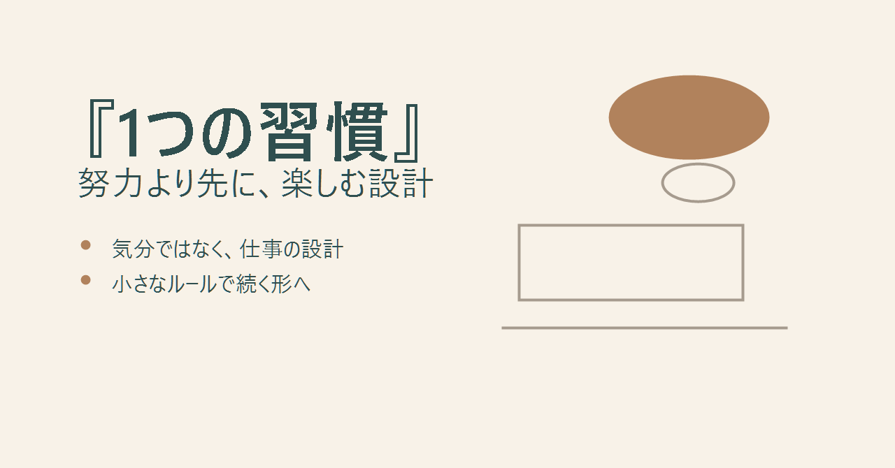
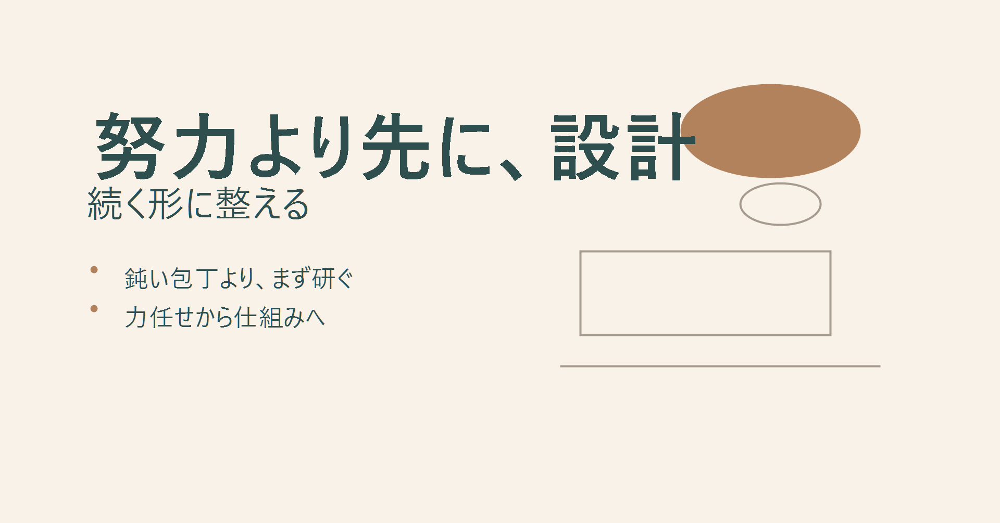
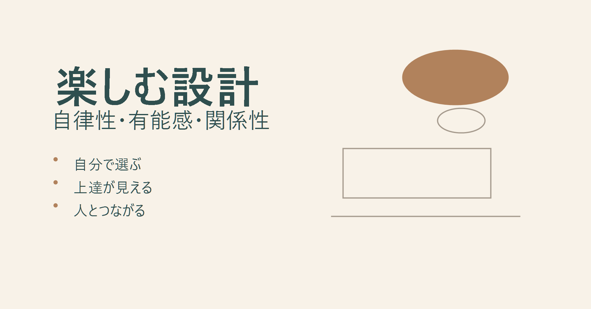
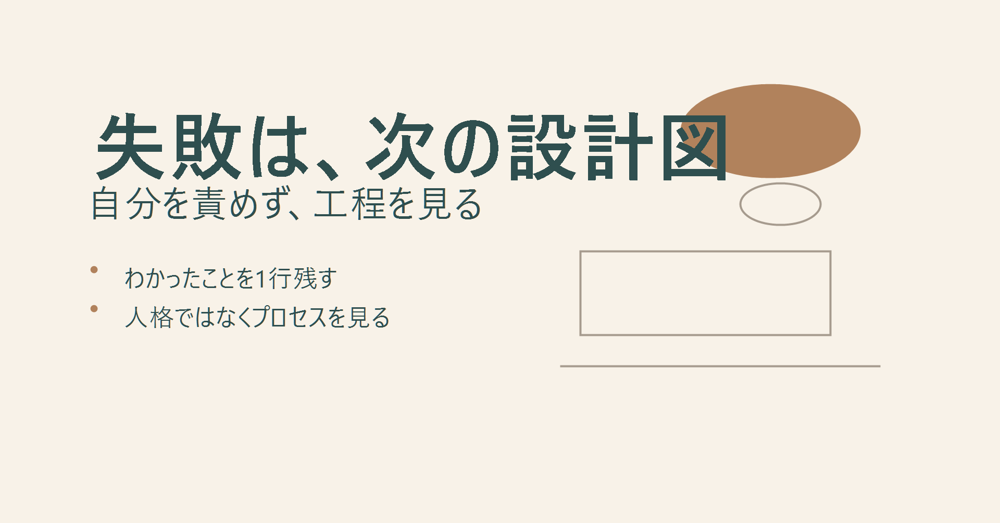
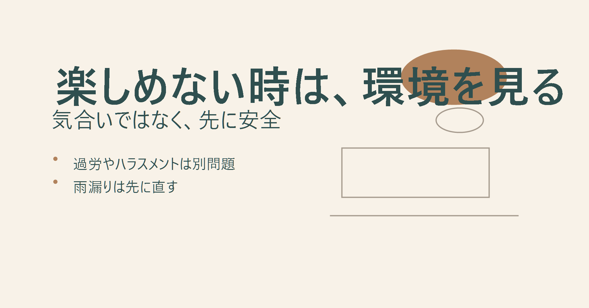

---
title: "1つの習慣から学ぶ、努力より先に整える楽しむ設計"
description: "横山直宏氏の『1つの習慣』をもとに、努力や我慢に頼らず仕事を続けるための楽しむ設計を解説。内発的動機づけ、失敗の意味づけ、環境の見極めまで扱います。"
pubDate: "2026-05-03"
tags: ["1つの習慣", "横山直宏", "楽しむ力", "自己啓発", "マインドセット"]
heroImage: "./thumbnail.png"
slug: "one-habit-enjoyment-design"
draft: false
---

# 『1つの習慣』が教える、努力より先に整えるべき「楽しむ設計」

月曜の朝、まだ家を出る前から、頭の中だけ先に会社へ着いていることがあります。

今日の会議。返信していないメール。先週から残っている資料。数字の進捗。部下からの相談。上司への報告。

コーヒーを飲んでも、体が仕事に追いつかない。休んだはずなのに、どこか重い。真面目にやっていないわけではありません。むしろ、かなり真面目にやっている。手を抜くのが苦手で、頼まれたことは断りにくい。遅れが出れば、自分の時間を削って埋める。

それでも、なぜか仕事は軽くならない。

ここに、今回取り上げる本の入口があります。横山直宏さんの『1つの習慣 うまくいく人は、なぜ「これ」を大切にするのか』です。すばる舎の公式書誌では、出版年月日は2025年7月24日、ISBNは9784799113400、判型は4-6、ページ数は232ページと確認できます。flierの要約では、本書の要点として「楽しむこと」「内発的動機づけ」「意味づけの変更」が挙げられています。

この本の中心にあるのは、とても短い言葉です。

楽しむ。

ただ、この言葉は誤解されやすい。軽く聞こえるからです。「楽しむなんて、余裕のある人の話でしょう」「仕事はそんなに甘くない」「結局、気持ちの問題にされるのでは」と感じる人もいるはずです。かつての私も、そういう受け止め方をしていました。

でも、論理的に整理すると、「楽しむ」は気分の問題ではありません。仕事や人生を長く続けるための設計技術です。

ここでいう設計とは、根性で自分を動かすのではなく、自然に動ける仕組みを先に置くことです。料理でいえば、腕力で固い野菜を切ろうとする前に、包丁を研ぐこと。家計でいえば、毎回の我慢に頼る前に、固定費の構造を変えること。仕事でいえば、つらい作業をつらいまま抱えるのではなく、攻略できる形に置き換えることです。

## 努力しているのに報われない人が見落としている前提

真面目な人ほど、「努力量」を信じます。

長く働いた。休まず続けた。自分を抑えて対応した。だから、いつか報われるはずだ。これは美しい考え方です。でも、常に正しいとは限りません。

特に現代の仕事では、単純な作業量よりも、判断、集中、工夫、学習、関係づくりの比重が高くなっています。つまり、ただ耐える力だけでは成果につながりにくい。むしろ、疲れた頭で続けるほど視野が狭くなり、同じやり方を繰り返しやすくなります。

ここで重要なのが、内発的動機づけです。内発的動機づけとは、興味や納得から自分で動く力のことです。反対に、評価、罰、報酬、周囲の目で動く力は外発的動機づけです。

外発的動機づけが悪いわけではありません。給与、評価、締切、責任。仕事には必要です。ただ、それだけで長く走ると、心の燃費が悪くなります。ガソリンを入れ続けても、エンジンの調整が悪ければ走行距離は伸びません。

本書の「楽しむ」という考え方は、この燃費の問題に触れています。

楽しいから遊ぶ、という話ではありません。面倒な仕事の中にも、自分で意味を見つけ、ルールを作り、工夫の余地を残す。すると、同じ作業でも消耗の仕方が変わります。

たとえば、メール返信を「早く片づけなければならない雑務」と捉えると、気が重くなります。でも、「25分で要点だけ返す訓練」と決めると、少しだけゲームになります。資料作成も、「完璧な資料を作る苦行」ではなく、「読み手が3分で判断できる構造を作る実験」と捉えれば、見る場所が変わります。

小さな違いです。でも、毎日積み重なると大きい。

## 「楽しむ」は気晴らしではなく戦略である

本書が扱う「楽しむ」は、休日に好きなことをしてリフレッシュする、という意味だけではありません。むしろ本丸は、平日の重い時間をどう設計し直すかにあります。

flierの要約では、本書の要点として「うまくいくための1つの習慣は、なにごとも楽しむこと」と整理されています。また、内発的動機づけで働くと仕事のパフォーマンスが高まり、自律性、有能感、関係性を意識することが重要だとされています。

自律性とは、自分で選んでいる感覚です。有能感とは、少しずつできるようになっている感覚です。関係性とは、人とつながっている感覚です。どれも、仕事を長く続けるうえで大切な土台です。

この3つを、日常の作業に戻して考えてみます。

自律性がない仕事は、ずっと「やらされている」状態になります。たとえ作業自体は簡単でも、心は重い。逆に、選べる範囲が少しでもあると、同じ仕事でも受け取り方が変わります。たとえば、会議資料の順番を自分で設計する。返信する時間帯を自分で決める。朝一番に重い仕事を置かず、頭が温まってから取りかかる。これだけでも、自分でハンドルを握っている感覚が戻ります。

有能感がない仕事は、砂を運んでいるような感覚になります。どれだけやっても、前に進んでいる感じがしない。ここでは、進捗が見える形にすることが効きます。チェックリスト、時間記録、処理件数、改善メモ。数字は自慢のためではなく、選択肢の存在証明として使う。昨日より5分早く終わった。先週より手戻りが1回減った。それだけで、仕事は少し攻略対象になります。

関係性がない仕事は、孤独な作業になります。誰のためにやっているのか見えない。ここでは、相手の判断が軽くなる、誰かの時間を取り戻す、次工程の人が迷わない、という視点を入れます。製造業でいえば、前工程と後工程の関係です。自分の工程だけ整っていても、次に渡す人が詰まれば全体は止まる。仕事を楽しむとは、自分だけ機嫌よくすることではなく、流れ全体を見えるようにすることでもあります。

## ごきげんは感情論ではない。パフォーマンス管理である

「ごきげんで仕事をする」と聞くと、少し軽く聞こえます。でも、実務ではかなり重要です。

不機嫌な状態では、人は守りに入ります。ミスを避けることに意識が向き、新しい工夫を試しにくくなる。言葉も硬くなり、相談も遅れる。チーム全体の空気も重くなります。

一方で、機嫌が安定している人は、判断に余白があります。失敗しても、すぐに「次はどうするか」へ移れる。これは単なる性格の問題ではありません。自分の状態を管理する技術です。

認知リソースという言葉があります。考えるために使える頭の余力のことです。スマホのバッテリーに近いですね。朝から通知、会議、雑談、細かな判断で残量を減らしていくと、夕方には大事な判断が雑になります。

楽しむ設計は、この認知リソースを守る方法でもあります。

たとえば、毎朝すぐにメールを開く習慣があると、1日の主導権を他人の依頼に渡しやすくなります。そこで、最初の30分だけ自分の重要タスクに使う。これは大きな改革ではありません。でも、朝の認知リソースを守る設計です。

あるいは、退屈な定型作業を10件単位で区切る。終わるたびに小さな記録を残す。これも単純ですが、脳に「進んでいる」というフィードバックを返します。家計簿でいえば、月末にまとめて反省するのではなく、毎日100円単位で支出の流れを見るようなものです。

人は、終わりが見えない作業に弱い。逆に、区切りと手応えがある作業には戻りやすい。

## 仕事をゲーム化すると、何が変わるのか

ゲーム化とは、面倒な作業にルール、点数、制限時間、達成条件などを加えて、攻略対象に変えることです。

これは幼稚な工夫ではありません。日々の仕事から「自分で選んでいる感覚」と「上達している感覚」を取り戻すための方法です。

たとえば、資料作成が苦手な人なら、次のようなルールを作れます。

- 1枚目だけで結論が伝わるかを確認する。
- 1スライド1メッセージにする。
- 文字数を前回より2割減らす。
- 読み手が迷う専門用語には一言解説を付ける。

これだけで、資料作成は「長く苦しむ作業」から「制約の中で整えるパズル」に変わります。

メール処理なら、こうです。

- 返信は結論、理由、次アクションの3行から始める。
- 迷ったら下書きに残さず、確認事項を1つだけ返す。
- 25分で処理する件数を記録する。

会議なら、こうです。

- 会議前に「今日決めること」を1行で書く。
- 会議後に「誰が、いつまでに、何をするか」だけ残す。
- 次回同じ議題が出ない状態をゴールにする。

どれも派手ではありません。でも、こうした小さな制約が、仕事を攻略可能な形に変えます。

料理にたとえるなら、冷蔵庫の余り物で一品作るようなものです。材料が無限にあると、かえって迷う。制約があるから工夫が生まれる。仕事も同じです。

## 意味づけを変えると、失敗の扱いが変わる

flierの要約では、本書の要点として「過去のできごとは変えられないが、そのできごとに対する意味づけは変えられる」とされています。

これは、かなり実務的な話です。

仕事で失敗すると、多くの人は「自分はだめだ」と受け取ります。もちろん、反省は必要です。でも、失敗を人格評価にしてしまうと、次の行動が鈍ります。

ここで使えるのが、リフレーミングです。リフレーミングとは、出来事の意味づけを変えることです。雨の日を「予定が崩れた日」と見るか、「家の中を整える日」と見るか。出来事は同じでも、次の行動が変わります。

仕事の失敗も同じです。

「提案が通らなかった」は、「自分に価値がない」ではありません。「相手の判断条件を取り違えていたデータが取れた」とも見られます。

「資料が差し戻された」は、「能力不足」だけではありません。「読み手が最初に知りたい順番と、自分が説明したい順番がズレていた」と見ることもできます。

「部下に伝わらなかった」は、「相手の理解力が低い」ではありません。「自分の指示が作業単位まで分解されていなかった」と見ることもできます。

この見方は、言い訳ではありません。原因を扱える大きさに切り分ける作業です。製造現場で不良が出たとき、作業者の気合いだけを原因にしても改善しません。治具、手順、検査、材料、環境を見ます。人を責めるより、プロセスを見る。

楽しむ設計も同じです。自分を責める前に、工程を見る。

## ただし、楽しめない環境まで自分のせいにしない

ここは、はっきり分けておきたいところです。

「楽しむ」は強い考え方です。でも、万能ではありません。過労、ハラスメント、深刻なメンタル不調、睡眠不足、生活不安がある場合、「楽しみ方を変えよう」だけでは足りません。

有害なポジティビティという言葉があります。つらい状況を無理に前向きな言葉で覆い隠してしまう態度のことです。雨漏りしている部屋で、「雨音を楽しみましょう」と言われても、まず屋根を直すべきです。

仕事も同じです。

毎日終電に近い。上司から人格否定がある。休んでも疲れが抜けない。休日に何も感じられない。そういう状態なら、ゲーム化より先に、距離を取る、相談する、医療や公的窓口を使う、異動や転職を検討する、といった現実的な選択が必要です。

楽しむことは、壊れた環境に耐えるための麻酔ではありません。

むしろ、自分の状態を正確に見るための感度です。楽しめない自分を責めるのではなく、「これは設計で変えられる重さなのか、環境を変えるべき重さなのか」を切り分ける。その冷静さが必要です。

## 明日からできる「楽しむ設計」3つ

ここからは、明日から試せる形に落とします。大きく変える必要はありません。むしろ、小さく始めた方が続きます。

### 1. 退屈な作業をタイムアタックにする

まず、1つだけ時間を区切ります。

メール返信なら25分。資料の構成なら15分。経費処理なら20分。制限時間を決めると、作業の輪郭が見えます。

ポイントは、完璧を目指さないことです。時間内に終わらせる訓練ではなく、時間内にどこまで進むかを見る実験です。終わらなかったら、次回の見積もり材料になります。

これは家計管理に似ています。最初から完璧な節約をするのではなく、まず1週間だけ支出を記録する。現実が見えると、改善できます。

### 2. 「失敗した」を「データが取れた」に言い換える

失敗の直後に、次の一文を書きます。

「今回わかったことは何か」

これだけです。

提案が通らなかったなら、相手が重視していた条件を書く。資料が差し戻されたなら、読みにくかった箇所を書く。会議が長引いたなら、決めることが曖昧だった箇所を書く。

感情を消す必要はありません。悔しさはあっていい。ただ、悔しさだけで終わらせず、次の工程に渡せる形にする。

製造業でいう不良解析に近いです。不良品を見て落ち込むだけでは改善しません。どの工程で、どんな条件で、何が起きたかを見る。仕事の失敗も、同じように扱えます。

### 3. エネルギーを奪うものを1つ遮断する

楽しむには、余白が必要です。余白がない状態で楽しもうとしても、うまくいきません。

まず、エネルギーを奪っているものを1つだけ減らします。

- 朝起きてすぐの通知確認をやめる。
- 寝る前のニュースアプリを開かない。
- 会議と会議の間に5分だけ空白を入れる。
- 返信しなくていいチャット通知を切る。
- 毎日迷う服や持ち物を固定する。

小さいですが、効きます。人は大きな決断だけで疲れるのではありません。小さな判断の積み重ねで疲れます。

冷蔵庫の目線の高さに野菜を置くと、自然に選びやすくなる。玄関に傘を置くと、雨の日に探さずに済む。環境のデフォルトを変えると、意志の消耗が減ります。

## 「楽しむ人」は、がんばっていないのではない

ここを誤解しない方がいいと思います。

楽しむ人は、努力を放棄しているわけではありません。むしろ、努力が続く形を知っています。

長く歩く人ほど、靴を選びます。毎日使う道具ほど、手になじむ形に整えます。仕事も同じです。根性で何とかする前に、続けられるフォームを作る。

本書の「楽しむ」という言葉は、一見すると柔らかい。でも、その裏にあるのはかなり合理的な考え方です。

苦しいまま続けることを美徳にしない。つらい環境を、自分の努力不足にしない。仕事の中に小さな選択肢を戻す。失敗をデータに変える。退屈な作業を攻略対象にする。自分の状態を守る。

これは、自由を根性ではなく設計で手に入れる発想に近いです。

## もう少し実務に落とす。楽しむ設計は「小さな権限」を取り戻すこと

仕事が重くなる理由のひとつは、自分で決めている感覚が消えることです。

会議の時間は決まっている。締切も決まっている。評価基準も決まっている。お客様の都合もある。上司の判断もある。そういう中で働いていると、いつの間にか「自分で選べる場所などない」と感じるようになります。

でも、実際には小さな権限が残っています。

どの順番で片づけるか。最初の15分で何を見るか。資料の1枚目に何を書くか。依頼を受けたとき、すぐに抱え込むのではなく、確認事項を1つ返すか。会議の最後に、次の行動を一文で残すか。

こうした小さな権限を取り戻すことが、楽しむ設計の入口です。

大げさな自由でなくていい。まずは机の上の配置を変えるくらいの自由です。毎朝、開くファイルを1つ減らす。通知を少し遅らせる。今日やることを3つだけに絞る。こういう小さな調整が、自分でハンドルを握っている感覚を戻します。

真面目な人ほど、全部を引き受けます。頼まれたら断らない。曖昧な依頼も自分で補う。誰かが困っていたら、自分の時間を削って助ける。それ自体は悪いことではありません。でも、それが続くと、自分の仕事の設計権がなくなります。

楽しむとは、好き勝手にすることではありません。自分の仕事に、小さな設計権を戻すことです。

## 「楽しむ」と「楽をする」は違う

ここも混同されやすいところです。

楽しむと聞くと、苦労を避けること、面倒を減らすこと、楽をすることだと思われがちです。でも、本書の文脈で考えるなら、楽しむとは負荷をゼロにすることではありません。負荷に意味と手応えを入れることです。

筋トレで考えるとわかりやすいです。負荷がなければ成長しません。でも、フォームが崩れたまま重い重量を扱えば、体を壊します。仕事も同じです。負荷は必要です。ただし、続けられるフォームが必要です。

たとえば、新しい仕事を任されたとき、「また面倒なことが増えた」と思うのは自然です。そこで一歩だけ視点を変えます。「この仕事で、自分のどのスキルを1つだけ伸ばすか」と決める。資料なら構成力。交渉なら質問力。会議なら要約力。全部を成長機会にする必要はありません。1つでいい。

1つだけ伸ばす対象を決めると、仕事に観察の目が入ります。観察が入ると、作業は少し実験になります。実験になると、失敗も材料になります。

この流れが、楽しむ設計です。

## 読者が最初に捨てるべき思い込み

最初に捨てるべきなのは、「苦労したものほど価値がある」という思い込みです。

もちろん、苦労の中でしか身につかないものはあります。長く続けた人にしか見えない景色もあります。でも、苦労そのものを価値にしてしまうと、改善が止まります。

1時間かかっていた作業が、仕組みを変えて15分で終わるようになった。そのとき、「楽をしている」と感じる必要はありません。浮いた45分は、別の判断、学習、休息、家族との時間に使えます。仕事の価値は、苦しんだ時間の長さではなく、誰の判断を軽くしたか、どんな選択肢を増やしたかで見た方がいい。

これは、AIや自動化の時代には特に重要です。短時間で高い品質を出せる方法があるなら、それを使うべきです。大切なのは、手を抜くことではなく、浮いた時間をどこに再投資するかです。

楽しむ人は、苦労を否定しているのではありません。苦労を目的にしないだけです。

## この記事の使い方

この記事を読んで、急に人生を変える必要はありません。

むしろ、今日やることは小さい方がいい。明日の仕事を1つだけ選び、それにルールを足してください。

メールなら、最初の一文を結論にする。

資料なら、1枚目に読み手の判断材料だけ置く。

会議なら、最後に次アクションを1行で残す。

失敗したら、「今回わかったこと」を1行だけ書く。

これで十分です。

大きな変化は、小さな設計変更の積み重ねで起きます。最初から完璧な仕組みにしようとすると、それ自体がまた重い仕事になります。まずは、明日の自分が少し楽に始められる形を作る。

楽しむとは、自分を甘やかすことではありません。明日の自分が続けられるように、今日の置き方を変えることです。

最後に、ひとつだけ問いを置きます。

あなたが今つらいのは、努力が足りないからでしょうか。

それとも、努力が続かない形に、仕事を置いているからでしょうか。

もし後者なら、今日変えるべきものは気合いではありません。仕組みです。まずは1つだけ、明日の仕事に小さなゲームのルールを入れてみてください。25分でメールを返す。失敗メモを1行だけ残す。朝の通知を30分遅らせる。

その小さな変更が、仕事との関係を少しだけ変えます。

楽しむとは、現実から逃げることではありません。現実を、扱える形に設計し直すことです。

## 出典メモ

- すばる舎公式書誌: 『1つの習慣 うまくいく人は、なぜ「これ」を大切にするのか』、横山直宏 著、出版年月日 2025年7月24日、ISBN 9784799113400、4-6判、232ページ。
- e-hon書誌: 出版年月 2025年7月、ISBN 978-4-7991-1340-0、229ページ、19cm。
- flier要約: 要約公開日 2025年9月18日。要点として「楽しむこと」「内発的動機づけ」「意味づけ変更」を確認。

<!-- 参照ファイル一覧
- 03_detailed_agenda.md
- 04_blog_post.md
- 05_thumbnail_prompts.md
- 06_section_prompts.md
- ./thumbnail.png
- ./img1.png 〜 ./img4.png
-->
