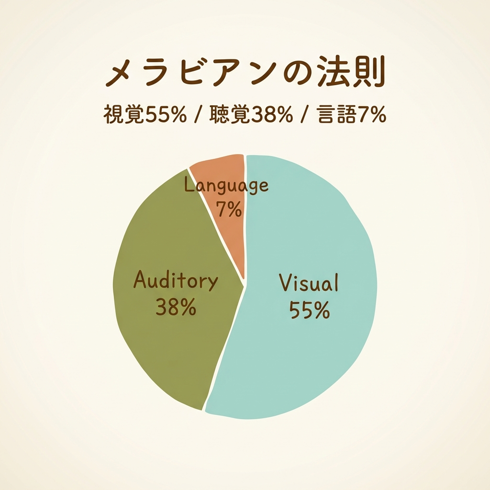
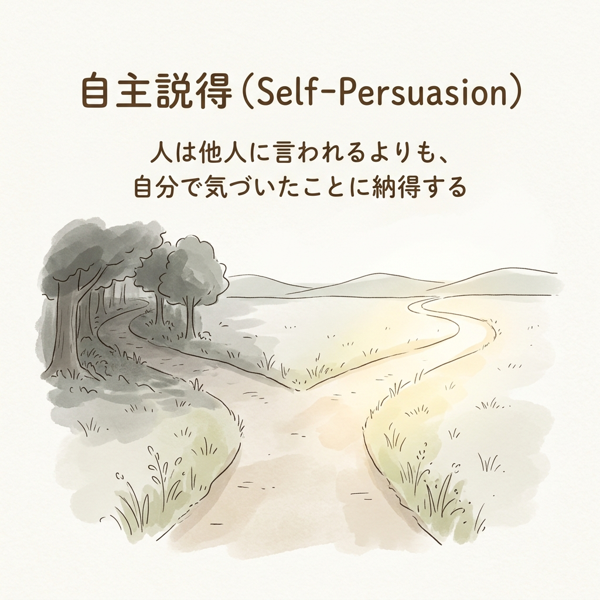

月曜の朝8時。
まだ誰もいない静かな喫茶店で、コーヒーが冷めないうちに今日の予定を3つだけに絞り込んでいました。窓の外では、足早にオフィスへと向かう人々の群れが流れていく。
ふと、昔の自分の姿が重なったんですよね。完璧な資料を作り上げ、データも揃っているのに、いざ本番が近づくと心臓の鼓動が早くなるあの嫌な感覚。

「言ってることは正しいんだけど、なんだか自信なさそうだったね」

先日の商談後、同僚からかけられた何気ない一言。あんなに準備したのに、なぜ伝わらなかったのか。「自分にはリーダーシップがないのか？」と自問自答し、やるせない悔しさと静かな怒りを抱えていた日々を思い出します。真面目に働いている人ほど、この罠にはまりやすい。

でも、安心してください。自由や自信は、根性ではなく「設計」で手に入るんです。あなたが無意識のうちに陥っている「損する話し方」から脱却し、静かな確信を持って相手を動かすシステムを紐解いていきましょう。

## 準備は完璧なのに、なぜ評価されないのか

あなたの実力や専門知識が不足しているわけじゃないんです。それは、最高級の食材を使っているのに、盛り付ける器がバキバキに割れているような状態。どれだけ中身が素晴らしくても、相手の目には「割れた器」ばかりが映ってしまうんです。

実は、日本人の約40％が1分間に6回以上も「えー」「あのー」といったフィラー語を発しているというデータがあります。これを1時間のプレゼンに換算すると、実に4分間も無意味な音を発していることに。これ、単なる時間の無駄じゃないですよね。「自分は頼りない人間です」という見えないノイズを相手に浴びせ続けているようなものです。

ここで重要なのが、相手はあなたの話の「内容」ではなく「あなた自身」を先に評価しているという冷酷な事実です。
心理学には初頭効果というものがあって、最初に与えられた情報がその後の印象を決定づけてしまう。面接の最初の挨拶が爽やかだと、その後の小さなミスも「愛嬌」に見えるアレです。

最新の研究によれば、スピーチ開始後わずか3〜5秒で、聴衆は最終的な評価を下すための情報を揃え始めるそうです。本の表紙を見た瞬間に「面白そう」と直感するのと同じで、あなたのプレゼンは言葉を発する前の「最初の数秒」の姿勢や表情ですでに勝負が始まっている。残酷ですが、これが現実です。

## なぜ「損する話し方」に陥るのか：謎解きとしての専門解説

「えー」「あのー」というつなぎ言葉や、「たぶん〜だと思います」と断定を避けるヘッジ表現。これらは、自分が傷つかないための「盾」として使ってしまっている言葉なんです。

綺麗なガラス窓に付いた無数の指紋を想像してみてください。外の素晴らしい景色を見せたいのに、相手はガラスの汚ればかり気になってしまう。
メラビアンの法則によれば、視覚・聴覚情報が93%を占め、話の内容はわずか7%。怒った顔で「楽しいです」と言われても誰も信じないように、自信のない声で語られる素晴らしいデータは、相手の心には届きません。

じゃあ、なぜ人前に立つと過度に緊張し、声や手が震えてしまうのか。
あがり症克服協会の調査でも、緊張時の悩みのトップは「声の震え（75%）」だそうです。でも、論理的に整理すると、緊張時に分泌されるアドレナリンって、実は「興奮」している時と全く同じ物質なんですよね。

ジェットコースターに乗る前の「ワクワク」と「恐怖」。脳内で起きている化学反応は同じで、ただ脳がどうラベル付けしているかの違いに過ぎない。「緊張しないように」と念じれば念じるほど、震えは増幅します。緊張を敵視するのではなく、「これは体が戦う準備をしているサインだ（ワクワクしている）」と脳を再設計することから始めてみてください。

## テクニックの限界と本質：教訓の抽象化

巷には「話し方の心理テクニック」が溢れかえっています。相手の仕草を真似る「ミラーリング」もその一つですが、優秀な実務家相手に小手先のテクニックを使うと、見事なまでに逆効果になります。

人は、自分の行動や選択の自由を奪われそうになると無意識に反発する心理を持っています（心理的リアクタンス）。服屋で店員に不自然に後ろを付いて回られると、急に買いたくなくなるあの感覚。相手のセンサーが「操ろうとしている」と反応した瞬間、そこにあったはずの信頼残高はゼロになります。

じゃあ、どうすれば相手を動かせるのか。計算すると、答えは恐ろしいほどシンプルです。「一方的な説明」を受けたグループが実際に行動を起こした割合はわずか3%だったのに対し、自分で納得させたグループの実行率は32%と、約10倍もの差が出たという実験データがあります。

映画のネタバレをされるより、自分で結末を予想する方がワクワクしますよね。他人に説得されるのではなく、自らの問いかけによって自分自身を納得させる自主説得（Self-Persuasion）のシステムを設計するんです。「ウチの提案の良いところはどこだと思いますか？」と問いかけ、相手自身の口からメリットを語らせる。それが最も強固な合意形成の仕組みになります。

## 「ベストバージョン」の設計：具体的なアクションプラン

具体的な設計図をお渡しします。まず、フィラーワードをなくすための物理的なシステムから。
各文の最初の一語をはっきり強く発声し、文を言い切った後は「必ず唇をしっかり閉じて黙る」。これだけで、物理的に「えー」という音を出せなくなります。

沈黙を恐れる必要は全くありません。音楽における「休符」と同じで、音がない時間が次のメロディを際立たせる。スティーブ・ジョブズも、プレゼン中に意図的に「7秒の沈黙」を取り入れていました。間を恐れず、むしろ聞き手に思考する時間を与える武器として再投資してください。

次に、相手との信頼を築くシステムです。
MacのパソコンにWindowsのソフトを入れようとしても動かないのと同じで、まずは相手のOS（価値観や判断基準）を見極める。スピードを重視する人には結論から話し、正確性を重んじる人にはエビデンスを提示する。行動ではなく「価値観」をミラーリングすることが、本質的な信頼を生みます。

本番の2分前、誰もいない場所で両手を広げて胸を張る「パワーポーズ」をとってみてください。主観的な自信が湧いてくるはずです。そして、自分のために話すのではなく、知識を必要としている相手を守るための「プロフェッショナルという着ぐるみ」を着るのです。

---

今の働き方、話し方のまま、5年後も同じだとしたら——それでいいですか？

あなたの言葉は、相手にただ「情報」を渡しているだけでしょうか？それとも「感情」を動かしていますか？
「自然体」で話すことは、実は最も不親切なコミュニケーションです。本当に伝えるべき相手の前では、あえて「プロという着ぐるみ」を着ることこそが、最大の誠実さ。

仕組みさえあれば、誰にでも再現できます。明日の朝、あなたの言葉が少しだけ重みを持つようになった時、見慣れた職場の景色は全く違うものになっているはずです。

<!-- 参照ファイル一覧
- 03_detailed_agenda.md
- 04_blog_post.md
- 05_thumbnail_prompts.md
- 06_section_prompts.md
- ./thumbnail.png
- ./img1.png
- ./img2.png
-->
