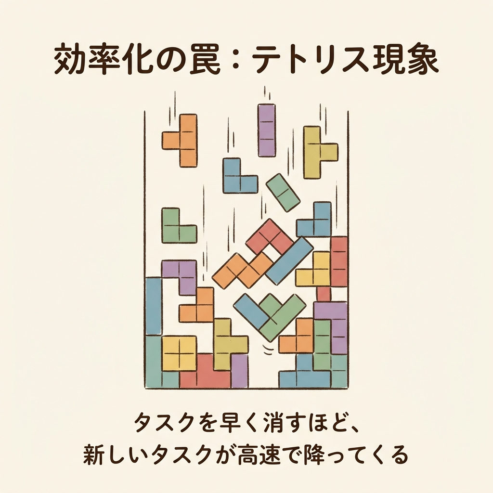
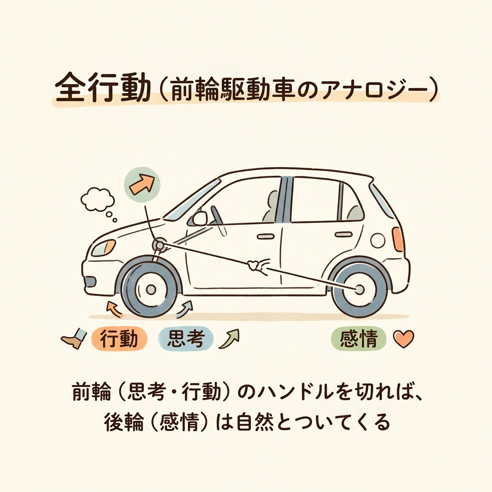

朝8時。満員電車に揺られながら、スマートフォンのカレンダーアプリを開く。
今日は夕方まで、15分刻みで隙間なく埋まった予定表。
ちょっと時間が空けば、たまったメールを返し、チャットツールで複数プロジェクトの進捗を確認する。息をつく間もなく、SNSのタイムラインで同業者の投稿をチェックしては「いいね」を押して自分の存在感も維持する。

最新のタスク管理ツールを使いこなし、誰よりも早くレスポンスを返す。
それは、どこからどう見ても優秀な社員の日常です。かつての私も、まったく同じように日々をこなしていました。

でも、ある日、予定外のクレーム対応が1件入っただけで、精緻なパズルのように組まれたスケジュールは完全に崩壊しました。深夜のオフィスでPC画面を見つめながら、ふと、強烈な違和感を覚えたのです。

「これだけ効率化して時間を捻出しているのに、なぜ自分のための時間は1秒も増えないのだろうか」

他人のタスクを高速で処理し続けるために、自分の人生という有限の時間を切り売りしている。
終わらない忙しさへの静かな絶望。もしあなたが月曜日の朝に似たような憂鬱を抱えているとしたら、今の働き方、5年後も同じだとしたら——それでいいですか？

今回は、私たちが陥りがちな効率化の罠を解き明かし、根性論ではなく「設計」によって自分だけの時間を取り戻す方法について、少し数字とロジックを交えてお話しします。

## 導入と問題提起（効率化の罠）

### 「空いた時間」は誰のものか？
タスクを早く終わらせれば、自分の時間が増える。私たちはそう信じて、色々な時間管理術を試します。
でも、現実に起きるのは「空いた時間に別の仕事が押し込まれる」という現象です。

これを私は「テトリス現象」と呼んでいます。
落ちてくるブロックを素早く正確に処理して消せば消すほど、ゲームのスピードは上がり、より多くのブロックが高速で降ってくるようになります。そして最終的にはキャパシティを超え、あっけなくゲームオーバーを迎えるのです。

厚生労働省の調査（平成29年）によると、58.3%の労働者が仕事や職業生活に関して強いストレスを感じています。また、Wiley社が2,360名を対象に実施した調査では、47％のマネジャーが深刻なストレスを抱えており、週に15時間以上を会議に費やしている管理職に至っては、その60％が深刻なストレスを訴えているそうです。

私たちは自分を楽にするために効率化しているはずなのに、結果として自分自身を追い込んでしまっているのです。

### タイムマネジメントという名の自己搾取
では、スケジュールを100%管理し、タスクを隙間なく埋めることは正解なのでしょうか。

ここで思い浮かべてほしいのが「線路のつなぎ目」です。
電車のレールには、必ず隙間が設けられています。これは気温の変化による熱膨張や、電車が走る際の振動を逃がすためです。もしこの隙間がなくレールが100%密着していたら、熱で膨張したレールは歪み、大事故につながります。

人間のスケジュールも全く同じです。100%の稼働を前提に組まれたスケジュールは、たった一つのトラブルや予定外の仕事で簡単に破綻します。（ちなみに、残業理由の31.2%は「突発的な仕事」が占めています）
時間を完璧に管理しようとする試み自体が無益であり、かえって焦りやストレスを増幅させると、専門家も指摘しています。

## 謎解きとしての専門解説（なぜ忙しさは終わらないのか）

### 「外的コントロール」に縛られた選択
なぜ私たちは、レールが歪むまでタスクを詰め込み、他人の期待に応えようとしてしまうのでしょうか。
その答えは、心理学の概念である「外的コントロール（External Control）」にあります。これは、批判や強要など、相手を自分の思い通りに変えようとするアプローチや、外部からの刺激によって動かされる状態を指します。

これは童話の「白雪姫の女王の鏡」のようなものです。
「世界で一番美しいのは誰？」と他人の評価という鏡に向かって問いかけ、自分が有能であり、必要とされている人間であることを確認し続ける、終わりのないループ。

上司からの評価、同僚からの承認、あるいはSNSでの「いいね」の数。私たちは、他人の期待という外的コントロールの基準で自分の行動を選択している限り、他人のタスクをこなす他人軸の人生から抜け出すことはできません。

### 本当に必要なのは「上質世界」という北極星
ここで、ウィリアム・グラッサー博士が提唱した「選択理論心理学（Choice Theory）」が重要な手がかりとなります。これは、人間の行動は外部からの刺激ではなく、内側から動機づけられて自ら選択しているとする心理学です。他人のリモコンではなく、自分の意志で自分を操縦する考え方ですね。

選択理論では、私たちの脳内には「上質世界（Quality World）」と呼ばれる領域があると考えます。
これは、自分の基本的な欲求を満たしてくれる人、物、価値観などのイメージを集めた、いわば頭の中にだけある自分専用の「願望の写真アルバム」です。

私たちは無意識のうちに、現実世界とこのアルバムの中の写真（理想）を一致させるために行動を選択しています。忙しさに忙殺されている人は、単に時間が足りないのではなく、自分の上質世界に何がファイリングされているのかを見失い、他人のアルバムを自分のものだと錯覚している状態なのです。

## 教訓の抽象化と普遍的なテーマへの昇華

### 行動のハンドルは自分が握っている
選択理論では、人間の行動を「行為」「思考」「感情」「生理反応」の4つの要素からなる「全行動」と定義し、これを「前輪駆動車」にたとえます。

後輪である感情や生理反応（疲れ、痛み）は、直接操作することができません。イライラを今すぐ消そうとしても無理なように。
しかし、前輪である行為と思考は、自分でハンドルを切ってコントロールすることができます。前輪の向きを変えれば、それに引っ張られて後輪（感情）も自然とついてきます。

つまり、他人の期待という他人のリモコンで動くのではなく、自分の意志で自分を操縦する。自分自身の上質世界に向けて、ハンドルを握り直すことが第一歩です。

### 痛みを無視しない——感情はダッシュボードの警告灯
とはいえ、「自分が本当に望むもの」がすぐに分からないという方も多いでしょう。
そんな時は、あなたの「ダッシュボードの警告灯」に目を向けてください。

車を運転しているとき、燃料切れやエンジンの異常を知らせる赤いランプが点滅したら、どうしますか？ ランプをガムテープで隠して走り続ける人はいないはずです。
私たちのネガティブな感情（憂鬱、苛立ち、強い疲労感）は、まさにこの警告灯です。

「これ以上、他人の期待に応えるのは無理だ」「いまの働き方は、自分の上質世界から遠ざかっている」。感情は、そんな脳からのSOSサインです。タイムマネジメントでこのサインを効率よく処理（無視）するのではなく、一度車を停めて、本当の目的地を再設定する必要があります。

## 解決策・具体的なアクションプラン

### 「やらないこと」を弾丸で撃ち抜く
目的地（自分の上質世界）が少しでも見えてきたら、次は行動の選択です。
ここでやるべきは、「どうやって効率よくこなすか」ではなく、「何をやらないか」を決めることです。

自分の上質世界に合致しない活動（惰性の飲み会、目的のない会議、過剰なSNSチェック）は、勇気を持って切り離します。
これは、相手を冷たく拒絶するためではありません。他人が土足で踏み込まないように自宅の周りに立てる「優しい砦（バウンダリー）」を築く行為です。バウンダリーとは、お互いの領域と責任を尊重するための見えないラインのことです。

事実、トップ5%の社員の時間術を取り入れた2.2万人のうち、89%が「適度な余裕（遊び）を持たせることで、より成果を残すことができた」と回答しています。
すべてを引き受ける「いい人」を辞めることが、結果的に自分も周囲も豊かにするのです。

### 最初の1時間は「自分への投資」で確保する
では、具体的に明日から何を変えればいいのか。
私が提案するのは、「先取り貯蓄」のアプローチです。

毎月の給料から、余ったお金を貯金しようとしても、決して貯まることはありません。確実に貯蓄する人は、給料が入った瞬間にまず自分のための口座に一定額を移し、残りで生活します。

時間も全く同じです。
1日の終わりに自分の時間を作ろうとしても、予定外のタスクや疲労で確実に消滅します。
だからこそ、朝の最初の1時間、あるいは誰にも邪魔されない時間帯をブロックし、自分の上質世界に近づくための活動（学習、設計、運動、あるいは静かな思索）に投資してください。残った時間で、他人のタスクを処理するのです。

## おわりに

もしもあなたに、生きる時間が残り1時間しか残されていないとしたら——。
いまカレンダーに入っているその会議に、本当に出席しますか？

時間は消費して管理するものではなく、未来に向けて投資するものです。
優れた投資家が、リターンの見込めない不良債権（不要な付き合いや無意味な業務）をポートフォリオから外すように、私たちも人生という有限の資産の投資先を厳選しなければなりません。

自由は、根性や自己犠牲の先にあるのではありません。
それは、自分自身の上質世界という設計図に基づき、日々の選択を論理的に積み重ねた結果として、静かに手に入るものなのです。

あなたの明日の予定表に、一つでも余白が生まれることを願っています。

<!-- 参照ファイル一覧
- 03_detailed_agenda.md
- 04_blog_post.md
- 05_thumbnail_prompts.md
- 06_section_prompts.md
- ./thumbnail.png
- ./img1.png
- ./img2.png
-->
