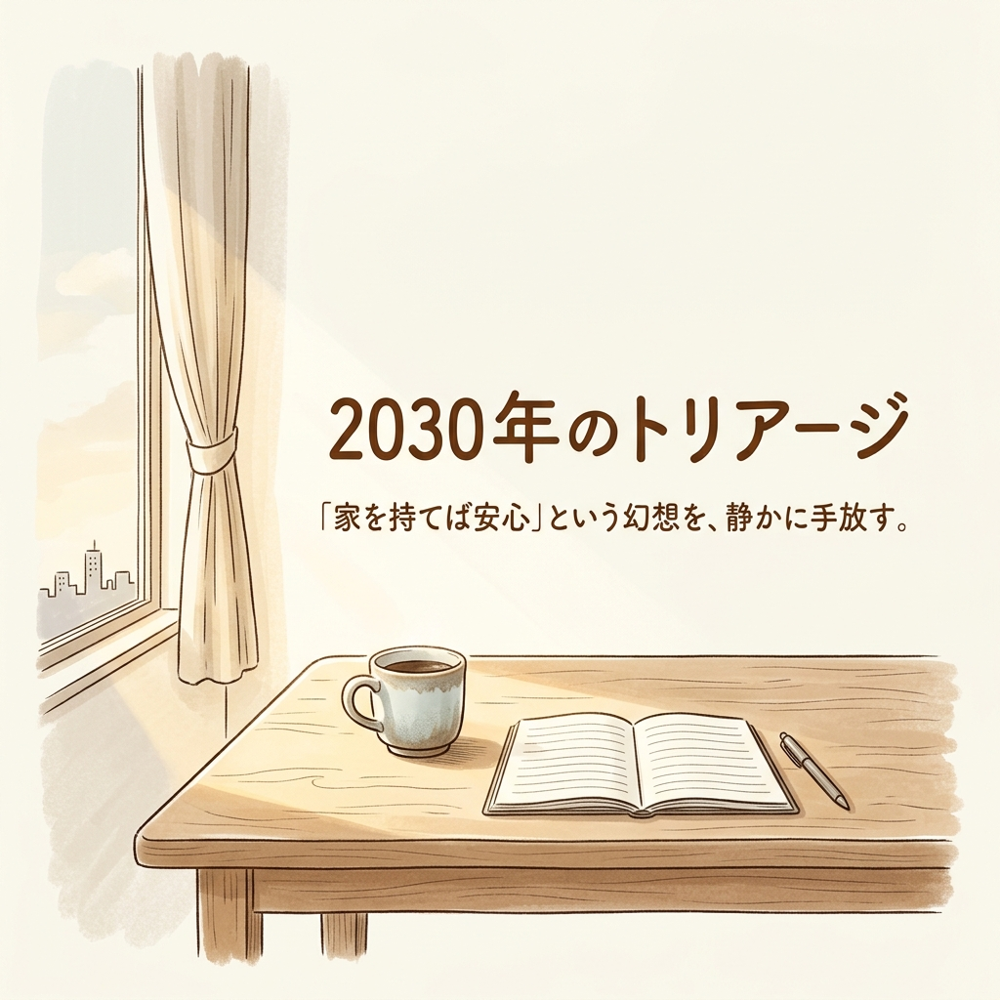
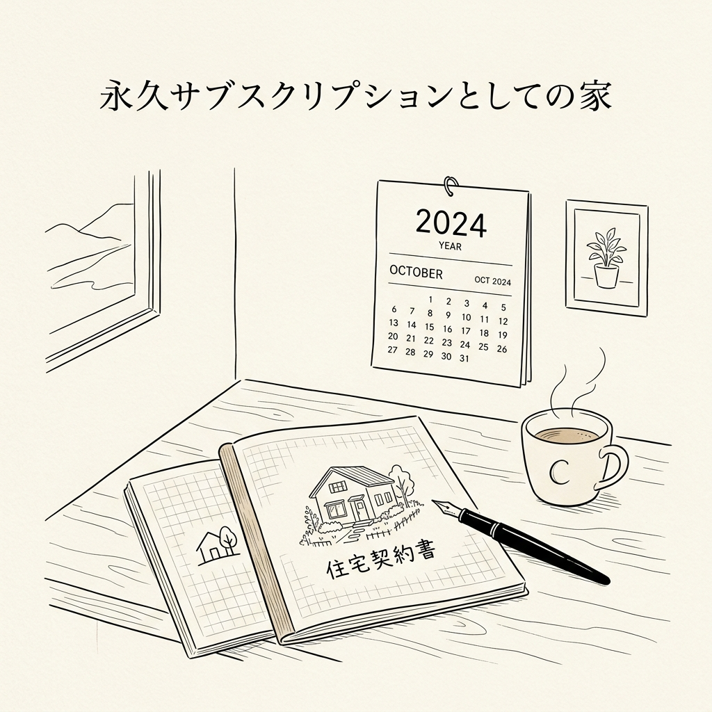

土曜日の朝、窓から差し込む柔らかな光を浴びながらコーヒーを飲む。
「これこそが、35年ローンを組んでまで手に入れたかった日常だ」
そう確信しているあなたのスマートフォンに、一つのニュースが流れてきます。

「〇〇市、立地適正化計画を更新。居住誘導区域の絞り込みを加速」

多くの人にとって、それは役所の難解な用語に過ぎないかもしれません。
でも、私のように製造業の現場で「効率」と「設計」を25年間叩き込まれてきた人間から見れば、これは静かな、しかし決定的な「宣告」に聞こえます。

かつての私も、あなたと同じでした。
「真面目に働いて、いい家を建てることこそが家族を守る唯一の正解だ」と信じていました。
でも、ある時気づいたのです。私たちが「資産」だと思い込んでいるその壁や屋根は、実は特定の自治体という「株式会社」と心中するための、極めてリスクの高い投資に他ならないという現実に。

今回は、不動産アナリスト・牧野知弘氏の知見を借りながら、人口減少社会という戦場を生き抜くための「設計図」についてお話しします。

## 昭和の「持ち家神話」が、令和の「負債」に変わる瞬間

私たちは家を買うとき、物理的な「物体」にお金を払っていると考えがちです。
でも、論理的に整理すると少し違います。

不動産を買うということは、その街が提供する行政サービスやインフラという「パッケージ」の**永久サブスクリプション**を、一括前払いで契約するようなものです。

どれほど立派な家を建てても、目の前の道路が穴だらけになり、水道代が跳ね上がり、夜道に街灯が灯らなくなれば、その家の価値はゼロに向かいます。
つまり、あなたの家の価値は、あなたの努力ではなく「自治体の経営能力」に完全に依存しているのです。

製造業の視点で言えば、家は単体で機能する製品ではありません。
街という巨大な「生産ライン」に組み込まれた、一つのパーツに過ぎないのです。ラインそのものが止まれば、パーツがどれほど高機能でも意味をなしません。

さらに今、金利上昇という波が来ています。
これまでは金利が低かったから、資産価値が目減りしても誤魔化せました。でも、金利が上がればその「貯金箱」には見えない穴が開きます。
人口減少で買い手がいなくなる市場で、出口戦略（売却）のない物件を持ち続けることは、底の抜けた器に硬貨を投げ込み続けるようなものです。

## 「街のトリアージ」が始まっている：居住誘導区域の残酷な境界線

いま、全国の自治体で密かに進められているのが**「立地適正化計画」**です。
簡単に言えば「街のコンパクト化」ですね。

人口が減り、税収が落ち込むなか、自治体は全てのインフラを維持する体力を失っています。
そこで行政は境界線を引きます。
「ここから内側は全力で守るが、外側については、将来的にインフラ維持を諦める」

これが、**居住誘導区域**という残酷な選別です。

沈みかけた大型客船を想像してみてください。
船長（自治体）は、全ての客室を守ることはできないと判断し、特定のボート（誘導区域）に人員と物資を集中させる決定を下しました。
あなたが今、静かな時間を過ごしているその場所は、果たしてその「ボート」の中に入っているでしょうか。

もし、誘導区域の外にあるとしたら、30年後に何が起きるか。
劇的な崩壊ではなく、ゆっくりとした「衰退の景色」です。
真っ先に消えるのは、夜道の街灯かもしれません。水道管が破裂しても修理まで数週間待たされる。
「不便だが住めなくはない」という状態から、徐々に「インフラが機能しない場所」へと変貌していくのです。

## 富裕層の「冷徹な視点」をインストールする

なぜ、富裕層は不動産で失敗しにくいのか。
彼らは家を「住み心地」という主観的な尺度だけで評価しないからです。
もちろんキッチンが広いことも大切ですが、それらは全て「消費」の側面です。

彼らは必ず**「流動性（交換価値）」**という物差しを当てます。
「今日この物件を売りに出して、一週間以内に現金化できるか？」
「この場所は、10年後も誰かが『どうしても欲しい』と指名してくる場所か？」

建物の部分は「型落ちの家電」と同じです。
鍵を受け取った瞬間から、物理的な減価償却のルールに従って、その価値は坂道を転げ落ちるように減っていきます。資産としての価値を維持できるのは、土地の稀少性だけなのです。

「一生住むつもりだから出口なんて関係ない」という人ほど、人生の不測の事態——病気や介護、あるいは街の衰退——に直面したとき、身動きが取れなくなります。
出口のない迷路に入るのは、勇気ではなく無謀です。

## 結論：変化に強い「アジリティ」をデザインする

人口減少社会という戦場で生き残るための、最も強力な武器。
それは所有ではなく、**「アジリティ（身軽さ）」**です。

もし今、不動産という「動かせない資産」に数千万円を投じようとしているなら、一度自分に問いかけてみてください。
「それは本当に、30年後の自分を自由にしてくれる選択ですか？」

富裕層が身軽な賃貸を選んだり、圧倒的な流動性を持つ都心の物件に限定したりするのは、変化の激しい時代のルールを理解しているからです。
不動産に固定されてしまう資金を、金融資産や「稼ぐ力（ポータブルスキル）」に振り向ける。
それは安定を捨てることではなく、真の安全保障を手に入れる「設計」なのです。

25年間、一つの会社に尽くし、一つの場所に根を張ろうとしていた私が今、マレーシアでAIワークフローを設計しながら確信していることがあります。
本当の「ホーム」とは土地のことではなく、場所を問わず価値を生み出せる「自分のスキル」と、損得抜きで助け合える「ネットワーク」です。

35年ローンという航海に出る前に、どうか一度地図を広げ直してみてください。
自由は、根性ではなく「設計」で手に入れる。
その第一歩は、「家を持れば安心」という幻想を、静かに手放すことから始まります。

---

<!-- 画像リネームマッピング (GAS/手動作業用)
Phase2生成ファイル → GASアップロード用ファイル名

Image/thumbnail/thumbnail_260428_001.png → thumbnail.png
Image/sections/section_01_subscription.png → img1.png
Image/sections/section_02_triage.png → img2.png
Image/sections/section_03_bs.png → img3.png

アップロード先: GitHub src/content/blog/real-estate-triage-2030/ (コロケーション配置)
Astro参照パス: ./thumbnail.png, ./img1.png, ./img2.png, ./img3.png
-->

<!-- 参照ファイル一覧
- 03_detailed_agenda.md
- 04_blog_post.md
- 05_thumbnail_prompts.md
- 06_section_prompts.md
- Image/thumbnail/thumbnail_260428_001.png
- Image/sections/section_01_subscription.png
- Image/sections/section_02_triage.png
- Image/sections/section_03_bs.png
-->
