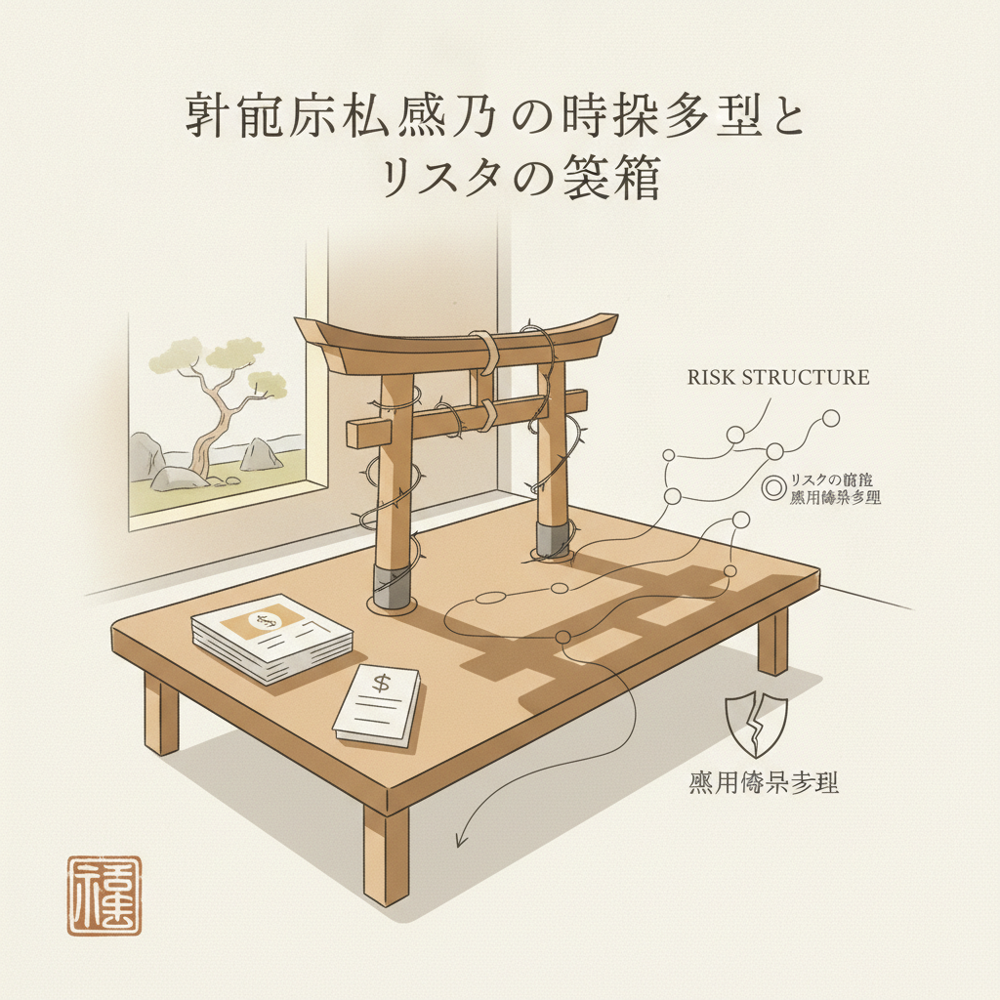

月曜の朝、満員電車に揺られながらスマートフォンの画面を眺めていると、時折奇妙な広告や投稿が目に留まることがあります。

「宗教法人の承継案件、ご相談に乗ります」
「年間8,000万円まで非課税。合法的な節税スキーム」

毎日真面目に働き、給与明細を見るたびに引かれる所得税や住民税、社会保険料の重さにため息をついている人からすれば、別世界の話のように思えるかもしれません。あるいは、個人事業や会社経営で必死に利益を出し、法人税の請求書を前に頭を抱えている経営者なら、「そんな裏ワザが本当にあるのか」と心が揺らぐこともあるはずです。

でも、世の中に「魔法の抜け穴」など存在しません。
あるのは、法律の隙間を利用して作られた歪な構造と、そこに群がる利害関係者、そしていずれ必ずやってくる清算の波だけです。

かつて製造業の現場で生産管理を担当していたころ、私はあらゆる工程の無駄を削ぎ落とし、数字を整合させる仕事をしていました。数字は嘘をつきません。帳簿や法律の設計図を冷静に読み解けば、表向きの甘い言葉の裏にどれほどのリスクが潜んでいるかは、驚くほどはっきりと見えてきます。

いま、日本の水面下で静かに広がっている「宗教法人の売買・M&A市場」。
その実態と構造、そして迫り来る終わりのシナリオを、数字とロジックで淡々と紐解いてみましょう。

---

## 1. 全国に5,000以上存在する「空っぽの箱」

まず、客観的なデータから現実を確認します。

文化庁が発表している『宗教年鑑 令和7年版』（令和6年12月31日現在）によると、日本全国にある宗教法人の総数は178,537法人です。その内訳は、神社などの神道系が84,014法人（47.2%）、寺院などの仏教系が76,493法人（42.9%）と、この二つで全体の9割以上を占めています。

ここで注目すべきは、「活動実態のない宗教法人」が急増しているという事実です。

文化庁の「不活動宗教法人の状況等に関する調査」によれば、令和7年12月31日時点で確認された不活動宗教法人は全国で5,286法人に達しています。前年から267法人増えており、令和4年末の3,329法人と比較すると、わずか数年で1.5倍以上に膨らんでいます。

地方の過疎化と少子高齢化、それに伴う檀家離れによって、住職や宮司が不在となった「空き寺」「空き神社」が日本中で放置されているのです。

後継ぎがおらず、屋根の雨漏りを直す数百万円の修繕費すら出せない。近隣の無住寺院を3つも4つも掛け持ちしてギリギリの生活を送る高齢の住職のもとへ、ある日ブローカーからダイレクトメールが届きます。

「あなたの寺院を、数千万円で引き取りたい人がいます」

文化庁が令和8年7月に行ったインターネット調査の中間報告では、宗教法人の売買を扱う日本語サイトが24件確認され、売りに出されていた案件は324件に上りました。さらに中国語のSNSでも16件の関連サイトが確認され、ゲストハウス転用や文化財投資名目で売り買いが呼びかけられていました。

民間の仲介相場を見ると、地方の小規模な寺社で2,000万〜3,000万円、中規模で3,000万〜5,000万円、都市近郊や好立地の大規模物件になると1億円から数億円の値がついています。

信仰の場であるはずの宗教法人に、なぜ数千万円もの値段がつくのか。
理由はいたって単純です。買い手が求めているのは本堂でも仏像でもなく、法人が持っている「税制上の特権」という名のライセンスだからです。

たとえるなら、車体（建物や信仰）はボロボロで動かない廃車寸前の軽トラックに、「全国の高速道路が一生乗り放題になり、車検も税金もかからないゴールデン・ナンバープレート」が付いているような状態です。買い手はボロい車が欲しいのではなく、その魔法のナンバープレートを自分のビジネスに付け替えるために大金を払っているのです。

---

## 2. なぜ売買できるのか。法的な抜け穴と「8,000万円ルール」のからくり

法律上、宗教法人の「売買」という行為は認められていません。宗教法人には株式会社のような株式や持ち分という概念が存在しないため、所有権を他人に譲渡することは制度上不可能なのです。

では、ブローカーたちはどうやって取引を成立させているのでしょうか。

使われているのは、「役員交代」と「寄付」を組み合わせた禅譲スキームです。
大まかな流れは以下の通りです。

- 買主が宗教法人に対して、数千万円の「寄付金」を振り込む。
- 宗教法人は、その資金を原資として旧代表役員（住職など）に「退職金」を支払う。
- 旧代表が退任し、買主側の指定する人物が新しい代表役員に就任する。
- 法務局で代表者変更の登記を行い、都道府県の所轄庁に届出を出す。

バスに例えるなら、運行している路線バス（法人）の所有権は動かせないまま、終点で運転手（旧代表）が帽子と鍵を次の人物（買主）へこっそり手渡し、謝礼を受け取って降りるようなものです。乗客である地域住民や檀家からは、いつの間にか運転手が交代したようにしか見えません。

そして、買い手を引き寄せる最大のインセンティブが、手厚すぎる税制優遇です。

日本の税法において、宗教法人の本来事業（お布施、賽銭、祈祷料、戒名料など）で得た収入は**完全非課税**です。
また、駐車場経営や不動産貸付などの「収益事業（法人税法施行令で定められた34業種）」を行った場合でも、所得が年800万円以下なら15%、800万円超でも19%の軽減税率が適用されます。普通法人の基本税率（23.2%）と比べて著しく有利です。

さらに、収益事業で得た利益の最大50%（または200万円のいずれか大きい方）を宗教活動部門へ繰り入れ、経費（損金）として処理できる「みなし寄附金」制度まで用意されています。

しかし、ブローカーが最も悪用するのが、いわゆる「8,000万円ルール」です。

現行の宗教法人法では、収益事業を行わない宗教法人のうち、年間の収入金額が8,000万円以下の法人は、所轄庁への収支計算書の提出が免除されています。
本来は小規模な地方寺社の事務負担を減らすための配慮なのですが、これがいつの間にか「年間8,000万円までは税務署に申告しなくていい」「裏金を作り放題」という危険なセールストークにすり替えられて出回っているのです。

もちろん、これは完全な誤解です。提出義務が免除されるのは「所轄庁（都道府県や文化庁）」への計算書であって、国税庁への申告義務が免除されているわけではありません。しかし、行政の縦割り構造の隙間を突き、長年にわたって監視の網からすり抜けてきた法人が存在したこともまた事実です。

---

## 3. 甘い話の末路。実際に起きた脱税摘発と経営破綻

こうした「抜け穴」を利用したビジネスは、本当に安全な資産防衛策として機能するのでしょうか。
過去の裁判例や事件史を振り返れば、その答えは火を見るより明らかです。

代表的な事例をいくつか挙げてみます。

### ① セミナー受講料を「寄付金」に偽装（福岡地検・2013年）
企画会社の前社長らが、静岡県の休眠宗教法人を買収。全国で開催した自己啓発セミナーの受講料を「お布施・寄付金」名目で宗教法人の口座に振り込ませていました。3年間で約27億円の所得を隠蔽し、約8億円を脱税したとして法人税法違反で追起訴されています。

### ② ビル転売益の無税化スキーム（名古屋地検・2017年）
不動産会社が名古屋市内の賃貸ビルを購入後、同額程度で静岡県の宗教法人へ売却。さらにその寺院から第三者へ高値で転売させ、得られた売却益約4億円を「宗教法人の非課税所得」として処理しました。名古屋地検特捜部が捜査に入り、約4億2,760万円の所得隠しと法人税約1億820万円の脱税容疑で不動産会社社長ら3人が逮捕されています。

### ③ 納骨堂の経営破綻と遺骨770人分放置（札幌市・2022年）
宗教家ではない人物が休眠宗教法人を買い取って納骨堂を運営していたものの、過大な設備投資と杜撰な資金管理により経営破綻。約770人分の遺骨が施設内に取り残され、遺族が引き取りに追われるという深刻な社会問題に発展しました。

宗教法人を巡るトラブルは、国税局による摘発だけにとどまりません。M&Aの実務上でも、極めて致命的な落とし穴がいくつも存在します。

その代表例が「単立」と「被包括」の取り違えです。

宗教法人には、特定の宗派に属さない「単立宗教法人」と、曹洞宗や真言宗、神社本庁といった宗派・教団の傘下にある「被包括宗教法人」の2種類があります。全国の宗教法人の約96%は被包括法人です。

被包括法人は、代表役員の変更や不動産の処分を行う際に、必ず包括団体（宗派の本山など）の承認印を必要とします。
ところが、買い手が「自由に使える独立した寺院」だと思い込んで買収したところ、実は大手フランチャイズの加盟店のような被包括法人であり、宗派から役員変更を拒否されて資金だけを奪われるトラブルが後を絶ちません。個人経営のカフェを居抜きで買ったつもりが、大手コンビニの加盟店契約を結ばされたようなものです。

また、前の住職が個人的に抱えていた隠れ借金や、滞納していた固定資産税を法人ごと引き継いでしまうケースもあります。実態のない休眠法人を高値で買い取ったものの、文化庁から「活動実態なし」と判断されて解散命令を請求され、投じた資金が紙屑になる事例も増えています。

---

## 4. 塞がれる抜け穴。国税・文化庁・司法の包囲網

こうした脱法的な動きに対して、国家側の防波堤も急速に再構築されています。

「動かない文化庁、拒めない法務局、見つけられない国税」と揶揄された時代は、すでに終わりを迎えつつあります。

文化庁は令和8年4月、「宗教法人格の不正利用対策に係る検討会議」を立ち上げると同時に、公式ウェブサイト上に「宗教法人の売買に関する情報提供窓口」を開設しました。不活動法人の整理対策にも本腰を入れており、令和7年だけで403法人の整理を実施。裁判所への解散命令請求は90件に達し、前年の4.3倍というハイペースで休眠法人の強制排除が進んでいます。

さらに司法の判断基準も大きく変わりました。
旧統一教会を巡る裁判手続きにおいて、最高裁判所第一小法廷は令和7年3月3日、民法上の不法行為（709条）であっても宗教法人法81条の「法令違反による解散命令事由」に含まれるという重要な決定を下しました。これにより、刑法違反だけでなく、民事上の違法行為を重ねる法人に対しても解散命令を出しやすくなる法理が確立されたのです。

税務調査の現場でも変化は顕著です。
国税当局はAIを用いた申告漏れ分析を進めており、宗教法人の口座から代表者個人への資金移動を徹底的に追尾しています。帳簿をつけていなくても、法要手帳や予約カレンダー、LINEのやり取り履歴などを押収し、本来事業と私的流用を厳格に仕分けて「代表者への簿外給与」として重加算税を課す事例が相次いでいます。

新規に宗教法人を立ち上げるには、礼拝施設と信者を確保した上で、最低でも3年半以上の実質的な活動実績を行政に証明しなければなりません。
そのハードルの高さを嫌い、既存の法人格を金で買ってショートカットしようとする試みは、いまや行政と税務の両面から厳重にマークされる「高リスク・低リターン」の危険地帯へと姿を変えています。

---

## 5. 自由は「歪み」の活用ではなく、真っ当な「設計」で手に入れる

世の中には、制度の隙間を突いて一時的に大きな利益を得ようとするスキームが常に存在します。
そして往々にして、そうした情報には「知る人ぞ知る合法ルート」「富裕層だけが実践している裏ワザ」といった甘美なラベルが貼られます。

でも、少し立ち止まって考えてみてください。

誰かの信仰が途絶え、荒れ果てた地方の寺社を買い取り、裏でコソコソと税務署の目を盗みながら資金を動かす。いつ税務調査が入るか、いつ文化庁から解散命令が届くかと怯えながら過ごす毎日のどこに、本当の自由があるでしょうか。

そんな歪んだ仕組みに何千万円もの資金と精神的なエネルギーを注ぎ込むくらいなら、やるべきことはもっと他にあります。

私自身、25年間地方の製造業で働き、毎日山のような帳票と格闘してきました。
給料は上がらず、固定費は重く、理不尽な思いをしたことは一度や二度ではありません。しかしそこから抜け出すために選んだのは、怪しい節税スキームではなく、業務を自動化するツールの学習であり、生活コストの構造的な見直しであり、小さくても自分の力で回るマイクロ法人の設計でした。

日本の現行制度の中でも、真っ当に使える仕組みはたくさんあります。
適切な経費の計上、小規模企業共済や確定拠出年金の活用、役員報酬と法人利益のバランス最適化、そして生活の拠点をどこに置くかという選択肢の確保。

ルールを逸脱してグレーゾーンを渡り歩く必要はありません。
明確なルールの枠組みを深く理解し、その中で自分にとって最も効率的なシステムを論理的に組み立てること。それこそが、長期にわたって脅かされることのない、確かな自由をもたらしてくれます。

朝の光の中で、今日やるべき仕事が3つだけ机の上に並んでいるような静かな時間。
誰に後ろ指を指されることもなく、どの国の法律にも堂々と胸を張って向き合える生活。
そうした穏やかな暮らしは、決して脱法的な抜け穴の先にはありません。

自由は、根性や裏ワザではなく、確かな「設計」によって手に入れるものです。
まずは足元の支出と、手元にある道具の使い方をひとつずつ見直すことから、自分のシステムを整えていきましょう。