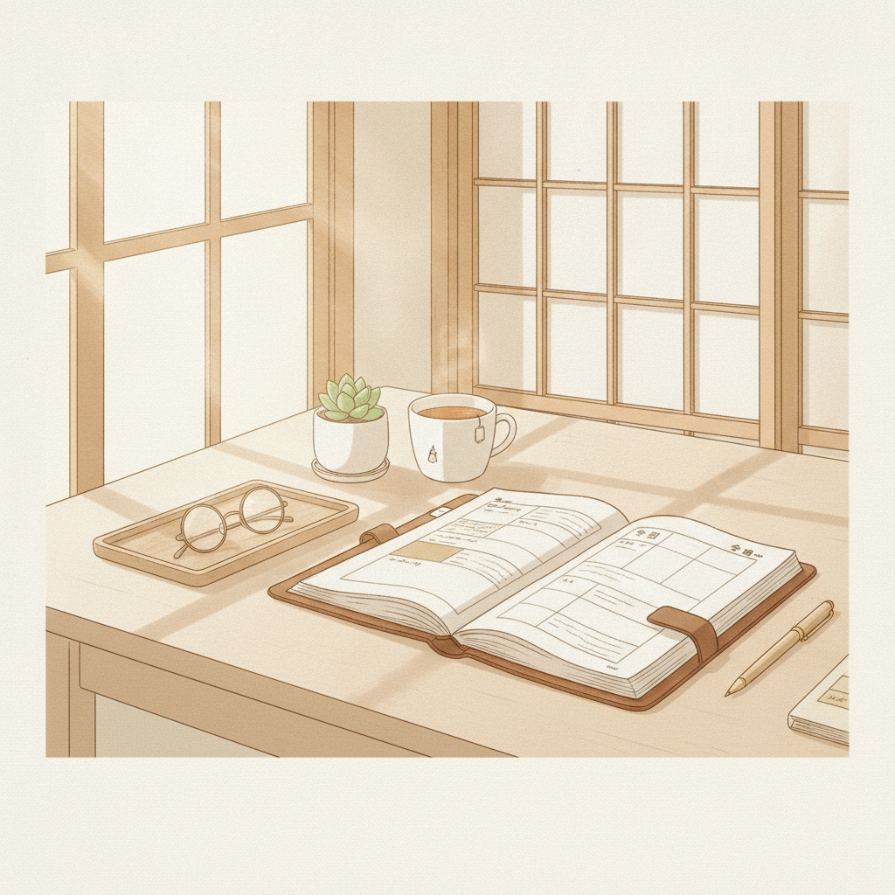
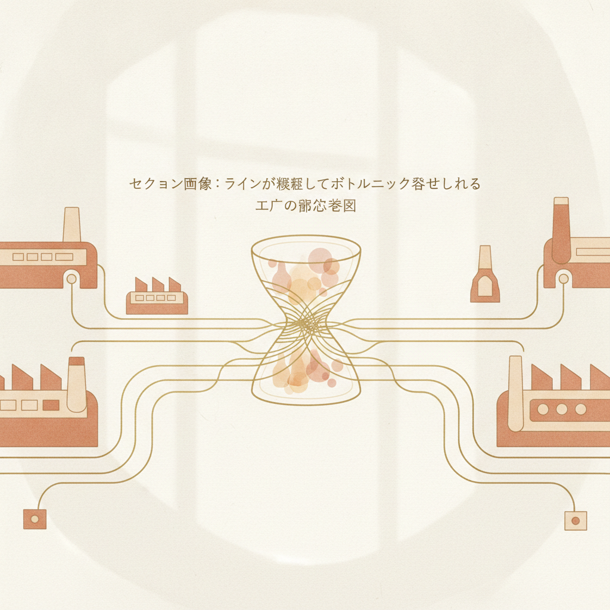
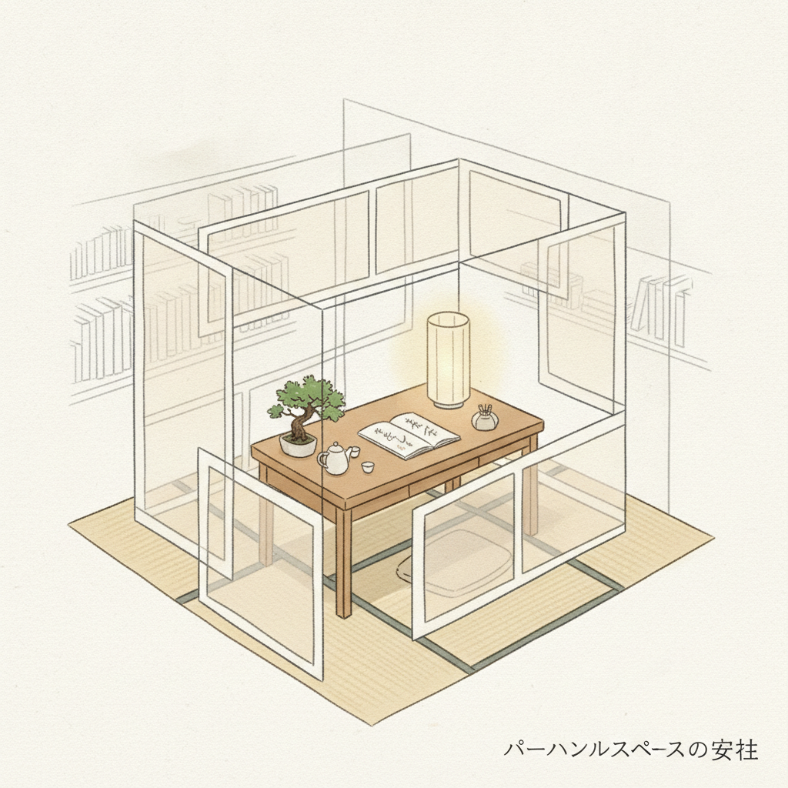
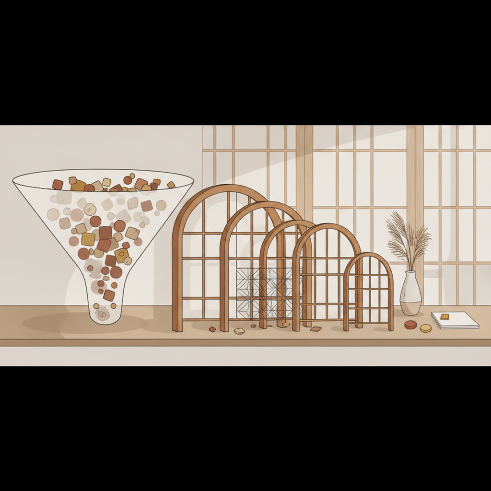
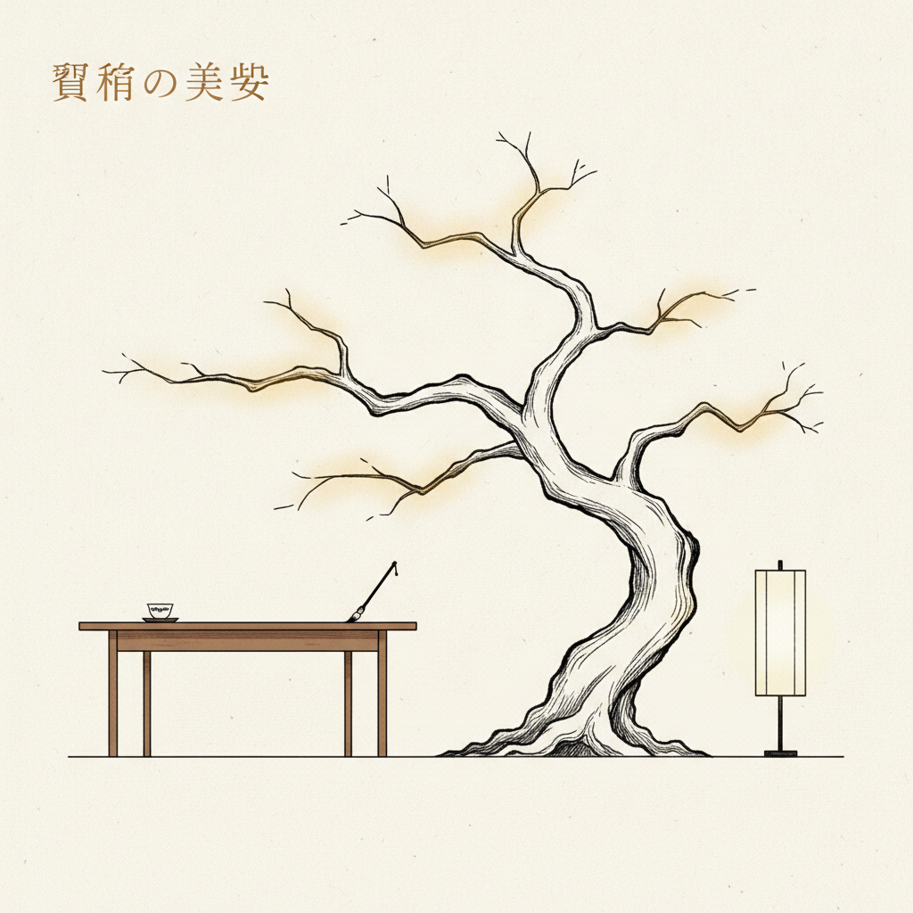
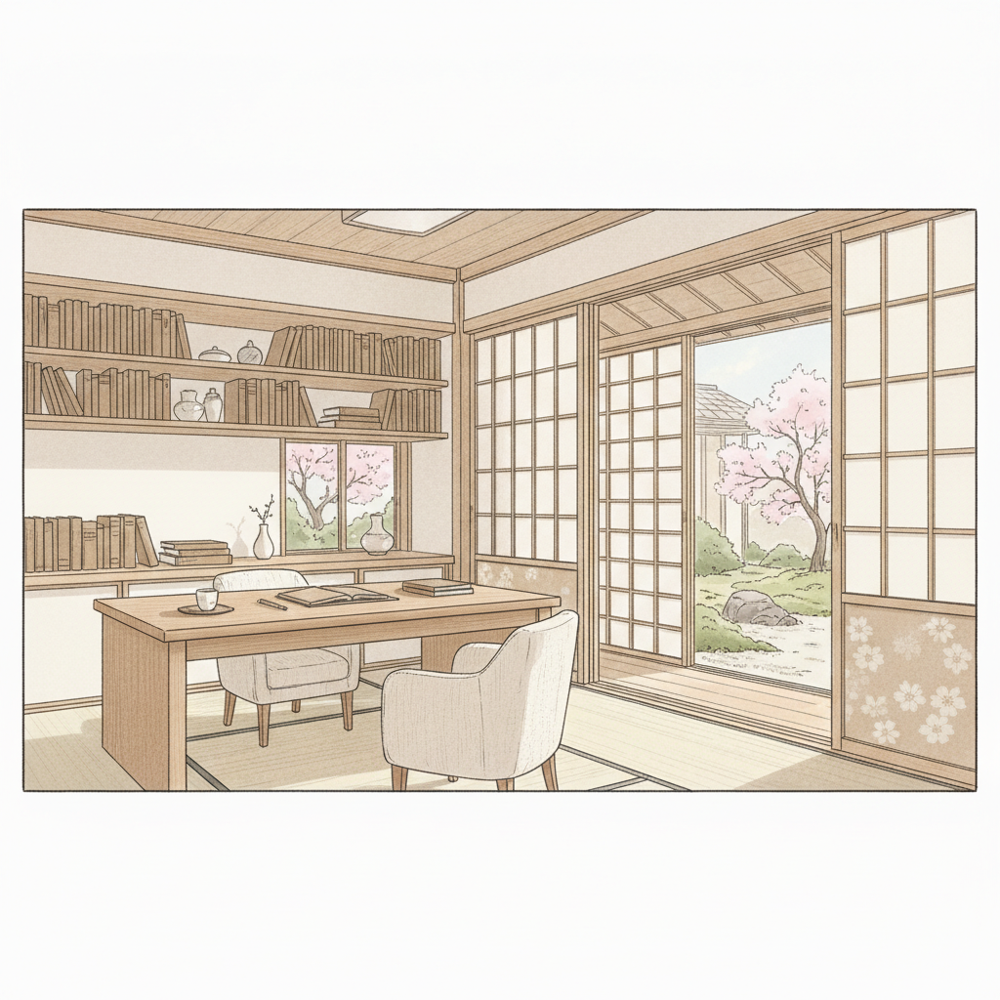

金曜日の夜、オフィスのパソコンを閉じるとき、ふと胸の奥に冷たい虚しさが残ったことはないでしょうか。

今週も誰かの急な依頼に応え、突発的なトラブルを処理し、周囲の空気を読んで立ち回った。同僚や上司からは「助かったよ、ありがとう」と言われたはずなのに、なぜか満たされない。それどころか、自分が本来やりたかった仕事や、大切にしたかったはずの時間は、1ミリも前に進んでいない。

真面目に働いている人ほど、この罠にはまりやすいです。

かつての私もそうでした。地方の製造業で生産管理の仕事をしていた頃の私は、いわゆる「頼まれたら嫌と言えない便利な人」でした。現場の無理な要求を呑み、他部署のミスを肩代わりし、夜遅くまでエクセルと格闘する日々。周囲からは感謝されましたが、自分の人生の主導権はどこにもありませんでした。

結論からお伝えします。
「ありたい自分」で居続けるために必要なのは、強い意志でも、人に嫌われる勇気といった精神論でもありません。必要なのは、自分の限られたリソース（時間・集中力・体力）を自分自身のために確保する「戦略的な自己中心の仕組み」です。

今日は、他人に振り回される毎日を抜け出し、人生のハンドルを自分の手元に取り戻すためのリソース設計についてお話しします。

---

## 1. なぜ「いい人」ほど、自分の人生から脱落するのか

製造業の現場には「稼働率100%を目指してはいけない」という鉄則があります。

一見すると、工場内の機械を24時間フル稼働させたほうが効率的に見えます。しかし、余白のないラインに突発的なオーダーや小さな機械トラブルが1つ入るだけで、工程全体が瞬時に目詰まりを起こし、最終的な歩留まり（生産効率）は著しく低下します。

人間のリソース配分も、これとまったく同じ構造です。

周りの期待に応えようとする「いい人」は、自分のスケジュールの稼働率を他人の予定で埋めてしまいます。

・急に頼まれた資料作成の引き受け
・特に結論の出ない定例会議への出席
・断りきれなかった気乗りしない飲み会
・同僚の愚痴に付き合う夜の1時間

これらをすべて受け入れていると、自分という工場のキャパシティは常に100%を超えて稼働し続けます。結果として、自分自身の将来に向けた学習や、本当にやりたかったプロジェクトに投入できるリソースはゼロになります。

ここで重要なのは、他人はあなたのキャパシティに責任を持ってくれないという事実です。悪気があるわけではありません。単に、他人は「頼めばやってくれる便利な窓口」に案件を持ち込んでいるだけなのです。

他人の計画の中に組み込まれている限り、自分の人生の生産ラインが整うことはありません。

---

## 2. 「自己中心的」を再定義する：利己主義ではなく主権の回復

「自己中心」という言葉を聞くと、多くの人は「他人に迷惑をかける自分勝手な人」を想像します。だからこそ、真面目な人ほどその選択肢を無意識に排除してしまいます。

しかし、私がここで提案したい「戦略的自己中心」は、わがままや利己主義とは根本的に異なります。

論理的に整理すると、両者の違いは明白です。

・利己主義（エゴイズム）：自分の利益のために、他者のリソースを不当に奪うこと。
・戦略的自己中心（セルフセントリック）：自分の限られたリソースの決定権を、他人に明け渡さないこと。

つまり、誰かを傷つけたり蹴落としたりする話ではありません。「自分の時間と集中力の主権を、自分の手元に留めておく」という極めて合理的な防衛策です。

飛行機に乗ると、安全説明で必ず言われるアナウンスがあります。
「酸素マスクが下りてきたら、まずご自身に装着してから、お子様や周囲の方を助けてください。」

自分が酸欠で倒れてしまえば、誰も助けることはできません。自分自身のリソースが枯渇している人が、他人に継続的な価値を提供することなど不可能なのです。

自分を最優先に満たすことは、巡り巡って周囲に健全な価値を提供するための前提条件です。

---

## 3. 自分の時間を守る「3つの境界線」とフィルタリング設計

では、具体的にどうやってその主権を取り戻せばいいのか。
感情で「断ろう」とすると、罪悪感が生まれて失敗します。必要なのは、意思の力を使わずに境界線を引く「フィルタリングの設計」です。

私が製造現場の自動化と独立の過程で実践してきた、3つのルールをご紹介します。

### ルール1：即答をやめ、非同期のバッファを挟む

対面やチャットで何かを頼まれたとき、その場で「いいですよ」と返答するのをやめます。その場での判断は、相手の熱量と同調圧力に流されやすいからです。

「手元のタスク状況を確認してから、15時までに折り返します」

こう言ってワンクッション置くだけで、判断の主導権が自分に戻ります。カレンダーと自分のメインタスクを見つめ直し、冷静に計算する時間を作るのです。

### ルール2：「断る基準」を事前に数値化・言語化しておく

その場の気分で断ろうとするから迷いが生じます。判断基準をあらかじめ「アルゴリズム」にしておきます。

私の場合は、以下のような基準を設けていました。

・目的が曖昧な会議には参加しない（アジェンダと決定事項のゴールがないものは辞退）
・自分の半年後の目標に1ミリも寄与しない突発タスクは、代替案を出して断る
・「ケンジさんでなければできない仕事」以外は、手順書を作って別の人やツールに委ねる

基準に合致しない依頼は、相手を否定するのではなく「現在のルール上、リソースを割けない」と事実ベースで伝えます。

### ルール3：自分のための余白を「先行予約」する

余った時間を自分のために使おうとしても、余白は絶対に残りません。隙間があれば、他人のタスクが勝手に流れ込んでくるからです。

対策は単純です。工場の生産計画と同じで、自分のための時間をあらかじめ「埋まった予定」としてスケジュール帳にブロックします。

朝の静かな1時間、週に一度の思考整理の時間。それらは他人の予定が入る前に、最優先でスケジュールをロックします。誰かから「この時間空いてる？」と聞かれたら、「先約があります」と答えて構いません。自分自身との先約があるのですから、嘘ではありません。

---

## 4. 人間関係は「減らす」ことで、むしろ純度が高まる

戦略的自己中心を徹底し始めると、一時的に周囲の反応が変わる時期があります。「最近付き合いが悪くなった」「冷たくなった」と言われることもあるかもしれません。

しかし、恐れる必要はありません。

私の経験上、リソース管理の境界線を引いたことで離れていく人は、あなたという人間ではなく、「あなたという便利なリソース」を利用したかっただけの人たちです。

製造業では、品質を安定させるために不要な工程を削ぎ落とす「引き算の管理」を行います。人間関係もまったく同じです。

他人の顔色を伺う時間をやめ、断るべきものを断るようになると、不思議なことが起きます。

本当に互いを尊重し合える人、お互いの時間を大切にできる人だけが周囲に残るようになります。薄く広い義理のネットワークが、狭く深い信頼のネットワークへと自然に剪定されていくのです。

結果として、合意形成にかかる無駄なストレスは劇的に減り、日常の静けさと集中力が保たれるようになります。

---

## 5. 根性ではなく、仕組みでありたい自分を維持する

朝8時。静かな部屋でコーヒーを淹れ、PCを開いたとき、今日の予定に「他人に強いられたタスク」がひとつもない状態を想像してみてください。

今日使うエネルギーのすべてを、自分が大切にしたい仕事や、自分の成長、あるいは大切な人との対話だけに配分できる。その静かな確信こそが、人が本来持つべき自由の姿だと私は思います。

「ありたい自分」でいることは、特別な才能を持った人だけの特権ではありません。

・自分のキャパシティに余白を設けること
・判断の基準をあらかじめ設計しておくこと
・他人の感情と自分の責任を切り離すこと

これらはすべて、知識と設計次第で誰にでも再現できる技術です。

今の働き方、今の時間の使い方を、この先5年も続けたとしたら——あなたの望む未来に辿り着けるでしょうか。

もし少しでもズレを感じているなら、まずは今週、気乗りしない依頼を1つ断ることから始めてみてください。あるいは、来週のスケジュール帳に、自分だけのための「空白の2時間」を書き込んでみてください。

自由は、誰かから与えられるものではありません。
自分で引いた合理的な境界線の内側にだけ、静かに立ち現れるものです。