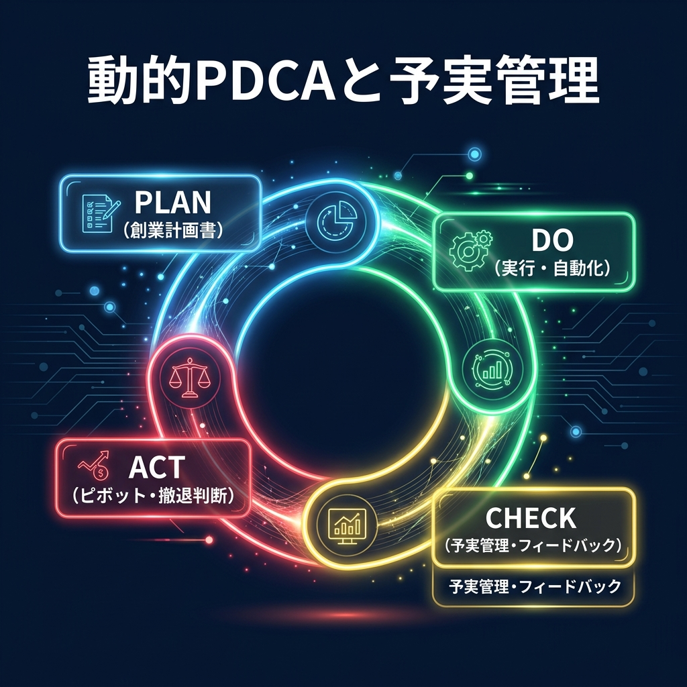
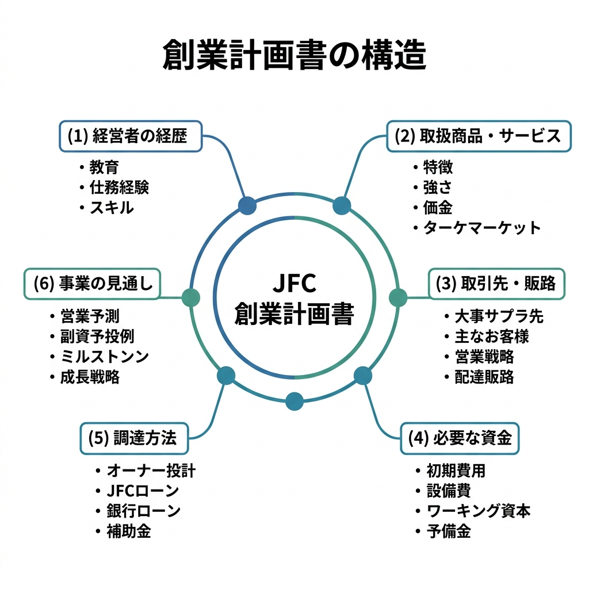
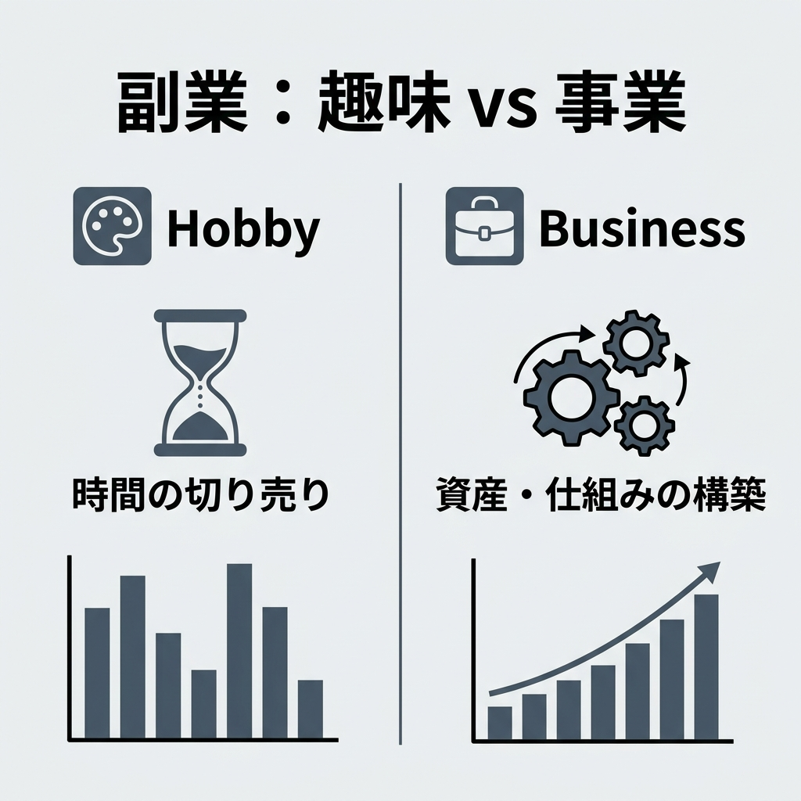

「ケンジさん、副業を始めて半年経ちますが、月5,000円から伸びません。毎日深夜まで頑張っているのに、ただ疲弊しているだけのような気がします……」

ホテルのラウンジでPCを広げていると、時折こうした相談をいただきます。かつての私も、地方の製造業で働きながら、似たような出口のない暗闇の中にいました。

エクセルを叩き、深夜までマニュアルを作成し、なんとか数万円を稼ぐ。でも、翌月にはまたゼロからのスタート。そんな「時間の切り売り」から抜け出せない真面目な人ほど、実はある致命的な罠にハマっています。

それは、副業を「お小遣い稼ぎ」として捉え、「事業」として設計していないことです。

自由は、根性ではなく「設計」で手に入れる。今日は、私がマレーシアでの身軽な生活を手に入れる基礎となった、論理的な副業設計術をお話しします。

## 副業の「趣味」と「事業」を分かつ境界線

多くの人が副業で挫折する理由は、スキルの不足ではありません。心理的な罠、特に「サンクコスト（埋没費用）」と「現状維持バイアス」にあります。

「せっかくここまで覚えたから」「今までこの方法でやってきたから」という理由で、時給数百円にも満たない作業を続けていませんか？ これは行動経済学で言うサンクコストの罠です。

事業として考えるなら、投資した時間に対して得られるリターンが市場平均を下回っている場合、即座に「損切り」してリソースを再配置しなければなりません。でも、感情がそれを邪魔するんですよね。よく分かります、かつての私もそうでしたから。

ここで私が提案するのが、日本政策金融公庫の「創業計画書」を書くことです。

「融資を受ける予定はないから必要ない」と思うかもしれません。でも、それは誤解です。創業計画書の本質は、自分の頭の中にある漠然とした「稼げそう」という妄想を、A3一枚の論理的な構造体へと強制的に変換することにあります。

いわば、「意思決定の外部OS」です。客観的な指標を持たないまま副業の荒波に漕ぎ出すのは、海図を持たずに手漕ぎボートで太平洋を渡ろうとするようなものです。

## 創業計画書を「経営戦略フレームワーク」として活用する

公庫のテンプレートは、数多の企業の生死を見届けてきた知恵の結晶です。これを副業に当てはめると、驚くほど構造がクリアになります。

テンプレートの冒頭にある「経営者の経歴」と「取扱商品・サービス」。これらを単なる事実の羅列として書いてはいけません。

ここで重要なのは、VRIO分析の視点を持つことです。
Value（価値）、Rareness（希少性）、Imitability（模倣困難性）、Organization（組織/仕組み）。

例えば、私の場合は「製造業のSCM経験」×「AIワークフロー構築」という掛け合わせが、強力な模倣困難性を生んでいます。あなたの中にも、本人だけが気づいていない「勝ち筋」が必ず眠っています。

また、多くの初心者が陥るのが「なんとなく月30万円稼げる気がする」という楽観バイアスです。公庫のシートでは、売上高、売上原価、経費を分解して書く必要があります。

これを書くと、「月30万円稼ぐには、今の単価だと月500時間の稼働が必要だ」といった不都合な真実が浮き彫りになります。ここで初めて、「単価を上げるための差別化」や「ツールによる自動化」という具体的な経営課題が見えてくるのです。

## 成長を加速させる「動的なPDCA」の回し方

計画書は一度書いて終わりではありません。それは生き物であり、常にアップデートし続けるものです。

自分一人で計画を練っていると、どうしても視点が内向きになります。そこで活用すべきなのが、質の高いコミュニティや、AIエージェントによる客観的な検証です。

「この計画で本当に負けないか？」と第三者に晒し、フィードバックを受ける。このプロセスこそが「知の深化」を生み、事業の生存率を飛躍的に高めます。

そして毎月末、計画と実績の乖離を特定してください。
計画より売上が低かったのは、集客不足か？ 成約率の低さか？ 経費が想定より膨らんだ原因は何か？

この数値を直視し、戦略をピボット（転換）するか、あるいは撤退を判断する。この「冷徹な判断」ができるようになれば、あなたはもう初心者ではありません。立派な一人の経営者です。

## 不確実な時代のマイクロビジネス戦略

今の日本、あるいは世界経済を見渡すと、不確実性は増すばかりです。

そんな時代において、「創業計画書に基づいた、低コストで機動性の高い副業」を持つことは、最強のヘッジになります。

固定費を極限まで下げ、AIやツールで作業を自動化し、論理的な計画で生存率を高める。

これは私だけの特別な話ではありません。製造業の現場で泥臭く働いていた私にできたのですから、仕組みさえ作れば、あなたにも必ず再現できます。

今夜、寝る前の30分だけでいいです。日本政策金融公庫のサイトから、創業計画書のPDFをダウンロードしてみてください。そこから、あなたの「本当の自由」への設計が始まります。

自由は、待つものではなく、自ら設計して手に入れるものです。

---

<!-- 画像リネームマッピング (GAS/手動作業用)
Phase2生成ファイル → GASアップロード用ファイル名

Image/thumbnail/thumbnail_01.png → thumbnail.png
Image/sections/section_01_hobby_vs_business.png → img1.png
Image/sections/section_02_plan_structure.png → img2.png
Image/sections/section_03_dynamic_pdca.png → img3.png

アップロード先: GitHub src/content/blog/side-hustle-business-strategy/ (コロケーション配置)
Astro参照パス: ./thumbnail.png, ./img1.png, ./img2.png, ./img3.png
-->

<!-- 参照ファイル一覧
- 03_detailed_agenda.md
- 04_blog_post.md
- 05_thumbnail_prompts.md
- 06_section_prompts.md
- Image/thumbnail/thumbnail_01.png
- Image/sections/section_01_hobby_vs_business.png
- Image/sections/section_02_plan_structure.png
- Image/sections/section_03_dynamic_pdca.png
-->
