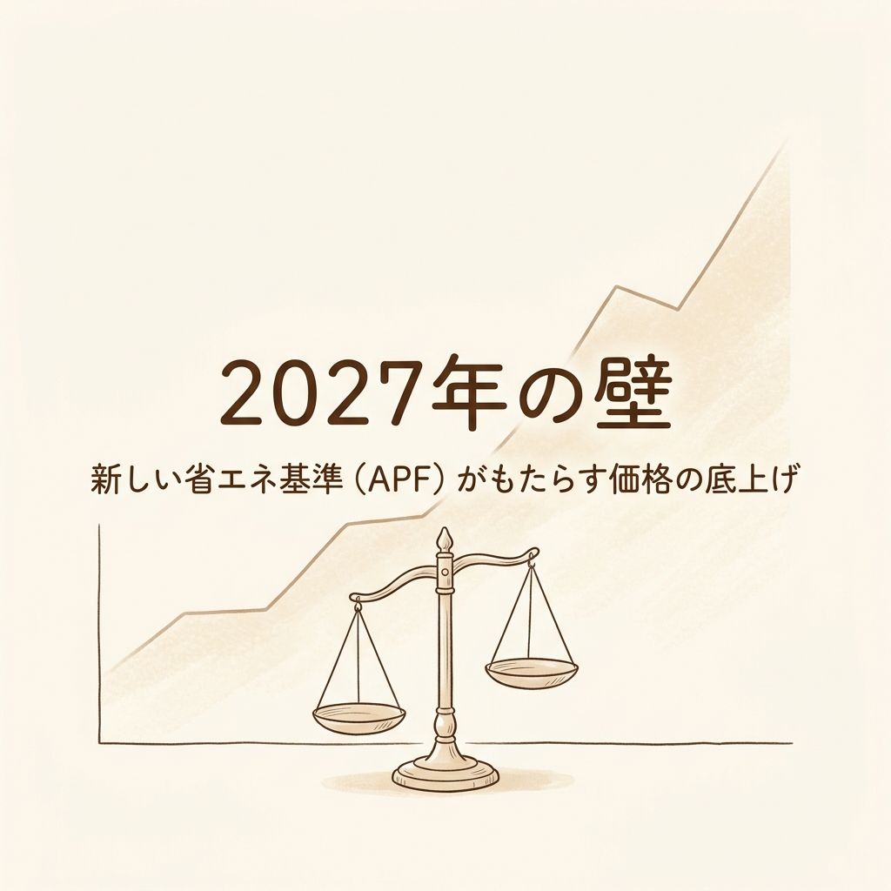
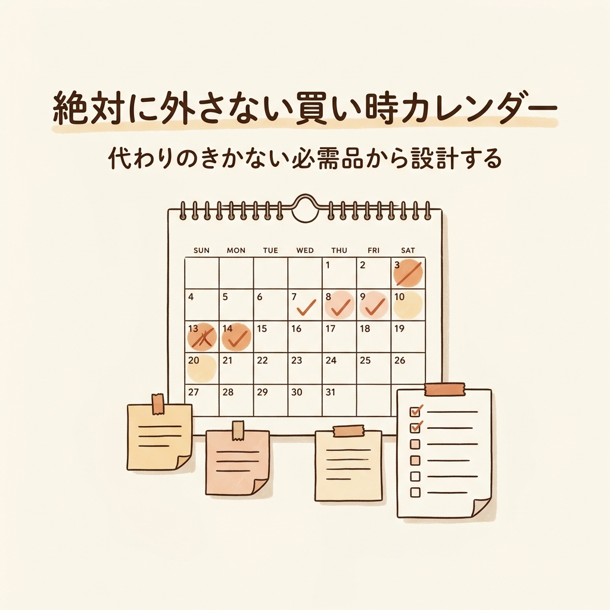

週末の夜、PCのモニターの明かりだけがやけに白く浮かぶ部屋。
あなたは今も、オンラインショップのカートに入れたまま何週間も決済できずにいる家電製品を眺めているのではありませんか。

「もう少し待てば、もっと安くなるかもしれない」

そんな淡い期待を抱きながら、価格推移グラフを何度も更新し、底値のタイミングを測る。痛いほどわかります。かつての私が、まさにその罠にはまっていました。
毎月限られた給料の中で、少しでも損をしたくない。真面目に生きている人ほど、休日の貴重な時間を「比較検討」という名の迷路の中で浪費してしまうものです。

しかし、あえて残酷な事実をお伝えします。
私たちが信じきっている「待てば安くなる」というルールは、すでに崩壊しつつあるのです。
特に今、ある大きな制度変更を目前にして、安価な標準モデル自体が市場から姿を消そうとしている事実を知っておく必要があります。

何十時間も比較検討していたあの時間は、一体何だったのか。
本記事では、ただ安いものを探して疲弊するゲームからあなたを解放し、「買い時と捨てるべきものを設計する」ための仕組みをお渡しします。

## 導入と問題提起（「待てば安くなる」という幻想）

### 価格推移の罠にハマる人々

家電を買うとき、私たちはどうしても「目の前の値札」に執着してしまいます。
しかし、カートに入れたまま価格を見張り続けるその行動こそが、実は最も高いコストである「あなたの時間」を奪っていることに気づくべきです。

これは「車のカタログ燃費と実燃費」の関係によく似ています。
カタログでリッター30km走ると書かれていても、実際に手に入れるまでに費やした何十時間というリサーチ時間、そして買い時を逃して不便な生活を強いられた期間を加味すれば、トータルの実燃費はひどく悪化しています。

Amazonのプライム会員を例にとりましょう。
2024年のデータによれば、日本のプライム会員は送料無料やセールを活用して、1人あたり平均約9,500円の節約を実現しています。年会費の5,900円を差し引いても、計算上は約3,600円のプラスです（※Amazon公式発表より）。
つまり、適切にシステムを利用する設計さえできていれば、毎日血眼になって価格を見張らなくても、一定の底値の恩恵は自動的に受けられるのです。

それなのに、私たちはなぜ「もっと安く」に固執してしまうのか。
それは、市場の裏側で起きている根本的なルール変更を知らないからです。

## 謎解きとしての専門解説（なぜ今、安価な家電が消えようとしているのか）

### 2027年問題と消える標準モデル

現在、最も切迫している事実をお伝えします。
もしあなたがエアコンの購入を検討しているなら、2026年中に決断すべきです。「もう少し待てば旧モデルが安くなる」という過去の成功体験は、来年にはもう通用しません。

その原因は、エアコン業界を揺るがす「2027年問題」です。
2027年4月より、家庭用エアコンに対して新たな省エネ基準が適用されます。この新基準の焦点となるのがAPF（通年エネルギー消費効率）という指標です。

APFとは何か。わかりやすく言えば、「家計における年間を通したリアルな食費の平均」のようなものです。
「夏休みは外食が多かった」「お正月はおせちを買った」というすべての季節の変動を込みにして、1年間でどれくらい効率よく電気を使えるかを示す、ごまかしの効かない実力値です。

このAPFの目標値が、現行基準と比べて最大で34.7%も引き上げられます。
この厳しい基準をクリアするために、メーカーは高価な部品を使わざるを得ません。
結果として何が起こるか。現在、5万〜7万円程度で手に入るような安価な標準モデルが物理的に市場から姿を消し、10万円台へと価格帯が跳ね上がる可能性が指摘されているのです。

「安い時期が来るのを待つ」こと自体が、安く買える機会を永遠に失うリスクに直結している。これが、私たちが直面している現実です。

## 教訓の抽象化と普遍的なテーマへの昇華（リスクを見極める力）

### 「安物買い」に潜む本当の代償

極端に安い製品をネット通販やフリマアプリで探すというアプローチにも、致命的な欠陥があります。

NITE（製品評価技術基盤機構）のデータを見ると、衝撃的な事実が浮かび上がります。
2014年度からの10年間で、ネット購入品による事故は1,617件も発生しており、製品事故全体に占める割合は現在、約30%にまで急増しています。特に事業者不明の激安バッテリーなどで発火・火災事故が相次いでいます。

また、海外製の安いスマートフォンやワイヤレスイヤホンには、日本の安全・法律基準を満たしていないものが溢れています。
電化製品の安全基準であるPSEマークや、電波法の基準をクリアした技適マーク。これらがない製品を使うことは、「保健所の営業許可証がない屋台」で食事をするようなものです。

あるいは、「車の車検ステッカーとナンバープレート」がない車で公道を走るのと同じです。
車検ステッカー（PSE）がなければいつ炎上するかわからず、ナンバープレート（技適）がなければ法律違反（1年以下の懲役または100万円以下の罰金）に問われるリスクがあります。
数百円、数千円の安さを追い求めた結果、命や社会的信用という取り返しのつかない代償を払うことになります。

### 型落ち・隠蔽配管の落とし穴

「では、安全な国内メーカーの型落ち品を安く買えばいいのでは？」
そう考えるのも無理はありません。確かに、新型が出る1〜2ヶ月前（エアコンなら秋や春先、冷蔵庫なら8〜9月）に、1世代前のモデルを狙うのは賢い設計の一つです。

しかし、ここにも見落としがちな罠があります。
一つ目は、隠蔽配管などの設置トラブルです。
エアコンの配管を壁の裏などに隠す工法ですが、これは「壁の裏に完全に埋め込んでしまったスマホの充電ケーブル」と同じです。見た目はスッキリしますが、後で機器を買い替える際に壁を壊すなどの大掛かりな工事が必要になり、ネット通販で本体を安く買ったにもかかわらず、当日の追加工事費で数万円を請求されるケースが後を絶ちません。

二つ目は、部品保有期間の壁です。
メーカーは製品の生産終了後、約10年間しか修理部品を保管しません。安すぎる古い型落ち品を買うということは、「長年愛用している廃盤になったボールペンの替え芯」を探すような状態に陥ることを意味します。
あるいは、「高級スーツの裏地に、ガッチリ縫い込まれたゴム紐」のように、ちょっとした故障でも部品がないため、結局は本体ごと買い替える羽目になるのです。

## 解決策・具体的なアクションプラン（思考の設計図）

### 絶対に外さない「買い時カレンダー」と「捨てる家電」

では、私たちはどう行動を設計すべきか。
まずは、代わりが効かない必需品から優先的に予算を確保することです。
「お気に入りだったスーツの予備ボタンの在庫」を確実に確保するように、生活のインフラ（冷蔵庫や洗濯機）の買い替え時期をあらかじめカレンダーに組み込んでおくのです。

- エアコン: 上位モデルは9〜11月、標準モデルは2〜3月が狙い目。ただし前述の通り、2026年中の決断が必須です。
- 冷蔵庫: 新型が秋に出るため、8〜9月が底値。
- 洗濯機: 縦型は4〜5月、ドラム式は8〜9月。

これらを「壊れる前」に設計通りに買い替える。
そして、同時に「捨てる家電」を決断します。
一人暮らしで毎日自炊しないのであれば、テレビや炊飯器、多機能すぎる電子レンジは不要です。スマホや単機能レンジで代用できます。
これらを切り捨てることで、本当に必要なものに投資する予算と、部屋の「空間の余白」が生まれます。

今、あなたが本当に欲しいのは、その家電そのものでしょうか。
それとも、その家電がもたらしてくれるはずの「快適な時間」や「余白の時間」でしょうか。

安く買うための何十時間ものリサーチは、時給換算すればすでに赤字です。
本当の節約とは、最安値を追い求めることではありません。選択肢を極限まで絞り込み、確実なタイミングで買い替える「決断のコスト」をゼロにすることです。

買い時を一度設計してしまえば、あとはその仕組みがあなたを自由にしてくれます。
明日、PCの前の時間をどう使うか。選択は、すでにあなたの手の中にあります。

<!-- 参照ファイル一覧
- 03_detailed_agenda.md
- 04_blog_post.md
- 05_thumbnail_prompts.md
- 06_section_prompts.md
- ./thumbnail.png
- ./img1.png
- ./img2.png
-->
