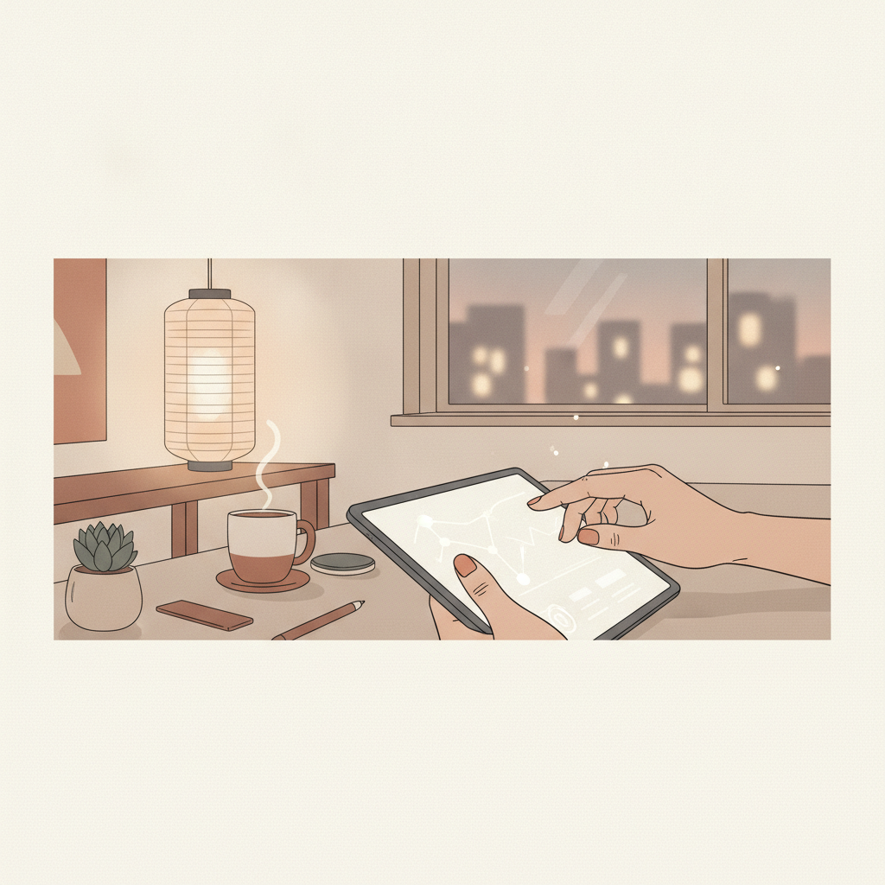
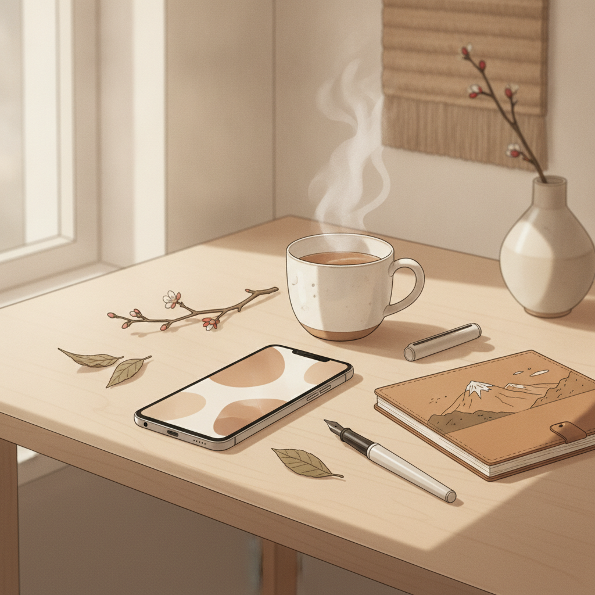
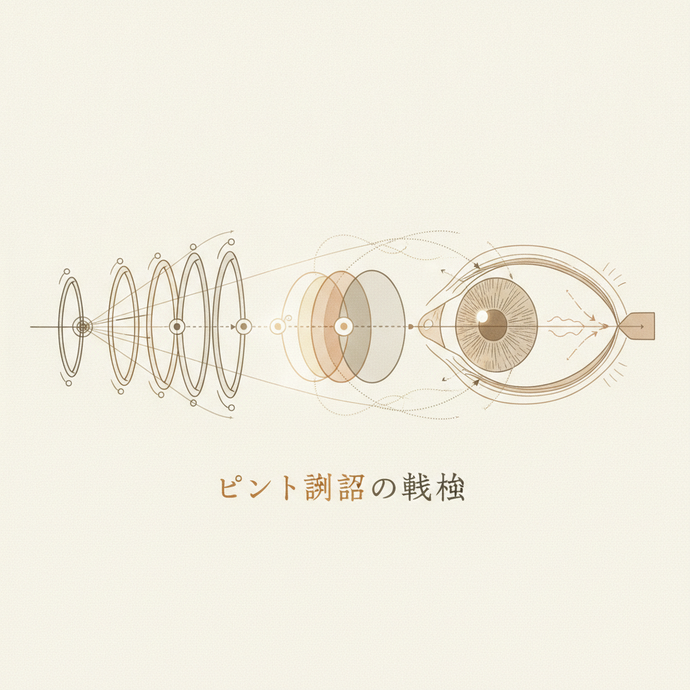
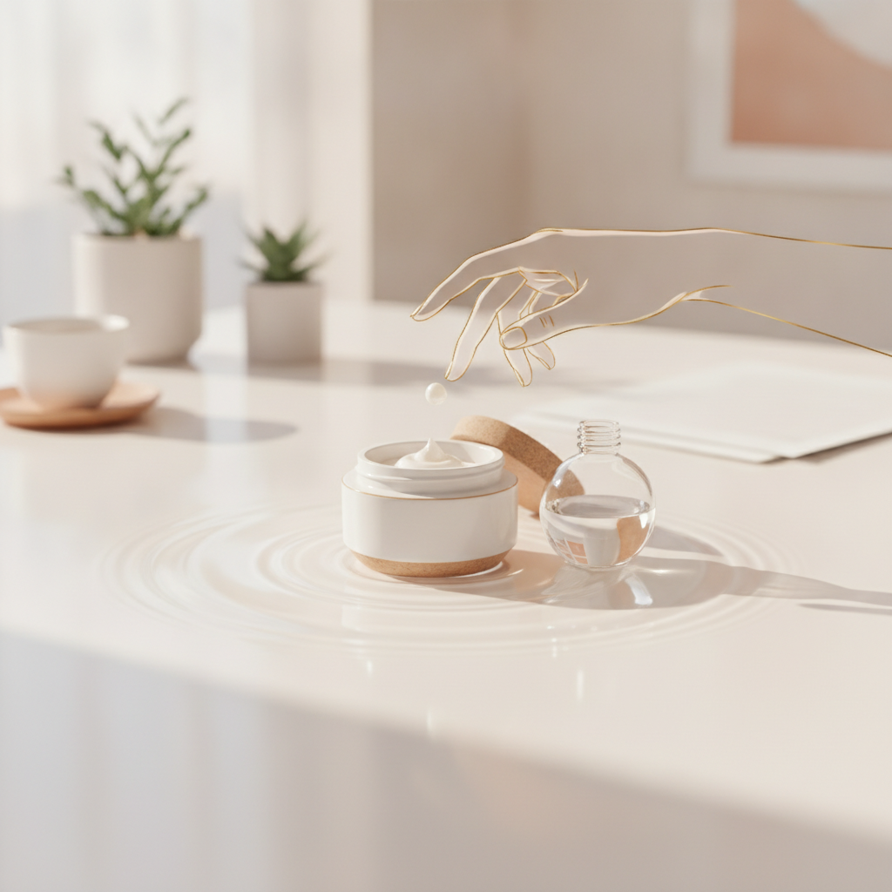
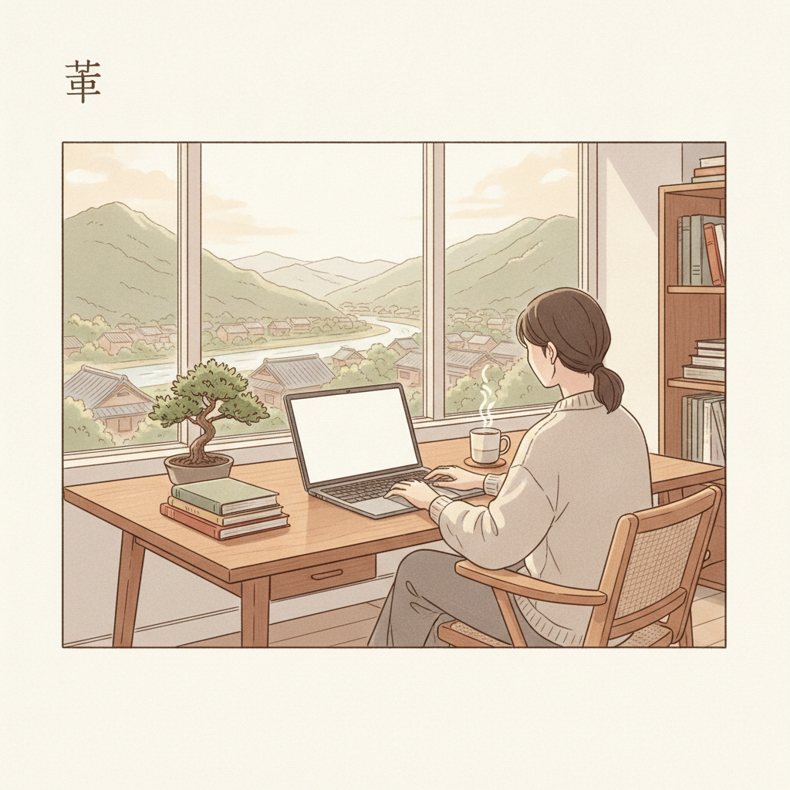

夕方5時を過ぎた頃、ふとパソコンから顔を上げてオフィスの時計や駅の案内板を見たとき、視界がじんわりと霞んでピントが合わない。そんな経験はないでしょうか。

手元のスマートフォンに目を戻すと、文字が二重に見えたり、少し画面を遠ざけないと読み取れなかったりする。まだ30代や40代なのに、ついに老眼が始まったのだろうかと、指先で眉間を押さえながら小さな不安を覚える人は少なくありません。

かつて私が製造業の生産管理を担当していた頃も、月末の納期管理や膨大なデータ処理が重なると、夕方にはモニターの数字がぼやけて判別できなくなる同僚が何人もいました。多くの人は「歳のせいだ」と諦めたり、気休めにブルーベリーのサプリを飲んだり、高価なブルーライトカット眼鏡を買い求めたりしていました。

しかし、眼科専門医の知見や最新の医学的エビデンスを紐解いていくと、私たちが信じてきた「目の常識」の多くが、実は根拠のない俗説であったことが分かります。

視界のかすみや重い眼精疲労は、加齢による不可逆な変化ではなく、単に「生体光学機器としての目の運用設計」に無理が生じているだけかもしれません。根性論で目を酷使するのをやめ、数字とロジックに基づいた正しいメンテナンスに切り替えること。それが、長くクリアな視界を保つための確かな道筋です。

---

## 「ブルーライトが目を壊す」という誤解と、眼精疲労の正体

ここ数年、ディスプレイを見る際の必需品のように語られてきたのが「ブルーライト対策」でした。青い光が網膜にダメージを与え、視力を低下させるという言説は、今や広く世間に浸透しています。

しかし、医学の世界ではすでに異なる結論が出ています。

2021年4月、日本眼科学会や日本眼科医会をはじめとする眼科関連6団体は、共同で声明を発表しました。その内容は、液晶ディスプレイから発せられるブルーライトの量は、曇りの日の屋外や窓越しの自然光に比べても遥かに少なく、網膜に障害を与えるレベルではないというものです。米国眼科アカデミー（AAO）も同様に、「ディスプレイの光によって目の疾患が生じることはない」と明言し、日常的な装用を推奨していません。

さらに、2021年に発表された厳密な臨床比較試験（Singh et al.）においても、ブルーライトカット眼鏡をかけたグループと、通常のレンズをかけたグループの間で、長時間の画面作業による眼精疲労の度合いに一切の有意差は認められませんでした。

もちろん、ブルーライトに全く影響がないわけではありません。ただし、その問題は「網膜を傷つけること」ではなく、「睡眠ホルモンであるメラトニンの分泌を狂わせること」にあります。

網膜には光を感じて体内時計を調節する特殊な細胞が存在します。夜遅くに強い青色光を浴びると、脳は「まだ真昼だ」と誤認してしまい、入眠を妨げてしまうのです。つまり、ブルーライトは目を物理的に破壊する有害物質ではなく、真夜中に鳴り響く「お昼の目覚ましアラーム」のようなものと言えます。

長時間のデスクワークで目が重くなり、頭痛が走る本当の原因は、光の波長ではありません。画面との「距離」と、無意識のうちに減ってしまう「まばたき」という、極めて物理的な運用の問題なのです。

---

## なぜ夕方になるとピントが合わないのか――毛様体筋の「空気椅子」

人間の目を精密なカメラに例えると、角膜と水晶体がレンズであり、網膜が画像を受け取るセンサーの役割を果たしています。

カメラと大きく異なるのは、人間の目は「毛様体筋」という筋肉を伸縮させることで、水晶体の厚みを変え、瞬時にピントを調節できる点です。

遠くを見ているとき、この筋肉は緩んでリラックスした状態にあります。反対に、スマートフォンや書類など近くを見るときは、毛様体筋がきゅっと収縮し、レンズを厚く膨らませます。

紙の書籍を読むときの標準的な距離はおよそ33cmから40cmですが、スマートフォンを操作しているとき、私たちの視距離は平均して20cm前後にまで縮まります。視距離が30cmから20cmに縮まるだけで、ピントを合わせるために必要な毛様体筋の負荷は約1.7倍に跳ね上がります。

想像してみてください。立ったまま軽く膝を曲げる中腰の姿勢（空気椅子）を、10秒や20秒なら誰もが保てるでしょう。しかし、その姿勢のまま微動だにせず、何時間も静止し続けたらどうなるでしょうか。太ももの筋肉はパンパンに張り詰め、いざ立ち上がろうとしても膝が伸びなくなってしまいます。

夕方に起きる「スマホ老眼」の正体は、まさにこの状態です。

至近距離を凝視し続けたことで、毛様体筋が収縮したまま痙攣を起こし、凝り固まってしまっているのです。加齢によって水晶体そのものが硬くなる不可逆な老眼とは異なり、こちらは筋肉の「一時的な筋緊張」です。

仕組みが筋肉のこわばりである以上、対処法も明確です。必要なのは高価なサプリメントを飲むことではなく、緊張しきった筋肉を定期的に緩める「インターバルの設計」です。

---

## 画面を見つめる時、目の表面で何が起きているか

眼精疲労と並んで現代人を悩ませているのが、目の乾き、いわゆる「画面ドライアイ」です。

私たちが通常、日常生活を送っているときのまばたきは1分間に12回から13回ほどです。数秒に一度、自動的にワイパーが動き、涙の膜を目の表面に塗り直して乾燥を防いでいます。

ところが、スマートフォンやPCのモニターを集中して凝視している間、このまばたきは1分間にわずか1回から2回へと激減します。実に8割から9割のまばたきが消失している計算です。

涙は単なる水分ではありません。水分の蒸発を防ぐために、表面にはごく薄い「油の膜」が張られています。この油分を分泌しているのが、まつ毛の生え際にある「マイボーム腺」という小さな分泌腺です。熱々のスープの上に油が浮いていると湯気が逃げにくいのと同じで、この油膜があって初めて、目の潤いは保たれます。

まばたきが減ると油膜の供給が滞り、表面の水分は一気に蒸発します。乾ききった角膜の上を、不完全なまばたきで無理やり擦り続ける。それはまるで、ウォッシャー液が出ないまま、埃まみれのフロントガラスをワイパーで力任せに擦っているような状態です。夕方に目がショボショボし、異物感を覚えるのは、角膜の表面に目に見えない微細な擦り傷がついているサインでもあります。

良かれと思って行っている日常の習慣が、かえって事態を悪化させているケースも少なくありません。

- 目薬の差しすぎ
  - 目薬は1滴で眼球表面の受容量の約2倍の液量があります。何滴も続けて差すと、目にとって大切な涙の成分まで洗い流してしまい、溢れた薬液が皮膚トラブルを招くことがあります。1回につき1滴で十分です。
- 水道水での洗眼
  - 水道水には塩素が含まれており、角膜を守る粘液層（ムチン）を破壊してしまいます。異物が入った緊急時を除き、日常的な水道水洗眼は避けるべきです。
- コンタクトレンズを装着したままの入浴
  - 浴室の水回りには、アカントアメーバなどの微生物が生息しています。レンズと角膜の間に菌が入り込むと、重篤な角膜感染症を引き起こすリスクがあります。コンタクトレンズは、法律上「AEDや人工骨と同等の高度管理医療機器」に分類される精密機器です。入浴時は必ず外すのが原則です。

---

## 根性ではなく環境で整える――臨床データが示す「20-20-20ルール」と作業設計

目を守るために必要なのは、「気合でスマホを見る時間を減らす」といった精神論ではありません。業務や日常の動線の中に、自動的に目が休まる「仕組み」を組み込むことです。

世界的な眼科ガイドラインで推奨され、近年その臨床効果が実証されたシンプルな運用法があります。それが「20-20-20ルール」です。

やり方は極めてシンプルです。

- デジタル画面を「20分間」見たら
- 「20フィート（約6メートル）」以上離れた遠くの景色を
- 「20秒間」ぼんやりと眺める

インドのアタル・ビハari・ヴァージパイ記念政府医科大学の研究チームが、1日4時間以上デジタル機器を使う536人を対象に実施した臨床試験があります。被験者にこの20-20-20ルールを4週間実践させたところ、全体の59%で眼精疲労の自覚症状が統計学的に有意に改善しました。特に「目の疲れ」や「頭痛」「ドライアイ」のスコアが劇的に低下したことが確認されています。

約6メートル先を見るだけで、空気椅子のように収縮していた毛様体筋はすっと弛緩し、ニュートラルな位置に戻ります。20分ごとのタイマーをかけるのが難しければ、「メールを1通書き終えたら窓の外をひと目見る」「信号待ちの間はスマホをポケットにしまい遠くの看板を見る」といった、行動のトリガーを決めておくだけでも十分な効果があります。

加えて、日々の作業環境を少しだけ調整してみてください。

- 画面との距離をA4用紙1枚分あける
  - 目と画面の距離は最低でも30cmから40cmを確保します。目安は手元にあるA4用紙の長辺（約30cm）です。これより画面が近づいていると気づいたら、端末を少し押し出します。
- 目線を「水平よりやや下」に設定する
  - モニターの上端が、自分の目の高さと同じか、やや下に来るよう配置します。見上げる角度になるとまぶたが大きく開き、涙の蒸発面積が広がってしまいます。視線をわずかに落とすだけで、目の露出面積が減り、乾燥を物理的に防ぐことができます。
- 1日5分、目元を温めて油膜を溶かす
  - マイボーム腺から出る油分は、冷えると固まりやすくなります。蒸しタオルや市販のホットアイマスクを使って1日5分ほど目元を温めると、固まった脂が溶け出し、涙の油膜が正常に機能するようになります。

---

## 道具をいたわるように、自分の感覚器官を設計する

工場のラインでも、個人のオフィスでも、長く正確に稼働し続ける機械には必ず、無理のない負荷基準と定期的なメンテナンス計画が組み込まれています。限界まで動かし続けて部品が焼き付いてから慌てても、元の性能を取り戻すには多大なコストと時間がかかります。

私たちの目も、それとまったく同じです。

朝起きてから眠りにつくまで、私たちは小さなガラス板を通じて世界とつながり、膨大な情報を処理し続けています。その負荷は、人類がこれまでの歴史で経験したことのない水準に達しています。

夕方に感じる目の重みや視界のかすみは、あなたの意志の弱さでも、避けられない老化の宣告でもありません。「少し負荷が限界を超えている」という、生体システムからの冷静なエラー通知です。

ブルーライトをいたずらに恐れる必要はありません。魔法のような視力回復法を探す必要もありません。

画面を少し遠ざける。  
ときどき遠くの景色を眺めて、筋肉のスイッチをオフにする。  
夜はお風呂に入る前にレンズを外し、あたたかな蒸気で目元を休める。

日々のささやかな「運用の見直し」の積み重ねが、5年後、10年後のあなたの視界を、静かに支え続けてくれるはずです。