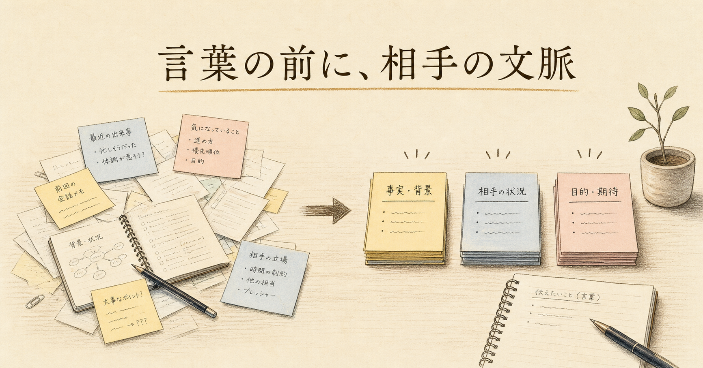
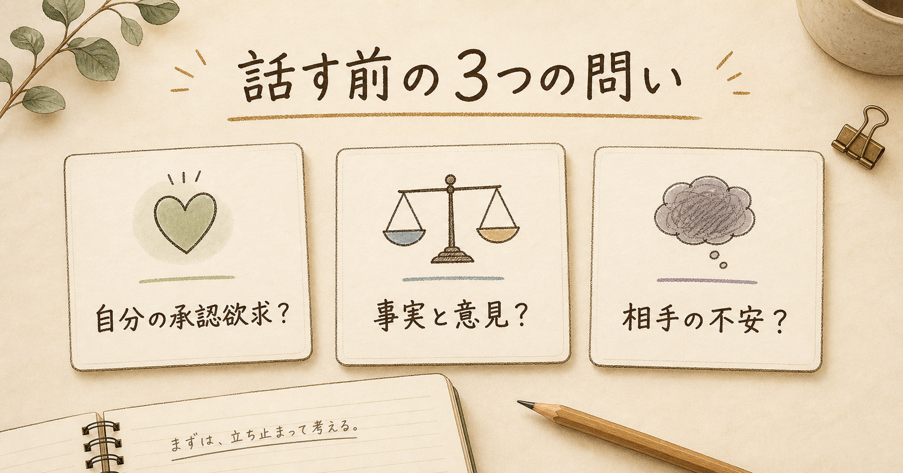

# 頭のいい人は、話す前に「相手の頭の中」を先に片づけている

月曜の朝、会議室に入る前から少し胃が重い。

資料は作った。数字も並べた。自分なりに考えた。なのに、話し始めた瞬間、相手の表情が少し曇ることがあります。

「言っていることは分かるんだけどね」

この一言を聞くと、こちらの中で小さく火がつく。分かるなら、なぜ進まないのか。根拠もある。筋も通っている。何が足りないのか。

以前の私は、こういう場面で「説明の仕方」を直そうとしていました。結論から話す。短くする。例を出す。もちろん、それも大事です。

でも、安達裕哉さんの『頭のいい人が話す前に考えていること』を読むと、少し違う景色が見えてきます。

伝わらない原因は、話し方だけではない。

話す前の段階で、相手の頭の中をまだ片づけていない。そこに問題があるのだと思います。

## 話し方を直しても、伝わらない人がいる

話し方の本はたくさんあります。結論から話す。ゆっくり話す。要点を絞る。相手の目を見る。

どれも間違っていません。

ただ、現場ではそれだけで済まないことが多いです。

部下が期限に遅れた理由を説明している。こちらは忙しい。言い訳に聞こえる。だから、つい途中で遮る。

「それは前にも言ったよね」

正しいかもしれません。でも、その瞬間に部下の耳は閉じる。面談は、課題解決の場ではなく、防衛の場になります。

自分が上司に提案する場面でも同じです。こちらは良い案だと思っている。けれど上司は、費用、リスク、社内調整、失敗時の責任を気にしている。その不安を先に受け取らないまま話すと、提案の中身以前に「この人は分かっていない」と判断される。

ここで出てくるのが、社会的知性です。

社会的知性とは、自分の頭のよさを見せる力ではありません。相手から見て「この人は、こちらのことを考えてくれている」と感じられる形で知識を使う力です。

## 本書の核心は「頭のよさは、他人が決める」

『頭のいい人が話す前に考えていること』は、2023年4月19日にダイヤモンド社から刊行されたビジネス書です。著者は安達裕哉さん。出版社公式情報では、四六判変形、336ページの書籍として紹介されています。

この本の中心にあるのは、かなり厳しい現実です。

頭のよさは、自分ではなく他人が決める。

最初は少し冷たく聞こえます。自分の努力や知識が、相手の評価に委ねられるのか、と感じる人もいるはずです。

でも仕事の現場では、これはかなり現実的です。

どれだけ正しいことを言っても、相手が「この人は自分の都合だけで話している」と感じたら、その言葉は届きません。反対に、言葉数が少なくても、「こちらの事情まで考えてくれている」と伝われば、信頼は生まれます。

会議で、すぐに反論できる人は目立ちます。知識がある人も目立ちます。専門用語を並べられる人も、短期的には「できる人」に見える。

でも、長く一緒に仕事をしたいと思われるのは少し違うタイプです。

こちらの話を最後まで聞く人。

自分の正しさを証明する前に、何が問題なのかを整理してくれる人。

相手を負かすのでなく、同じ課題を見る位置に立てる人。

そういう人は、場を荒らしません。相手の承認欲求を不必要に刺激しない。承認欲求とは、誰かに認められたい気持ちのことです。上司にも、部下にも、もちろん自分にもあります。

会話がこじれる時、実は内容そのものより、この承認欲求のぶつかり合いが原因になっていることがあります。

「自分は間違っていない」

「自分のほうが分かっている」

「ちゃんと評価されたい」

この気持ちが前に出ると、言葉は相手のための道具ではなく、自分を守る盾になります。

本書が言う「頭のよさ」は、その盾を少し下ろすことから始まります。

## 反応しない人は、何を考えているのか

本書の法則の中で、現場ですぐ効くのは「とにかく反応するな」だと思います。

これは、黙って我慢するという意味ではありません。感情をなかったことにする話でもない。

反応と返答を分ける、ということです。

反応は速い。怒り、焦り、言い返したい気持ち。これは自然に出ます。人間なので仕方ありません。

返答は遅い。相手の意図を見て、事実と意見を分けて、今この場で何を言えば前に進むかを選ぶ必要があります。

この数秒の差が、かなり大きいです。

部下が言い訳をしているように聞こえた時。

上司が雑に否定してきた時。

同僚がこちらの努力を分かっていないように感じた時。

そこで即座に言葉を返すと、自分の承認欲求が先に出ます。相手の話ではなく、自分の傷を守るために話し始めてしまう。

でも、数秒だけ止まる。

その間に、こう問い直します。

いま起きているのは、人との戦いか。課題との戦いか。

この問いは、地味ですが効きます。

部下が「他部署からの返事が遅くて」と言ったとします。すぐに「また他責か」と反応すると、人と闘う流れになります。

でも、少し止まって考えると、別の見方ができます。

本当に他部署の返事が遅いのかもしれない。依頼の出し方が曖昧だったのかもしれない。締切の共有が遅かったのかもしれない。部下が早めに相談しづらい空気を、こちらが作っていたのかもしれない。

つまり、相手の性格ではなく、解くべき課題が見えてくる。

これが「人と闘うな、課題と闘え」ということだと思います。

## 正論は、相手の頭の中を散らかすことがある

正論は便利です。

遅れたなら早く報告すべき。

分からないなら確認すべき。

会議では結論から話すべき。

どれも正しい。けれど、正しい言葉ほど、使い方を間違えると相手の頭の中を散らかします。

相手は、すでに不安や焦りを抱えているかもしれません。そこに正論を投げると、相手は情報を受け取る前に、自分を守ろうとします。

料理で言えば、相手の皿の上にまだ前の料理が残っているのに、次の料理をどんどん置くようなものです。

まず皿を下げる。つまり、相手の状態を見ます。

「何が一番詰まっている？」

「どこから崩れた？」

「今の説明で、私がまだ理解できていない部分はどこ？」

この聞き方をすると、会話の向きが変わります。相手を裁く時間から、課題を分解する時間へ変わる。

## 今日から使える、話す前の3つの問い

ここからは実践に落とします。

難しいことは不要です。話す前に、3つだけ問いを置く。

1つ目。

いま私は、相手ではなく自分の承認欲求を満たそうとしていないか。

会議でよく起きます。相手の発言の小さな間違いを訂正したくなる。自分の知識を入れたくなる。過去の苦労を分かってほしくなる。

その衝動が出た時、少し止まる。

その指摘は、目的を前に進めるのか。それとも、自分が正しいと示したいだけなのか。

2つ目。

この話の事実と意見は分かれているか。

「あの部署は協力的ではない」は意見です。

「依頼メールへの返信が3営業日なかった」は事実です。

この2つを混ぜると、会話は感情戦になります。分けると、課題になります。

3つ目。

相手は、いま何を不安に思い、何を期待しているか。

上司なら、失敗時の責任を気にしているかもしれない。

部下なら、否定されることを恐れているかもしれない。

同僚なら、自分の負担が増えることを警戒しているかもしれない。

この不安を先に見ないまま、こちらの正しさだけを出すと、伝わりません。

## 結論。話す前に考えるとは、相手のために一度止まること

頭のいい人は、たくさん話す人ではありません。

難しい言葉を知っている人でもありません。

相手の頭の中が散らかっている時に、一緒に片づけられる人です。

自分の言葉を投げる前に、相手が受け取れる形へ包み直す人です。

そのために、少し止まる。

反応を返答に変える。

人ではなく課題を見る。

事実と意見を分ける。

相手の承認欲求を、静かに満たす。

派手さはありません。でも、仕事の信頼はこういう小さな所作で決まります。

次に会議で何か言いたくなった時、すぐに言葉を出さなくてもいい。

一度だけ、こう問いかけてみてください。

この言葉は、相手を楽にするためのものか。

それとも、自分が賢く見られるためのものか。

この問いを挟むだけで、会話の質は変わります。

そして、その数秒の沈黙こそが、話す前に考えている人の静かな強さなのだと思います。

<!-- 参照ファイル一覧
- 03_detailed_agenda.md
- 04_blog_post.md
- 05_thumbnail_prompts.md
- 06_section_prompts.md
- ./thumbnail.png
- ./img1.png
- ./img2.png
- ./img3.png
- ./img4.png
-->
