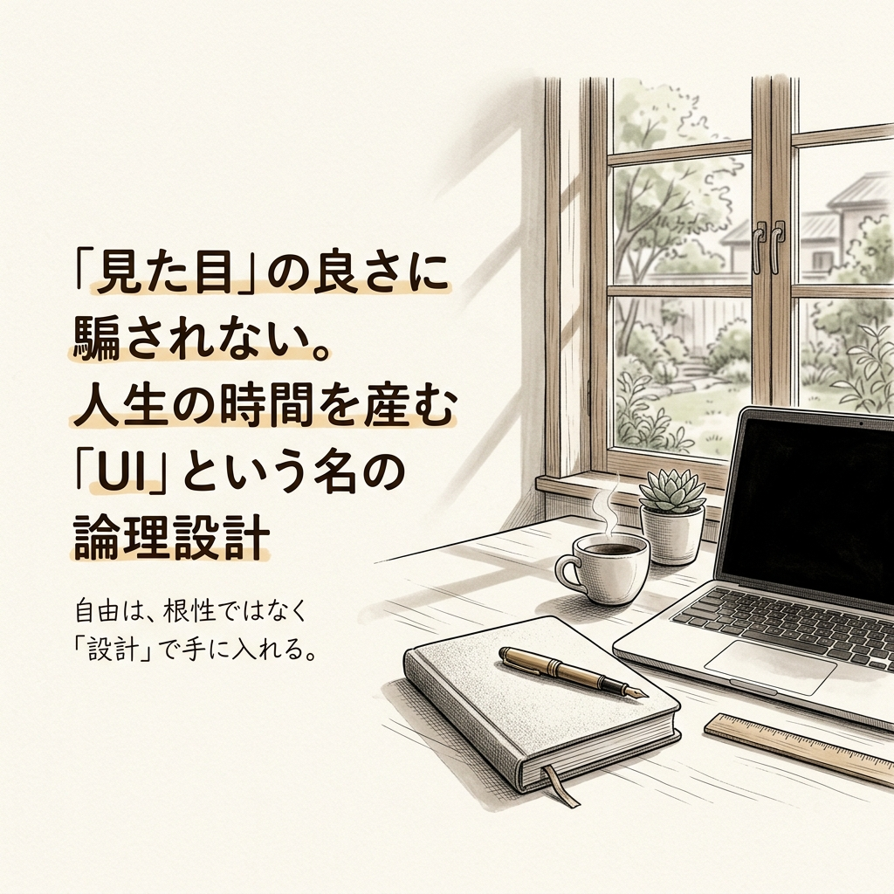
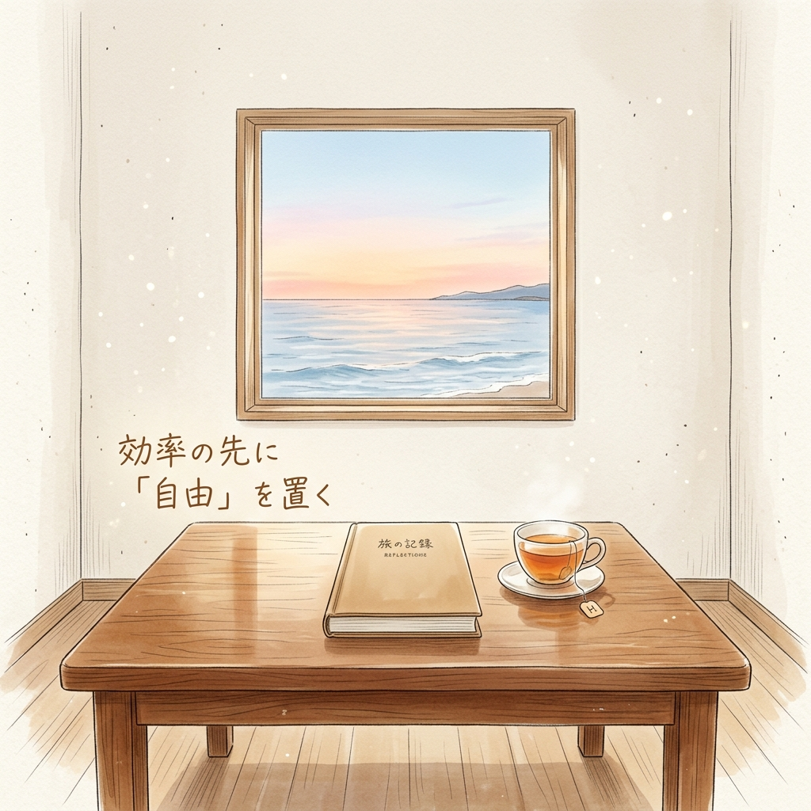

月曜日の朝。淹れたてのコーヒーが冷めないうちに、一日の予定を確認しようとアプリを開く。

でも、目的の画面にたどり着くまでに不快な広告を消し、深いメニューの迷路を彷徨い、ようやく見つけたボタンは指が届きにくい右上に配置されている。そんな経験、誰にでもありますよね。

気づけばコーヒーは冷め、朝の静かな集中力は霧散して、ただ「操作」という名の無駄な労働に時間を奪われていく。

かつての私もそうでした。製造業の現場で25年間、生産管理に明け暮れていた私は、現場の非効率を憎む一方で、デジタルツールの「不親切さ」に絶望していました。なぜ、こんなに使いにくいのか。なぜ、私の貴重な時間をこのアプリは奪うのか。

そこで学んだのは、UI（ユーザーインターフェース）とは単なる見た目の良し悪しではないということ。それは、私たちの人生の時間を産むか、それとも奪うかを決める「論理の設計」そのものなんです。

今日は、誰にでも再現できる「自由を手にするための設計思想」について、穏やかに、でも確信を持って語ってみようと思います。

## デザインの正体は「見た目」ではなく「動線の設計」にある

「UIが良い」と聞くと、多くの人は「色が綺麗」とか「アニメーションがかっこいい」といった視覚的な装飾を思い浮かべます。でも、本質は全く別の場所にあります。

UI（ユーザーインターフェース）とは、一言で言えば「システムと人間の接点」です。窓口と言い換えてもいい。

たとえば、ホテルのフロントを想像してみてください。
ロビーには豪華なシャンデリアがあり、大理石の床が輝いている。でも、チェックインの窓口がどこか分からず、ようやく見つけた列に並んで30分待たされるとしたら、そのホテルのUIは最悪だと言わざるを得ません。

一方で、装飾は質素でも、入り口に入った瞬間にスタッフが歩み寄り、30秒で鍵を渡してくれるフロント。これが、本来の意味で「UIが優れている」状態です。

UIの本質は、ユーザーに「考えさせない」こと。そして、ユーザーが目的を達成するまでの「最短ルート」を、論理的に、かつ静かに敷くことにあります。

私が製造業の現場で「工具箱の整理」に心血を注いでいたのも同じ理由です。職人は、目をつぶっていても必要なレンチを手に取ることができます。それは、工具の持ち手というUIと、その配置という設計が、極限まで合理化されているからです。

デジタルツールも同じ。優れたUIは、あなたの思考を止めません。呼吸をするように、目的を達成させてくれる。その「時間を産む設計」こそが、私たちが追求すべき正解なんです。

## 巨人に学ぶ「論理」の極致：ヤマト運輸とヨドバシカメラ

日本には、この論理の設計を極めた素晴らしい事例があります。その中でも、対極のアプローチでありながら共通の真理を突いているのが、ヤマト運輸とヨドバシカメラです。

### ヤマト運輸：迷いを消す「おもてなし」の論理

ヤマト運輸のウェブサイトを開いたとき、迷うことはまずありません。
トップページには「個人のお客様」「法人のお客様」という属性と、「荷物を送る」「荷物を受け取る」という目的が、非常に明確に、かつ大きく配置されています。

これは、ユーザビリティ（使い勝手の良さ）の教科書のような設計です。
ヤマト運輸のUIが評価される理由は、サイトを訪れる人が「今、何に困っているか」を完全に理解し、その解決策をそっと差し出しているからに他なりません。

たとえば、再配達の依頼。
数回のタップで完了します。複数の荷物をまとめて照会できる機能も、「一つずつ入力する手間」というユーザーの痛点を論理的に解消しています。

これは単なる親切ではありません。ユーザーの「心理的エネルギー」の消費を最小限に抑える、高度な設計です。駅の改札を通るとき、私たちは「どこにカードをかざすべきか」と考えませんよね。ヤマト運輸のUIも、それと同じレベルで「無意識」を味方につけています。

### ヨドバシ.com：見た目を超えた「信頼と効率」の論理

一方で、ヨドバシカメラのECサイト「ヨドバシ.com」は、一見すると情報の密度が高く、少し「古臭い」と感じる人もいるかもしれません。しかし、ここには別の意味で極まったUIが存在します。

ヨドバシ.comの強みは、「最短での目的達成」を追求したストイックな設計です。
買うものが決まっているユーザーにとって、不要なレコメンドや過剰な演出は邪魔でしかありません。

商品一覧ページを見てください。価格、在庫状況、ポイント還元、お届け予定日、そしてレビュー。購入判断に必要な「すべての材料」が、一画面に集約されています。ユーザーは複数のページを往復する必要がありません。

これは、プロ仕様の厨房と同じです。
一流の料理人は、調理中にあちこち動き回りません。自分の手が届く範囲に、すべてのスパイスとナイフが配置されている。ヨドバシ.comのUIは、買い物という「判断」をプロの効率で行わせてくれる、極めて合理的な道具なんです。

見た目の洗練さよりも、ユーザーが「早く、安心して、確実に買う」という核心的な目的を優先する。この覚悟こそが、11年連続で顧客満足度1位という驚異的な数字を支えている論理の正体です。

## 優れたUIが共有する唯一の掟：「ユーザーに考えさせない」

ヤマト運輸とヨドバシカメラ。手法は違えど、二つのサイトが守り抜いている掟があります。それは、「ユーザーに考えさせない」ということです。

人間が情報を理解し、判断を下すとき、脳はエネルギーを消費します。これを専門用語で「認知負荷」と呼びます。

スマートフォンのバッテリーを想像してみてください。
使いにくいアプリを操作しているとき、あなたの脳のバッテリーは急速に消耗していきます。「このボタンは何？」「さっきの画面に戻るには？」そんな疑問が浮かぶたびに、あなたの貴重な意志力は削り取られていくんです。

優れたUIは、この認知負荷を極限まで下げてくれます。
そのために重要なのが「一貫性」です。

たとえば、信号機のルール。
世界中どこへ行っても、赤は「止まれ」、青は「進め」です。もし、ある街で赤が「進め」だったら、パニックが起きるでしょう。UIにおける一貫性も、これと同じです。

- 「この形をしていれば、ボタンである」
- 「左上にある矢印は、前の画面に戻る」
- 「赤い文字は注意を促している」

こうした共通言語をサイト全体で守ることで、ユーザーは「学習」という名のコストを支払わずに済みます。優れたUIは、あなたの無意識に語りかけ、エネルギーを温存させてくれるんです。

その温存されたエネルギーこそが、私たちがよりクリエイティブな仕事や、大切な人との時間に注ぎ込むべき原動力になるはずです。

## 私たちの人生の「UI」を再設計する

ここまで、優れたウェブサイトの事例を通じてUIの本質を語ってきました。でも、私が本当に伝えたいのは、画面の中の話だけではありません。

「あなたの人生のUI（仕組み）は、どうなっていますか？」

毎日、同じ探し物をしていませんか？
終わりの見えない会議の迷路を彷徨っていませんか？
使いにくい「心のボタン」を無理に押し続けて、脳のバッテリーを浪費していませんか？

仕組みを整えることは、根性論を捨てることです。
蛇口をひねれば、水が出る。
この「UI」のおかげで、私たちは川まで水を汲みに行く重労働から解放され、その時間を読書や休息という自由な時間に使えるようになりました。

デジタルツールを選ぶとき、あるいは業務のプロセスを設計するとき、常に自分に問いかけてみてください。「これは、誰かの考えを止めていないか？」「これは、誰かの時間を産んでいるか？」

UIとは、単なる表面のデザインではありません。
自分と、そして自分の大切な人たちの「自由」を守るための、静かで強力な盾なんです。

かつての私は、根性で不便を乗り越えようとしていました。
でも、今は違います。論理で、仕組みを設計する。
もし、あなたの今の働き方が、5年後も同じだとしたら。
その時、あなたの人生のUIは、あなたをどんな場所に連れて行ってくれるでしょうか。

一度立ち止まって、自分を取り巻く「論理の設計図」を見直してみる。
それは、あなたが自由を手にするための、最も実直で、確実な一歩になるはずです。

---

### 専門用語の備忘録（本記事の理解を深めるために）

- **UI（ユーザーインターフェース）**：システムと人間の接点。ドアの取っ手のようなもの。
- **UX（ユーザーエクスペリエンス）**：システムを通じて得られる体験全体。ドアを開けて中に入った時の心地よさ。
- **ユーザビリティ**：使い勝手の良さ。自分の手に馴染む箸のような感覚。
- **認知負荷**：情報を理解するために脳が使うエネルギー。カバンの中で鍵を探すときのイライラ。
- **レスポンシブデザイン**：スマホでもPCでも最適に見える設計。どんな器にも形を合わせる水のような柔軟性。

---

**【今回の設計図：5SからUIへ】**
かつて製造業の世界では「整理・整頓・清掃・清潔・躾」という5Sが現場を支えていました。
現代において、この5Sに代わるのが、優れたUI設計だと私は考えています。
物理的な空間だけでなく、デジタル空間、そして思考の空間を整える。
その設計の先に、本当の自由が待っています。

<!-- 画像リネームマッピング (GAS/手動作業用)
Phase2生成ファイル → GASアップロード用ファイル名

Image/thumbnail/thumbnail_260429_001.png → thumbnail.png
Image/sections/section_01_ui_logic.png → img1.png
Image/sections/section_02_life_design.png → img2.png

アップロード先: GitHub src/content/blog/ui-design-logic-freedom/ (コロケーション配置)
Astro参照パス: ./thumbnail.png, ./img1.png, ./img2.png
-->

<!-- 参照ファイル一覧
- 03_detailed_agenda.md
- 04_blog_post.md
- 05_thumbnail_prompts.md
- 06_section_prompts.md
- Image/thumbnail/thumbnail_260429_001.png
- Image/sections/section_01_ui_logic.png
- Image/sections/section_02_life_design.png
-->
