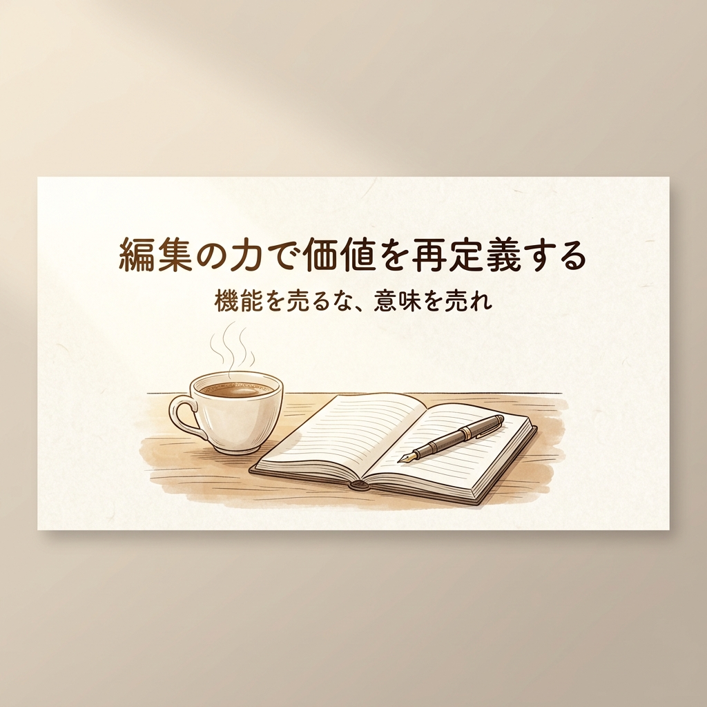
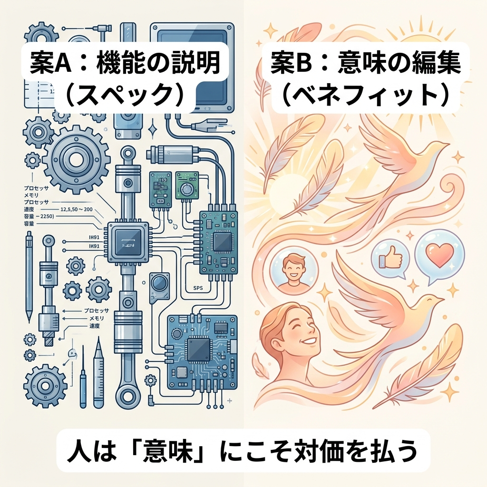
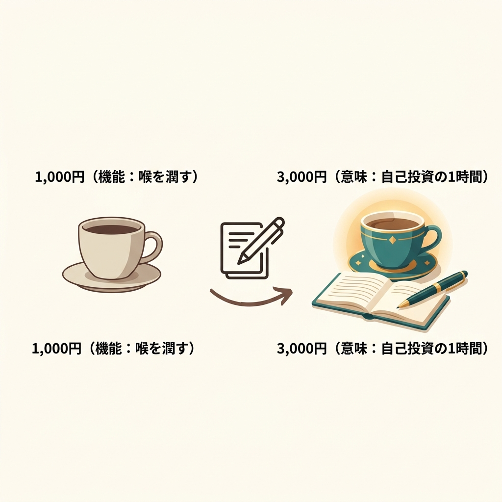
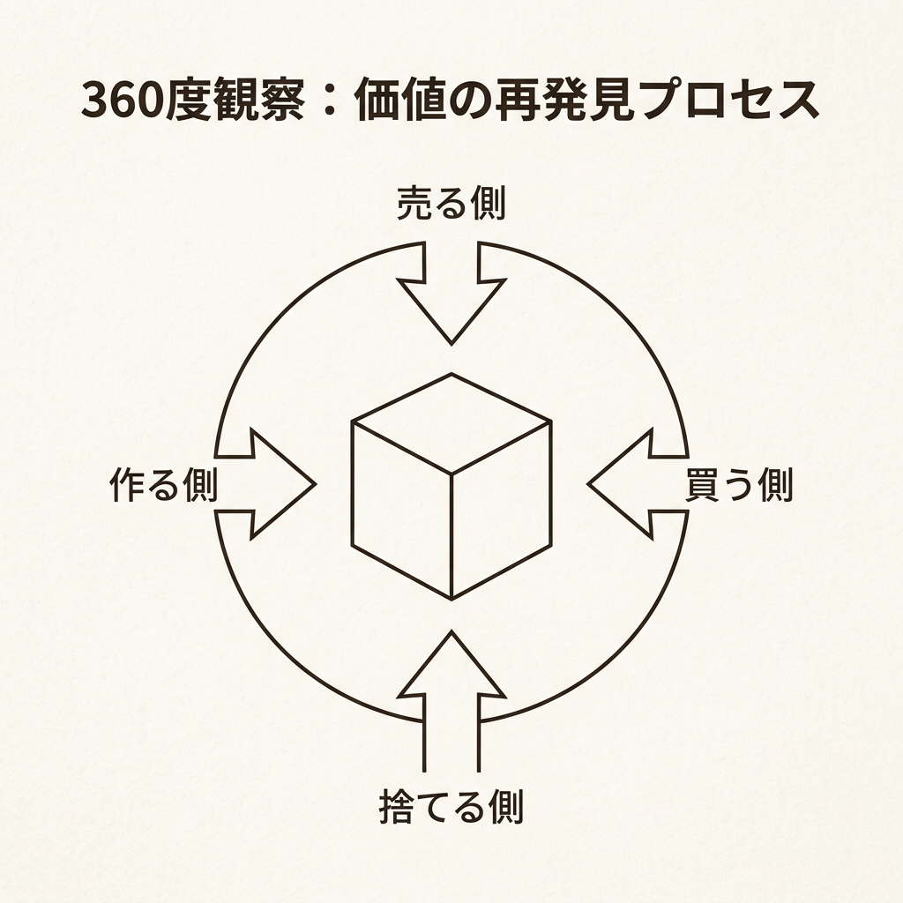

---
title: "「僕のオフィスに、ネコがくる。」に学ぶ、価値を最大化する「編集」の技術"
description: "優れた技術があるのに安売りしてしまう。そんな悩みを持つすべてのビジネスパーソンへ。柿内芳文氏の理論をベースに、機能を売るスペック競争から脱却し、「意味」を編集して価値を再定義する具体的な手法を解剖します。"
pubDate: "2026-04-27"
tags: ["ビジネス戦略", "編集力", "価値再定義", "柿内芳文"]
heroImage: "./thumbnail.png"
slug: "value-editing-redefinition"
draft: false
---

「もっと安く、もっと速く、もっと多機能に。」

もしあなたが今、このループの中で息苦しさを感じているなら、それはあなたの能力のせいではない。ビジネスの根幹である「価値」というものの定義を、少しだけ履き違えているだけかもしれない。

腕はいい。仕事も丁寧だ。なのに、なぜか価格競争に巻き込まれ、最後は「お願いだからこの金額で」と頭を下げている。一方で、隣の席のライバルは、自分より明らかに低いスペックで、悠々と数倍の利益を上げている。

この理不尽な格差を生んでいるのは、技術の優劣じゃない。その技術をどう見せるか、どう定義するかという「編集力」の差だ。

今回は、稀代のヒットメーカー・柿内芳文氏が提唱する「価値の再定義」と「ツケカ」の技術を、僕なりに解き明かしてみたい。これまでの「正解」を一度ゴミ箱に捨てて、新しい思考をインストールする準備をしてほしい。

## 努力の方向を間違えていないか？ ―「機能」の迷宮と「価値」の発見

夜遅くまでデスクにしがみつき、競合のスペック表を眺めては「あちらに無い機能を一つ追加しよう」とマニュアルを更新する。そんな日々を過ごしていないだろうか。

悪いことは言わない。その努力は、今すぐやめるべきだ。

現代において、機能（スペック）だけで勝負を挑むのは、死の行軍に近い。機能はすぐにコピーされ、資本力のある誰かが物量で上書きしてくる。そもそも、僕たちはもう、機能の多さに疲れ果てているんだ。

たとえば、1,000種類もの調理コースがある最新の炊飯器を、あなたは本当に使いこなせるだろうか？ おそらく、多くの人にとって価値があるのは、ボタン一つで「死ぬほど旨い白米」が炊き上がるシンプルな土鍋のほうだ。

多忙な朝、1,000の機能はただの「ノイズ」でしかない。あなたが売るべきは機能そのものではなく、その機能が顧客の人生にもたらす「変化」や「意味」であるべきなんだ。

価値は、作るものではなく「見つける」ものだ。柿内氏が提唱する「360度観察法」は、そのための強力な武器になる。

商品を作る側、売る側、買う側、そして捨てる側。あらゆる視点から、今あるものを眺め直してみる。それは新しい発明ではなく、価値の「検品作業」だと言ってもいい。

古いオフィスに猫を放してみたとする。
作る側からすれば、衛生管理が面倒なだけの邪魔者かもしれない。けれど、そこで働く社員にとっては、張り詰めた空気を和らげる「一服の清涼剤」になり、会話を生む「ハブ」になる。

「猫」という存在に、新しい「意味」というラベルを貼る。これこそが編集の力だ。

大掃除のとき、自分がゴミだと思って捨てようとした古びた時計を、アンティーク業者が「お宝だ」と目を輝かせる。価値とは、あなたの手元にあるときではなく、誰かの「痛み（不）」と合致した瞬間に、火花のように生まれるものなんだ。

## 1,000円のコーヒーを3,000円に変える「ツケカ」の技術

一番痺れるのが「ツケカ（値付け）」の概念だ。

原価にちょこっと利益を乗せて価格を決める。そんな「原価積み上げ」の発想では、一生、自由にはなれない。ツケカとは、商品が持つ潜在的な魅力を適切な言葉でパッケージングし、「その価格で買うのが合理的だ」と納得できる文脈を作ることだ。

1,000円のコーヒーを、どうやって3,000円で売るか。

豆を高級にする？ それは古い。
そうではなく、提供する文脈を編集するんだ。その場所を「コーヒーを飲む場所」ではなく、「人生の重要な決断を下すための、極上の静寂が守られた1時間」として定義し直す。

名前を「ブレンドコーヒー」から「決断のための1時間」に変える。スマホを預かり、デジタルデトックスの環境を作る。思考を整理するための上質なノートと万年筆を差し出す。

こうなれば、顧客はコーヒーにお金を払うのではない。「自分の未来を決めるための投資」として、喜んで3,000円を差し出すようになる。中身が同じ豆でも、編集ひとつで「喉を潤す液体」から「自己投資のツール」へと昇華する。これがツケカの真髄だ。

## 「選ばない自由」を売る ―これからのビジネスの最適解

最後に触れておきたいのが、提示の仕方だ。柿内氏の言う「A/Bの法則」は、僕たちのビジネスにも直結する。

ダイエット食品を売るとき、「糖質90%カット」というスペック（A）を強調するか、それとも「好きなものを食べる楽しみを諦めなくていい生活」（B）を強調するか。顧客が財布を開くのは、いつだってBのほうだ。

さらに、現代人は「選択」という行為に疲れ切っている。
100種類のメニューがある店は親切に見えて、実は客に「選ぶ」という労働を強いている。一方で、「今日の最高の一皿」だけを出す店は、客から選択の苦痛を奪い、「信頼」という価値を提供しているんだ。

「何でもできます」は、誰からも選ばれない。
「これだけを、あなたのために用意した」という編集的決断こそが、高単価を実現する。

AIが瞬時に「正解」を出してくれる時代。
論理的な整合性や効率性なんてものは、もう価値を持たなくなる。人間に残された最後の聖域は、この「意味付け」――すなわち編集力だと思う。

AIは1,000円のコーヒーを安く淹れる方法は教えてくれるが、それを「人生を変える一杯」として定義することはできない。

あなたのサービスから機能をすべて奪ったとき、あとに残る「意味」は何だろうか？
顧客があなたに払っているのは、プログラムの行数でも、作業時間でもない。その先にある「安心」や「期待」だ。

一度、価値を作る手を止めて、身の回りを360度観察してみてほしい。
あなたの足元には、まだ名前のついていない巨大な価値が眠っているはずだ。

それを掘り出し、適切な名前をつけ、最高のパッケージで届ける。
それこそが、僕たちが目指すべき、最もエレガントなビジネスの姿だ。

<!-- 画像リネームマッピング (GAS/手動作業用)
Phase2生成ファイル → GASアップロード用ファイル名

Image/thumbnail/thumbnail_D.png → thumbnail.png
Image/sections/section_01_360view.png → img1.png
Image/sections/section_02_value_up.png → img2.png
Image/sections/section_03_ab_law.png → img3.png

アップロード先: GitHub src/content/blog/value-editing-redefinition/ (コロケーション配置)
Astro参照パス: ./thumbnail.png, ./img1.png, ./img2.png, ./img3.png
-->

<!-- 参照ファイル一覧
- 03_detailed_agenda.md
- 04_blog_post.md
- 05_thumbnail_prompts.md
- 06_section_prompts.md
- Image/thumbnail/thumbnail_D.png
- Image/sections/section_01_360view.png
- Image/sections/section_02_value_up.png
- Image/sections/section_03_ab_law.png
-->
