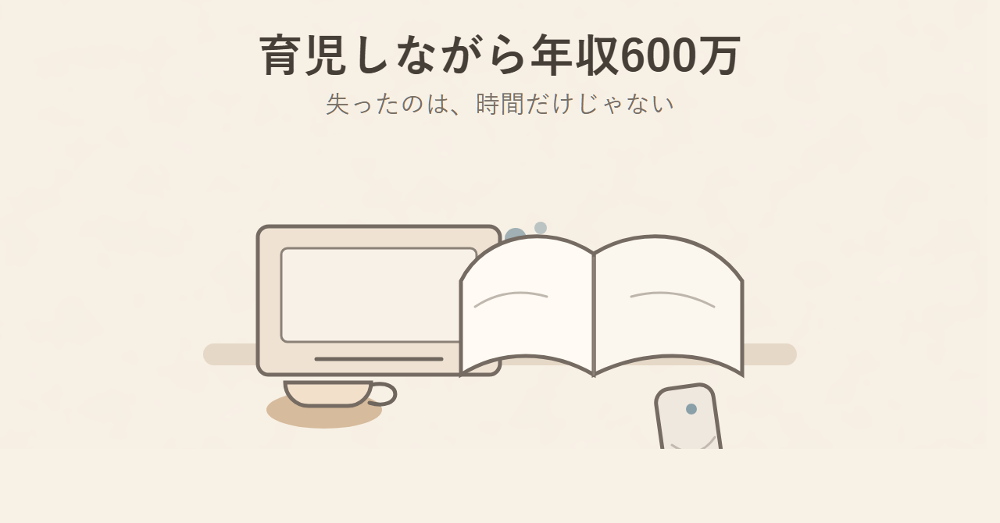
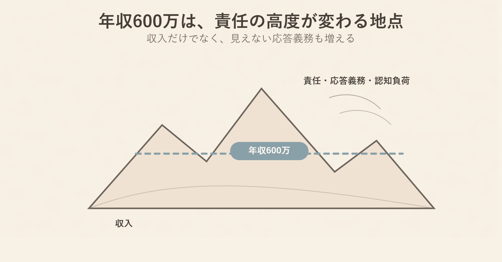
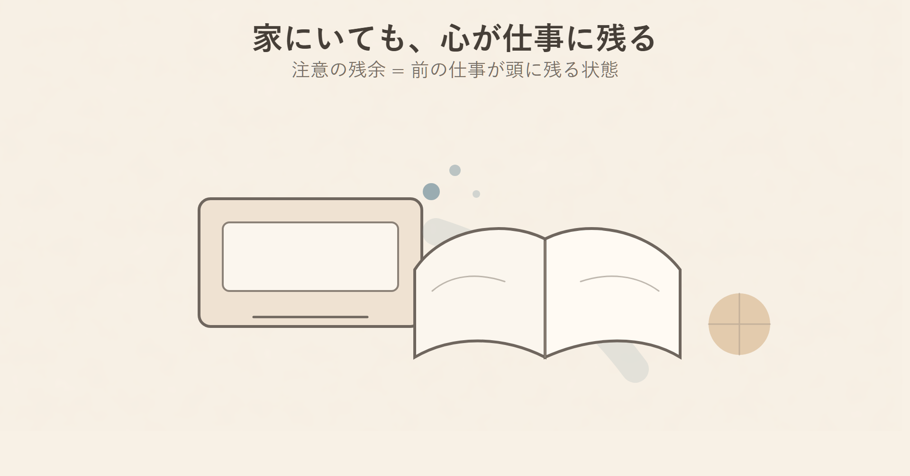
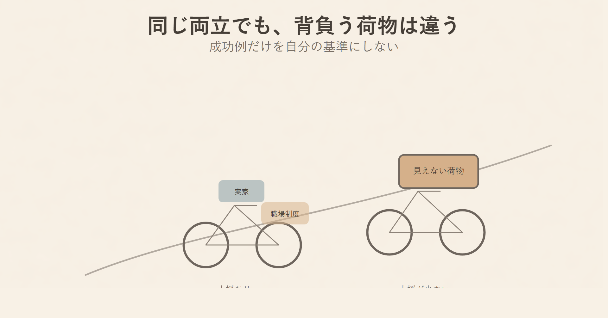
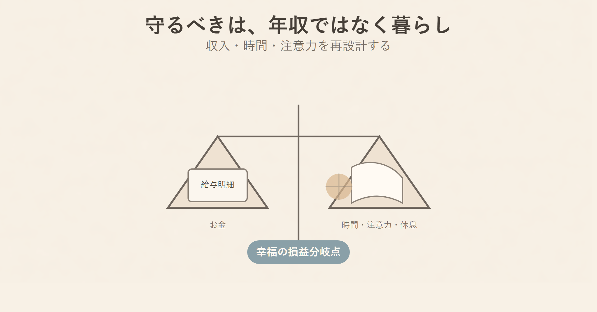

# 育児しながら「年収600万」を稼ごうとして失ったもの

夜21時。子どもはパジャマ姿で、絵本を一冊持って立っています。

本当なら、少し手を止めて「今日はどんな一日だった？」と聞いてあげたい。そう思っているのに、頭のどこかでは明日の会議資料と、まだ返していないチャットが点滅している。

子どもが「今日ね」と話し始めた瞬間、口から出るのは別の言葉です。

「ごめん、もう寝よう」

寝顔を見て、胸が少し痛む。でも翌朝には、また同じ一日が始まる。仕事では責任ある立場。家庭では保育園の準備、食事、寝かしつけ、学校行事、子どもの感情の受け止め。

年収は上がった。社会的には、きっと前に進んでいる。

それなのに、家庭の中で、自分がどんどん薄くなっている気がする。

この記事で考えたいのは、高年収の母親が悪い、という話ではありません。むしろ逆です。真面目に働き、家族のために稼ぎ、責任から逃げずに踏ん張っている人ほど、この罠にはまりやすい。

問題は愛情不足ではなく、設計の問題です。

年収600万円という数字そのものではなく、その数字にくっついてくる「24時間の心理的拘束」が、家庭の余白を削っていないか。ここを見ます。

## 年収600万円は、ただの数字ではない

国税庁の「令和5年分 民間給与実態統計調査」によれば、女性の平均給与は約314万円です。年収600万円を超える女性は、女性給与所得者全体の中でも少数派に入ります。

つまり年収600万円は、少し頑張れば誰でも届く数字ではありません。多くの場合、専門性、責任、長い稼働時間、突発対応、職場からの高い期待とセットになっています。

統計とは、社会全体の傾向を数字で見る道具です。もちろん、一人ひとりの事情は違います。ただ大きな傾向として、女性が年収600万円に到達するには、かなり高い職責を背負っている可能性が高い。

山登りでいえば、年収600万円は見晴らしのよい展望台ではなく、酸素が薄くなる高度に入る地点です。景色はよくなる。でも、呼吸は苦しくなる。

ここを見落とすと、「稼げているのだから、もっと楽なはず」と自分を責めてしまう。

でも現実には、報酬は単なる労働時間に払われているわけではありません。いつでも応答できる責任に払われている面があります。

日本の多くの会社は、まだメンバーシップ型雇用の色が濃く残っています。メンバーシップ型雇用とは、職務を細かく限定せず、会社の必要に応じて広く役割を引き受ける働き方です。

この働き方では、仕事の境界線が曖昧になります。勤務時間が終わってもチャットは届く。子どもと夕食を食べていても、明日の会議のことが頭から離れない。休日でも、月曜の段取りを考えてしまう。

家の鍵を、会社にも渡しているような状態です。退勤しても、心の中にはいつでも会社が入ってこられる。

この状態で育児をするのは、かなり難しい。

## 問題は「時間不足」ではなく「注意力の枯渇」

育児と仕事の両立というと、よく「時間が足りない」という話になります。もちろん時間は足りません。ただ、もっと深いところで起きているのは、注意力が残っていないことです。

心理学には、注意の残余という考え方があります。前の仕事の思考が頭に残り、次の行動に集中できない状態のことです。

重要な会議が終わったあと、子どもと向き合っているつもりでも、頭の一部では「あの発言でよかったか」「次の資料はどう直すか」と考え続けている。身体は家にある。でも、心の一部はまだ職場に残っている。

パソコンで重いアプリを閉じたつもりでも、裏側でまだ動き続けて、全体の動作が遅くなるようなものです。

この状態では、子どもの小さなサインを拾う力が落ちます。

「今日、ちょっと元気がないな」

「この話し方は、何か引っかかっているな」

「今は正論より、ただ聞いてほしいだけだな」

こういう微細な変化を受け止めるには、静かな注意力が必要です。

発達心理学には、情動的調律という考え方があります。子どもの感情に親が波長を合わせることです。難しく聞こえますが、要するに、子どもの不安、喜び、戸惑いに気づき、それを受け止めて返すこと。

ラジオの周波数を合わせるようなものですね。少しずれても音は聞こえます。でも、雑音が混じる。

高年収の仕事で身につけた効率化の力は、職場では武器になります。けれど家庭では、ときに逆方向に働きます。

子どもの話は、結論が遅い。食事も着替えも、思った通りには進まない。感情は、タスクのように処理できない。

でも、仕事で脳が疲れ切っていると、子どもの寄り道がノイズに見えてしまう。

「早くして」

「あとで聞くね」

「今それ必要？」

この言葉を言ったあと、自己嫌悪になる人は多いはずです。私も、仕事の設計を間違えると、人は簡単に余裕を失うものだと考えています。人格の問題ではありません。余白の設計が足りないのです。

## 「両立できている人」の裏には、見えない条件がある

SNSを見ると、年収も育児も美容も家庭も、全部うまく回しているように見える人がいます。

でも、そのまま自分と比べるのは危険です。

ここには、生存者バイアスが入ります。成功した人だけが目立ち、失敗した人が見えなくなる偏りのことです。宝くじ売り場に当選者の写真だけが貼られていて、外れた大量の券は見えない。あれに近い状態です。

両立できているように見える人の裏には、見えない条件があります。

近くに頼れる実家がある。パートナーが本当に半分以上を担っている。職場が柔軟で、急な休みに理解がある。職種が高単価で、労働時間と収入が強く連動していない。本人の体力やストレス耐性がかなり高い。

これらは努力ではなく、構造です。

総務省統計局の「令和3年社会生活基本調査」では、6歳未満の子どもを持つ共働き世帯において、妻の家事・育児関連時間は1日7時間28分、夫は1時間54分とされています。

無償労働とは、給料は出ないけれど生活を支える仕事です。料理、洗濯、保育園準備、子どもの体調管理、学校行事の把握、予防接種の予約。こうした仕事は、家計簿にも給与明細にも出てきません。

でも、確実に時間と注意力を使います。

同じ坂道を走っているように見えて、片方は電動自転車、片方は荷物を積んだ普通の自転車かもしれない。見た目の速度だけを比べても、意味がない。

だから「あの人みたいにできない」と責める前に、自分の背負っている荷物を見たほうがいい。

## 本当に失うものは、あとから請求書になる

子どもが聞き分けよくしてくれると、親は助かります。

でも、それがいつも安全なサインとは限りません。

心理学には、過剰適応という言葉があります。周囲に合わせすぎて、自分の気持ちを抑える状態です。また、偽りの自己という考え方もあります。本音ではなく、期待される自分を演じ続ける状態です。

もちろん、聞き分けのよい子がすべて危険という意味ではありません。子どもの性格もありますし、家庭によって事情も違います。

ただ、親がいつも忙しく、いつも疲れていて、いつも「早くして」と言っていると、子どもは学習します。

「今は言わないほうがいい」

「困らせないほうがいい」

「自分の気持ちは後回しにしたほうがいい」

これは、火災報知器の音量を下げただけで、火が消えたわけではない状態に似ています。表面上は静かになる。でも、内側の問題は残る。

育児の怖さは、失ったものがすぐには見えないことです。

家計なら、赤字は数字で出ます。仕事なら、納期遅れやクレームでわかります。でも、親子関係の小さなズレは、毎日の生活の中では見えにくい。

小さな約束を何度も後回しにする。話を途中で切る。目を見ずに返事をする。スマホを見ながら相づちを打つ。

一つひとつは些細です。でも、積み重なると、あとから請求書のように返ってくることがあります。

ここで重要なのが、所得の限界効用です。限界効用逓減とは、増えたものから得られる満足が、だんだん小さくなることです。

1杯目の水は、本当にありがたい。でも5杯目の水は、そこまで強い満足を生まない。

内閣府の「満足度・生活の質に関する調査報告書2022」でも、世帯年収と生活満足度の関係には、一定以上で上昇が緩やかになる傾向が示されています。

お金は大切です。経済的な安定は、親にも子どもにも必要です。そこは軽く見てはいけません。

ただ、年収を100万円上げるために、子どもが「今日聞いて」と言った10分を何度も失っているなら、その交換は本当に合理的でしょうか。

高い食材を買ったのに、食卓で味わう時間がない。広い家に住んでいるのに、家で深く休めない。

そういう逆転が起きていないか、一度立ち止まって見る必要があります。

## 解決策は「もっと頑張る」ではなく、設計を変えること

この問題の解決策は、「もっと気合いを入れて両立する」ではありません。

むしろ、頑張る前提を減らすことです。

まず考えたいのは、キャリアダウンではなく、キャリア配分の再設計です。

戦略的キャリア・ピボットという考え方があります。能力を捨てるのではなく、働き方の方向を一時的に変えることです。

たとえば、マネジメント職から専門職寄りに戻る。週4勤務や時短正社員を交渉する。責任範囲を限定したポジションに移る。副業や独立の準備を、今すぐ大きく始めるのではなく、小さく検証する。

これは敗北ではありません。車を止めるのではなく、坂道に合わせてギアを落とすことです。

次に、家庭内タスクは「分担」ではなく「完全移譲」に近づける必要があります。

管理コストとは、人に任せたあとも、指示、確認、修正で残る見えない負担です。

夕食を夫に任せたはずなのに、献立を考え、買い物リストを作り、調理後に片付けを確認しているなら、それは本当の意味では手放せていません。

荷物を半分持ってもらったのに、道案内と落とし物チェックを全部自分がしている状態です。

任せるなら、判断権も渡す。少し雑でも、口を出さない。これは簡単ではありません。でも、管理コストを減らさない限り、脳の占有率は下がりません。

そして、1日30分だけでも、仕事が入れない場所を作ることです。

マインドフル・ペアレンティングという考え方があります。今この瞬間の子どもに、評価せず注意を向ける育児です。

大げさなことをする必要はありません。

寝る前の10分だけスマホを別室に置く。夕食中だけ通知を切る。保育園から家までの道では、仕事の音声入力をしない。子どもが話し始めたら、最初の30秒だけ最後まで聞く。

畑に毎日少しだけ水をやるようなものです。一度に大量の水をかけるより、少しでも確実に続くほうが効きます。

## 手放すべきは収入ではなく、24時間の心理的拘束

年収600万円を稼ぐことは、悪いことではありません。経済的自立は、女性にとって強い武器です。家庭を守る力にもなります。

ただし、守るべきは年収の数字そのものではありません。その数字で守るはずだった暮らしです。

機会費用という言葉があります。ある選択をしたことで諦めた別の価値のことです。

残業代と引き換えに、寝る前の絵本時間を手放す。昇進と引き換えに、子どもの小さな変化に気づく注意力を手放す。責任あるポジションと引き換えに、自分の睡眠と機嫌を手放す。

それでも必要な時期はあります。家計を守るため、キャリアを守るため、踏ん張る時期はある。

でも、それを永続的な標準設定にしてはいけない。

製造業の現場では、機械を限界稼働させれば短期の生産量は増えます。でも、メンテナンスを怠れば、ある日ライン全体が止まります。家庭も似ています。止まってから直すほうが、ずっと高くつく。

自由は、根性ではなく設計で手に入れるものです。

育児期のキャリアも同じです。自分が弱いから苦しいのではありません。設計が、今の負荷に合っていない可能性がある。

年収600万円は、あなたの暮らしを守るための道具だったはずです。

では、その道具を守るために、暮らしそのものを削っていないでしょうか。

あなたが本当に守りたいものは、年収の数字でしょうか。それとも、その数字で守るはずだった暮らしでしょうか。

その問いから、次の設計を始めればいいと思います。

## 反論も見ておく。高年収は家庭を救う力にもなる

ここまで読むと、「では年収を下げればよいのか」と感じるかもしれません。

でも、話はそこまで単純ではありません。

高年収には、はっきりとした力があります。教育費を準備できる。住む場所の選択肢が増える。急な病気や転職にも備えやすい。家事代行やベビーシッター、病児保育などの外部リソースを使う余地も広がる。

経済的な余裕が、親の心を守る場面もあります。

だから「年収600万円を捨てれば幸せになる」とは言えません。むしろ、収入があるからこそ守れるものも多い。

問題は、収入そのものではありません。

その収入を得るための働き方が、常に親の注意力を奪い続ける構造になっていることです。

お金で買える支援はあります。けれど、子どもがふと話し始めた瞬間に、親の意識がそこにあるかどうかは、お金だけでは買えません。

家事代行を頼めば、床はきれいになります。食材宅配を使えば、買い物時間は減ります。シッターを頼めば、物理的な拘束は軽くなります。

ただし、外部リソースを使うほど、別の仕事も生まれます。誰に頼むかを選ぶ。予約する。指示する。支払う。品質を確認する。子どもとの相性を見る。予定変更に対応する。

この見えない仕事が、管理コストです。

管理コストを自分一人で抱えたまま外注だけ増やすと、身体は少し楽になっても、頭の中はあまり空きません。

ここで必要なのは、お金を使うか使わないかではなく、自分の脳の占有率をどう下げるかです。

## 父親と職場の話を抜きにしてはいけない

このテーマを扱うとき、最も避けたいのは、母親だけを反省させる書き方です。

家庭が回らないのは、母親の段取りが悪いからではありません。多くの場合、家庭の中でケア労働が女性側に偏り、職場では長時間応答できる人が評価される。この二つの構造が重なっています。

家事や育児は、単なる作業ではありません。

保育園の持ち物を覚える。子どもの靴のサイズに気づく。予防接種の時期を把握する。先生からの連絡を読む。子どもの友だち関係の変化を見る。週末に疲れをためないよう予定を調整する。

こうした見えない管理は、家庭のOSのようなものです。OSとは、スマホやパソコン全体を裏側で動かす基本システムのことです。画面には大きく出てきませんが、ここが止まると全部が止まります。

父親が「手伝う」という言葉を使っているうちは、まだ主担当が母親に残っている可能性があります。

必要なのは、手伝いではなく共同責任です。

職場にも同じことが言えます。

育児中の社員が疲弊する職場は、本人の能力不足ではなく、仕組みの柔軟性が足りない可能性があります。急な呼び出しに対応できる余白がない。属人化していて休めない。会議が夕方に集中する。チャット返信の即時性が評価される。

このような職場では、育児中の人だけでなく、介護中の人、病気を抱える人、学び直しをしたい人も苦しくなります。

育児中の女性の苦しさは、会社の設計不良を映す鏡でもあります。

## 自分の幸福の損益分岐点を計算する

まず、自分の家庭にとっての最小必要年収を出します。

ここでいう最小必要年収とは、贅沢を増やす金額ではありません。住居費、食費、教育費、保険、貯蓄、予備費を含めて、家族が過度な不安なく暮らすために必要な金額です。

次に、その年収を維持するために支払っているコストを書き出します。

- 残業時間
- 通勤時間
- 夜間や休日の仕事連絡
- 睡眠不足
- 子どもへのイライラ
- 夫婦間の緊張
- 自分の体調不良
- 外注費
- ストレス解消のための出費

金額以外もコストとして扱ってください。

家計簿には、親子関係の摩耗は出てきません。睡眠不足も数字になりません。けれど、確実に人生の支出です。

年収600万円を維持する働き方。年収500万円で残業を減らす働き方。年収450万円で定時退社に近づける働き方。副業準備をしながら、責任範囲を一段下げる働き方。

それぞれについて、お金、時間、注意力、健康、家庭の空気を比べてみます。

重要なのは、年収が高い選択肢が自動的に正解、としないことです。

仕事の成果を数字で見る人ほど、年収という数字に引っ張られます。でも、家庭の幸福は給与明細だけでは測れません。

注意力。機嫌。睡眠。子どもの安心。夫婦の会話。自分が自分に戻る時間。

これらを、年収と同じ場所に置いて考える。ここから、ようやく冷静な判断ができます。

## 小さく始める三つの実験

大きな転職や退職を、いきなり決める必要はありません。

まずは、三つの小さな実験で十分です。

一つ目は、通知を切る時間を固定すること。

毎日30分で構いません。寝る前、夕食中、保育園から帰った直後。その時間だけ、スマホを別室に置く。仕事の通知を見ない。子どもの話を最後まで聞く。

短すぎると思うかもしれません。でも、毎日30分あれば、1週間で3時間半です。1か月で約15時間です。子どもにとっては、「この時間はちゃんと見てもらえる」という予測可能性になります。

二つ目は、家庭タスクを一つだけ完全移譲すること。

食事、洗濯、保育園準備、病院予約、週末の予定調整。どれか一つでいい。パートナーや外部サービスに渡し、細かい修正をしない。

最初は質が下がるかもしれません。でも、家庭は会社のプロジェクトではありません。完璧な運用より、持続可能な運用のほうが大切です。

三つ目は、仕事の責任範囲を一つだけ交渉すること。

会議時間を変える。夜のチャット返信を翌朝にする。属人化している業務を分ける。繁忙期だけサポートを依頼する。時短や週4勤務が難しくても、責任の一点を軽くすることはできるかもしれません。

ここで必要なのは、感情的な訴えではなく、設計変更として話すことです。

「育児が大変なので無理です」ではなく、「この応答体制だと持続性が落ちます。品質を維持するために、ここを分散したいです」と伝える。

これは逃げではありません。長く働くためのメンテナンスです。

## それでも苦しいときは、専門家を使う

もし、眠れない、涙が止まらない、子どもに強く当たりすぎる、自分を責める思考が止まらない、仕事にも家庭にも戻れない感じがあるなら、それは気合いで解決する段階を超えているかもしれません。

その場合は、医療機関、自治体の相談窓口、心理職、産業医、信頼できる第三者を使ってください。

相談することは、弱さではありません。

製造業の現場でも、異音が出ている機械を「根性で回せ」とは言いません。止めて点検します。必要なら部品を替えます。原因を見ます。

人間も同じです。

壊れてからでは、修復に時間がかかります。

早めに点検する。早めに助けを入れる。早めに負荷を下げる。

それは、子どものためでもあり、自分の人生を取り戻すためでもあります。

## 出典・参照

- 国税庁「令和5年分 民間給与実態統計調査」
- 総務省統計局「令和3年社会生活基本調査」
- 内閣府「満足度・生活の質に関する調査報告書2022」
- マインドフル・ペアレンティング関連資料

## 注意書き

本記事は、母親個人を責めるものではありません。高年収そのものを否定するものでもありません。子どもの気質、パートナーの関与、実家支援、職場制度、経済状況によって結果は大きく異なります。強い不安、抑うつ、親子関係の深刻な困難がある場合は、医療機関や専門相談窓口への相談も選択肢に入れてください。

<!-- 参照ファイル一覧
- 03_detailed_agenda.md
- 04_blog_post.md
- 05_thumbnail_prompts.md
- 06_section_prompts.md
- ./thumbnail.png
- ./img1.png
- ./img2.png
- ./img3.png
- ./img4.png
-->
